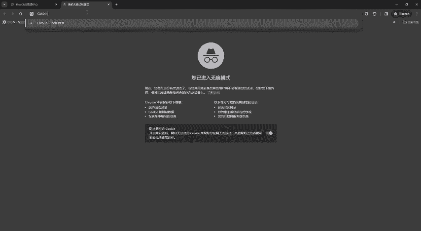
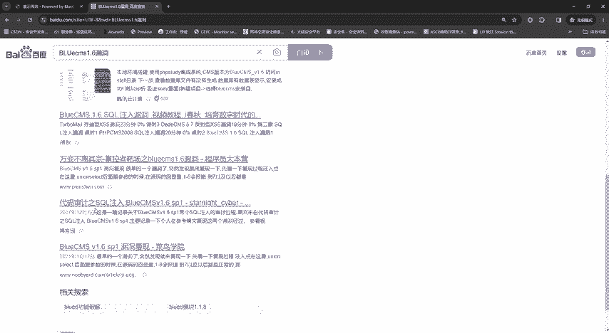
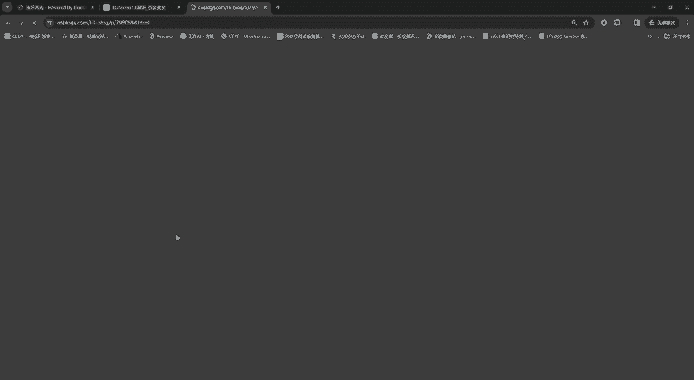
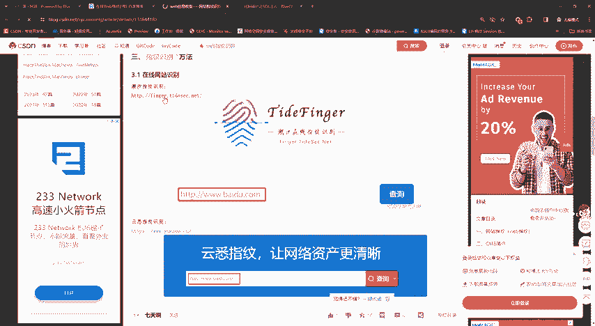
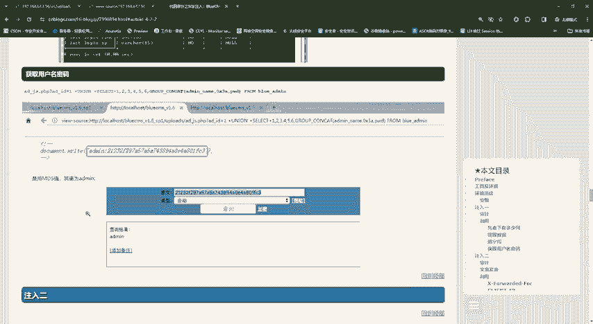
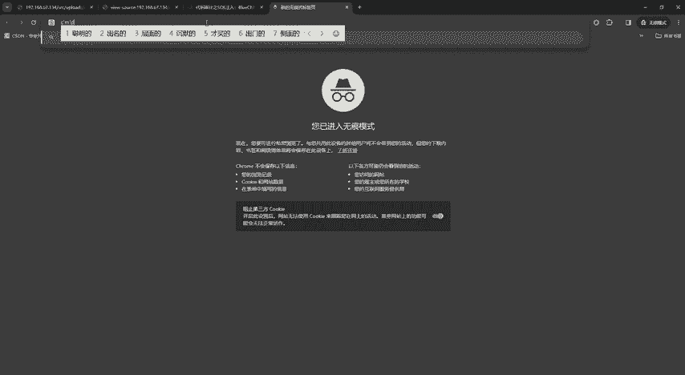
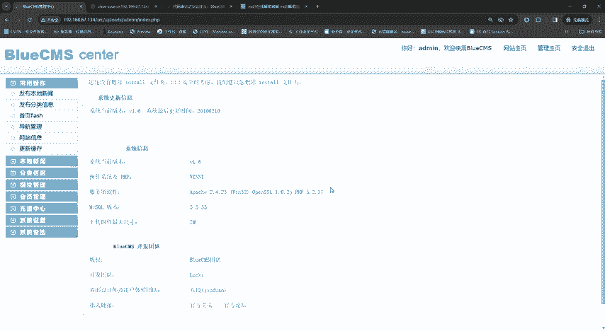

# 网络安全入门到精通：P11：CMS识别与漏洞寻找 🔍

在本节课中，我们将要学习渗透测试中信息收集的关键环节：**CMS识别**与**漏洞寻找**。我们将了解什么是CMS，如何识别目标网站使用的CMS及其版本，并学习如何利用这些信息寻找和利用已知的历史漏洞。

上一节我们介绍了端口扫描、目录扫描等信息收集手段。本节中我们来看看另一种重要的信息收集方式：针对网站内容管理系统（CMS）的识别与漏洞挖掘。

## 什么是CMS？

**CMS** 的全称是 **Content Management System**，即内容管理系统。它是一个建站系统，旨在方便用户快速搭建和管理网站。

常见的CMS包括：
*   **BluesMS**
*   **DedeCMS**
*   **帝国CMS**

这些系统被开发出来，是为了帮助企业或个人以较低的成本快速建立网站，避免了自主开发、定制和维护所需的大量人力、物力和财力。因此，许多中小型企业会选择使用现成的CMS来搭建自己的网站。

CMS系统通常有免费（开源）和付费版本。由于开源免费的特性，许多企业会选择使用它们。然而，这些CMS系统像软件一样，会不断更新版本（如1.0， 2.0）。版本更新可能是为了优化功能，也可能是为了修复已发现的严重漏洞。

问题在于，并非所有使用该CMS的网站都会及时更新到最新版本。这就导致了安全风险：攻击者可以通过识别网站使用的CMS及其旧版本，来寻找和利用该版本已知的历史漏洞。

## 如何识别CMS？

识别CMS主要有以下几种方法，它们依赖于CMS在网站中留下的特定“特征”。

### 方法一：查看页面底部信息

许多CMS会在网站页脚（页面最底部）留下署名信息，这通常是最直接的识别方式。

例如，你可能会看到类似这样的信息：
*   `Powered by BluesMS 1.6`
*   `Pro by [某公司名称]`

这行文字直接指明了网站所使用的CMS名称和版本号。

### 方法二：使用专用识别工具

如果网站管理员移除了底部的署名信息，我们就需要借助工具进行识别。以下是几种可用的工具类型：

**1. 本地指纹识别工具**
这类工具通常是一个集成环境或独立程序，可以扫描目标URL并分析其响应特征，从而匹配出CMS类型和版本。
例如，老师提供的“预镜WEB指纹识别系统”就是一个本地工具。

**2. 在线指纹识别平台**
无需安装任何软件，直接在浏览器中访问这些平台，输入目标网址即可进行识别。
常见的在线平台包括：
*   潮汐指纹识别
*   云悉指纹识别
*   WhatWeb（也有本地版本）

这些平台和工具的原理是收集了大量CMS的“指纹”（如特定文件、目录、HTTP头信息、HTML标签等），通过比对来识别目标。

## 如何寻找并利用漏洞？

成功识别出CMS及其版本后，下一步就是寻找与之相关的已知漏洞。

以下是寻找和利用漏洞的基本步骤：
1.  **搜索历史漏洞**：利用识别到的CMS名称和版本号作为关键词进行搜索。例如，搜索 `BluesMS 1.6 漏洞`。
2.  **分析漏洞详情**：在搜索结果中，你会找到相关的漏洞披露文章或利用教程。仔细阅读，了解漏洞类型（如SQL注入、后台绕过、文件上传等）、影响版本和利用方法。
3.  **验证并利用漏洞**：按照找到的漏洞利用方法（Payload）在目标网站上进行尝试。例如，教程中演示了通过访问特定路径 `/upload/.../enemy.php` 来获取数据库中的管理员用户名和MD5加密的密码。
4.  **解密关键信息**：如果获取到的是加密数据（如MD5哈希），可以使用在线CMD5破解平台进行查询解密，从而获得明文密码。
5.  **登录后台**：使用解密得到的用户名和密码尝试登录网站后台管理系统，获取控制权限。

**核心概念示例：**
*   **SQL注入漏洞**：攻击者通过将恶意的SQL代码插入到Web表单的输入参数中，欺骗服务器执行非法的SQL命令。
    *   示例Payload：`' OR '1'='1`
*   **MD5解密**：MD5是一种广泛使用的密码哈希函数，理论上不可逆，但可以通过查询预先计算好的“彩虹表”来破解常见字符串的哈希值。
    *   代码/公式表示：`密文 = MD5(明文)` -> 通过彩虹表查询 `密文` 反推可能的 `明文`。

本节课中我们一起学习了CMS识别与漏洞寻找的完整流程。我们首先了解了CMS的概念及其在安全测试中的重要性，然后掌握了通过页面底部信息和专用工具识别CMS的方法。最后，我们学习了如何根据识别结果搜索历史漏洞，并按照步骤尝试利用漏洞获取权限。

通过这节课，希望大家能够建立起针对CMS系统进行渗透测试的基本思路。安全测试的思路因人而异，老师所展示的仅是一种方法和流程，大家可以在实践中不断探索和形成属于自己的体系。