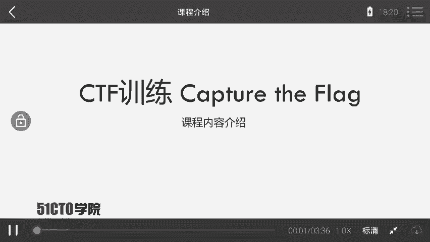
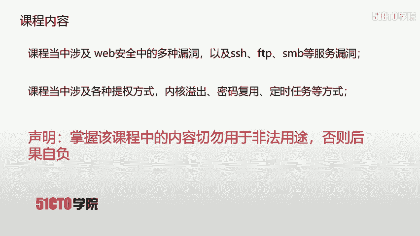
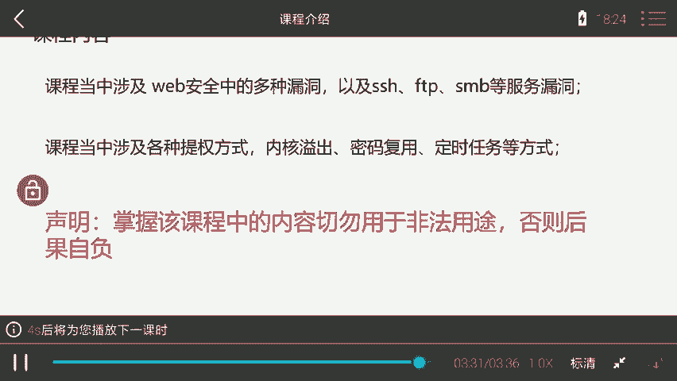
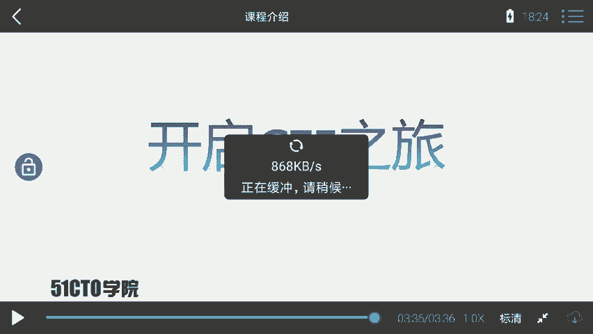
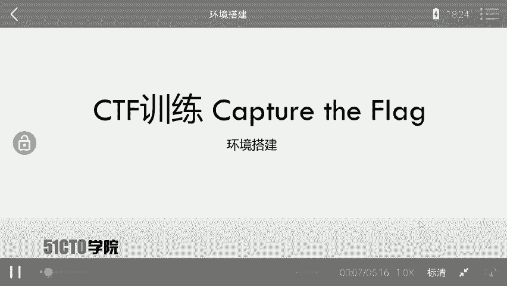
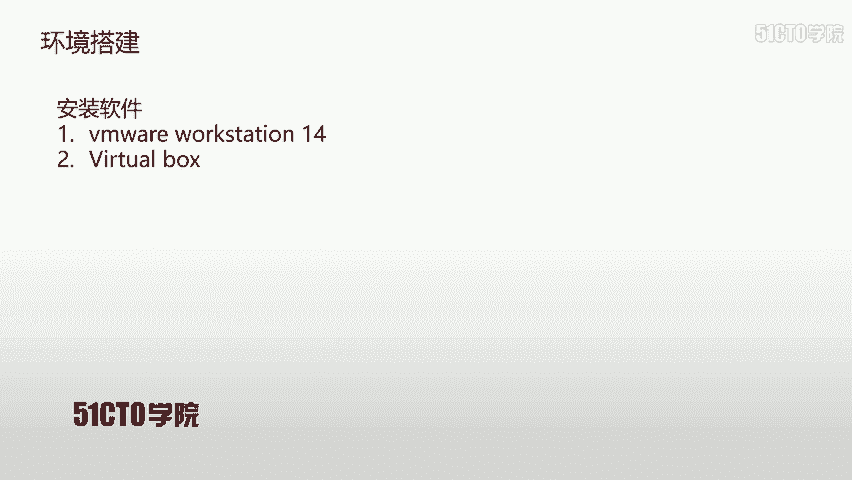
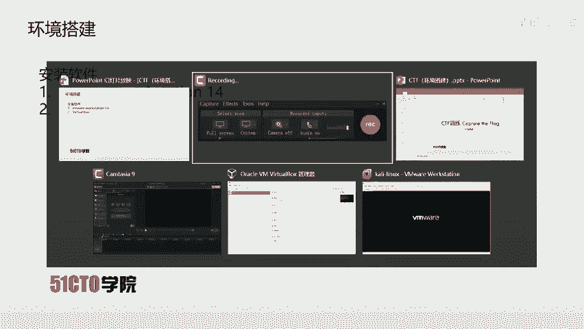

# 网络安全入门：P26：1.1.2：课程介绍 🎯

在本节课中，我们将对这门CTF（Capture The Flag）入门课程进行整体介绍，包括课程目标、所需基础、实验环境以及核心内容概述。

---

CTF是一种流行的信息安全竞赛形式，英文全称是“Capture The Flag”，中文可译为“夺旗赛”。

其基本流程是：参赛团队之间通过攻防对抗、程序分析等形式，率先从主办方提供的比赛环境中找到一串具有特定格式的字符串或其他内容，并将其提交给主办方，从而获得相应分数。

为了方便称呼，我们把这样的目标内容称为 **`flag`**。

在CTF比赛中，涉及内容繁杂，参赛者需要利用所有可用的方法来获取对应的 **`flag`**。

---

上一节我们了解了CTF的基本概念，本节中我们来看看本课程所使用的实验环境。

每节课都会提供对应的攻击机（Kali Linux）和靶场机器（Linux）资源。学员在下载攻击机和靶场机器后，需要自行搭建测试环境。

以下是搭建环境后的核心任务：
*   对靶场机器进行渗透测试。
*   最终目标是获取靶场机器上的 **`flag`** 值。

---

本课程定位为中等难度，要求学员具备一定的基础知识。

以下是学习本课程前需要了解的内容：
*   了解HTTP协议。
*   会使用一些基本的安全工具，例如：**Burp Suite**、**Nmap** 以及 **Metasploit**。

无论你是想要入门的CTF新手，还是具备一定经验的选手，或是网络安全爱好者，本课程都是一份有价值的学习资料。

---

本课程内容涵盖了多个实战方面。

首先，课程涉及Web安全中的多种漏洞，以及SSH、FTP、SMB等服务的漏洞。利用这些漏洞，我们可以获取靶场机器的shell访问权限。

但初始获取的shell通常不是root权限。这时，我们就需要进行权限提升。

以下是课程中讲解的几种提权方式：
*   内核漏洞提权
*   密码复用提权
*   定时任务提权

本课程完全以实战的方式，引导大家对靶场进行渗透测试，并获取对应的 **`flag`** 值。

**重要提示**：学员在掌握课程内容后，切勿将其用于非法用途，否则需自行承担一切后果。

---

本节课中，我们一起学习了CTF比赛的基本形式、本课程的实验环境与学习目标、所需的前置知识以及课程将要涵盖的核心实战内容，包括漏洞利用和权限提升技术。

现在，让我们正式开启CTF学习之旅。