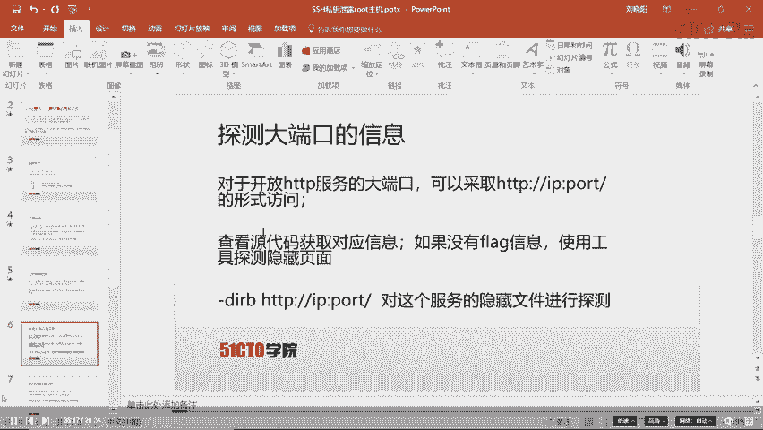
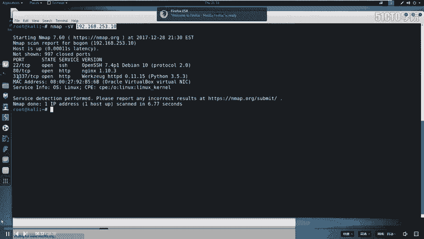
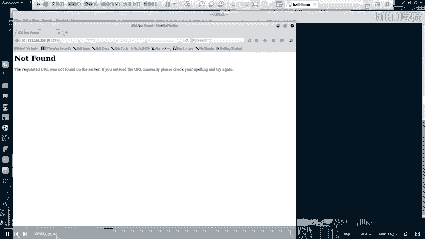
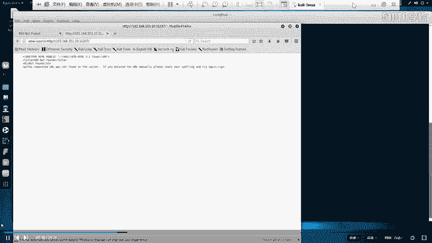
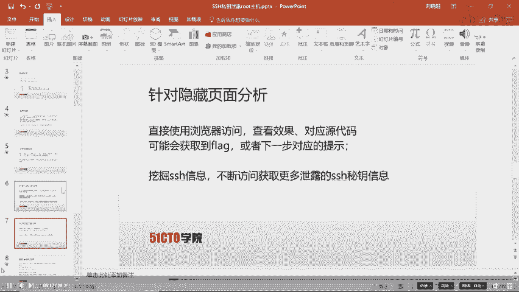
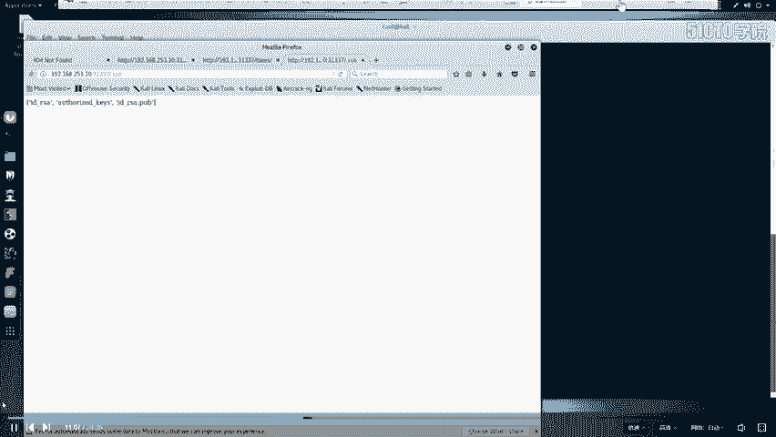
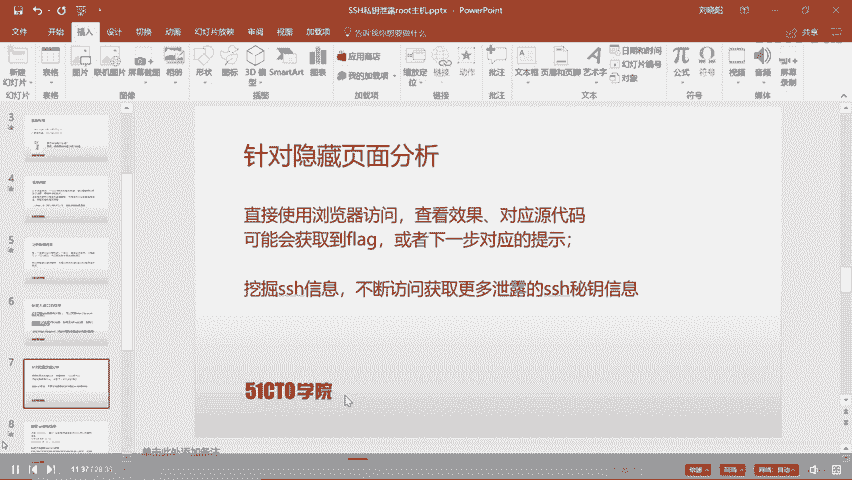
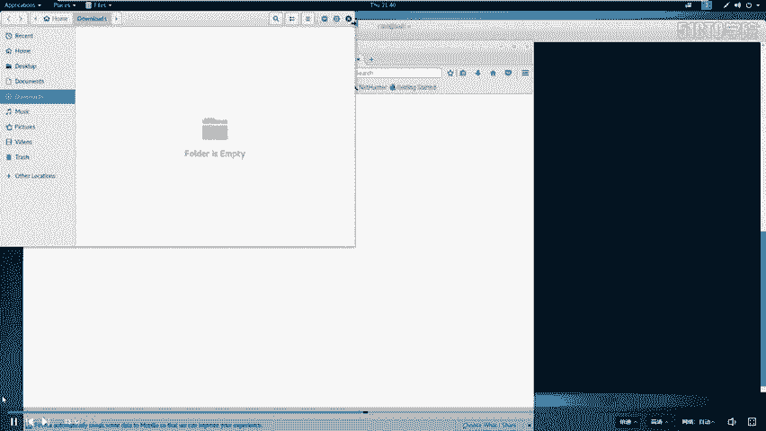
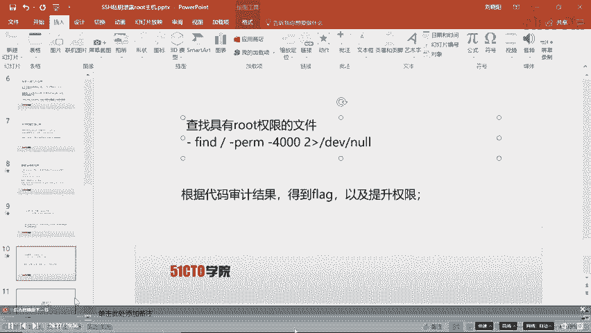
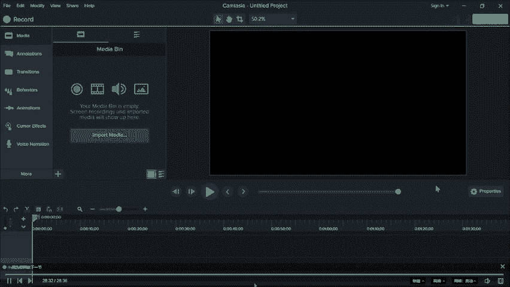

# CTF入门教程：P27：2.3.CTF-SSH私钥泄露 🔑

在本节课中，我们将学习CTF比赛中一种常见的安全问题：SSH私钥泄露。我们将从一个靶场主机的外部开始，通过信息收集、发现泄露的私钥，最终利用它登录到靶场主机，并逐步提升权限，最终获取root权限下的flag。

## 课程概述

上一节我们介绍了CTF比赛的基本环境。本节中，我们来看看如何利用SSH私钥泄露这一具体漏洞进行渗透测试。我们将学习从信息探测到权限提升的完整流程。

## CTF比赛环境简介

在深入学习具体技术前，我们先了解CTF比赛的两种常见环境。

以下是两种主要的比赛环境：

1.  **局域网环境**：攻击机和靶场机器位于同一局域网。选手通过Web方式访问攻击机（通常是Kali Linux），并使用攻击机对靶场机器进行测试。选手通常无需自备设备，由举办方统一提供。
2.  **自带设备环境**：举办方仅提供一个网络接口。选手需要自备个人电脑（PC）及所需的各种渗透测试工具。选手的设备可以接入互联网查询资料。选手直接使用自己的攻击机对举办方提供的靶场IP地址进行攻击。

## 实验环境搭建

本次实验环境如下：
*   攻击机（Kali Linux）IP：`192.168.253.12`
*   靶场机器 IP：`192.168.253.10`

我们的目标是获取靶场机器上的flag值。

## 第一步：信息探测与扫描

无论参加何种CTF比赛，第一步都是对目标进行信息探测。我们需要扫描靶场机器，探测其开放的服务和端口。

我们使用 `nmap` 工具进行服务版本扫描。



```bash
nmap -sV 192.168.253.10
```



扫描结果显示靶场开放了SSH服务（端口22）和两个HTTP服务（端口80和31337）。在渗透测试中，我们通常对开放的服务进行漏洞探测。



**知识点**：计算机上的每个服务都对应一个端口（0-65535），通过端口实现通信。常见服务有默认端口，如SSH(22)、HTTP(80)、MySQL(3306)。发现非常用端口（如31337）值得深入探查。


## 第二步：Web服务深入探测

探测结果显示端口31337运行着HTTP服务，我们首先通过浏览器访问它。



访问 `http://192.168.253.10:31337` 后，页面没有直接显示flag信息。

在CTF中，关键信息常隐藏在网页源代码中。我们查看页面源代码，但依然没有收获。

因此，我们需要探测该Web服务下是否存在隐藏的文件或目录。这里使用 `dirb` 工具进行目录爆破。



```bash
dirb http://192.168.253.10:31337/
```

扫描发现了几个结果，其中 `/ssh` 和 `/robots.txt` 最为醒目。我们先分析 `robots.txt` 文件。

## 第三步：分析robots.txt文件

`robots.txt` 文件用于告知搜索引擎哪些目录可以或不可以被抓取。我们访问 `http://192.168.253.10:31337/robots.txt`。

文件内容显示，它不允许搜索引擎访问 `.bashrc`、`.profile` 和 `taxes` 文件。这提示我们 `taxes` 可能是一个敏感文件。



访问 `http://192.168.253.10:31337/taxes`，我们成功找到了第一个flag。



## 第四步：发现并下载SSH私钥

在 `dirb` 结果中，我们还看到了 `/ssh` 目录。访问 `http://192.168.253.10:31337/ssh`，页面显示了一些文件信息，暗示可能存在 `id_rsa`（SSH私钥文件）。

我们尝试访问 `http://192.168.253.10:31337/ssh/id_rsa`，浏览器提示下载。我们将 `id_rsa` 和同目录下的 `authorized_keys` 文件下载到攻击机桌面。

**SSH认证原理**：SSH采用非对称加密认证。用户持有私钥(`id_rsa`)，服务器存有对应的公钥(`id_rsa.pub`)。登录时，双方通过加密算法验证私钥与公钥是否匹配。

## 第五步：尝试使用私钥登录



我们尝试用下载的私钥登录靶场机器。首先切换到桌面目录，并检查私钥文件的权限。

```bash
cd ~/Desktop
ls -alh id_rsa
```

如果权限不足（非`-rw-------`），需要赋予其仅所有者可读写的权限。

```bash
chmod 600 id_rsa
```

现在尝试登录。我们需要用户名，查看下载的 `authorized_keys` 文件，发现一行记录：`ssh-rsa ... smog@...`，这表明用户名是 `smog`。

```bash
ssh -i id_rsa smog@192.168.253.10
```

系统提示需要密码，但我们不知道。这说明私钥本身被密码短语（passphrase）保护着，我们需要破解它。

## 第六步：破解SSH私钥的密码短语

我们使用 `ssh2john` 工具将私钥格式转换为 `john` 密码破解工具能识别的格式。

```bash
ssh2john id_rsa > rsa_crack
```

然后使用 `john` 工具配合密码字典进行破解。这里使用Kali自带的 `rockyou.txt` 字典。

```bash
john --wordlist=/usr/share/wordlists/rockyou.txt rsa_crack
```

破解成功后，`john` 会显示密码短语，本例中为 `starwars`。

## 第七步：使用私钥成功登录

获得密码后，再次执行登录命令，并在提示时输入密码短语 `starwars`。

```bash
ssh -i id_rsa smog@192.168.253.10
```

输入密码 `starwars` 后，我们成功以 `smog` 用户身份登录到靶场主机。

## 第八步：权限提升与获取最终Flag

登录后，我们当前用户权限较低。查看根目录，发现 `flag.txt`，但无权限读取。

```bash
ls /root
cat /root/flag.txt
```

我们需要寻找提权机会。使用 `find` 命令查找系统中所有具有SUID权限（以root身份运行）的文件。

```bash
find / -perm -4000 2>/dev/null
```

在结果中，我们发现 `/usr/local/bin/read_message` 这个程序具有SUID权限。查看其源代码 `/root/read_message.c`。

```bash
cat /root/read_message.c
```

审计代码发现，该程序将用户输入复制到缓冲区，并与一个硬编码的字符串 `“smog”` 进行比较。如果前5个字符匹配，则执行一个 `message` 数组中的命令，而该数组内容来自用户输入的后半部分。这存在命令注入风险。

运行该程序，并在输入时先输入 `smog` 匹配前5字符，后面跟上我们要执行的命令。

```bash
/usr/local/bin/read_message
```
输入：
```
smogAAAAA/bin/sh
```

由于程序具有SUID权限，我们获得的shell将是root权限。验证并读取最终flag。

```bash
whoami
# 输出应为 root
cat /root/flag.txt
```

## 课程总结



本节课中我们一起学习了CTF中利用SSH私钥泄露进行渗透的完整链条：
1.  使用 `nmap`、`dirb` 进行信息收集。
2.  分析 `robots.txt` 等文件发现线索。
3.  找到并下载泄露的SSH私钥。
4.  使用 `john` 破解受密码保护的私钥。
5.  利用私钥成功登录远程主机。
6.  通过审计SUID程序代码，利用命令注入漏洞完成权限提升。
7.  最终获取root权限下的flag。



这个流程体现了CTF比赛和渗透测试中“信息收集-漏洞发现-利用-权限提升”的核心思路，每一步都建立在上一步的发现之上，需要耐心和细致的观察。