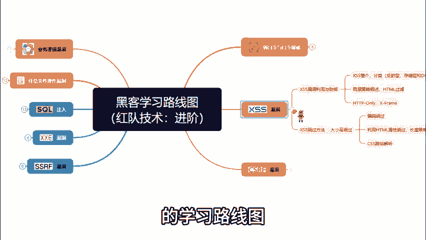
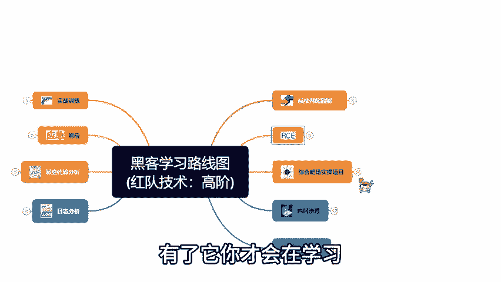
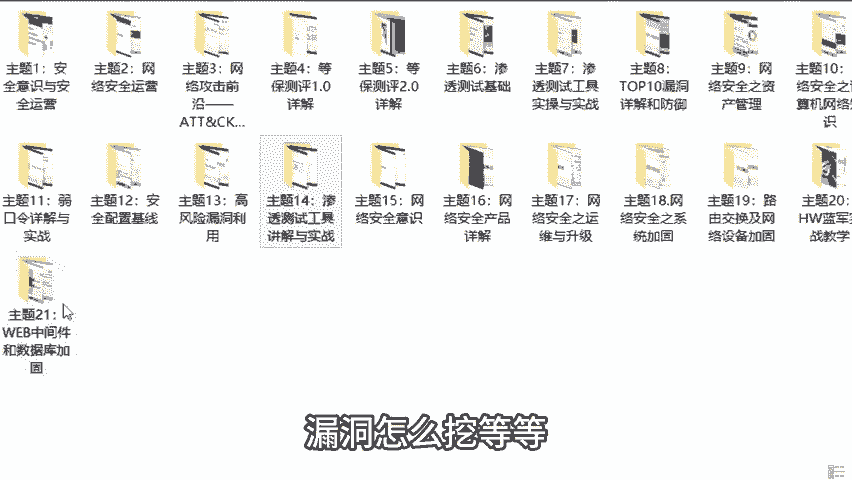

网络安全入门教程：P2：学习资料与路径指南

在本节课中，我们将介绍为网络安全初学者准备的核心学习资料与系统化的学习路线图，帮助你明确方向，高效入门。

上一节我们了解了课程的整体框架，本节中我们来看看具体有哪些学习资源可以辅助你的成长。

如果你是一名对网络安全技术感兴趣的初学者，无论是为了职业发展还是技术钻研，系统性的学习资料都至关重要。掌握正确的学习路径能避免迷失方向，稳步提升技能。

以下是为你整理的核心学习资料与指导：

**1. 系统化学习路线图**
一份清晰的学习路线图至关重要。它规划了从零基础到具备较高水平的完整学习路径，明确了每个阶段需要掌握的技术知识点。遵循路线图学习，可以确保你的学习过程目标明确、循序渐进。

**2. 实战视频教程**
总计190节的网络攻防实战视频教程涵盖了从环境搭建到漏洞挖掘的各个环节。教程内容包括但不限于：专用操作系统（如Kali Linux）的安装与配置、常见漏洞的原理与利用方法、渗透测试工具的使用等。通过跟随视频进行实操，你可以将理论转化为实践能力。

**3. 个性化学习支持**
自学过程中遇到困难是常见情况。如果你觉得自学模式挑战较大或希望获得更直接的指导，可以寻求额外的帮助。提供从零开始的引导式学习支持，旨在帮助你克服入门阶段的障碍。

本节课中我们一起学习了如何获取和利用关键的网络安全学习资源。我们了解到，一份系统的**学习路线图**能指引方向，详尽的**实战视频教程**能传授核心技能，而必要的**学习支持**则能帮助克服难点。合理利用这些资料，将为你的网络安全学习之旅奠定坚实的基础。