# CTF夺旗实战：P34：9.10：SQL注入（POST）攻防演练 🚩

在本节课中，我们将学习CTF比赛中一种常见的攻击方式——SQL注入。我们将通过一个完整的实战演练，从信息收集开始，利用POST请求中的SQL注入漏洞，最终获取目标服务器的最高权限（root权限）并夺得Flag。

## 什么是SQL注入？

上一节我们介绍了CTF的基本概念，本节中我们来看看SQL注入。SQL注入攻击是指攻击者构造特殊的输入作为参数，传入Web应用程序，通过执行对应的SQL语句，进而执行攻击者所要的操作。其主要原因是程序没有细致地过滤或者过滤不严格用户输入的数据，致使非法数据侵入系统。

**核心概念**：任何用户可以输入的位置都有可能成为注入点。例如，在URL中传递的参数以及HTTP报文中POST传递的参数。

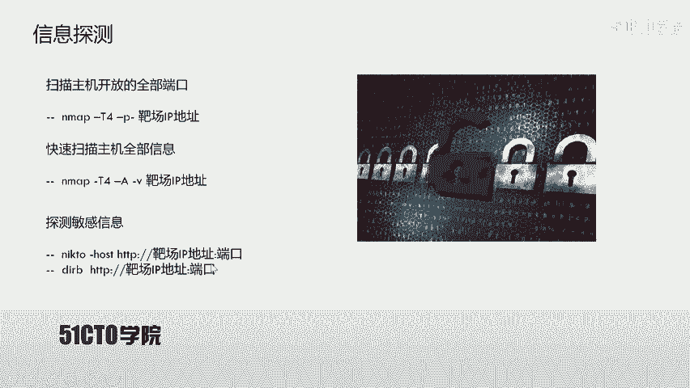

## 实验环境搭建

在开始实战之前，我们需要了解本次实验的网络环境。

*   **攻击机**：Kali Linux，IP地址为 `192.168.1.11`。
*   **靶机**：Ubuntu系统，IP地址为 `192.168.1.104`。

我们的目标是：挖掘靶机上的漏洞，获得主机的最高权限（root权限），最终取得对应的Flag值。

## 第一步：信息收集

拿到靶场IP地址后，首先要进行信息探测，目的是发现靶机上开放了哪些服务和端口。

以下是信息收集的常用步骤：

1.  **探测主机开放端口**
    我们使用 `Nmap` 工具进行扫描。命令 `nmap -sS -p- -T4 192.168.1.104` 表示使用TCP SYN扫描方式（-sS），扫描所有端口（-p-），并以最快速度（-T4）扫描目标IP。

2.  **探测主机详细信息**
    除了端口，我们还可以获取更详细的信息。命令 `nmap -T4 -A -v 192.168.1.104` 会加载所有扫描模块（-A），并输出详细信息（-v），帮助我们了解靶机的操作系统、服务版本等。

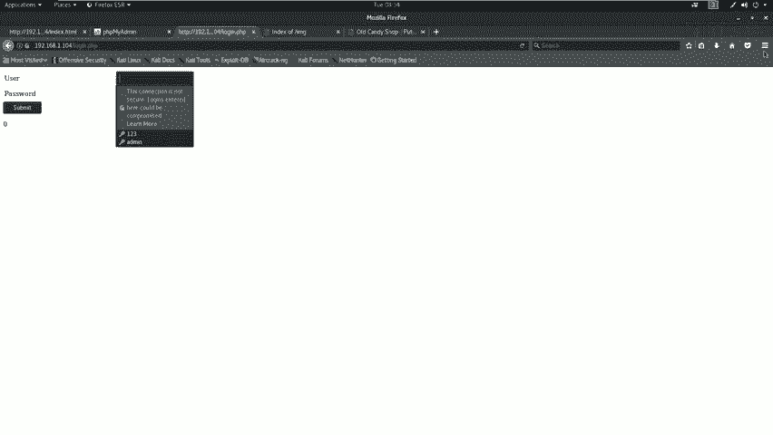

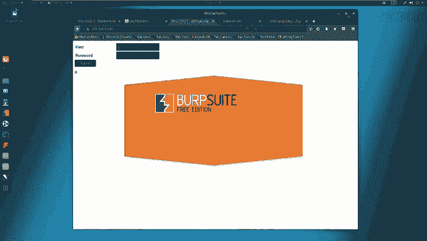

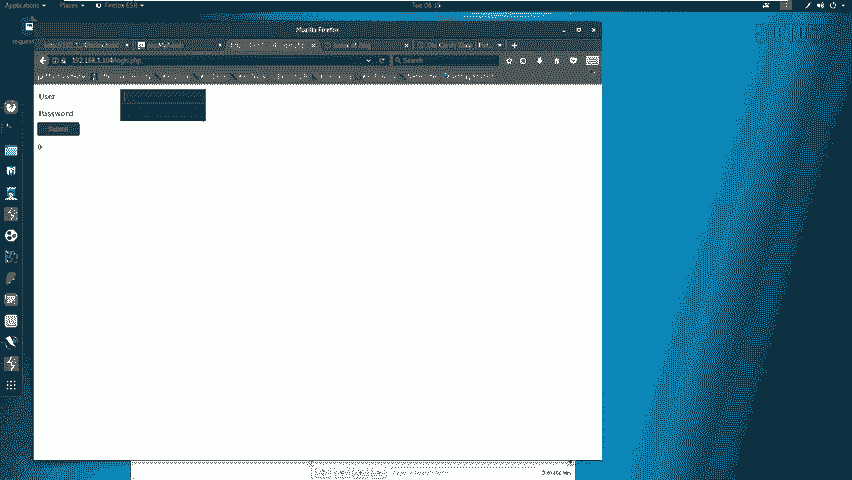

3.  **探测Web敏感目录与文件**
    扫描结果显示靶机开放了80和8080端口的HTTP服务。针对Web服务，我们可以使用 `nikto` 和 `dirb` 工具来探测存在的敏感目录和文件。
    *   `nikto -h http://192.168.1.104` 用于扫描80端口。
    *   `dirb http://192.168.1.104` 用于暴力破解80端口的目录结构。
    *   对于8080端口，只需在命令后加上 `:8080` 即可，例如 `nikto -h http://192.168.1.104:8080`。

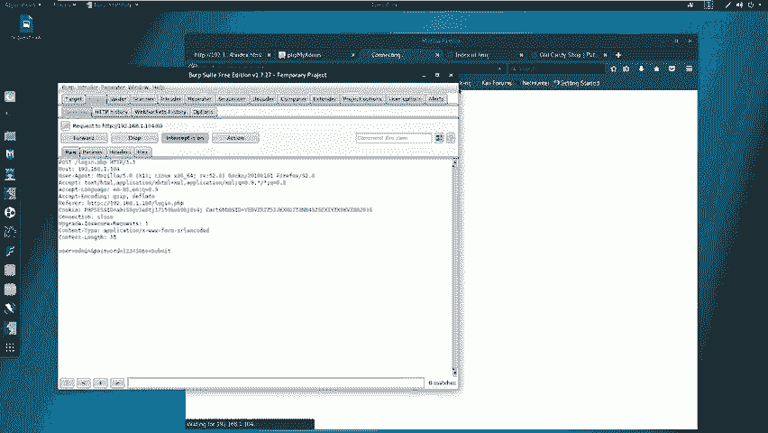

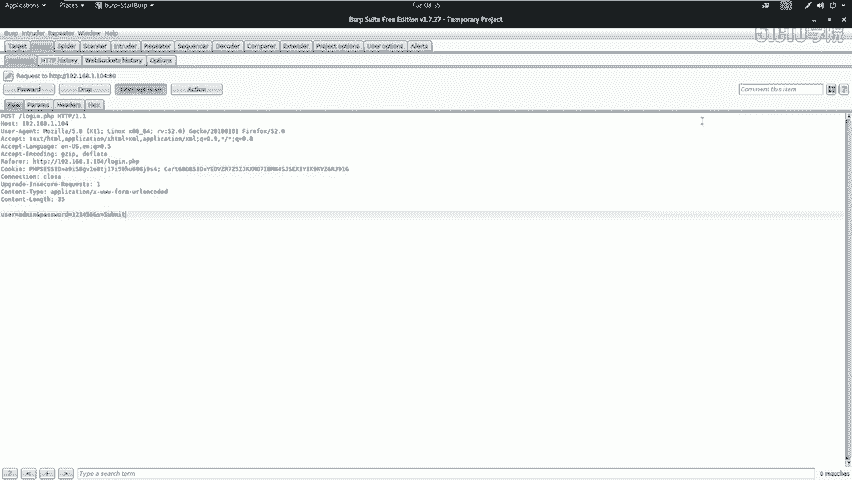

## 第二步：漏洞分析与发现

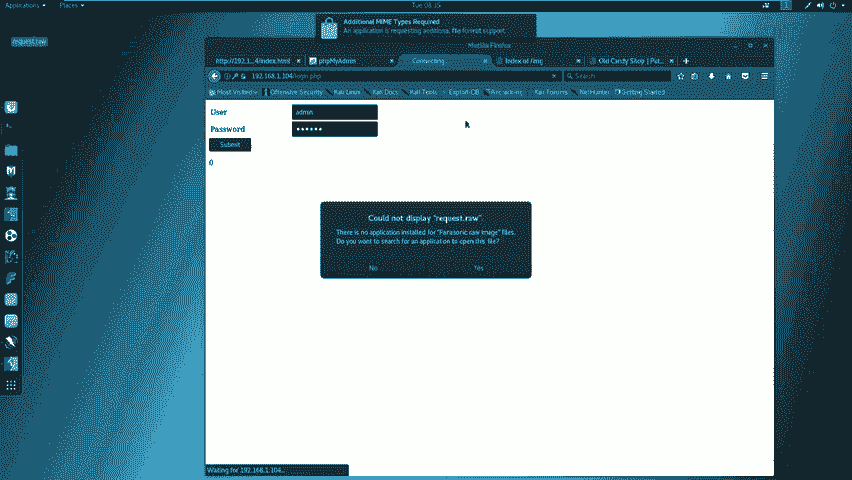

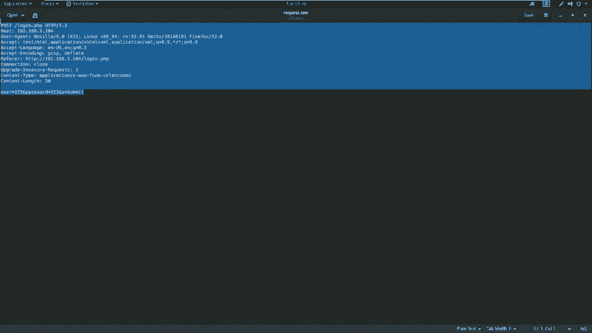

在收集了大量信息后，我们需要对其进行分析，寻找可能的攻击入口。

1.  **分析扫描结果**
    *   80端口发现一个登录页面 `login.php`。
    *   80端口发现 `phpMyAdmin` 数据库管理入口。
    *   8080端口发现一个由 `WordPress` 搭建的网站。
    *   使用 `OWASP ZAP` 漏洞扫描器对两个端口进行扫描，未发现明显的高危漏洞。

2.  **手工测试与注入点确认**
    由于自动化工具未报漏洞，我们需要对可疑点进行手工测试。`login.php` 是一个典型的用户输入点，可能存在SQL注入。我们使用 `Burp Suite` 拦截登录请求，并将请求数据保存为文件（如 `request.txt`）。

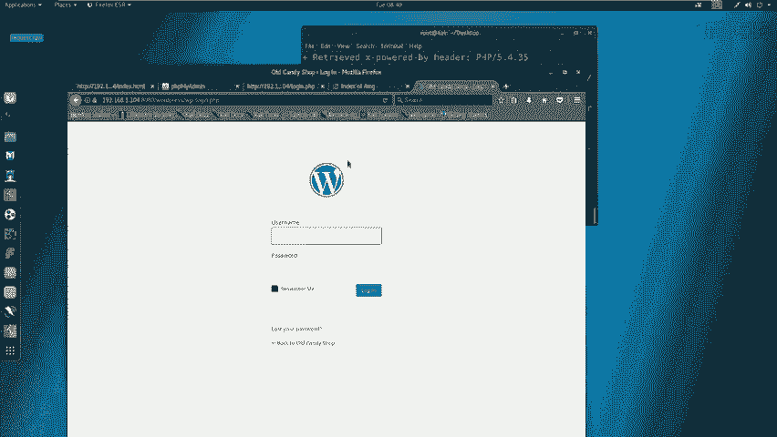

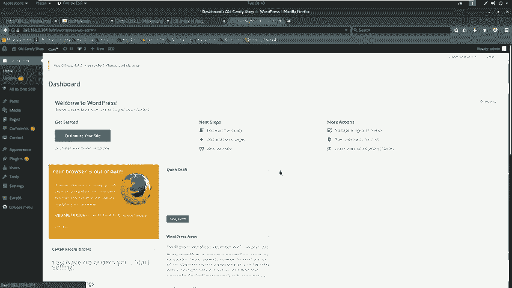

3.  **使用SQLmap进行自动化注入测试**
    接下来，我们使用强大的SQL注入工具 `sqlmap` 对拦截到的请求进行测试。
    核心命令如下：
    ```bash
    sqlmap -r request.txt --level=3 --risk=3 --dbs --dbms=mysql --batch
    ```
    *   `-r request.txt`: 指定包含HTTP请求的文件。
    *   `--level=3 --risk=3`: 使用较高的测试等级和风险等级。
    *   `--dbs`: 枚举数据库。
    *   `--dbms=mysql`: 指定数据库类型为MySQL，提高检测效率。
    *   `--batch`: 使用默认选项，无需人工干预。

    执行后，`sqlmap` 成功识别出注入漏洞，并列出了数据库。我们进一步探测 `wordpress` 数据库中的表、字段，最终获取到了管理员用户名和密码。

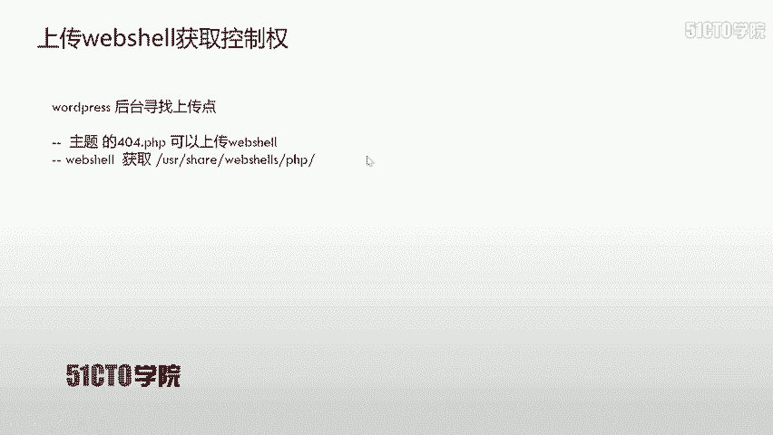

## 第三步：漏洞利用与权限提升

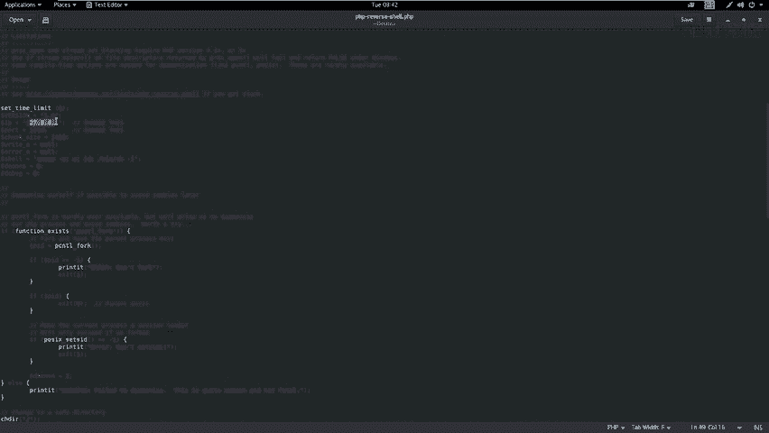

发现漏洞并获取凭证后，我们开始利用它来获取系统权限。

1.  **登录后台系统**
    使用 `sqlmap` 获取到的用户名和密码，成功登录8080端口上的WordPress网站后台。

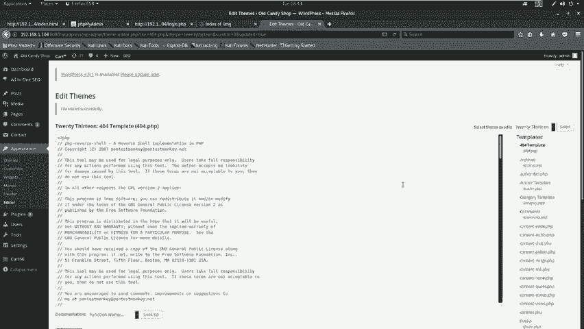

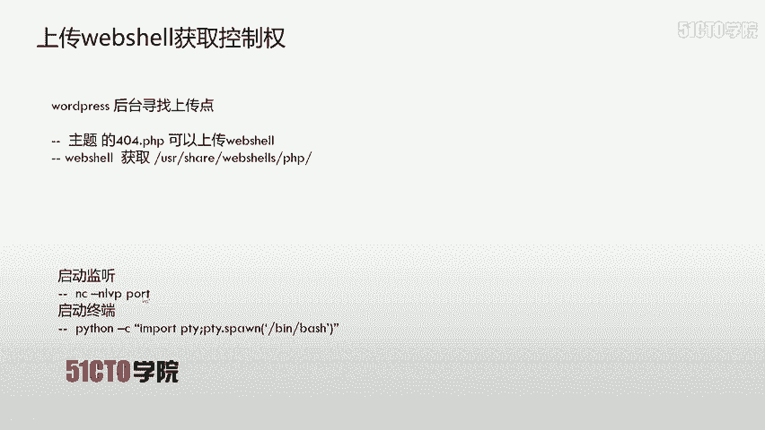

2.  **上传WebShell**
    在WordPress后台，我们可以通过编辑主题文件（如 `404.php`）来植入WebShell。我们从Kali的 `/usr/share/webshells/php/` 目录下获取一个PHP反向Shell脚本（如 `php-reverse-shell.php`），修改其中的IP和端口为攻击机的监听地址（`192.168.1.11:4444`），然后将其内容替换到主题的 `404.php` 文件中并上传。

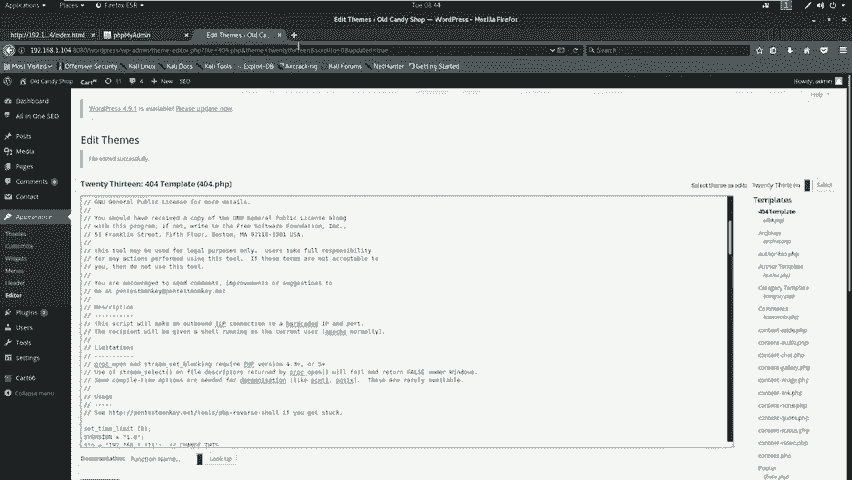

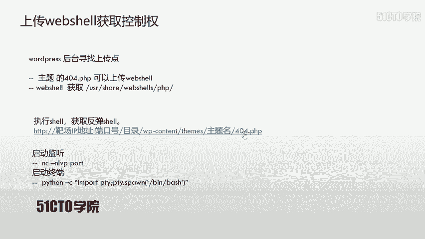

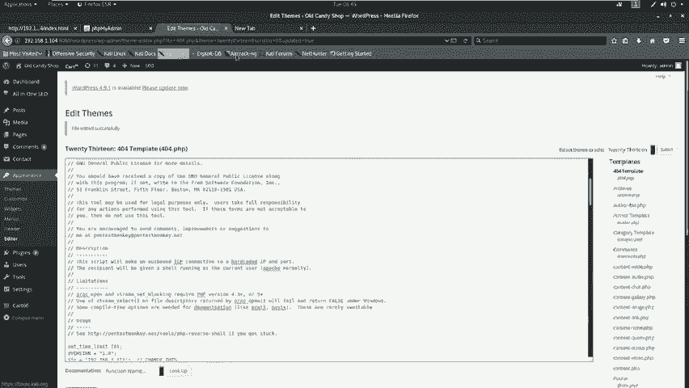

3.  **建立监听与获取Shell**
    在攻击机上使用 `netcat` 监听4444端口：
    ```bash
    nc -nlvp 4444
    ```
    然后，通过浏览器访问植入WebShell的页面（例如 `http://192.168.1.104:8080/wordpress/wp-content/themes/twentythirteen/404.php`），即可在 `netcat` 上获得一个反向Shell连接。

4.  **提升为交互式Shell与Root权限**
    初始获得的反向Shell功能有限。我们使用Python将其升级为功能完整的TTY：
    ```bash
    python -c ‘import pty; pty.spawn(“/bin/bash”)’
    ```
    随后，尝试切换为root用户。通过查看系统文件（如 `/etc/shadow`）的提示，或尝试使用之前获取的WordPress管理员密码，成功使用 `su` 命令提升到root权限。
    ```bash
    su -
    # 输入密码
    ```
    使用 `id` 命令验证，确认UID为0，即已获得root权限。此时，可以浏览 `/root` 目录，寻找最终的Flag文件。

## 总结与要点回顾

本节课中我们一起学习了通过POST型SQL注入夺取靶机root权限的完整流程。我们需要明白以下几个关键点：

*   **注入点无处不在**：任何用户可输入的位置，如登录框、搜索框，都可能存在SQL注入点。
*   **工具与手工结合**：自动化漏洞扫描器（如OWASP ZAP）的结果并非绝对，对于可疑点必须进行手工验证（如使用sqlmap）。
*   **攻击链思维**：一次完整的渗透通常是一个链条：信息收集 -> 漏洞发现 -> 漏洞利用 -> 权限提升 -> 获取目标。本例中，我们从SQL注入获取后台密码，到登录后台上传WebShell，再到提权，正是这一思维的体现。
*   **防御建议**：作为开发者，应对所有用户输入进行严格的过滤和参数化查询，从根本上杜绝SQL注入漏洞。

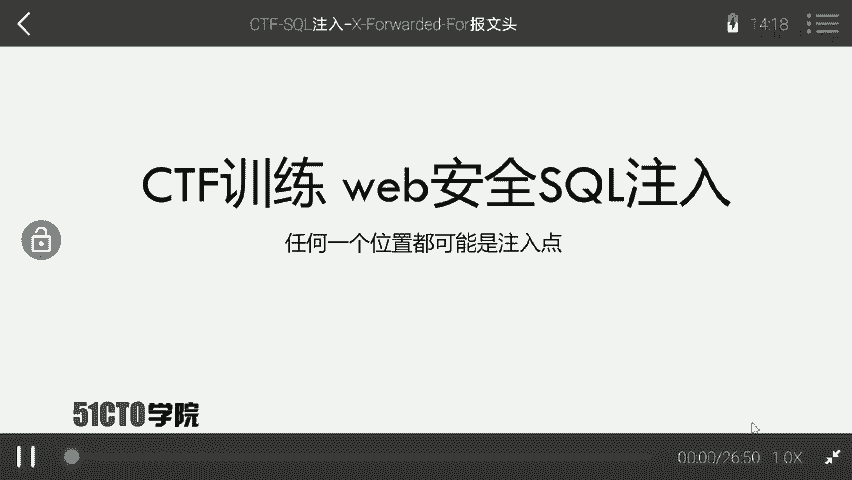

通过本次实战，你应该对SQL注入的危害和利用方式有了更直观的认识。在CTF比赛或安全测试中，保持耐心、细致观察、灵活运用各种工具和技巧，是取得成功的关键。