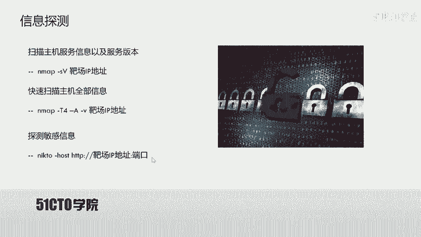
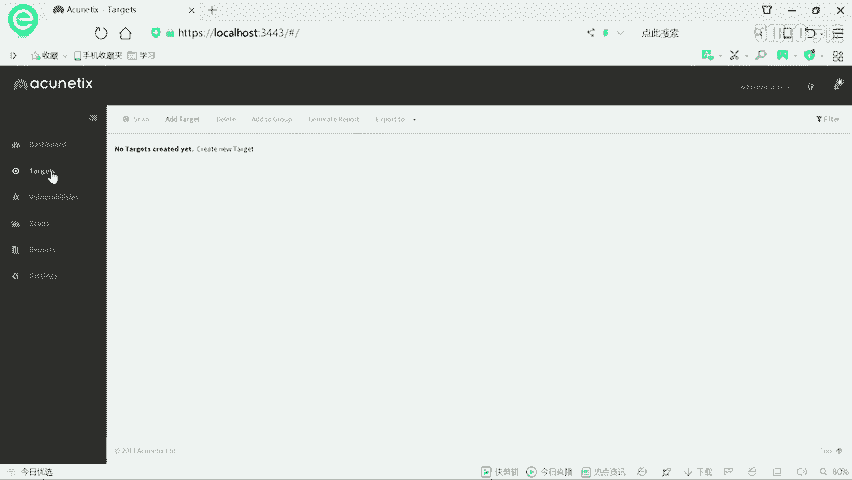
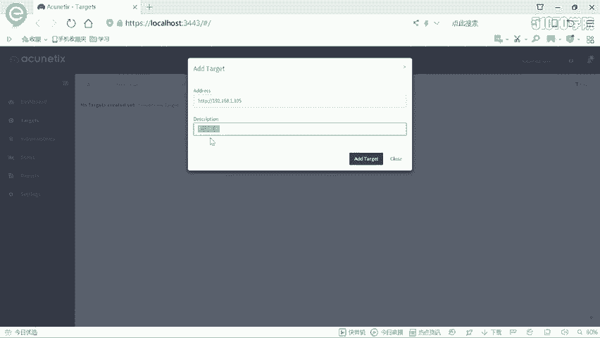
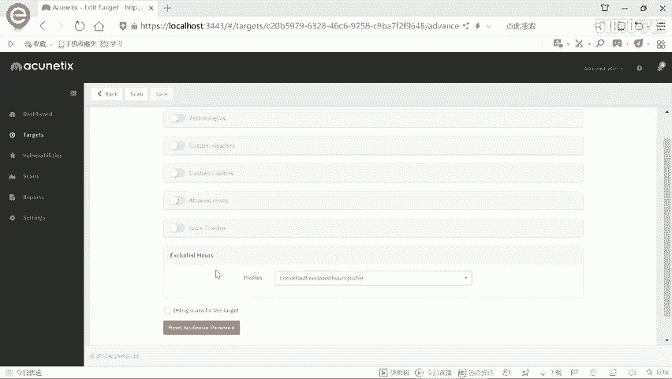
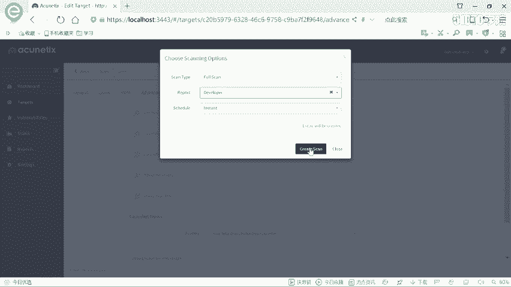
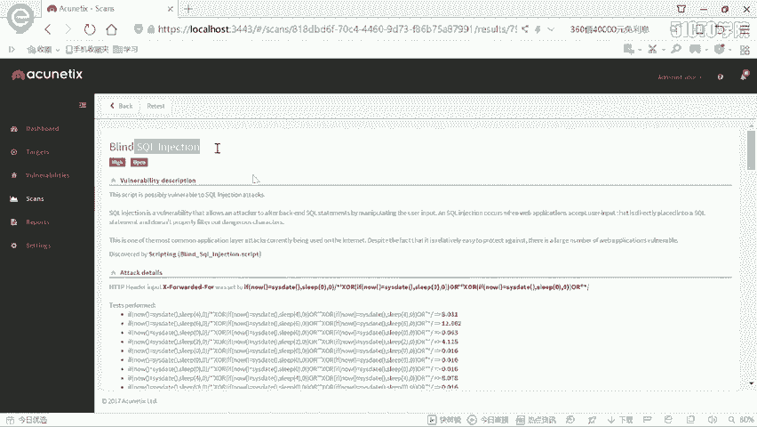
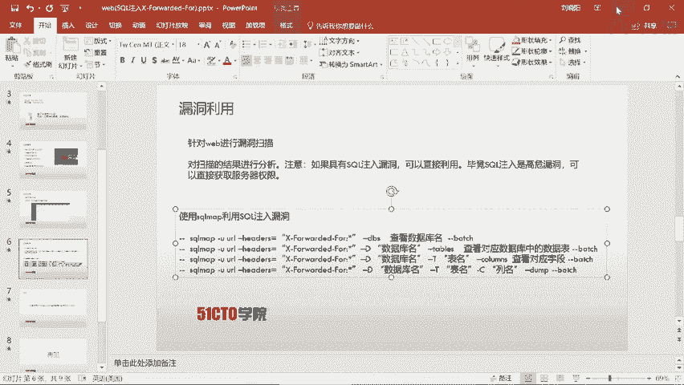
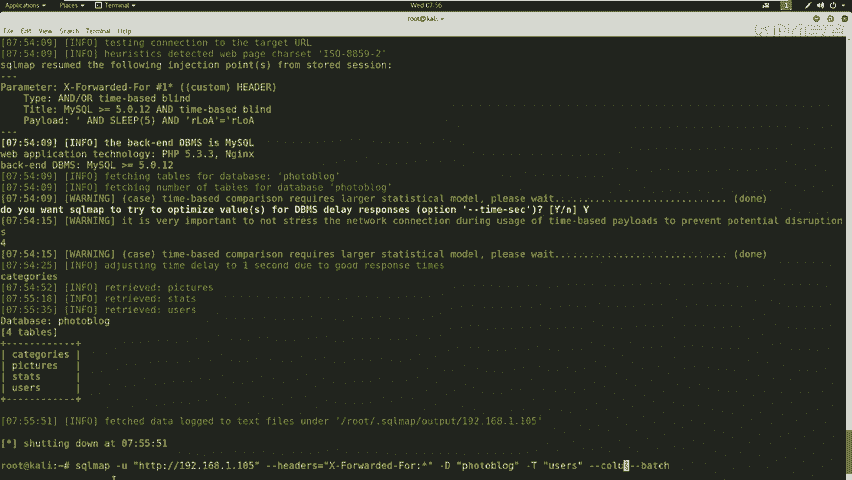
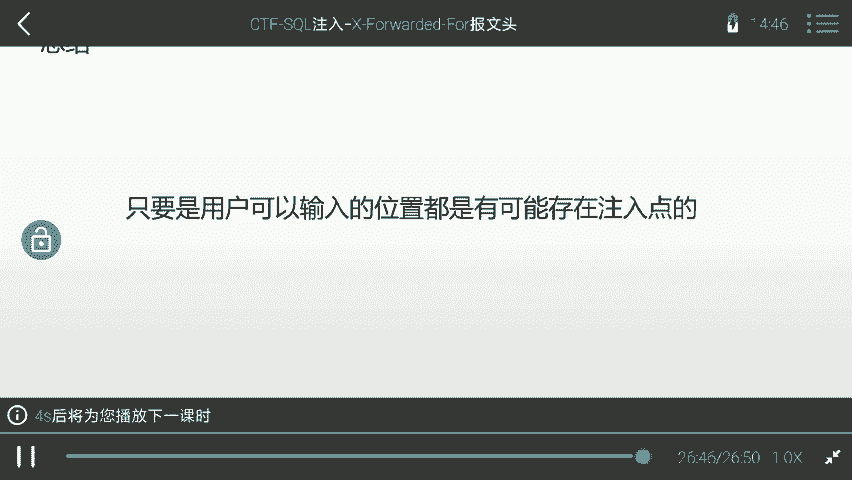

# CTF夺旗实战：P35：10.11：SQL注入(X-Forwarded-For) 🚩

在本节课中，我们将学习CTF比赛中的一项核心技能：SQL注入攻击。我们将从一个具体的HTTP头部（X-Forwarded-For）注入漏洞入手，演示如何从信息收集、漏洞扫描到利用工具获取后台权限的完整流程。

## 什么是SQL注入漏洞？

上一节我们介绍了CTF比赛的基本概念，本节中我们来看看SQL注入。SQL注入漏洞是Web安全中一个特别重要的知识点。

SQL注入漏洞是指攻击者通过构建特殊的输入作为参数传入到Web应用程序中。Web应用程序执行了这些传入的参数，导致执行了预设之外的SQL语句，从而使非法数据侵入系统。

这里强调一点：**任何一个用户可以输入的位置，都可能存在注入点**。例如：
*   用户可以在URL（网址标识符）中输入任意内容。例如，一个以 `?id=` 方式提交的参数，就可能存在注入点。
*   在HTTP报文头中，也存在可以操作和输入的位置，构造对应的语句同样可以完成注入攻击。

## 实验环境搭建

在开始实战之前，我们需要了解本次实验的网络环境。

*   **攻击机 (Kali Linux)**：IP地址为 `192.168.1.104`。
*   **靶场机器**：IP地址为 `192.168.1.105`。

我们的目标是挖掘该靶场Web应用的漏洞，最终获得系统后台的登录权限。



## 第一步：信息探测

拿到目标IP地址后，我们首先需要探测目标系统运行的服务和版本信息。我们使用 `Nmap` 工具进行扫描。

以下是使用Nmap进行扫描的基本命令：

```bash
# 基础扫描，获取开放端口和服务版本
nmap -sS -sV 192.168.1.105

# 全面扫描，加载所有脚本，获取详细信息
nmap -T4 -A -v 192.168.1.105
```



**命令解释**：
*   `-T4`：设置扫描速度为高速。
*   `-A`：启用操作系统检测、版本检测、脚本扫描和路由跟踪。
*   `-v`：显示详细输出。



扫描结果显示，靶机只开放了80端口的HTTP服务，服务器是Nginx，开发语言为PHP。



## 第二步：探测Web敏感页面



发现HTTP服务后，我们需要探测其是否存在敏感目录或文件。这里使用 `nikto` 工具进行扫描。

以下是nikto扫描命令：
```bash
nikto -host http://192.168.1.105
```
扫描速度很快，并成功发现了一个管理员登录界面 (`/admin/login.php`)。

我们访问该登录页面，尝试常用弱口令（如 `admin/admin`, `admin/123456`）均告失败。因此，我们需要寻找其他漏洞进入系统。

## 第三步：使用漏洞扫描器



为了系统性地发现Web应用漏洞，我们使用功能强大的专业漏洞扫描器 **AWVS**。



AWVS专注于Web安全，更新迅速，能扫描绝大多数Web漏洞。以下是操作流程：
1.  打开AWVS，添加扫描目标 `192.168.1.105`。
2.  选择“Full Scan”（完全扫描）模式并开始扫描。
3.  等待扫描完成，期间AWVS会列出发现的各种漏洞。

扫描过程中，AWVS报告了一个**高危漏洞：SQL盲注**。漏洞详情指出，在HTTP头部的 `X-Forwarded-For` 字段存在SQL注入点。

## 第四步：利用SQL注入漏洞

发现SQL注入点后，我们使用自动化注入工具 **sqlmap** 进行利用。sqlmap能自动检测和利用SQL注入，极大地提高效率。

根据AWVS提供的线索，我们构造sqlmap命令来利用HTTP头部的注入点：

```bash
sqlmap -u “http://192.168.1.105” --headers=“X-Forwarded-For: *” --dbs --batch
```

**命令解释**：
*   `-u “http://192.168.1.105”`：指定目标URL。
*   `--headers=“X-Forwarded-For: *”`：指定在 `X-Forwarded-For` 头部进行注入测试，`*` 代表注入点位置。
*   `--dbs`：枚举数据库。
*   `--batch`：以非交互模式运行，所有提示均选择默认。

执行后，sqlmap确认漏洞存在，并开始逐个字符地爆破数据库名（因为是时间盲注）。最终得到两个数据库：`information_schema`（系统库）和 `photoblog`（用户库）。

## 第五步：获取后台凭据



我们的目标是获取后台登录权限，因此需要进一步挖掘 `photoblog` 数据库中的敏感信息。

以下是后续操作命令：
```bash
# 1. 列出 photoblog 数据库中的所有表
sqlmap -u “http://192.168.1.105” --headers=“X-Forwarded-For: *” -D photoblog --tables --batch

# 2. 列出 users 表的所有列（字段）
sqlmap -u “http://192.168.1.105” --headers=“X-Forwarded-For: *” -D photoblog -T users --columns --batch

# 3. 导出 users 表中 login 和 password 列的数据
sqlmap -u “http://192.168.1.105” --headers=“X-Forwarded-For: *” -D photoblog -T users -C login,password --dump --batch
```
sqlmap成功从 `users` 表中提取出登录凭据：
*   **用户名**：`admin`
*   **密码**：`P4SSW0RD`（密码字段存储的是MD5哈希值，sqlmap自动进行了破解）

## 第六步：登录系统后台

使用获取到的用户名 `admin` 和密码 `P4SSW0RD`，我们成功登录到靶场系统的后台管理界面，获得了系统的控制权。

## 总结

本节课中我们一起学习了CTF中SQL注入攻击的完整流程。我们了解到，SQL注入可以发生在任何用户可输入的位置，包括URL参数和HTTP头部（如本例的 `X-Forwarded-For`）。

我们的实战步骤可以总结为：
1.  **信息收集**：使用Nmap、nikto探测目标。
2.  **漏洞发现**：使用AWVS等扫描器发现潜在漏洞。
3.  **漏洞利用**：使用sqlmap等工具自动化利用SQL注入点。
4.  **数据获取**：枚举数据库、表、字段，提取敏感信息（如后台账号密码）。
5.  **权限提升**：利用获取的凭据登录系统，完成夺旗或控制目标。



在实战和CTF比赛中，合理利用自动化工具可以事半功倍，高效完成任务。记住，安全测试的目的是快速、准确地发现和验证风险，而非单纯展示手工技巧。