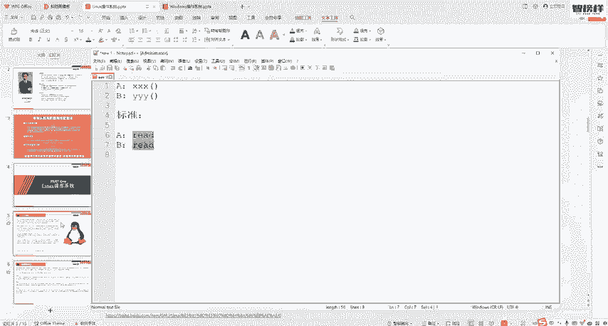
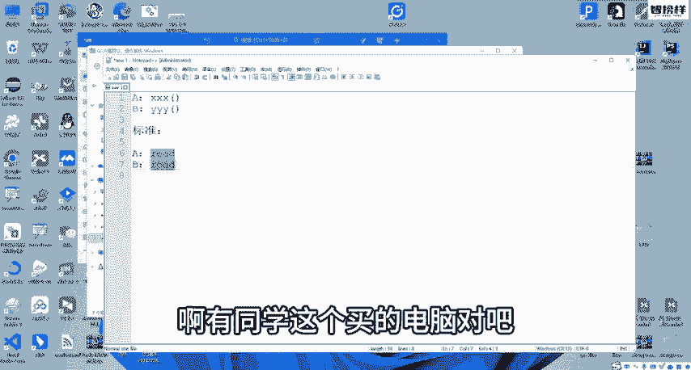
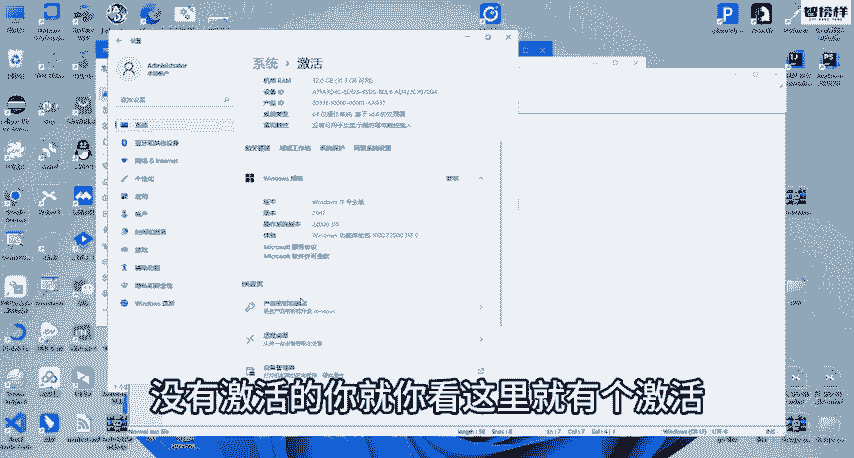
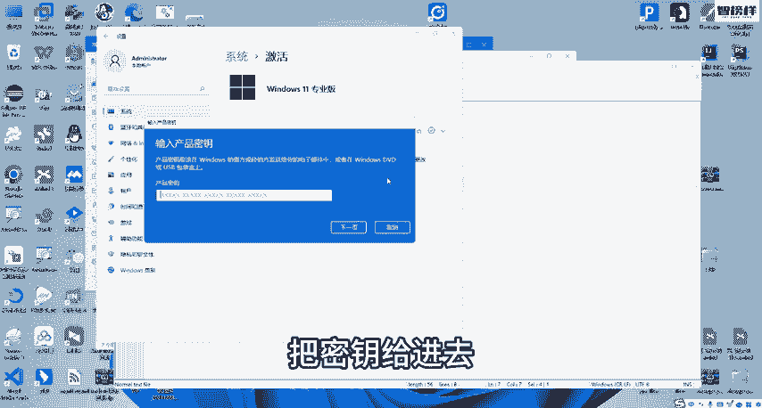
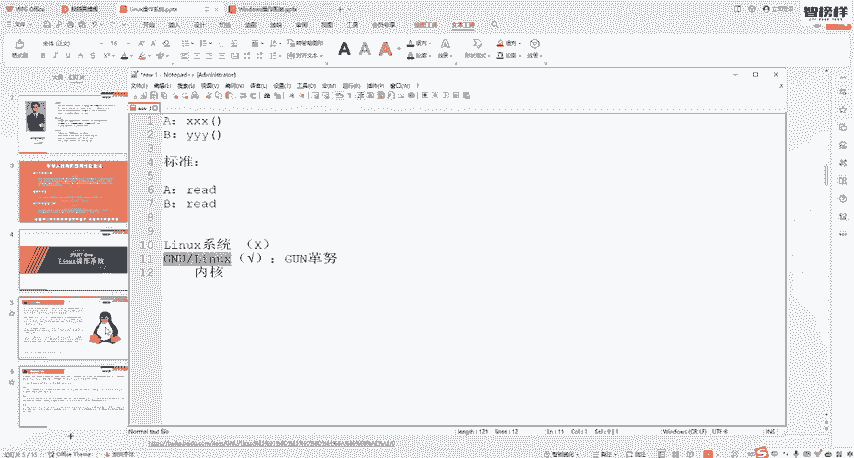

# 网络安全入门：P3：02：Linux操作系统是什么 🐧

在本节课中，我们将要学习Linux操作系统的基础知识。我们将了解它的起源、核心概念以及它与我们熟知的Windows系统有何不同。这对于后续学习网络安全工具和Kali Linux至关重要。

上一节我们介绍了操作系统的基本概念，本节中我们来看看一款在网络安全领域至关重要的操作系统——Linux。

## Linux是什么？

Linux是一款操作系统，与Windows操作系统一样，用于管理计算机硬件与软件资源。

## 相关核心概念

为了理解Linux，我们需要先了解几个关键名词。

### Unix与类Unix系统

*   **Unix**：它本身也是一个操作系统，最早出现于20世纪70年代，比Windows更早。
*   **类Unix系统**：指基于Unix操作系统演变而来的系统。我们今天的主题**GNU/Linux**就是一款类Unix系统。
*   **其他类Unix系统示例**：
    *   FreeBSD, OpenBSD
    *   **QNX**：常用于智能汽车（如未来、理想、小鹏汽车）的仪表盘系统。
    *   苹果的macOS和iOS，以及安卓系统，在广义上也可被视为类Unix系统。

**注意**：虽然许多系统都是类Unix系统，但获得官方Unix标准认证的只有苹果的macOS。这是因为认证费用高昂。Linux作为免费开源系统，虽未付费认证，但实质上符合Unix标准。

### POSIX标准

POSIX是一种专门针对**系统调用接口**制定的标准。

**接口是什么？** 回想操作系统组成，系统调用接口是用户程序与操作系统内核交互的桥梁。

**为什么需要标准？** 如果没有统一标准，不同操作系统（即使都是类Unix系统）为同一功能（如读取文件）提供的接口名称可能各不相同（例如 `xxx`, `yyy`, `zzz`）。这导致为一个系统编写的程序无法直接在另一个系统上运行，需要大量修改代码。

**POSIX的作用**：它规定所有符合该标准的系统，为特定功能（如读文件）提供的接口必须使用统一的名称（例如 `read`）。这样，开发者编写的程序就能在符合POSIX标准的任何系统上运行，提高了兼容性。

Linux是一款基于POSIX标准的多用户、多任务、支持多线程与多CPU的操作系统。Windows虽然也是多用户多任务系统，但它使用微软自己的接口标准，而非POSIX。

### GNU/Linux：更准确的名称

我们通常所说的“Linux操作系统”，严格来说是不准确的。因为 **Linux** 实际上只是一个**内核**（Kernel）。

**什么是内核？** 内核是操作系统的核心，负责管理CPU、内存等核心资源。但仅有内核无法直接使用计算机，还需要驱动程序、系统工具和软件等外围组件。

**GNU项目**：这是一个旨在创建一套完全自由的操作系统的计划。然而，GNU项目自己的内核（Hurd）开发进展缓慢。

**两者的结合**：GNU项目拥有丰富的系统工具和软件，但缺少成熟的内核；而Linux正好提供了一个优秀的内核。于是，**GNU项目的工具套件** 与 **Linux内核** 结合在一起，构成了一个完整的操作系统，即 **GNU/Linux**。

我们日常简称的“Linux系统”，通常指的就是 **GNU/Linux** 这个完整的操作系统。它是一个**免费、开源**的系统。

**对比**：
*   **macOS**：闭源，收费。
*   **Windows**：闭源，通常需要购买授权（新电脑的价格可能已包含正版授权）。
*   **GNU/Linux**：开源，免费使用。

## 总结

本节课中我们一起学习了：
1.  Linux是一款类Unix操作系统。
2.  了解了**Unix**、**类Unix系统**和**POSIX接口标准**等基础概念。
3.  明白了“Linux”通常指的是 **GNU/Linux**，即GNU工具集与Linux内核组合而成的完整、免费、开源的操作系统。

理解这些基础概念，将帮助我们更好地在后续课程中学习和使用基于Linux的网络安全发行版，如Kali Linux。