# 网络安全入门到精通：P42：17.19.命令注入1

在本节课中，我们将学习Web安全中的命令注入漏洞。我们将了解如何通过Web应用程序从外部运行目标主机的Shell命令，最终获得主机的访问权限，提升至root权限，并获取对应的flag值。

## 实验环境介绍

攻击机是Kali Linux，其IP地址为 `192.168.1.106`。靶场机器的IP地址为 `192.168.1.104`。

在CTF比赛中，主要目标是获取靶场机器上的flag值。我们所有的操作都将围绕这个目标展开，即获取flag并控制靶场机器。

## 第一步：信息收集

首先，我们需要对靶场机器进行信息探测。我们使用Nmap来扫描靶场机器的服务信息及版本。

使用以下命令进行扫描：
```bash
nmap -sV 192.168.1.104
```
Nmap将向靶场机器发送数据包，并根据响应返回扫描结果。

除了扫描版本信息，我们还可以使用以下命令扫描主机的全部信息：
```bash
nmap -A -v -T4 192.168.1.104
```
参数 `-T4` 表示Nmap以最大效率发送数据包，从而加快扫描速度。

扫描完成后，如果发现开放了HTTP服务，我们可以使用Nikto和Dirb等工具扫描靶场HTTP服务的目录信息。

使用Nikto扫描：
```bash
nikto -h http://192.168.1.104
```
Nikto会分析响应，并列出发现的目录、文件（如 `robots.txt`）以及支持的HTTP方法（如GET、POST）。

同样，可以使用Dirb进行目录扫描：
```bash
dirb http://192.168.1.104
```

## 第二步：信息分析与利用

探测完信息后，我们需要从结果中挖掘有用的线索，以帮助渗透靶场机器。

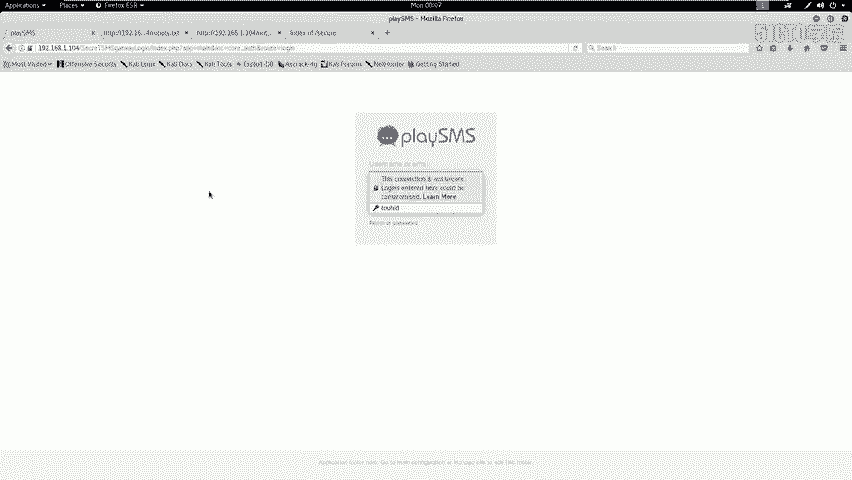

如果开放了HTTP服务，我们可以使用浏览器访问扫描到的敏感页面，查看是否有可利用的信息。例如，访问 `robots.txt` 文件或扫描出的目录。

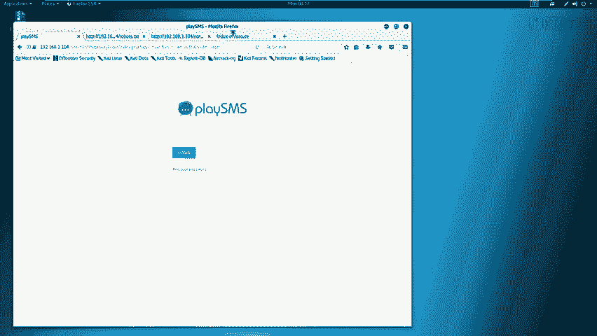

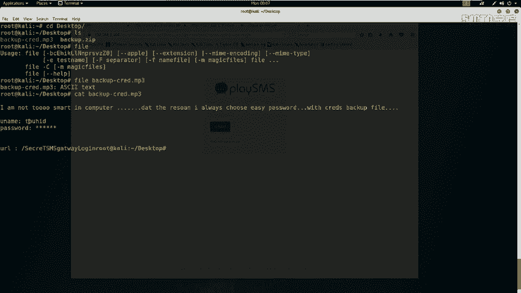

在访问 `/no` 目录时，页面显示为“Not Found”。通过查看该页面的HTML源代码，我们在注释中发现了疑似密码的信息：
```
my secret pass: freedom, password, hello world!, I love root
```

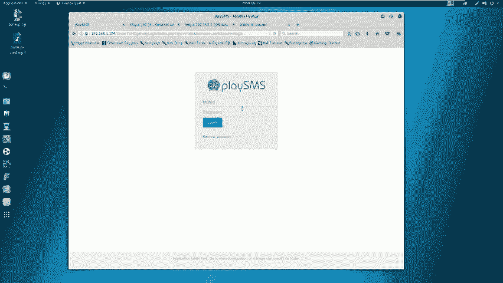

此外，在扫描结果中，我们发现了一个 `/secret` 目录。访问该目录，我们找到了一个名为 `backup.zip` 的备份文件，这可能是网站源代码的备份。

下载该文件后，尝试解压，发现需要密码。我们使用在 `/no` 页面中找到的密码进行尝试，使用密码 `freedom` 成功解压。

解压出的文件名为 `backup.mp3`。使用 `file` 命令检查其真实类型：
```bash
file backup.mp3
```
结果显示它是一个ASCII文本文件。使用 `cat` 命令查看其内容：
```bash
cat backup.mp3
```
文件内容包含用户名 `touchID`、被隐藏的密码以及一个URL `http://192.168.1.104/administrator`。

## 第三步：登录后台系统

我们访问发现的URL，出现一个登录界面。使用找到的用户名 `touchID` 和之前发现的密码列表进行尝试。最终，使用密码 `I love root` 成功登录系统后台。

登录系统后，我们需要寻找可利用的漏洞。首先识别系统，发现是 `playSMS`。使用 `searchsploit` 工具查找该系统的已知漏洞：
```bash
searchsploit playSMS
```
查询结果显示存在一个编号为 `42038.txt` 的漏洞，描述为“不严格的文件上传”，允许注册用户上传任意文件。

根据漏洞描述，在 `sendfromfile.php` 文件中存在代码执行漏洞。攻击者可以通过修改上传文件的 `filename` 参数来注入并执行PHP代码。

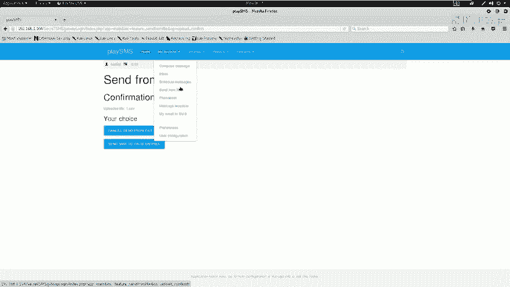

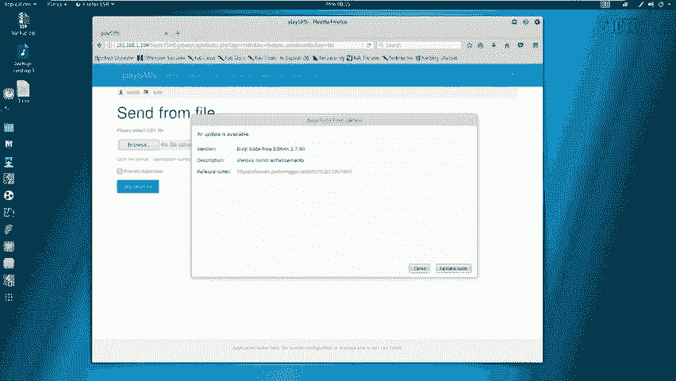

## 第四步：漏洞验证与利用

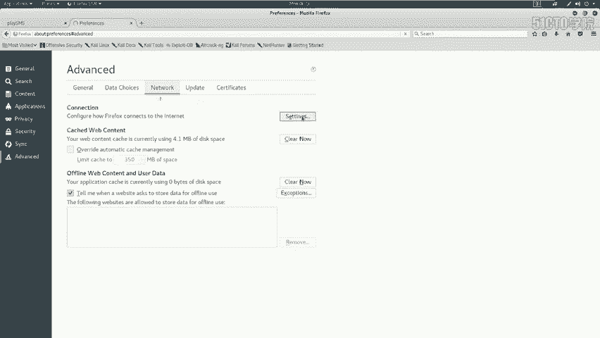

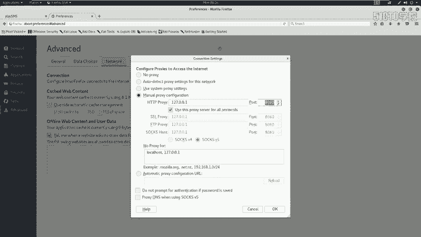

我们访问靶场上的漏洞路径 `/sendfromfile.php`，这是一个文件上传页面。

首先，在Kali上创建一个测试文件：
```bash
touch 1.csv
```
然后，通过浏览器上传此文件。

接下来，使用Burp Suite拦截上传请求。将请求发送到Repeater模块，修改 `filename` 参数，注入PHP代码。例如，执行 `uname -a` 命令：
```
filename="test.php; system(‘uname -a’); ?>"
```
发送修改后的请求，在响应中可以看到系统成功执行了 `uname -a` 命令并返回了结果，验证了命令注入漏洞的存在。

我们可以用同样的方法尝试执行其他命令，如 `id`，来查看当前用户权限。

## 总结

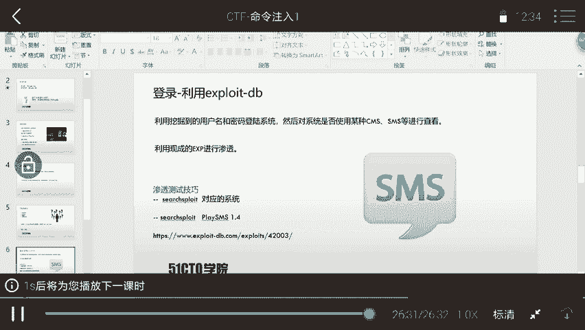

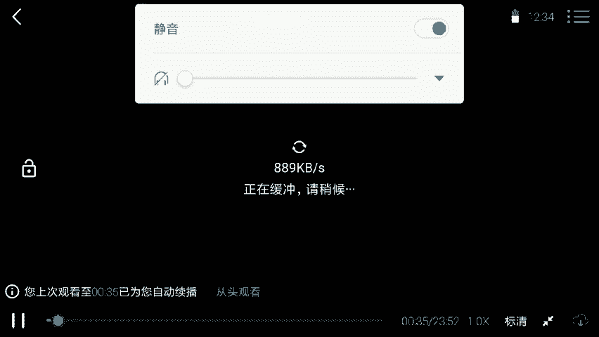

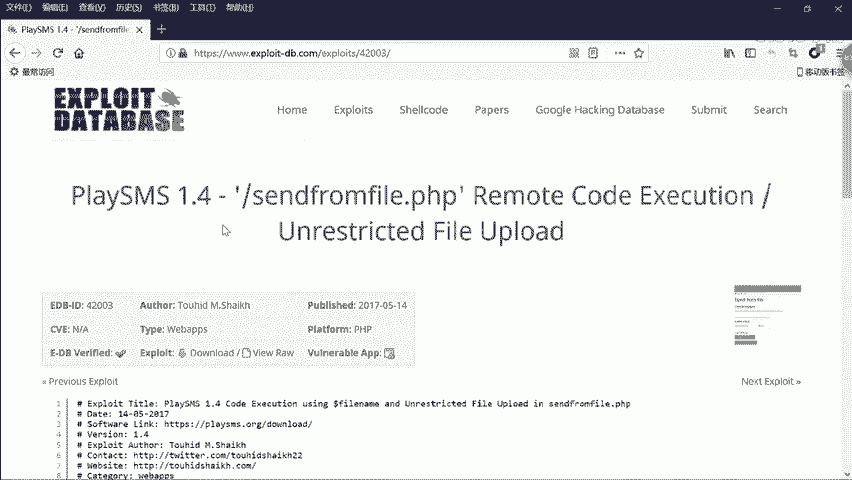

本节课我们一起学习了命令注入漏洞的初步利用。我们首先对靶场进行了信息收集，包括端口扫描和目录枚举。然后，通过分析收集到的信息（如 `robots.txt`、备份文件），我们找到了后台登录凭证。登录系统后，通过搜索已知漏洞，发现并验证了一个文件上传处的代码执行漏洞，成功在目标服务器上执行了系统命令。下节课我们将学习如何利用此漏洞获得一个反向Shell，从而完全控制目标服务器。