# 网络安全入门教程：P45：20.22.CTF综合测试(高难度)WEB安全初级入侵

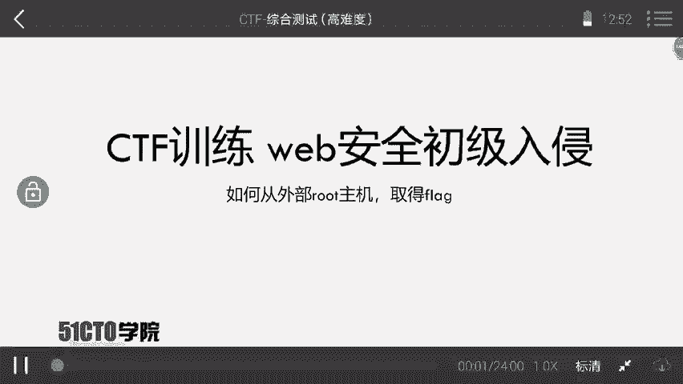

## 概述

在本节课中，我们将学习如何通过Web应用程序的安全漏洞进行渗透测试，最终目标是获取靶机（目标服务器）的root权限，并取得对应的flag值。我们将从信息收集开始，逐步分析并利用漏洞，完成一次完整的初级Web入侵流程。

---

## Web安全简介

随着Web 2.0、社交网络、微博等一系列新型互联网产品的诞生，基于Web环境的互联网应用越来越广泛。在企业信息化过程中，各种应用都架设在Web平台之上。


Web业务的迅速发展也引起了黑客的强烈关注，随之而来的是Web安全威胁的凸显。黑客利用网站操作系统的漏洞和Web应用程序的SQL注入漏洞等，获取Web服务器的控制权限。轻则篡改网页内容、挂黑页，重则通过Web漏洞窃取企业内部重要的数据信息。

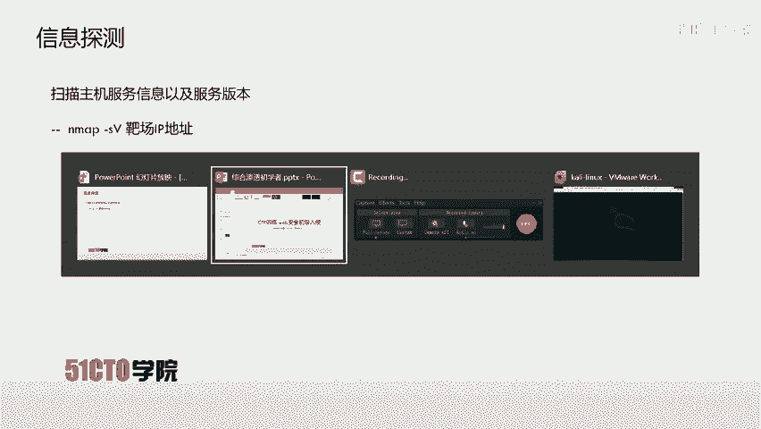

更为严重的是在网页中植入恶意代码。例如，近年来比较流行的是在网页中植入恶意代码，实现“挖矿”操作，如挖掘比特币、门罗币等虚拟货币，使网站访问者受到侵害。

---


## 实验环境介绍

下面我们介绍一下今天的实验环境。
*   攻击机IP地址：`192.168.253.12`
*   靶机IP地址：`192.168.253.13`

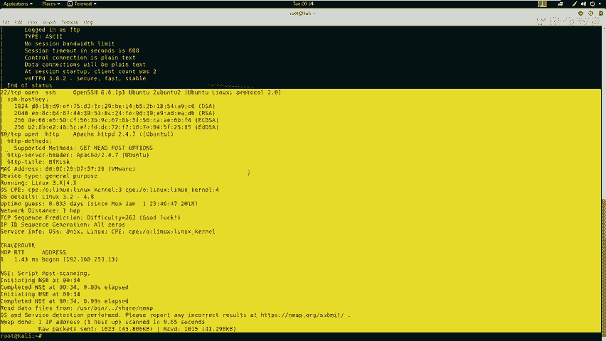

拿到实验环境后，我们的目标非常明确：获取靶机的root权限。在CTF比赛中，目标则是获取靶机上的flag值。

---

## 第一步：信息收集

在获取目标信息后，我们可以使用攻击机对靶机进行测试。测试的第一步是对靶机进行信息探测，深入了解其开放的服务和版本信息。

我们可以使用Nmap来扫描靶机IP地址所开放的服务及版本信息。

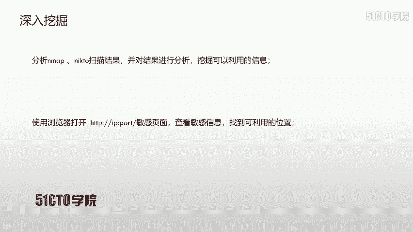

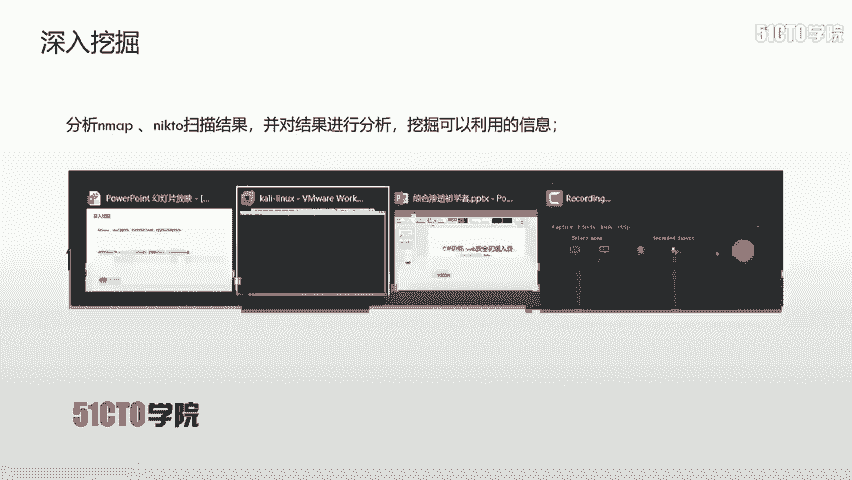

### 使用Nmap进行扫描

首先，我们使用Nmap进行基础服务版本扫描。
```bash
nmap -sV 192.168.253.13
```
执行此命令后，Nmap会向靶机发送数据包，并将处理后的服务信息显示在标准输出中。

除了扫描服务信息，我们还可以使用Nmap的“全部功能”选项来获取靶机的更全面信息。
```bash
nmap -A -v -T4 192.168.253.13
```
参数说明：
*   `-A`：启用操作系统检测、版本检测、脚本扫描和路由跟踪。
*   `-v`：显示详细输出。
*   `-T4`：指定扫描速度（0-5），T4为较快速度。

命令执行后，Nmap会将详细的扫描结果返回。

### 使用其他工具扫描Web服务

除了Nmap，我们还可以使用其他工具专门针对HTTP服务进行扫描，例如探测Web目录和敏感文件。

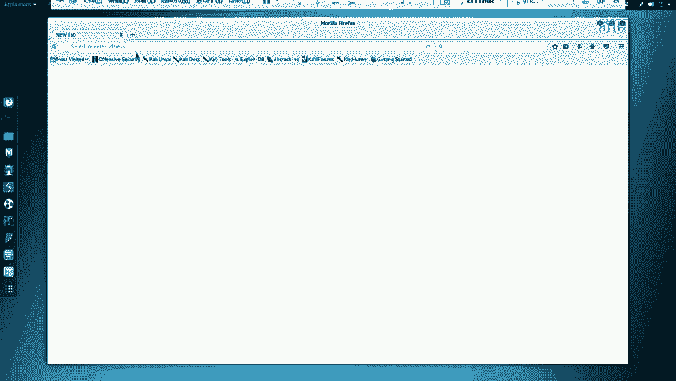

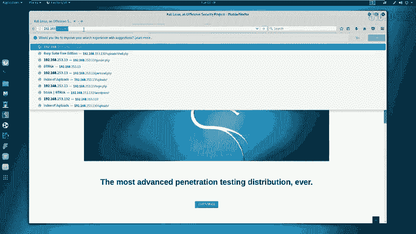

以下是两个常用工具：
1.  **Nikto**：用于扫描Web服务器，寻找潜在的危险文件和配置。
    ```bash
    nikto -h http://192.168.253.13
    ```
2.  **Dirb**：基于字典的Web目录扫描工具。
    ```bash
    dirb http://192.168.253.13
    ```

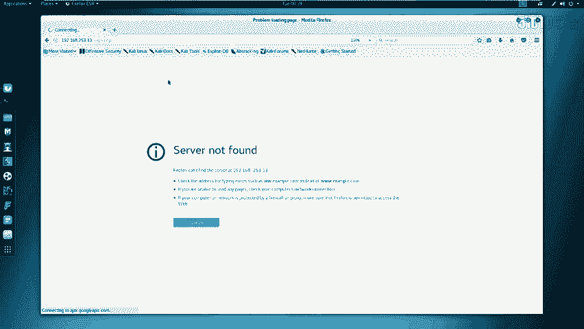

执行这些命令后，工具会返回靶机Web服务中存在的目录和文件信息。

---

## 第二步：信息分析与漏洞挖掘

完成信息收集后，我们需要从海量信息中挖掘出可利用的漏洞点。本节中，我们将分析Nmap、Nikto、Dirb等工具的扫描结果，并进行深入挖掘。


### 分析扫描结果

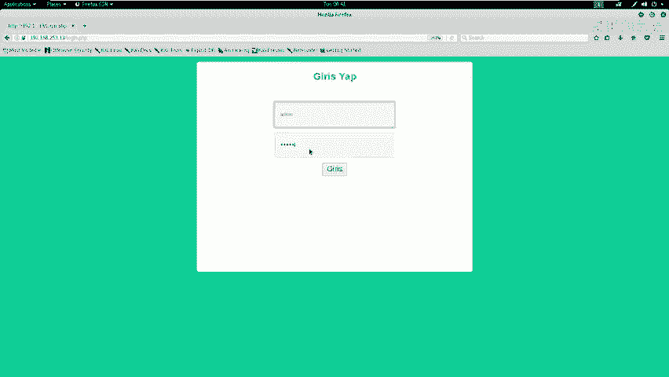

首先回顾Nmap的扫描结果，我们发现靶机开放了以下关键端口：
*   **21端口**：FTP服务。
*   **22端口**：SSH服务。
*   **80端口**：HTTP (Web) 服务。

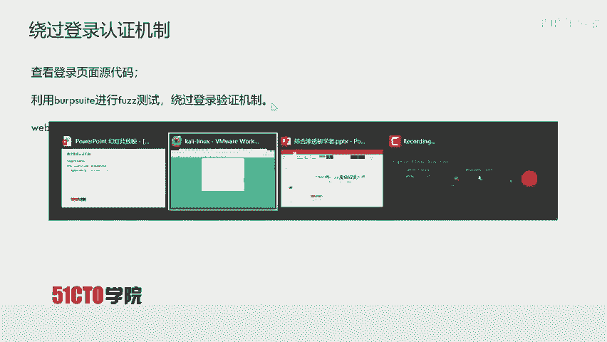

由于本次以Web入侵为主，我们重点关注80端口。查看Nikto的扫描结果，发现了一些敏感信息：
*   `config.php`：一个PHP配置文件，可能包含数据库认证信息。
*   `login.php`：用户登录界面。
*   其他默认文件或目录，如Apache中间件默认文件、资源目录、上传目录(`upload`)等。

Dirb的扫描结果也印证了这些目录的存在。

### 访问潜在漏洞点

在众多信息中，`login.php`登录界面是一个明显的交互点，可能存在漏洞。我们尝试在浏览器中访问它：
```
http://192.168.253.13/login.php
```

### 漏洞挖掘思路

面对一个可能的漏洞点（如登录界面），我们可以从以下几个方向进行思考：
1.  **SQL注入**：登录框是否存在SQL注入漏洞，可以直接绕过认证？
2.  **敏感信息泄露**：之前发现的`config.php`等文件能否直接访问并泄露信息？
3.  **已知框架漏洞**：网站是否使用了已知的CMS（内容管理系统）或框架？这些框架是否有公开的漏洞可利用？
4.  **备份文件**：网站是否存在备份文件（如`.bak`, `.old`），其中可能包含源代码或配置信息？
5.  **代码审计**：通过分析前端代码或获取到的部分源代码，寻找程序逻辑缺陷。

在CTF比赛和实际渗透中，需要对每个文件和目录保持敏锐的观察力，并具备一定的“脑洞”。

---

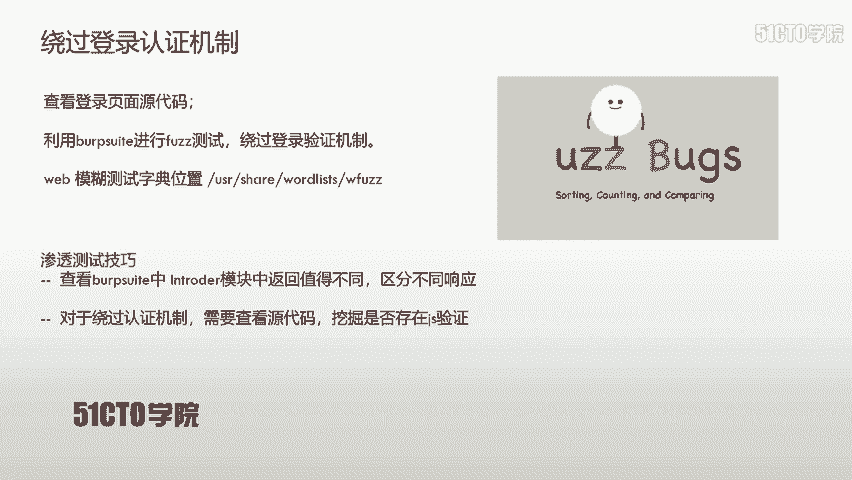

## 第三步：漏洞测试与利用

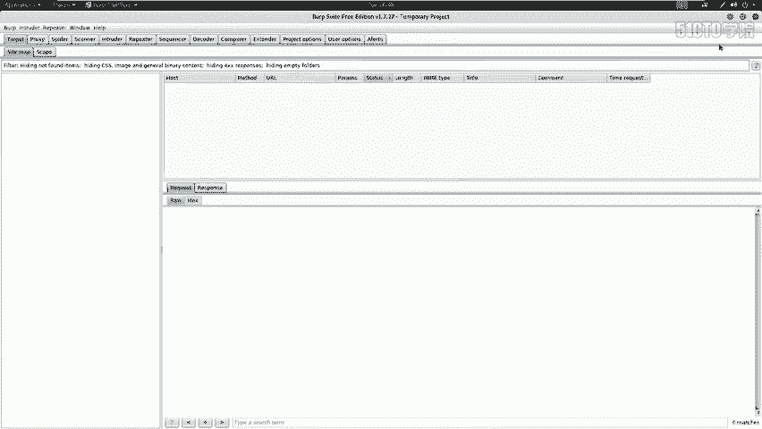

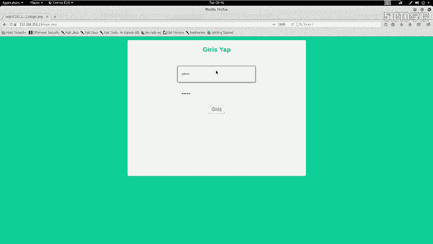

我们成功打开了登录界面。首先尝试使用弱口令（如admin/admin）登录，发现失败。接下来，我们需要尝试绕过登录认证机制。

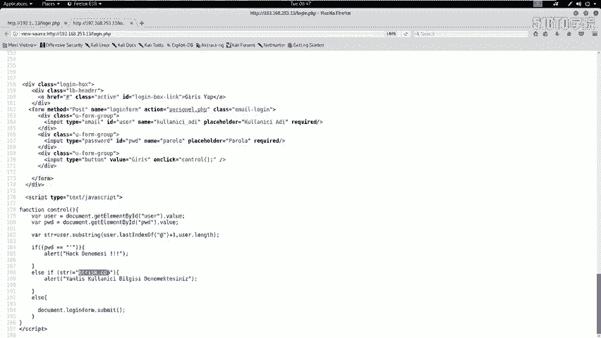

### 分析前端代码

查看网页源代码是重要的第一步，注释或前端JavaScript代码中可能隐藏关键信息。
在`login.php`的页面源代码底部，我们发现了一段JavaScript代码：
```javascript
// 示例代码逻辑
var user = 获取的用户名;
var pwd = 获取的密码;
var str = user.substring(user.lastIndexOf('@')+1);
if (pwd == '\'') {
    alert('黑客攻击！');
} else if (pwd != '\'' && str != 'btrisk.com') {
    alert('用户名必须以为btrisk.com结尾的邮箱！');
} else {
    // 执行登录
}
```
代码分析：
1.  从用户名中提取“@”符号后的内容赋值给`str`。
2.  如果密码等于**单引号(`‘`)**，则弹出“黑客攻击”警告。
3.  如果密码不是单引号，且`str`不等于“`btrisk.com`”，则提示用户名格式错误。
4.  否则，执行登录逻辑。

这段代码提示了两个关键信息：
*   密码字段可能对**单引号**敏感，暗示后端可能存在**SQL注入**漏洞。
*   用户名必须是以“`@btrisk.com`”结尾的邮箱格式。

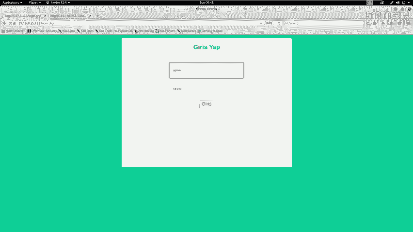

### 进行模糊测试(Fuzzing)

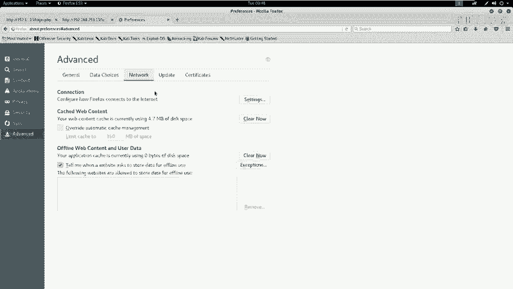

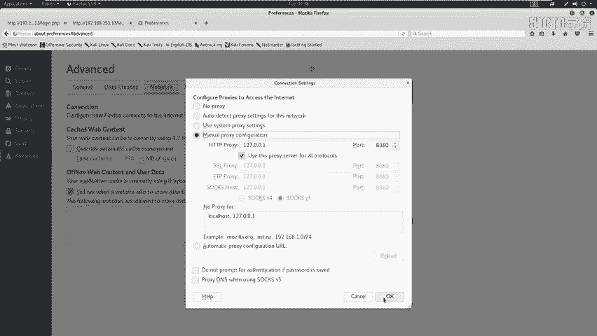

基于以上分析，我们可以对密码字段进行模糊测试（Fuzzing）。Fuzzing是通过自动化工具，向目标输入大量测试数据（Payload），根据响应差异（如返回内容长度、状态码）来判断是否存在漏洞的方法。

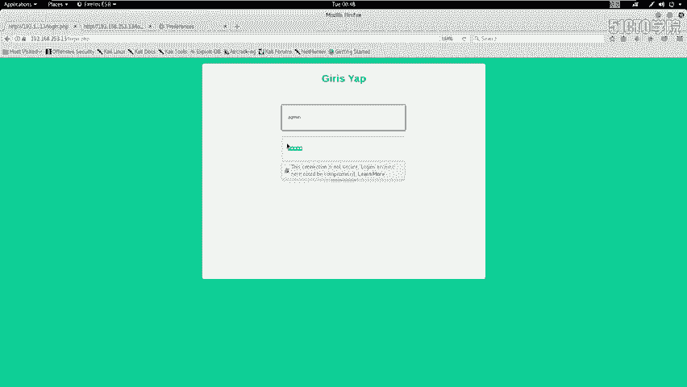

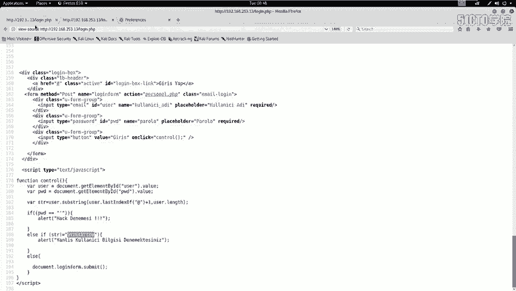

我们将使用Burp Suite工具进行测试。

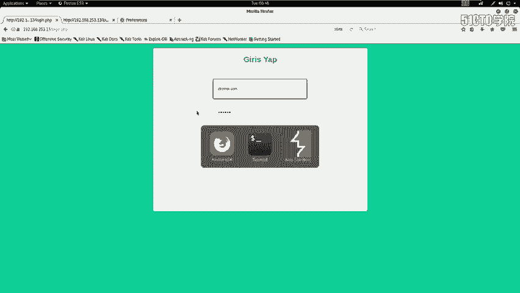

**操作步骤如下：**
1.  配置浏览器代理指向Burp Suite。
2.  在登录界面输入用户名：`test@btrisk.com`，密码：`123456`，并点击登录。
3.  Burp Suite会截获这个登录请求数据包。
4.  将数据包发送到Burp的 **Intruder** 模块。
5.  在Intruder模块中，将密码(`pwd`)的值设置为攻击**变量**。
6.  **Payload** 选择Kali Linux中自带的SQL注入测试字典：`/usr/share/wordlists/fuzzdb/attack/sql-injection/detect/GenericBlind.txt`。
7.  开始攻击，观察不同Payload对应的响应长度(`Length`)。

测试结果中，我们发现大多数Payload返回长度为`2044`或`2203`。但有一个特殊的Payload返回了`2900`的长度，这很可能代表登录成功（因为成功页面与失败页面内容长度不同）。

在响应中查看这个`2900`长度的请求，发现其返回了一个新的页面，其中包含一个**文件上传功能**。

---

## 第四步：获取初步权限与上传绕过

我们成功绕过了登录，进入了一个上传页面。通常，上传功能是获取WebShell（在服务器上执行命令的脚本）的重要途径。

### 测试上传功能

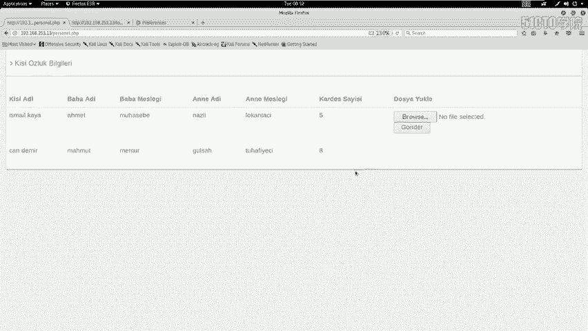

我们首先尝试上传一个普通图片文件（如`.jpg`），上传成功。
接着，我们尝试上传一个PHP Webshell文件（如`shell.php`），发现被阻止，页面提示只能上传图片格式。

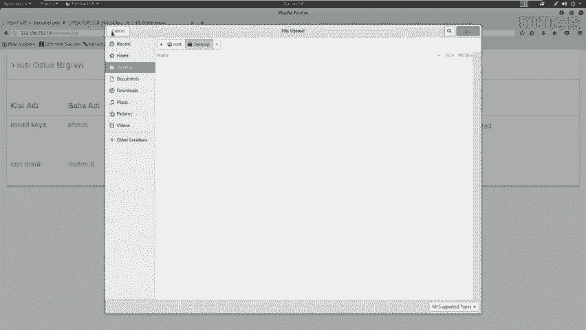

这说明网站对上传文件进行了**后缀名或内容类型检查**。

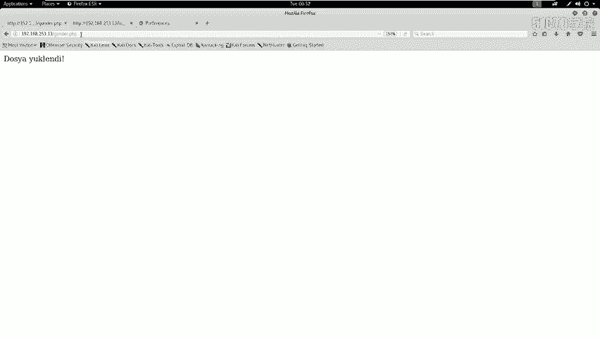

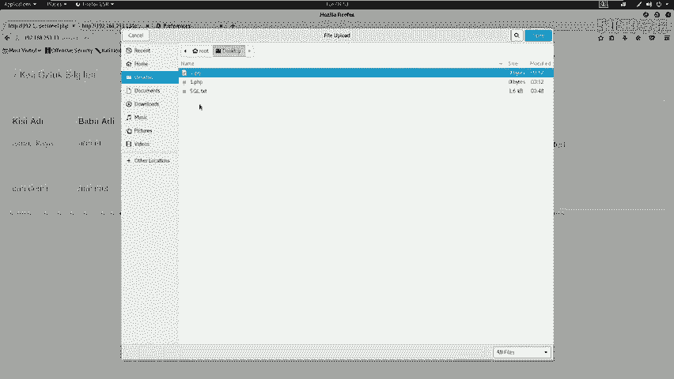

### 本节总结与下节预告

本节课中，我们一起学习了Web安全渗透测试的初级流程：
1.  **信息收集**：使用Nmap、Nikto、Dirb等工具探测目标。
2.  **漏洞分析**：分析扫描结果，定位潜在漏洞点（如`login.php`）。
3.  **漏洞测试**：通过代码审计发现线索，利用Burp Suite进行模糊测试，成功绕过登录认证。
4.  **功能探测**：发现了文件上传功能，但存在上传限制。

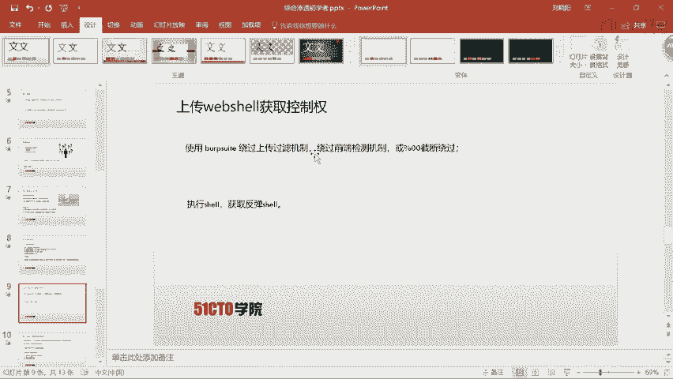

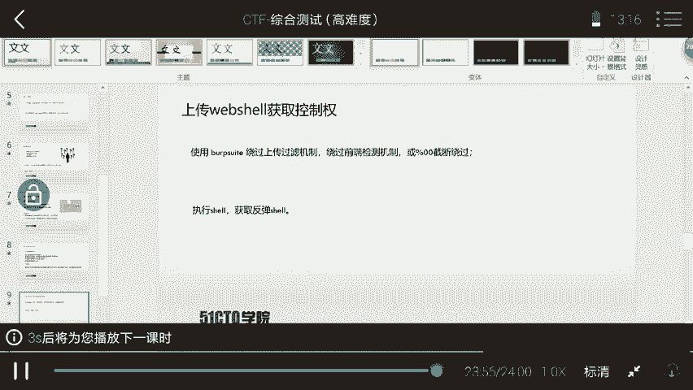

我们目前已经获得了后台访问权限，并找到了一个上传点。然而，直接上传PHP文件被阻止。**如何绕过上传检测机制，成功上传WebShell并获取系统权限，将是我们下节课要解决的核心问题。** 常见的绕过方法包括修改文件后缀名（如`shell.php.jpg`）、伪造Content-Type、利用解析漏洞等。