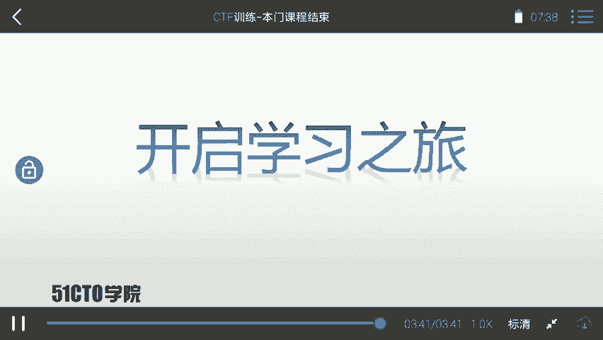
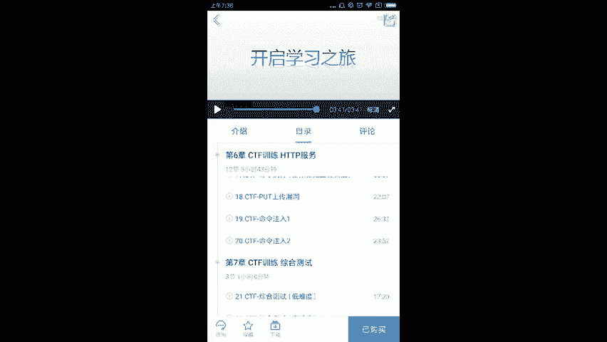

# CTF训练课程：P46：课程总结与展望 🎯

在本节课中，我们将对之前所学的CTF（Capture The Flag）知识进行回顾与总结，并展望未来的学习路径。

## 课程内容回顾

上一节我们介绍了CTF比赛的多种题型，本节中我们来回顾整个课程的核心概念。

CTF是一种流行的信息安全竞赛形式，其英文名可译为“夺旗赛”。其大致流程如下：参赛团队之间通过进行攻防对抗、程序分析等形式，率先从主办方给出的比赛环境中得到一串具有一定格式的字符串或其他内容，并将其提交给主办方，从而夺得分数。为了方便称呼，我们把这样的内容称之为 **`flag`**。

在CTF比赛中，涉及的内容比较繁杂。我们需要利用所有可以利用的方法获得对应的flag。这里强调大家需要有很大的“脑洞”来挖掘对应的信息。

通过本门课程的学习，大家基本掌握了CTF比赛中的一些基本套路，可以完成一定难度靶场的flag寻找。但是本门课程并不能确定并指导你成为一个“大牛”。大家距离“大牛”的路是相当远的。

## 持续学习的方法

在信息安全或CTF学习当中，我们需要不断实践、不断尝试才能更快地进步。当然，我们在学习时也需要有一定的方法、有对应的课程、有训练环境。

以下是持续精进的几个关键点：
*   **坚持实践**：理论知识需在靶场和比赛中反复应用。
*   **系统学习**：跟随结构化的课程，逐步构建知识体系。
*   **利用环境**：在安全的实验环境中大胆测试和尝试。

## 后续课程预告

在之后，我也会推出一些课程帮助大家学习。欢迎大家关注我之后发布的课程。

以下是计划推出的课程简介：
*   **代码审计课程**：专门教大家去挖掘对应的漏洞，并且编写对应的 **`POC（Proof of Concept）`**。
*   **WiFi安全课程**：里面会使用一些高度集成的工具测试WiFi，并且涉及最新的测试方法，例如中间人攻击直接修改对应WPA/WPA2 WiFi密码。
*   **Metasploit模块编写课程**：教大家如何编写一个Metasploit模块来进行自动化测试。
*   **CTF训练高端课程**：提升课程难度，使大家对CTF有更深入的了解，并提升安全能力。

## 总结与共勉

本节课中，我们一起学习了CTF比赛的基本概念与流程，回顾了课程要点，并探讨了持续学习的方法与未来方向。

大家的学习尚未成功，仍需努力。让我们一起开启下面的学习之旅吧。

