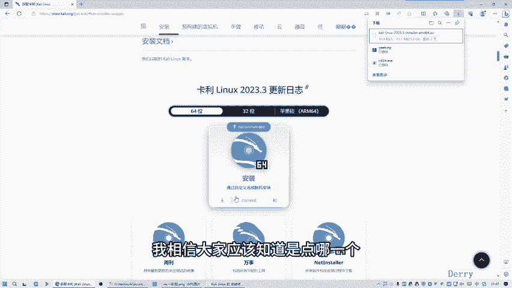
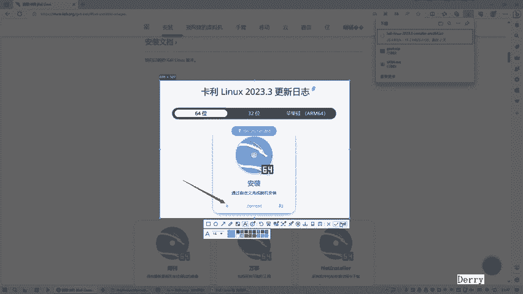
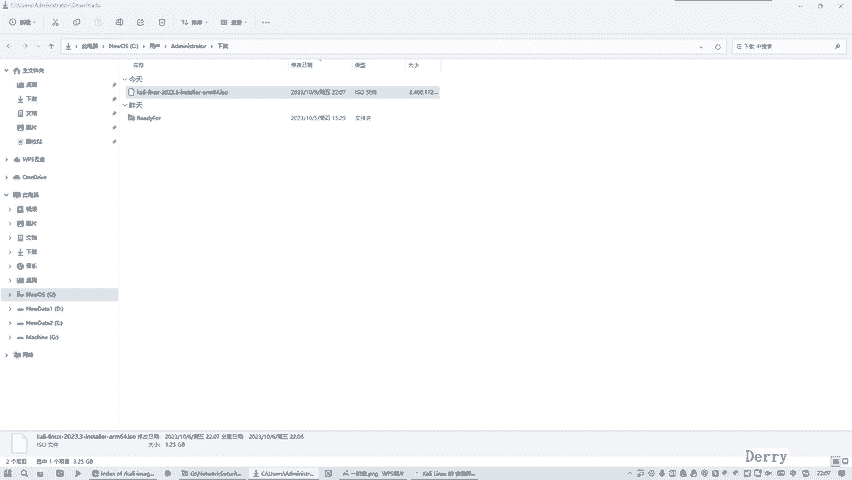

# Kali Linux入门教程：P4：03.Kali Linux ARM64下载指南

在本节课中，我们将学习如何下载Kali Linux的安装镜像文件。这是安装Kali Linux的第一步，我们将详细介绍两种下载方法：通过官方网站下载最新版本和通过历史版本库快速下载。

## 打开Kali Linux官网

首先，我们需要访问Kali Linux的官方网站。有两种方式可以实现。

*   在百度等搜索引擎中搜索“Kali Linux官网”关键字。
*   直接在浏览器地址栏输入Kali Linux的官方网址。

以下是具体步骤：

1.  打开浏览器。
2.  在地址栏输入Kali Linux官网地址。
3.  如果英文界面阅读有困难，可以使用浏览器的翻译功能将页面翻译成中文。

## 通过官网下载镜像

翻译完成后，我们需要点击下载按钮。官网提供了多种下载方式。

*   不推荐使用迅雷等下载工具的方式。
*   推荐直接通过浏览器下载。

对于Windows系统用户，需要选择64位版本。请注意，这里指的是Kali Linux系统的64位版本，与Windows系统本身是32位还是64位无关。苹果Mac电脑的ARM芯片用户应选择对应的ARM64版本。选择正确的版本后，即可开始下载。最新版本的镜像文件较大，下载速度可能较慢。

## 通过历史版本库加速下载

如果通过官网直接下载速度过慢，我们可以采用第二种方法：从Kali Linux的历史版本库下载。这种方法通常速度更快。

具体操作是访问Kali Linux的历史版本目录，选择稍旧但稳定的版本进行下载。例如，可以选择2023年的某个发布版本。在文件列表中，找到扩展名为 `.iso` 的安装镜像文件。对于大多数用户，下载 `installer` 版本即可。点击对应的文件链接，下载速度通常会显著提升。

## 下载完成确认

使用历史版本库的方法下载完成后，可以在浏览器的下载管理器中找到已下载的 `.iso` 镜像文件。至此，Kali Linux的镜像文件下载工作就完成了。如果官网直接下载仍在进行，可以将其取消。

---

本节课中，我们一起学习了下载Kali Linux安装镜像的两种主要方法。首先介绍了通过官方网站下载最新版本的流程，然后针对下载速度慢的问题，讲解了通过访问历史版本库来加速下载的实用技巧。成功获取 `.iso` 镜像文件是后续安装操作的基础。