# 网络安全入门到精通：P5：03-2. 网络安全基础：Kali Linux简介 🐉

在本节课中，我们将要学习网络安全渗透测试中一个至关重要的工具——Kali Linux。我们将从最基础的概念讲起，了解什么是Linux，什么是发行版，并详细介绍Kali Linux的背景、特点以及如何获取它。

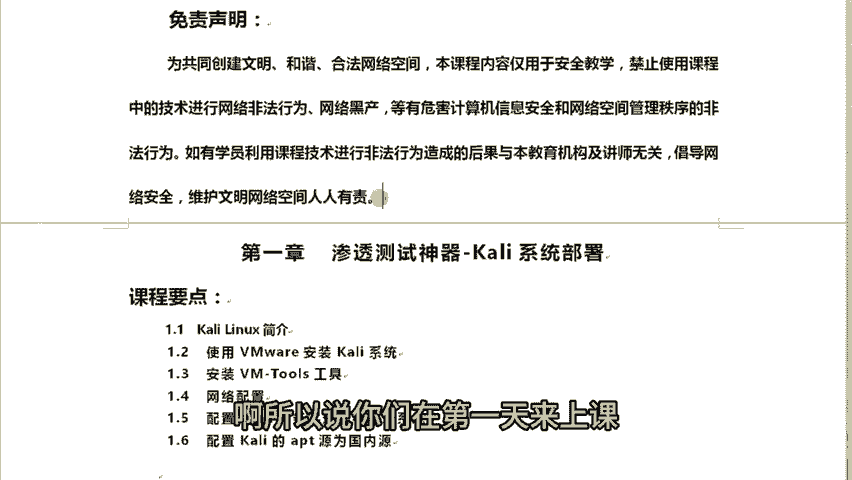

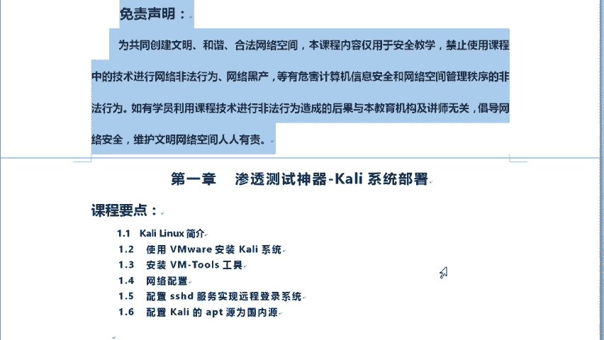

## 免责声明 ⚠️

在开始学习之前，必须明确本课程内容的用途。

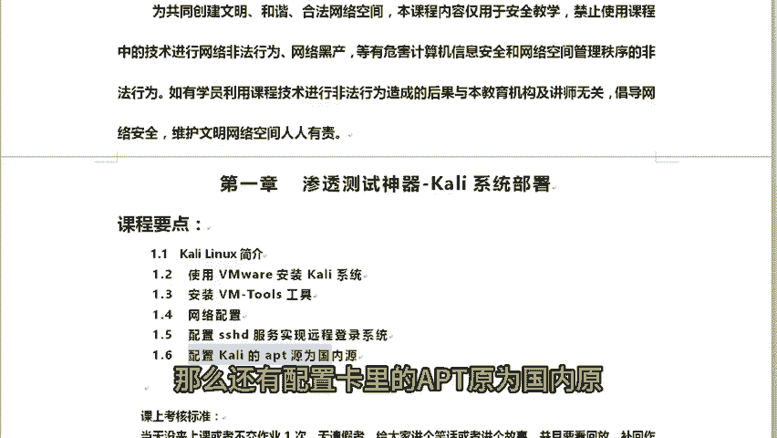

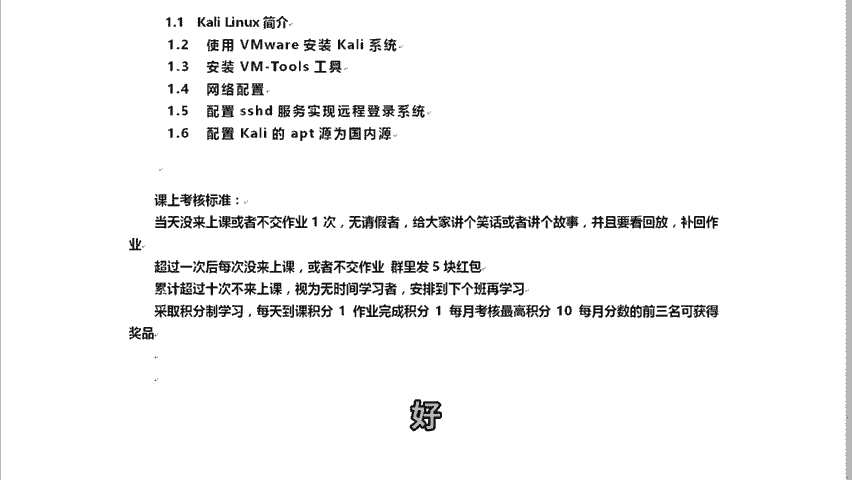

本课程内容仅用于安全教学目的，旨在共同创建文明、和谐、合法的网络空间。**禁止**使用课程中教授的任何技术进行网络非法行为、网络黑产等危害计算机信息安全和网络空间管理秩序的活动。

若有学员利用课程技术进行非法行为并造成后果，其责任与后果均与本机构及讲师无关。维护网络安全，人人有责。

## 第一章：渗透测试神器Kali Linux的部署

上一节我们明确了学习的法律与道德边界，本节中我们来看看今天的主角——Kali Linux。我们将学习如何部署这个强大的渗透测试系统。

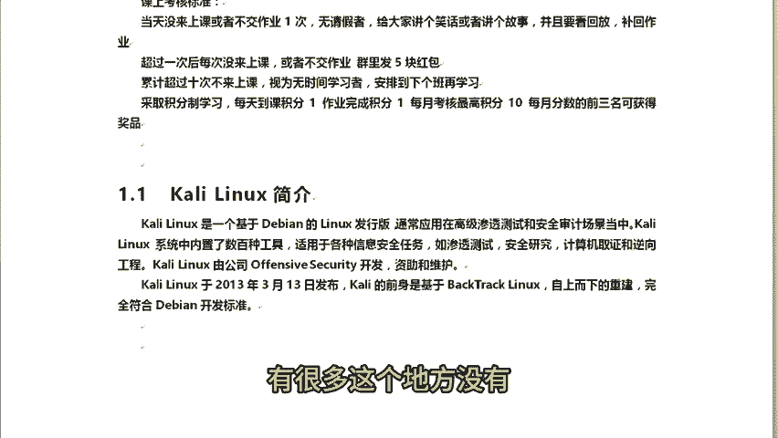

以下是本章将要涵盖的核心内容：
*   Kali Linux简介
*   使用VMware安装Kali系统
*   安装VMware Tools工具
*   网络配置
*   配置SSHD服务实现远程登录
*   配置Kali的APT源为国内源

### 1. Kali Linux简介

首先，我们来认识一下Kali Linux。Kali Linux是一个基于**Debian**的Linux发行版。

这里有两个核心概念需要理解：**Linux**和**发行版**。

*   **Linux**：严格来说，Linux本身**不是一个完整的操作系统**，而是一个**操作系统内核**。内核是操作系统的核心，负责管理系统的关键资源，例如：
    *   **多任务处理**与**进程管理**
    *   **内存管理**
    *   **网络管理**
    可以将其理解为计算机硬件与上层软件之间的“翻译官”和“调度员”。
*   **发行版**：早期的Linux用户需要手动下载内核，再逐一寻找和编译所需的应用程序（如命令行界面、图形界面等），过程非常复杂。后来，一些组织或公司将Linux内核与一系列精选的软件、工具包打包在一起，形成一个可以直接安装使用的完整操作系统。这样的打包版本就称为“发行版”。提供这些打包版本的组织就是“发行商”。

**简单来说：Linux是引擎，发行版是整辆汽车。**

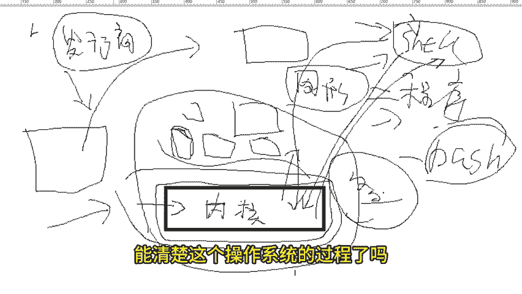

Kali Linux就是这样一个“发行版”。它专为**高级渗透测试**和**安全审计**设计，其最大特点是**内置了数百种安全工具**，适用于多种安全任务场景。

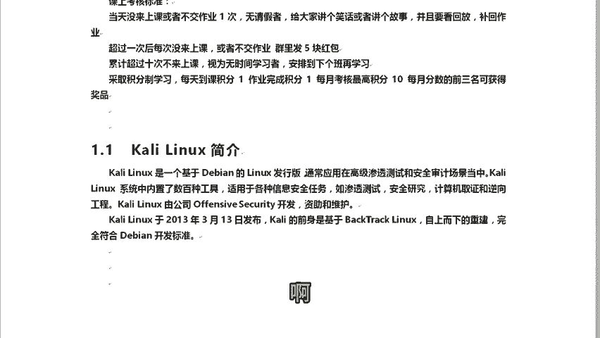

以下是Kali Linux支持的一些主要场景：
*   渗透测试
*   安全研究
*   计算机取证
*   逆向工程

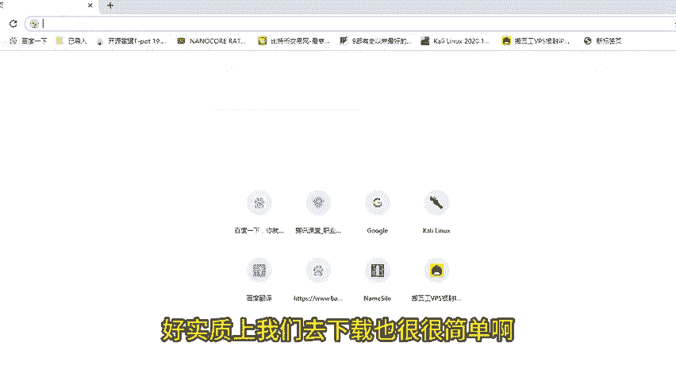

Kali Linux由**Offensive Security**公司开发、资助和维护。该公司名称可译为“进攻性安全”。

### 2. Kali Linux的历史与获取

了解了Kali是什么之后，我们来看看它的来历以及如何获取。

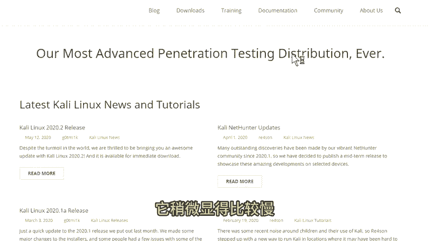

Kali Linux的前身是著名的**BackTrack Linux**。在2013年3月13日，Offensive Security对BackTrack进行了自上而下的彻底重构，发布了Kali Linux 1.0。它完全遵循Debian的开发标准，成为了一个独立的发行版。

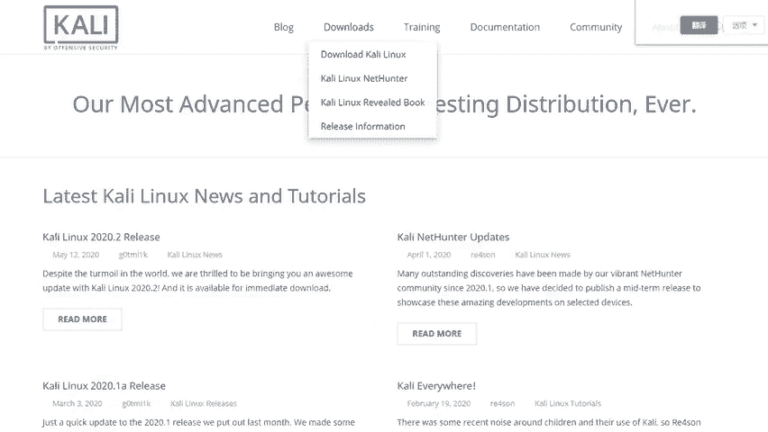

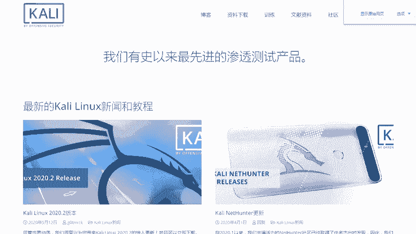

要获取Kali Linux，最直接的方式是访问其官方网站。

**官方网站地址**：`https://www.kali.org`

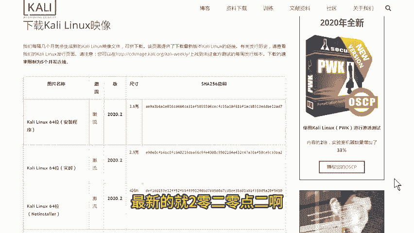

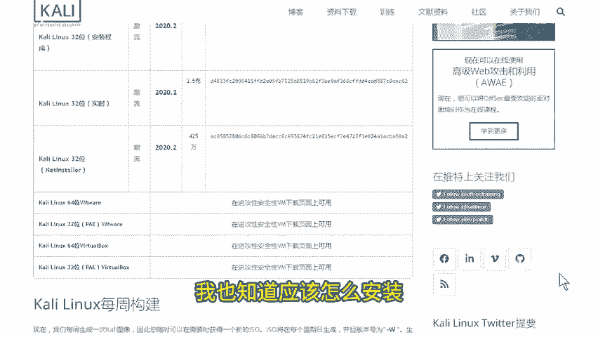

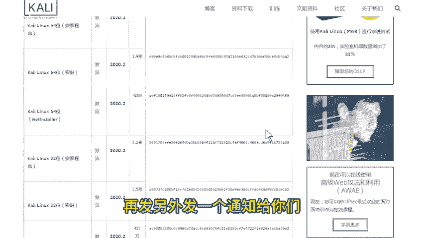

在官方网站上，你可以：
*   下载最新的Kali Linux系统镜像文件（ISO）。
*   查看官方的更新文档，了解每个版本的变化。
*   寻找相关的帮助和社区支持。

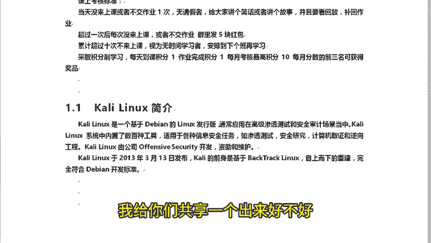

**下载说明**：本课程将以**Kali Linux 2019.3**版本进行讲解和演示。选择稍旧的版本是为了让初学者更好地理解基础原理和操作，之后再学习新版时，就能清晰地对比出其中的变化与改进。

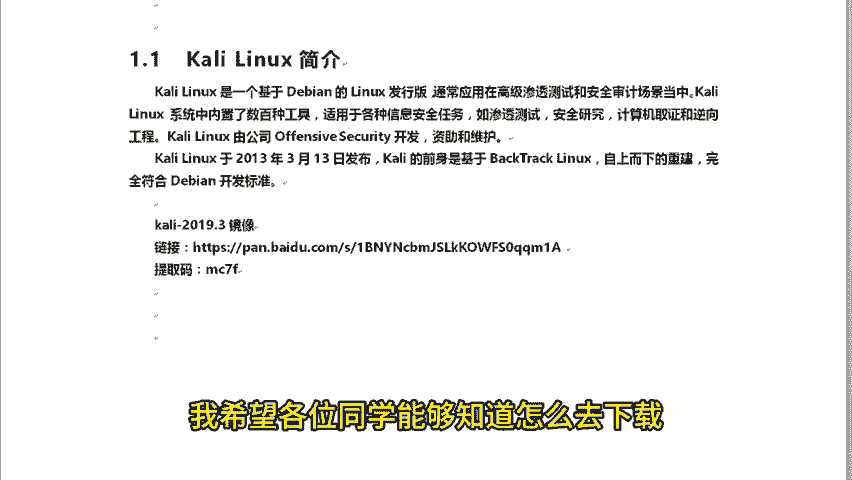

下载时通常有两种方式：
1.  直接通过HTTP链接下载镜像文件。
2.  下载种子文件（Torrent），使用BT工具进行下载。

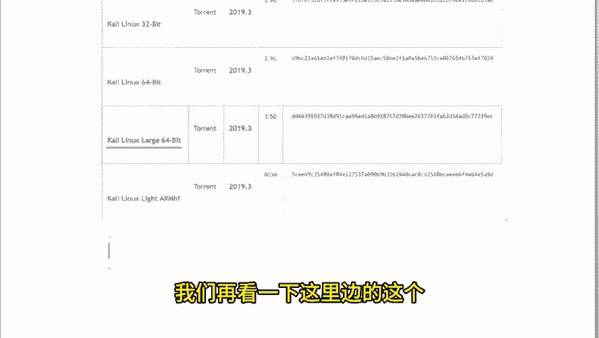

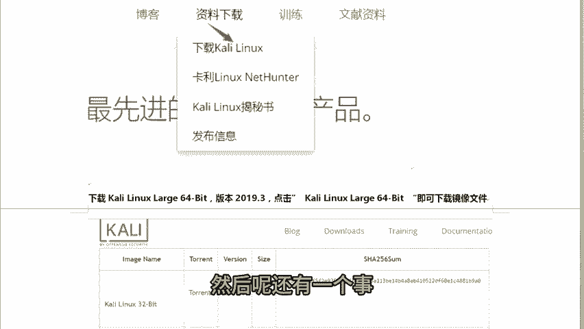

**请注意**：课程所需的Kali Linux 2019.3镜像文件，讲师会在课后提供下载链接，请学员关注课程群内的通知。

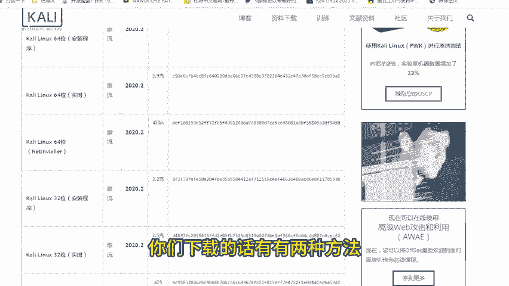

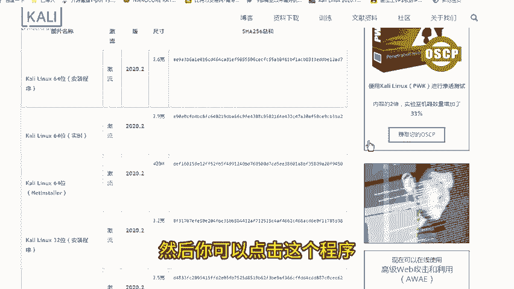

---

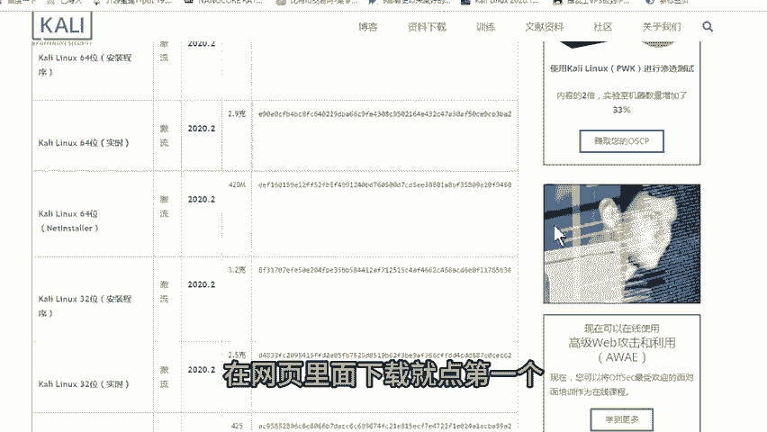

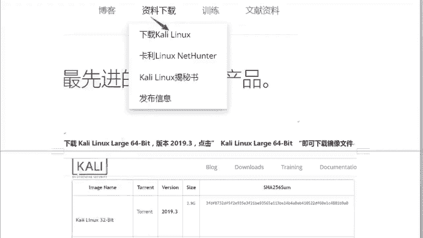

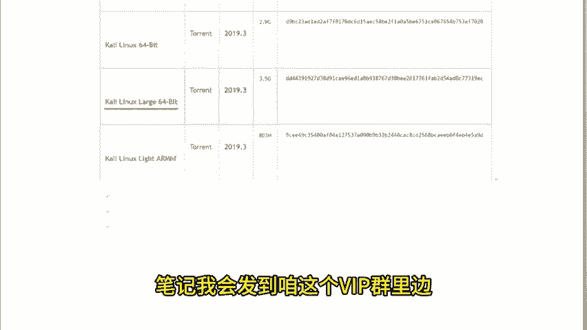

本节课中我们一起学习了Kali Linux的基本概念。我们明确了Linux内核与发行版的区别，了解了Kali Linux作为一款专为安全测试设计的发行版，其历史、特点及官方获取途径。下一节，我们将开始动手实践，学习如何在虚拟机中安装Kali Linux系统。