# 网络安全入门教程：P6：04.Kali安装到VM

在本节课程中，我们将学习如何将下载好的Kali Linux镜像文件安装到VMware虚拟机中。这是搭建网络安全学习环境的关键一步。

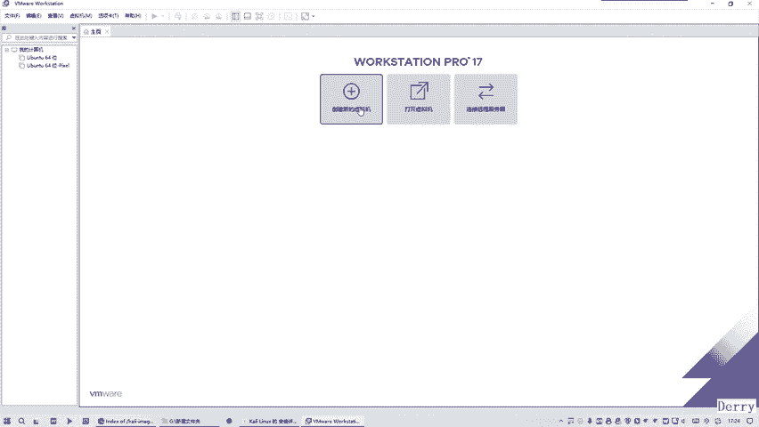

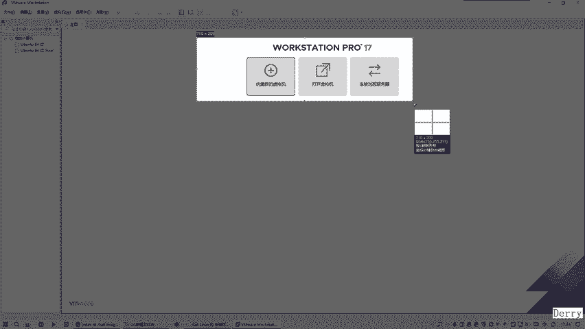

在上一节中，我们已经成功下载了Kali Linux的ISO镜像文件。本节我们将利用之前安装好的VMware Workstation 17，创建一个新的虚拟机并完成Kali系统的安装。

## 创建新虚拟机

首先，打开VMware Workstation 17软件。

以下是创建新虚拟机的详细步骤：

1.  **点击“创建新的虚拟机”**：在VMware主界面，点击“创建新的虚拟机”按钮，启动新建向导。
    

2.  **选择配置类型**：在弹出的向导窗口中，选择“自定义（高级）”选项，以获得更灵活的配置控制权。
    

3.  **选择硬件兼容性**：保持默认的“Workstation 17.x”选项，点击“下一步”。

4.  **选择安装来源**：这是关键步骤。选择“稍后安装操作系统”，我们将在后续步骤手动指定Kali镜像文件。
    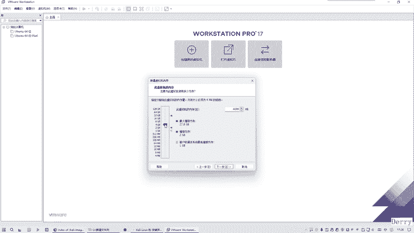

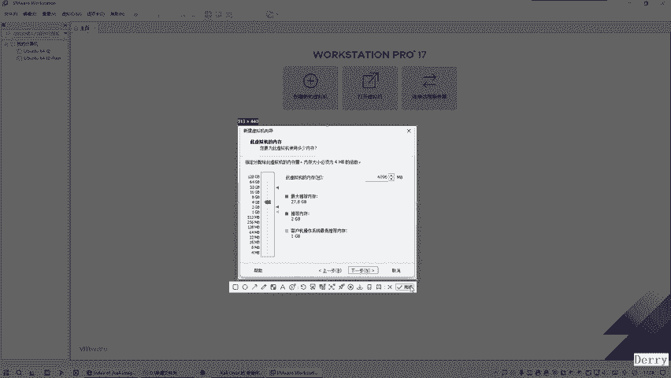

5.  **选择客户机操作系统**：选择“Linux”，然后在版本下拉菜单中，选择“Debian 11.x 64位”。Kali基于Debian，因此选择对应的版本。
    

6.  **命名虚拟机**：为虚拟机取一个名称，例如“Kali-Linux”。**重要提示：名称和安装路径请务必使用英文，避免使用中文，以防出现未知错误。**
    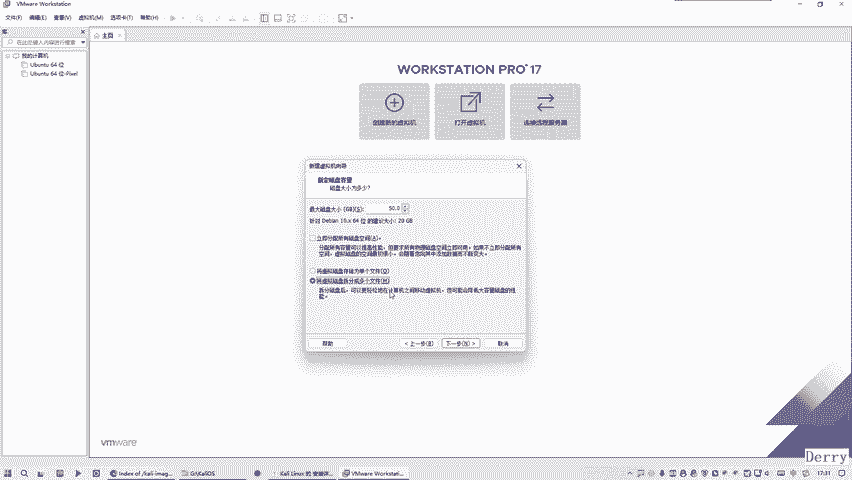

7.  **处理器配置**：为虚拟机分配处理器核心。建议至少分配“2”个处理器，每个处理器“2”个核心，即总共4个逻辑核心。
    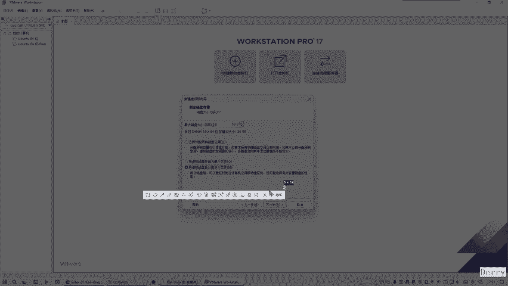

8.  **内存配置**：为虚拟机分配内存。默认的2GB可能不够，建议设置为**4096 MB（即4GB）**，以保证系统运行流畅。

9.  **网络类型**：保持默认的“使用网络地址转换（NAT）”即可。

10. **I/O控制器和磁盘类型**：这两个步骤均保持软件推荐的默认选项。

11. **选择磁盘**：选择“创建新虚拟磁盘”。

12. **指定磁盘容量**：设置虚拟磁盘大小。Kali系统本身占用不大，但考虑到后续工具安装和数据存储，建议分配**50 GB**。并选择“将虚拟磁盘拆分成多个文件”，这种方式在文件管理和迁移时更灵活，问题更少。
    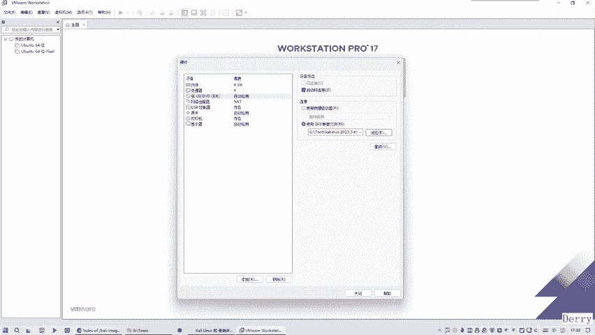

13. **指定磁盘文件**：保持默认的磁盘文件名和位置，点击“下一步”。

14. **准备创建**：在最终确认界面，先不要点击“完成”。我们需要先**自定义硬件**，指定Kali的安装镜像。

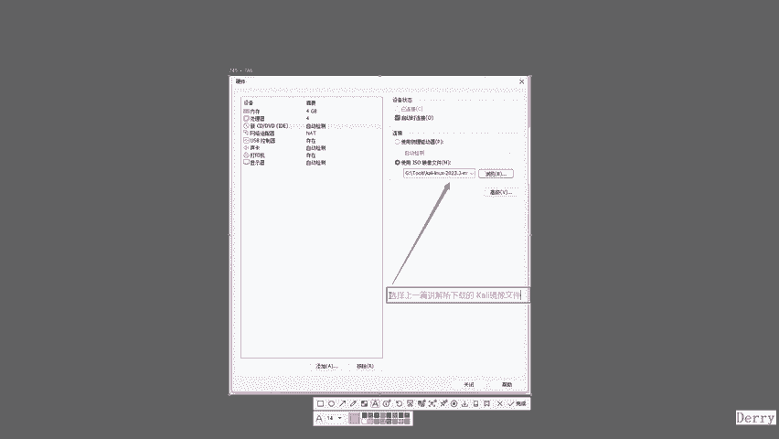

## 配置虚拟机硬件

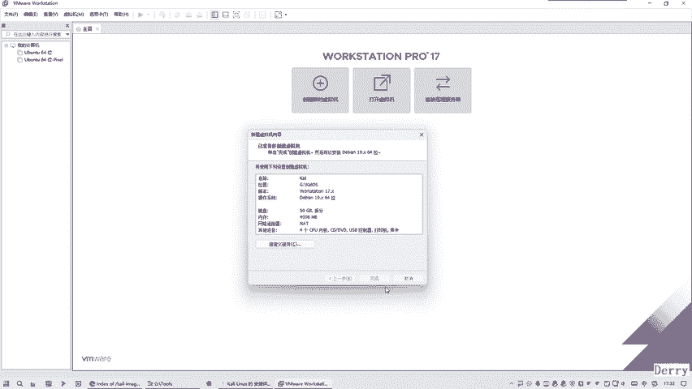

由于我们在第4步选择了“稍后安装操作系统”，现在需要手动挂载ISO镜像文件。

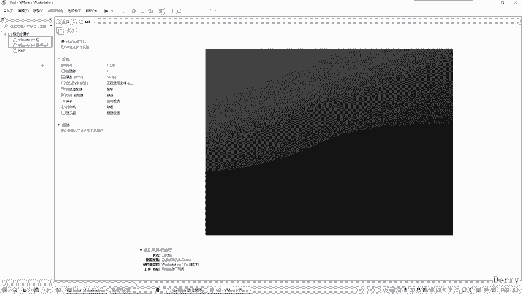

以下是配置步骤：

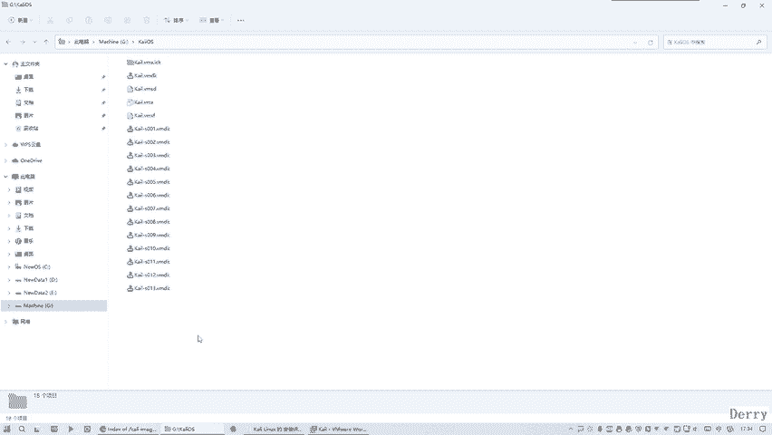

1.  在“准备创建”界面，点击“自定义硬件...”。
    

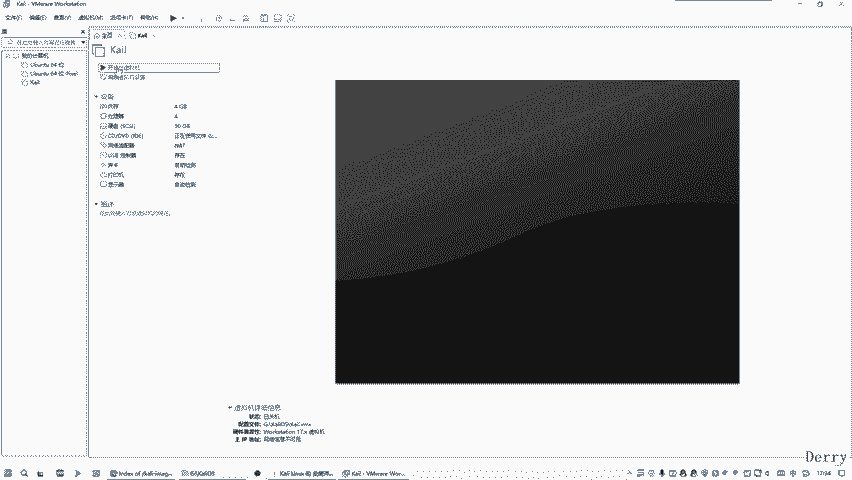

2.  在弹出的硬件窗口中，找到“CD/DVD (SATA)”设备。
3.  在右侧，选择“使用ISO映像文件”，然后点击“浏览”，找到并选择你在上一节中下载的Kali Linux ISO文件。
    

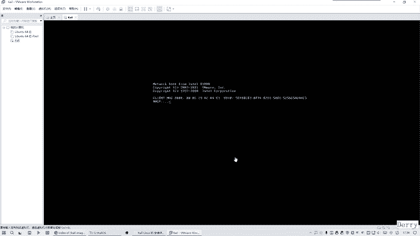

4.  确认选择无误后，点击“关闭”，然后回到主向导界面点击“完成”。

至此，虚拟机的创建和初始配置就完成了。你可以在VMware的库中看到新创建的“Kali-Linux”虚拟机。

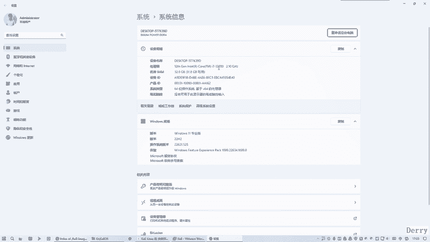

## 启动并安装Kali Linux

现在，虚拟机已经准备就绪，可以开始安装操作系统了。

1.  在VMware库中选中“Kali-Linux”虚拟机，点击“开启此虚拟机”。
    

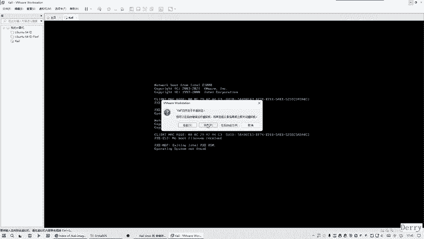

2.  虚拟机会从我们配置的ISO镜像启动。启动后，会进入Kali Linux的安装引导界面。
    

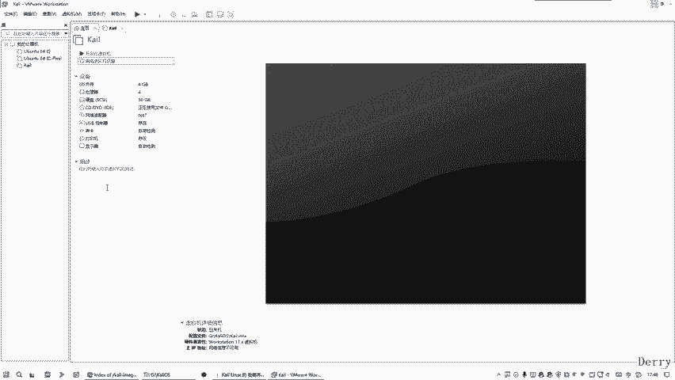

**注意**：如果启动后长时间黑屏或提示类似“**SYSLINUX ... boot: ... not found**”的错误，可能是虚拟机服务或配置问题。可以尝试以下解决方法：
*   按 `Ctrl+Alt` 组合键将焦点从虚拟机切换回主机。
*   彻底关闭虚拟机（选择“关机”）。
*   检查虚拟机的“CD/DVD”设置，确保ISO文件路径正确且无中文。
*   在Windows主机上，按 `Win + R` 键，输入 `services.msc` 打开服务管理器，确保所有VMware相关的服务（如VMware Authorization Service, VMware NAT Service等）都处于“正在运行”状态。
    
    
*   重启这些服务后，再次尝试启动虚拟机。

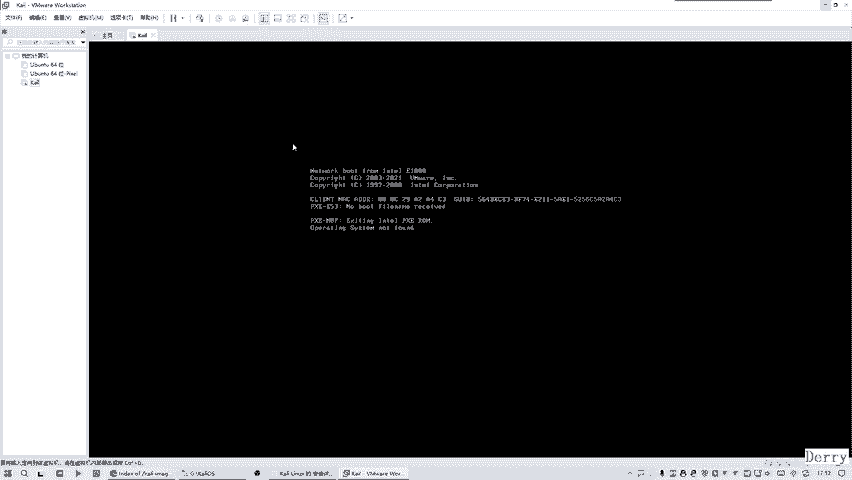

当Kali安装引导界面成功出现后，我们就可以开始正式的安装过程了。由于安装过程需要一定时间，且步骤较多，我们将在下一节中详细讲解Kali Linux系统内部的安装与配置选项。

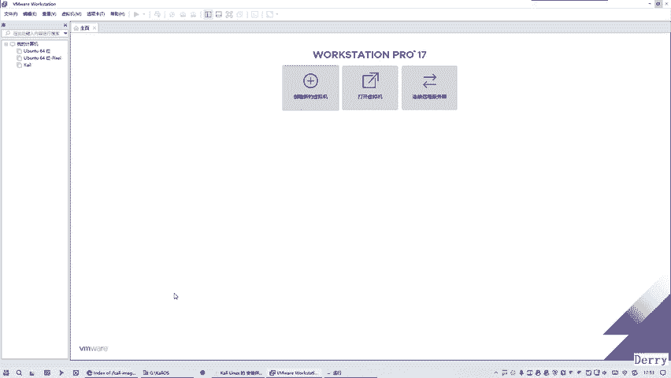

## 本节总结

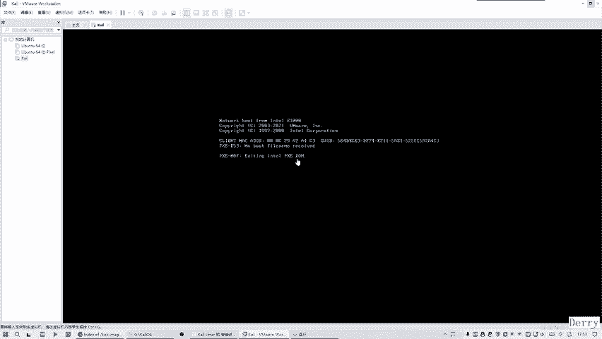

在本节课中，我们一起完成了Kali Linux虚拟机环境的搭建。我们学习了如何在VMware Workstation 17中创建一台新的虚拟机，并完成了关键配置，包括分配处理器、内存、磁盘，以及挂载Kali安装镜像。我们还了解了在启动虚拟机时可能遇到的常见问题及其解决方法。下一节，我们将进入虚拟机内部，完成Kali Linux操作系统的最终安装。