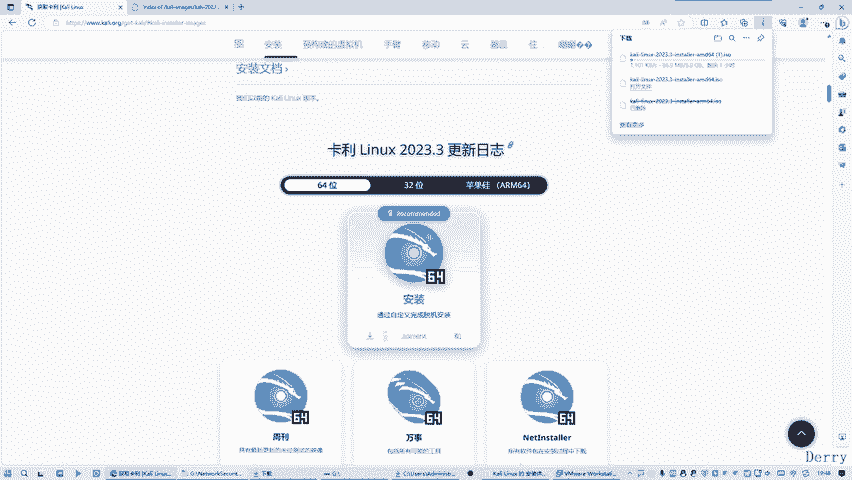
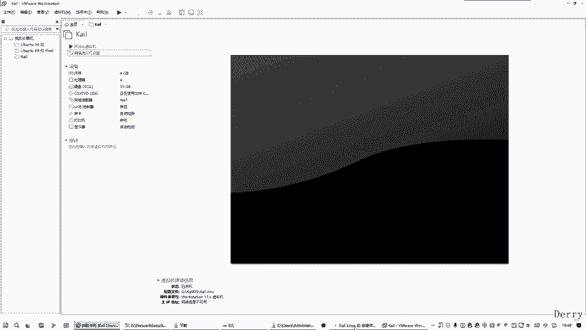
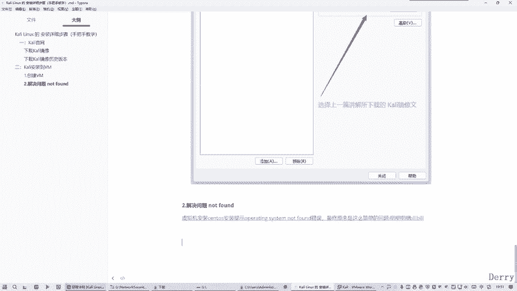
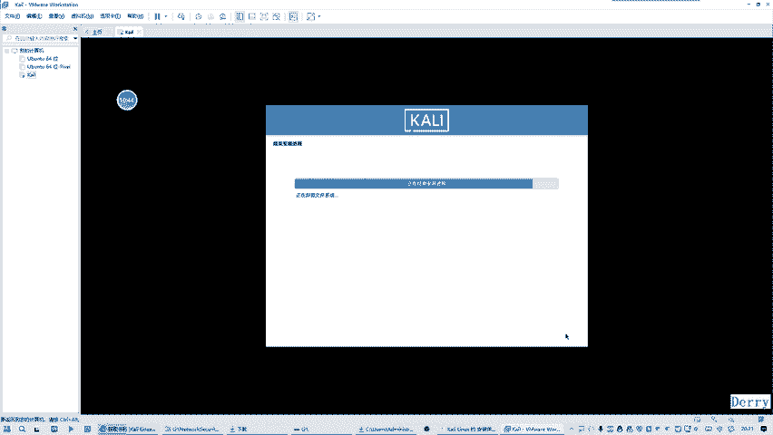
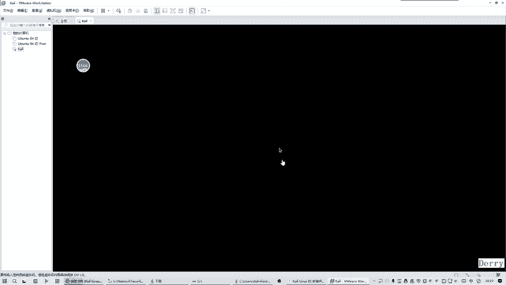

# 网络安全入门：P7：05. 在VMware中运行已安装的Kali Linux的详细步骤 🔧

在本节课程中，我们将详细讲解如何在VMware虚拟机中启动并完成Kali Linux系统的安装与初始配置。我们将解决一个常见的安装问题，并一步步引导你完成从启动安装程序到首次登录系统的全过程。

## 概述与问题定位

上一节我们介绍了Kali Linux的下载与虚拟机创建。本节中，我们来看看如何运行并安装它。在启动安装时，你可能会遇到一个常见问题。

网上许多教程给出的解决方案，例如重装操作系统、重装VMware虚拟机软件等，通常是无效的。真正的原因在于**下载的安装镜像文件（ISO）本身存在问题或已损坏**。

具体来说，最初我们使用的某种历史版本下载方式，所获取的ISO文件大小约为**3.25GB**，这个文件可能因传输不兼容而缺少必要组件。而正确的、完整的Kali Linux安装镜像大小应为**3.9GB**。

以下是解决此问题的步骤：
1.  放弃使用有问题的下载方式。
2.  采用另一种可靠的下载渠道，确保下载到大小为 **3.9GB** 的完整ISO文件。

## 更换并加载正确的安装镜像

问题定位清楚后，我们需要在VMware中更换为正确的安装镜像文件。

首先，在VMware中编辑虚拟机的设置。找到CD/DVD (SATA)设备选项，将其指向新下载的、大小为 **3.9GB** 的ISO文件。

完成此操作后，即可启动虚拟机，开始正式的安装过程。

## 系统安装与配置步骤

虚拟机启动后，将进入Kali Linux的图形化安装界面。以下是每一步的具体操作。

### 1. 选择语言与区域
安装程序启动后，首先选择系统语言。虽然默认是英语，但我们建议选择 **“中文（简体）”**，以便后续操作。接着，选择区域为 **“中国”**，键盘布局选择 **“汉语”**。

### 2. 配置主机名与域名
接下来需要设置主机名（hostname），可以保持默认值。然后设置域名（domain name），为了方便记忆，可以将其设置为与主机名相同或任意简单的名称。

### 3. 设置用户账户与密码
以下是创建用户账户的步骤：
*   输入一个用户名（例如 `kali`）。
*   设置一个强密码，并确认输入。
*   系统会提示设置时区，通常选择 **“Asia/Shanghai”** 即可。

### 4. 磁盘分区
磁盘分区是安装过程中的关键一步。对于新手，建议采用最简单的方式：
*   选择 **“使用整个磁盘”**。
*   分区方案选择 **“将所有文件放在同一个分区中”**（即默认的推荐方案）。
*   确认分区信息后，选择 **“是”** 以格式化磁盘并开始安装。

> **注意**：此过程会清除虚拟磁盘上的所有数据，请确保操作正确。

### 5. 软件包安装与系统配置
系统将开始复制文件并安装基础软件包，这个过程需要一些时间。安装完成后，安装程序会提示配置软件包管理器（APT）的镜像源。为了获得更快的下载速度，建议选择 **“是”**，并使用提供的镜像源列表。

最后，安装GRUB引导程序到虚拟磁盘，并完成安装。点击 **“继续”**，虚拟机将重启。

## 首次启动与登录

系统重启后，会进入登录界面。输入之前设置的用户名和密码，即可成功登录到Kali Linux的桌面环境。

首次进入的桌面通常包含文件管理器、终端、回收站等基本组件，这表明Kali Linux系统已经成功安装并可以正常使用了。

## 总结

本节课中我们一起学习了在VMware中完成Kali Linux安装的完整流程。我们首先定位并解决了因安装镜像不完整导致的常见问题，然后逐步完成了语言选择、账户配置、磁盘分区等关键设置，最终成功启动并登录到了Kali Linux系统。现在，你已经拥有了一个用于网络安全学习和实践的专用操作环境。