# 网络安全入门教程：P8：06. 绿色包Kali安装指南 🚀

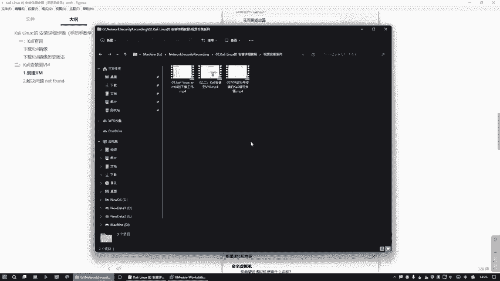

在本节课中，我们将学习一种更快捷的Kali Linux安装方法——使用“绿色包”。与之前手动安装镜像的复杂步骤相比，这种方法能实现一键部署，极大地简化了安装流程。

上一节我们介绍了通过下载ISO镜像文件手动安装Kali Linux的详细步骤。本节中我们来看看如何通过下载预配置好的“绿色包”来快速完成安装。

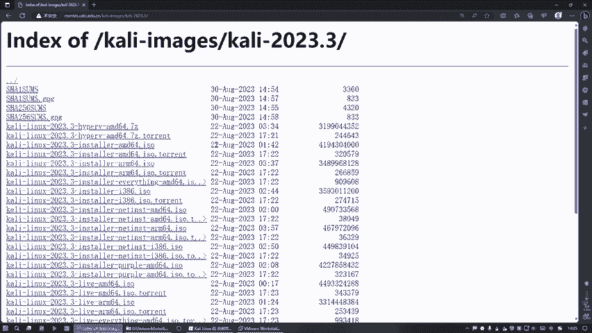

## 绿色包 vs. 传统镜像

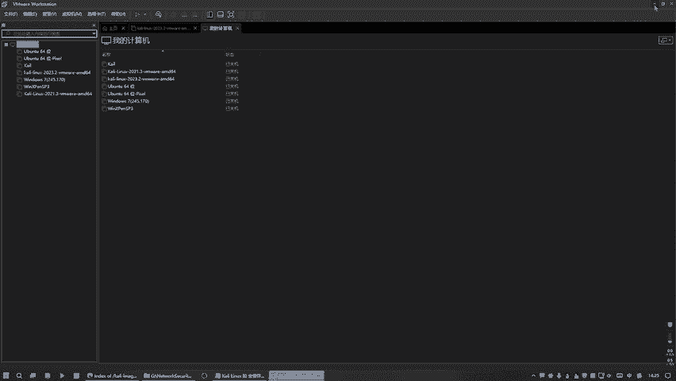

传统安装方式需要下载 **`.iso`** 镜像文件，并在虚拟机中手动完成每一步设置，过程繁琐。而“绿色包”是一个已经预安装并配置好的虚拟机文件包，用户只需下载并加载即可直接使用，无需参与安装细节。

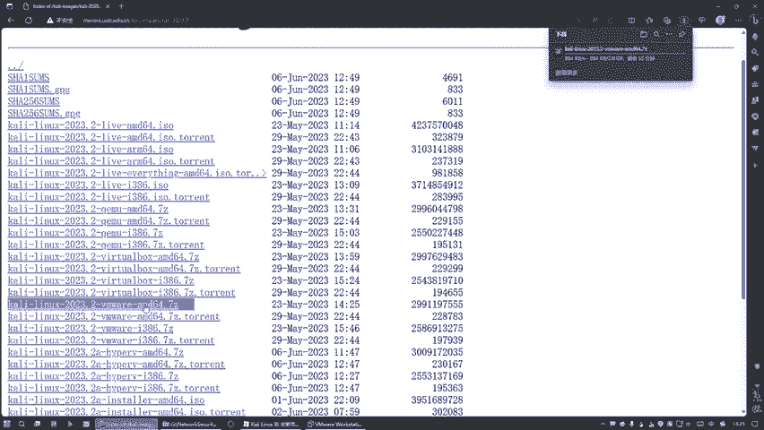

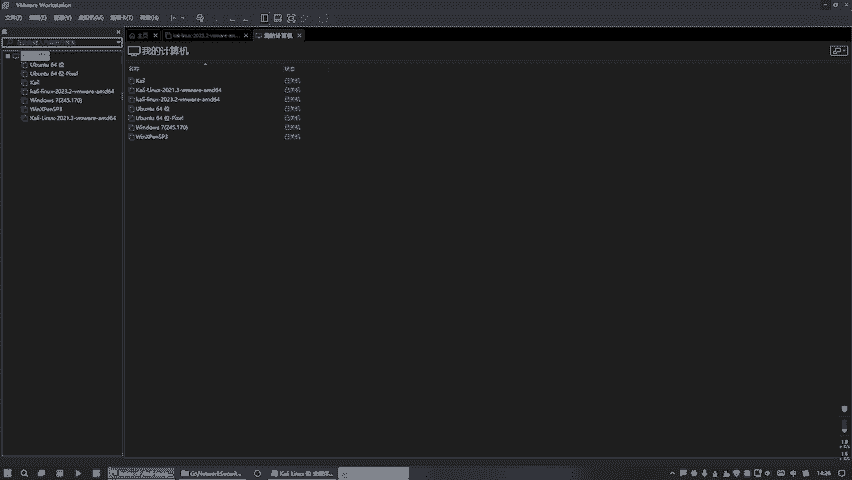

## 下载绿色包

以下是下载Kali Linux绿色包的步骤。

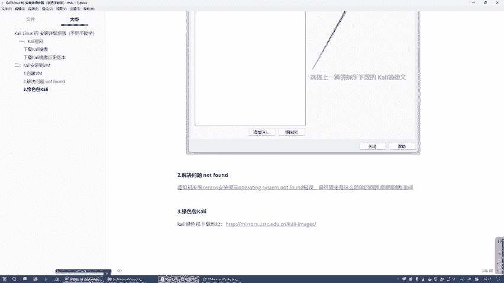

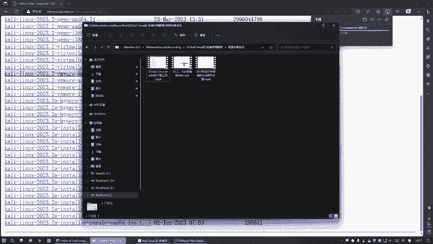

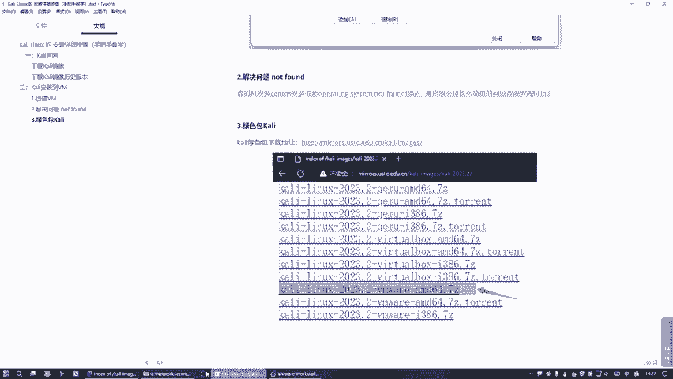

1.  打开浏览器，访问Kali Linux官方网站的下载页面。
2.  在下载选项中，找到并选择适用于VMware的“绿色包”或“预构建虚拟机”文件进行下载。文件通常命名为类似 **`kali-linux-2023.3-vmware-amd64.7z`** 的格式，其中 **`.7z`** 表示压缩格式。

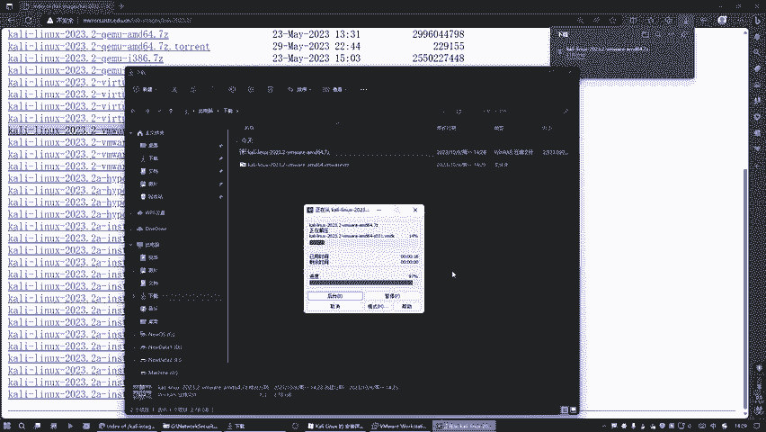

## 加载与使用绿色包

下载完成后，您可以通过以下两种等效的方式加载绿色包。

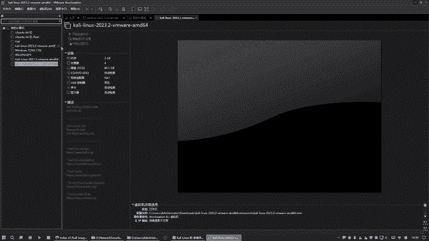

**方式一：直接双击**
找到下载并解压后的文件夹，里面会有一个 **`.vmx`** 后缀的虚拟机配置文件。直接双击此文件，VMware Workstation会自动打开并加载该虚拟机。

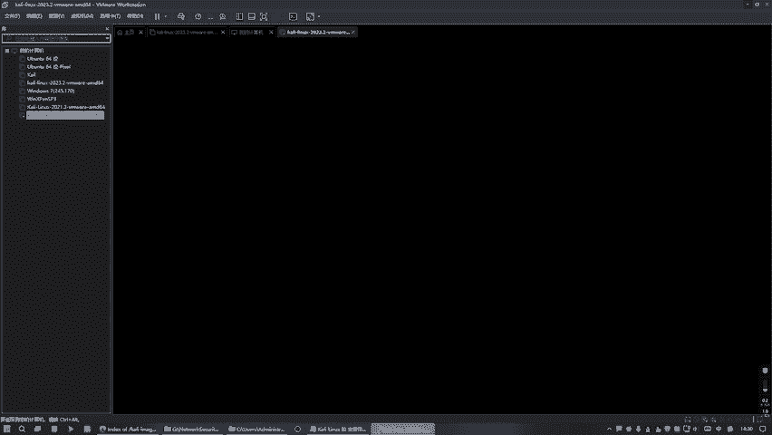

**方式二：通过VMware菜单打开**
1.  打开VMware Workstation。
2.  点击“文件” -> “打开”。
3.  浏览并选择解压后文件夹中的 **`.vmx`** 配置文件。

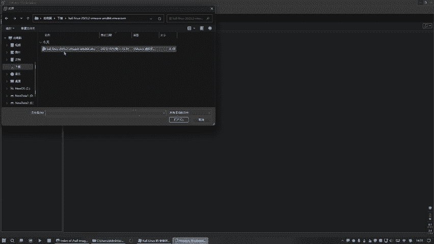

无论采用哪种方式，加载完成后，虚拟机将直接启动。系统已预设好用户名和密码：
*   **用户名**: `kali`
*   **密码**: `kali`

该绿色包默认的虚拟机配置通常为：**2GB内存**、**4核处理器**和**80GB硬盘**。所有这些配置都已由包提供者预先完成，用户无需进行任何手动设置。

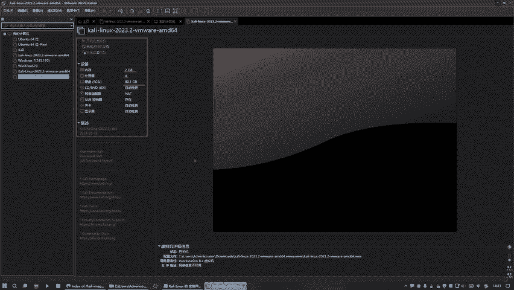

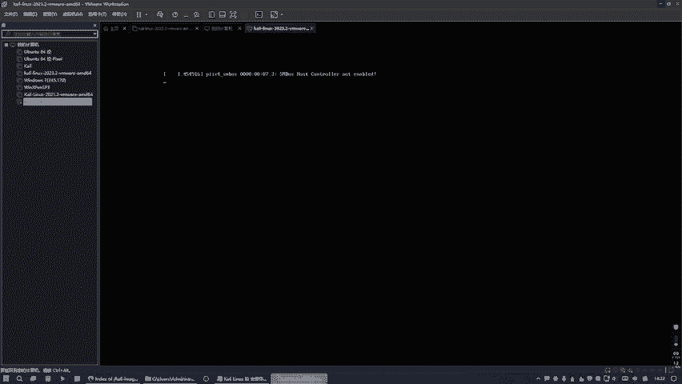

## 总结

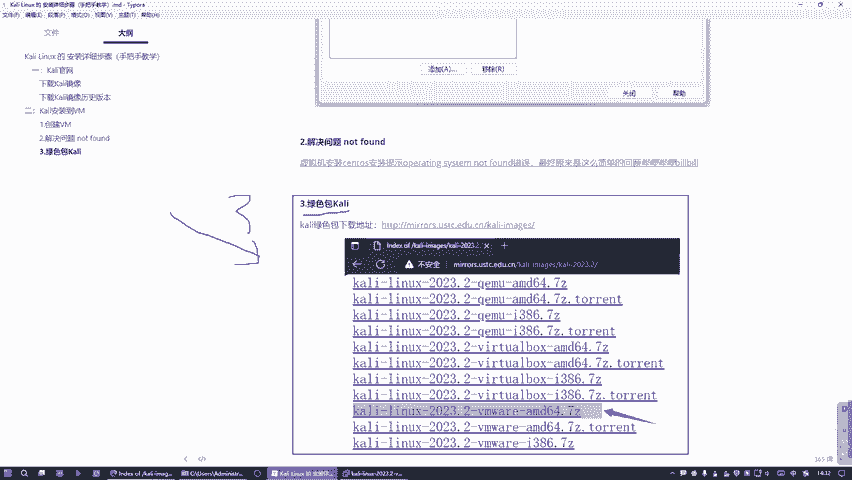

本节课中我们一起学习了使用“绿色包”安装Kali Linux的方法。这种方法的核心优势在于 **“开箱即用”** ，它跳过了所有手动安装步骤，将复杂的安装过程简化为下载和加载两个动作，非常适合希望快速搭建测试环境的初学者。但请注意，由于跳过了安装细节，您可能无法根据个人需求在初始阶段定制系统配置。