# 网络安全入门到精通：P9：07.对Kali新系统的第一件事-更新软件包合集 🔄

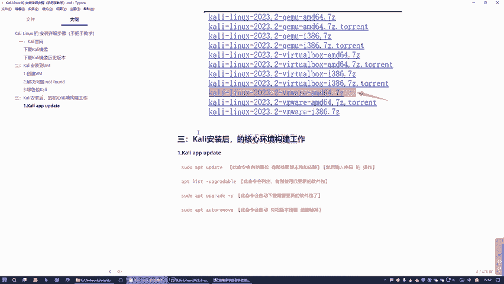

在本节课中，我们将学习如何为全新的Kali Linux系统进行核心环境配置的第一步：更新软件包。这是确保系统稳定、软件为最新版本的关键操作。

## 概述


上一节我们介绍了Kali Linux的安装方式。本节中，我们来看看系统安装完成后，需要立即执行的核心操作——更新软件包。这类似于为新安装的Windows系统安装驱动和更新补丁，是后续所有安全工具正常工作的基础。

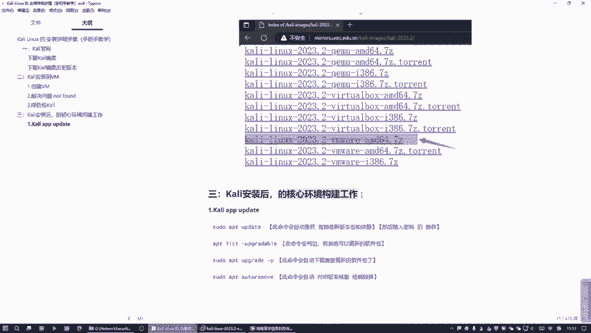

我们使用上一节中下载的Kali Linux绿色包版本进行演示。当然，如果您是通过镜像一步步安装的，操作流程完全相同。


## 启动Kali Linux系统

首先，打开Kali Linux绿色包，点击“启动”按钮。


启动后，按 `Ctrl + Alt` 组合键可以释放鼠标。系统启动后，我们进入的是一个全新的Kali环境，尚未安装任何额外软件。我们的任务就是为这个新系统安装和更新核心软件。

在Kali中，我们主要通过命令行来操作系统，而非图形界面。首先，我们需要打开终端窗口。

## 更新软件包源列表

第一个环节是执行 `apt update` 命令。这个命令的作用是同步软件包索引列表，检查有哪些软件包有新版本可用，并下载这些新版本的依赖信息到本地。**它只会下载更新信息，并不会实际安装任何新软件**。

执行此命令可以解决许多因缺少依赖而导致的奇怪错误。很多网络问题解决方案的第一步就是执行此命令，因为它能自动获取缺失的依赖信息。


以下是具体操作步骤：

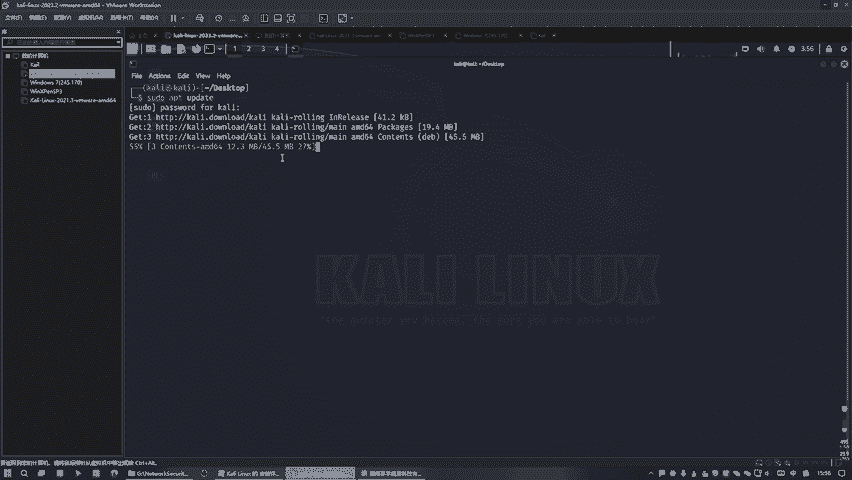

1.  在终端中输入命令 `sudo apt update`。
2.  按回车后，系统会提示输入密码。输入密码时，屏幕不会有任何显示（如星号），这是正常现象，直接输入即可。
3.  命令开始执行，其速度取决于您的网络连接状况。

```bash
sudo apt update
```

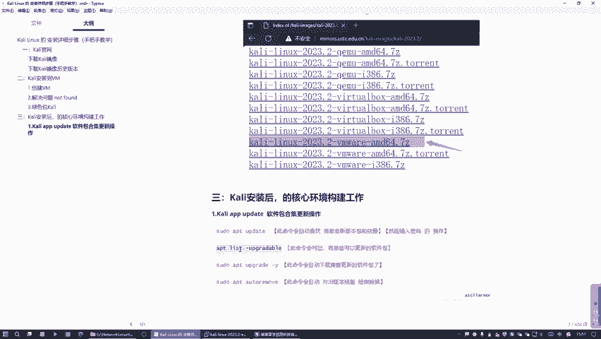

此命令执行完毕后，系统便知道了有哪些软件包可以更新以及需要哪些依赖。

## 列出可更新的软件包

接下来，我们执行 `apt list --upgradable` 命令。这条命令会具体列出所有可以升级的软件包及其版本信息，让我们对需要更新的内容有一个清晰的了解。

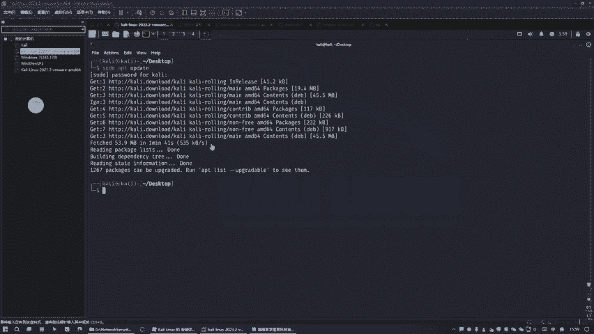

它会在列表中明确显示每个软件包的**当前版本**和**可升级到的版本**。

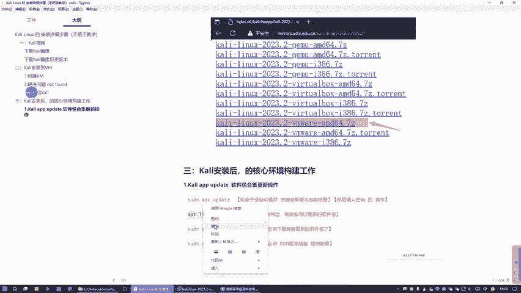

```bash
apt list --upgradable
```

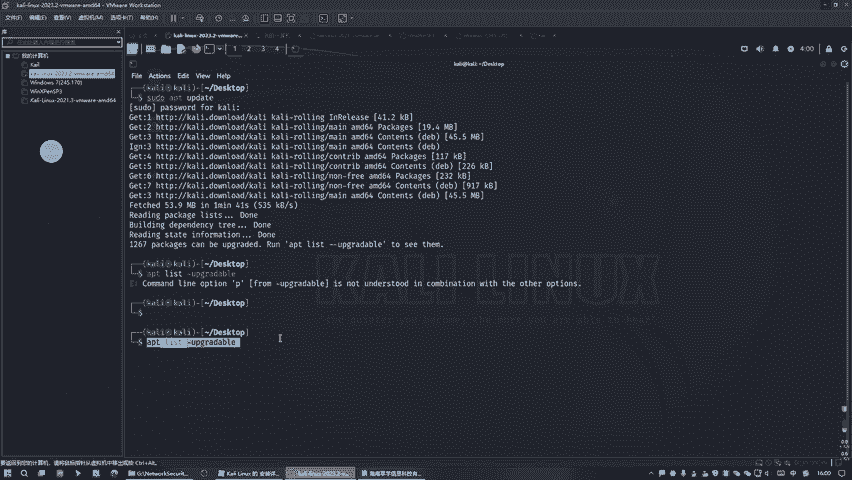

## 升级所有可更新的软件包

列出更新列表后，我们需要实际进行升级。使用 `sudo apt upgrade -y` 命令。

这条命令会自动下载并安装所有可更新的软件包。参数 `-y` 表示在安装过程中对所有询问自动回答“是”（yes），这样就不需要手动确认每一个更新，使过程自动化。

```bash
sudo apt upgrade -y
```

此过程可能需要一些时间，具体时长取决于网络速度和需要更新的软件包数量。

## 自动移除旧版本软件包

升级完成后，系统会保留旧版本的软件包。这就像电脑里同时存在QQ 1.0和QQ 2.0两个版本，我们只需要保留新版本即可。

因此，我们需要执行 `sudo apt autoremove -y` 命令。这条命令会自动删除那些因升级而残留的、不再需要的旧版本软件包和依赖，保持系统整洁。

```bash
sudo apt autoremove -y
```

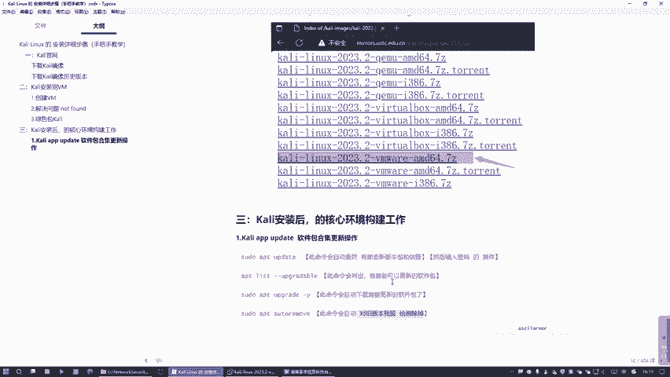

执行时，系统会列出将要删除的软件包列表，输入 `y` 或直接回车（因为使用了 `-y` 参数）确认即可。

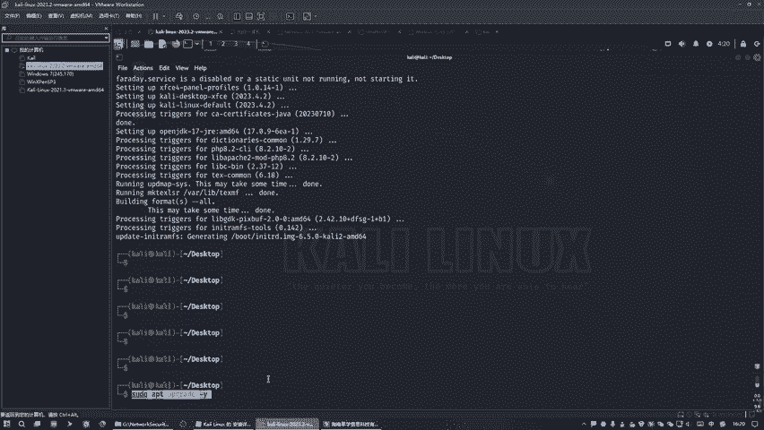

## 总结

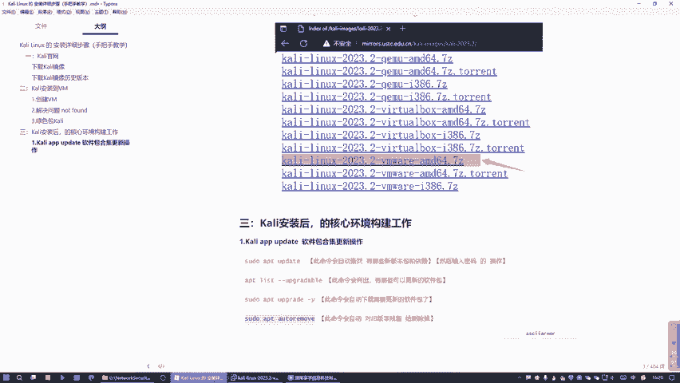

本节课中，我们一起学习了为全新Kali Linux系统更新软件包的标准流程。我们依次执行了四条核心命令：

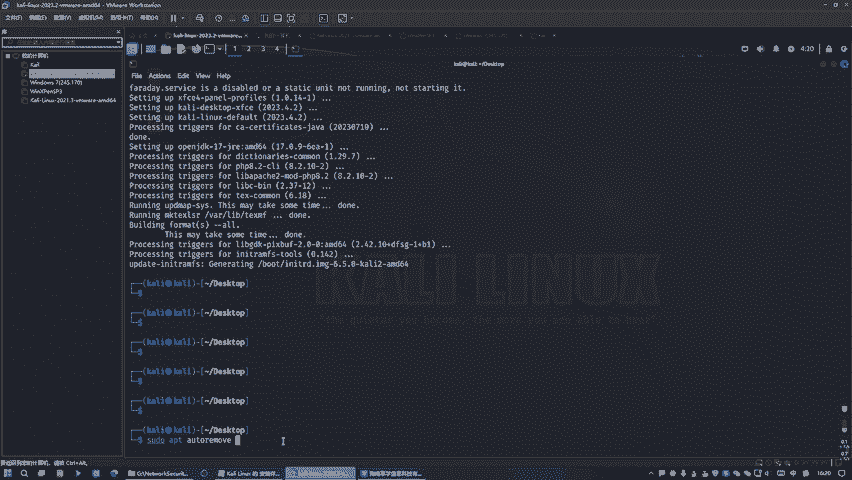

1.  `sudo apt update`：更新软件包源列表。
2.  `apt list --upgradable`：查看可更新的软件包。
3.  `sudo apt upgrade -y`：自动升级所有软件包。
4.  `sudo apt autoremove -y`：自动清理无用的旧软件包。

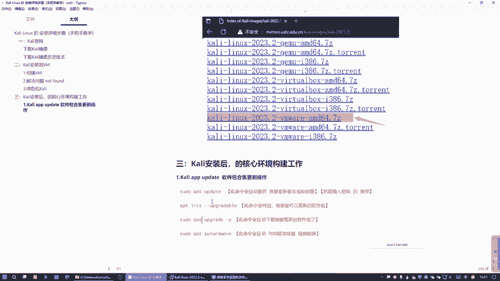

完成这些步骤后，您的Kali Linux系统就处于一个软件包最新、依赖完整的状态，为后续学习和使用各种网络安全工具打下了坚实的基础。下一节，我们将开始探索Kali Linux中强大的安全工具集。