# AWVS安装与激活教程：P1：跨平台部署指南 🚀

在本教程中，我们将学习如何在不同操作系统上安装和激活AWVS。AWVS是一款自动化的Web应用漏洞扫描程序，能帮助安全研究人员发现潜在的安全风险。我们将分别演示在Windows和Linux系统上的完整流程。

## 免责声明 ⚠️

本教程所用资源均来自网络，**仅供个人学习与研究使用**。请勿将其用于任何商业或非法用途。建议在虚拟机环境中操作，并在下载后24小时内删除相关资源。使用者需自行承担一切法律责任。

---

## Windows平台安装与激活 🖥️

上一节我们了解了基本信息和免责声明，本节中我们来看看如何在Windows系统上安装和激活AWVS。

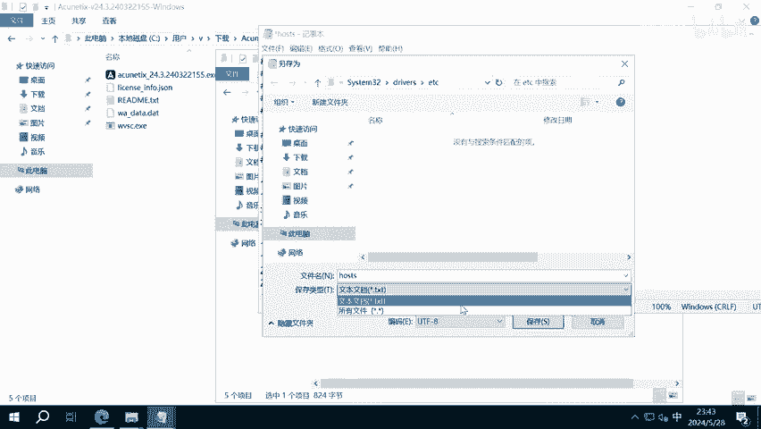

### 准备工作

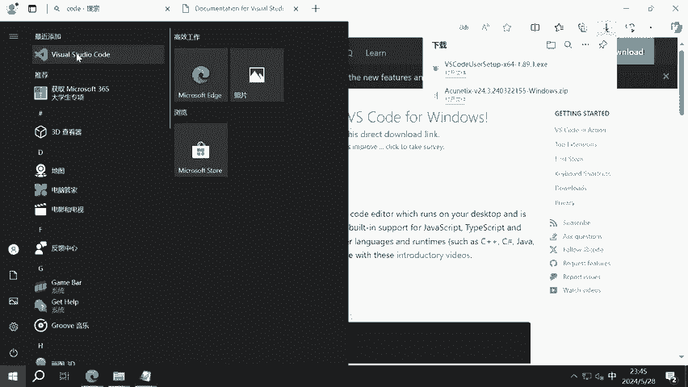

以下是安装前需要完成的步骤。

1.  **下载安装包**：从提供的链接下载AWVS安装压缩包。
2.  **解压文件**：将下载的压缩包解压，得到一系列文件。

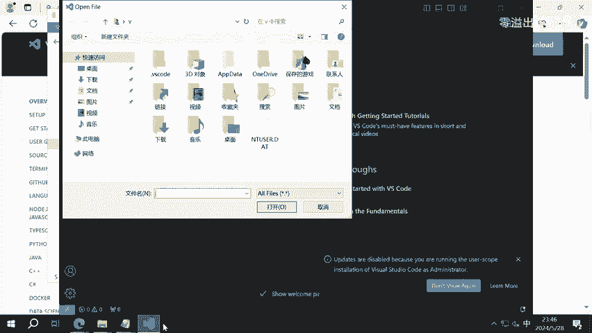

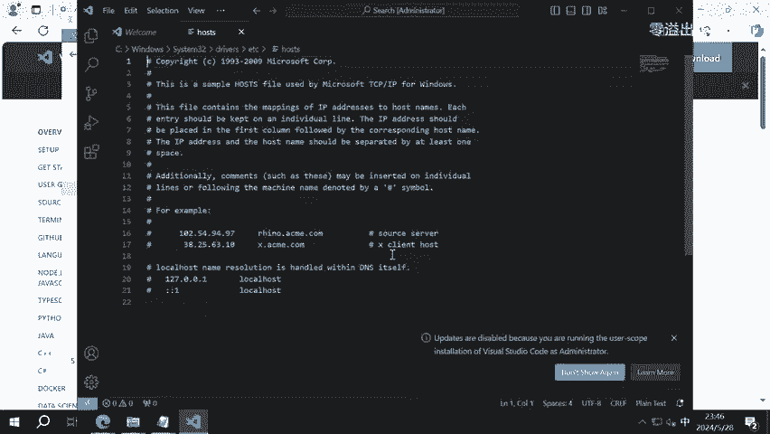

### 修改Hosts文件以绕过验证

为了绕过软件的在线验证，我们需要修改本地的Hosts文件。

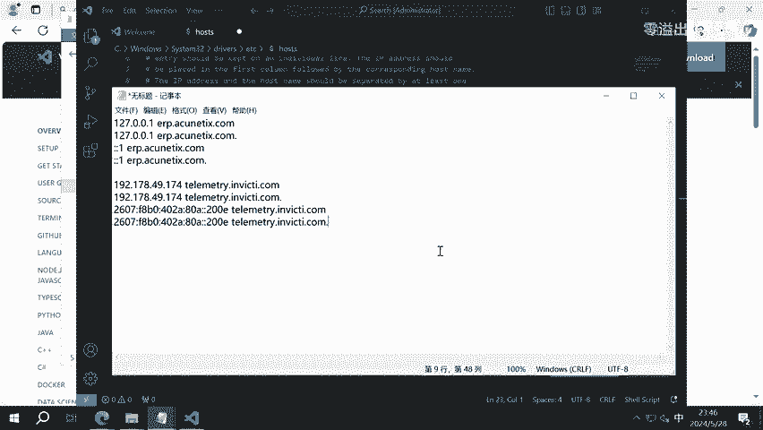

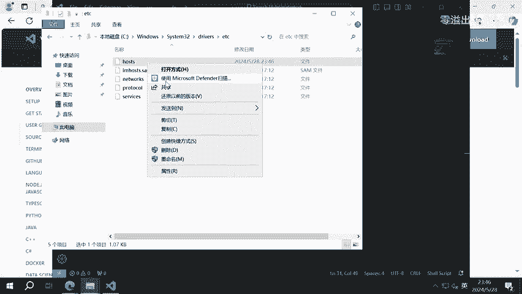

1.  **定位Hosts文件**：文件路径为 `C:\Windows\System32\drivers\etc\hosts`。
2.  **使用编辑器修改**：由于系统权限限制，直接编辑可能无法保存。建议使用VS Code编辑器。
    *   下载并安装VS Code。
    *   以**管理员身份**运行VS Code。
    *   通过 `文件 -> 打开文件` 菜单，打开上述路径的 `hosts` 文件。
3.  **添加内容**：将准备好的特定文本内容复制到 `hosts` 文件末尾，并保存。

### 安装AWVS程序

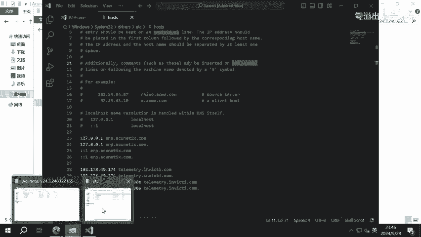

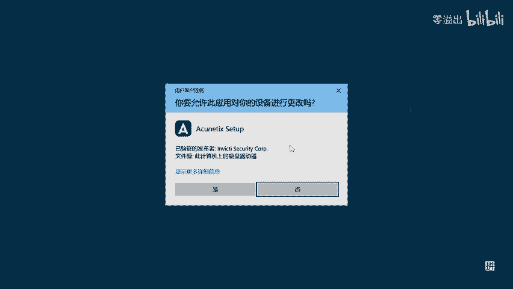

完成Hosts修改后，即可开始安装主程序。

1.  运行解压目录中的安装程序（`.exe` 文件）。
2.  按照安装向导提示，点击“下一步”进行安装。
3.  设置管理员邮箱和密码。密码需满足复杂度要求：**包含至少三种字符类型（大写字母、小写字母、数字、符号），且长度大于8位**。
4.  服务端口保持默认设置即可。
5.  等待安装完成。

### 替换文件与激活

安装完成后，需要替换关键文件以完成激活。

1.  **停止相关服务**：在Windows服务管理器中，找到并停止AWVS相关的两个服务。
2.  **替换主程序文件**：
    *   找到AWVS的安装目录（通常在 `C:\Program Files (x86)\Acunetix`）。
    *   将资源包中的 `wvsc.exe` 文件复制到安装目录，替换原有文件。
3.  **复制许可文件**：
    *   打开资源管理器，启用“查看隐藏的项目”选项。
    *   进入目录 `C:\ProgramData\Acunetix\shared\license`。
    *   将资源包中的 `license_info.json` 和 `wa_data.dat` 两个文件复制到此目录，替换原有文件。
    *   右键点击这两个文件，将其属性设置为“只读”。
4.  **重启服务**：回到服务管理器，重新启动之前停止的两个AWVS服务。

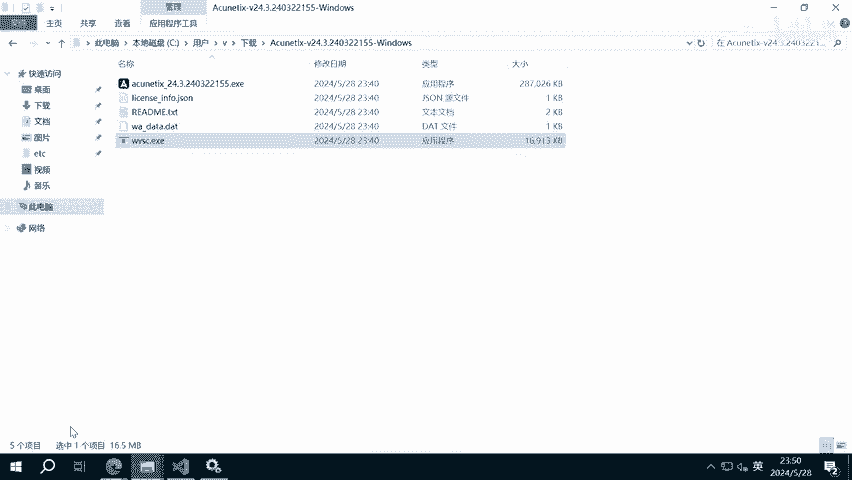

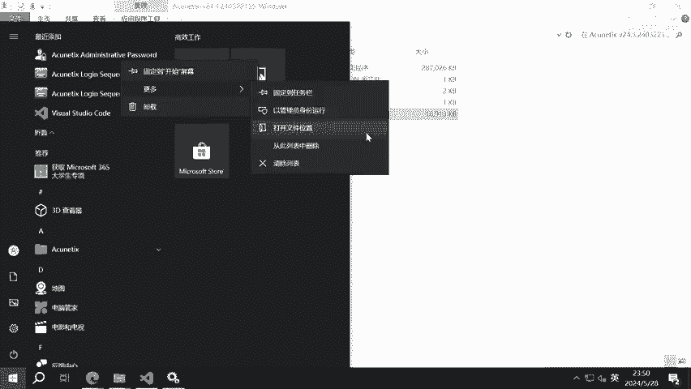

### 验证与汉化

服务启动后，即可验证激活状态并进行界面汉化。

1.  在浏览器中访问 `https://localhost:3443`（使用HTTPS协议）。
2.  使用安装时设置的邮箱和密码登录。
3.  **汉化界面**：
    *   点击页面左上角的账户头像，进入“Profile”。
    *   在语言设置中选择“简体中文”。
    *   填写“Last Name”（必填项），然后保存设置。
4.  **验证激活**：进入“设置 -> 订阅”页面，确认许可证有效期已延长（例如至2123年），即表示激活成功。

---

## Linux平台安装与激活 🐧

上一节我们完成了Windows平台的部署，本节中我们来看看如何在Linux系统上通过Docker快速部署AWVS。

### 安装Docker环境

如果你的系统尚未安装Docker，请按以下步骤操作。

```bash
# 更新软件包索引
sudo apt update

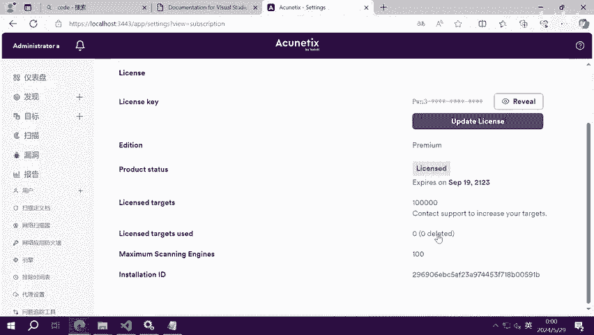

# 安装Docker
sudo apt install docker.io
```

### 拉取并运行AWVS镜像

Docker环境就绪后，即可拉取预配置的AWVS镜像。

1.  **拉取镜像**：执行以下命令下载镜像。
    ```bash
    sudo docker pull secfa/docker-awvs
    ```
    *注：由于网络原因，下载可能较慢或失败，可多次尝试或配置镜像加速。*
2.  **运行容器**：镜像下载完成后，运行以下命令启动容器。
    ```bash
    sudo docker run -itd -p 3443:3443 --cap-add LINUX_IMMUTABLE secfa/docker-awvs
    ```
    命令执行后输出一串哈希值，即表示容器启动成功。

### 访问与配置

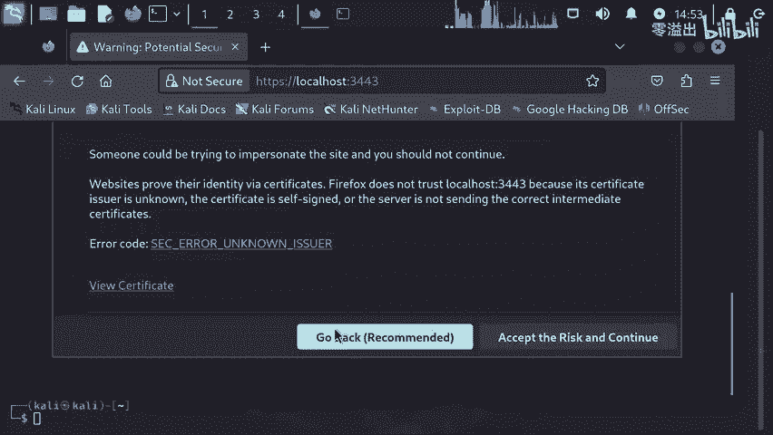

容器运行后，即可通过浏览器访问AWVS。

1.  在浏览器中访问 `https://你的Linux主机IP:3443`。
2.  忽略证书不安全警告，继续访问。
3.  使用默认凭据登录：
    *   **邮箱**：`admin@admin.com`
    *   **密码**：`Admin123`
4.  **汉化界面**：参照Windows平台的步骤，在账户Profile中将语言设置为简体中文并保存。
5.  **验证激活**：进入“设置 -> 订阅”页面，确认许可证已激活。

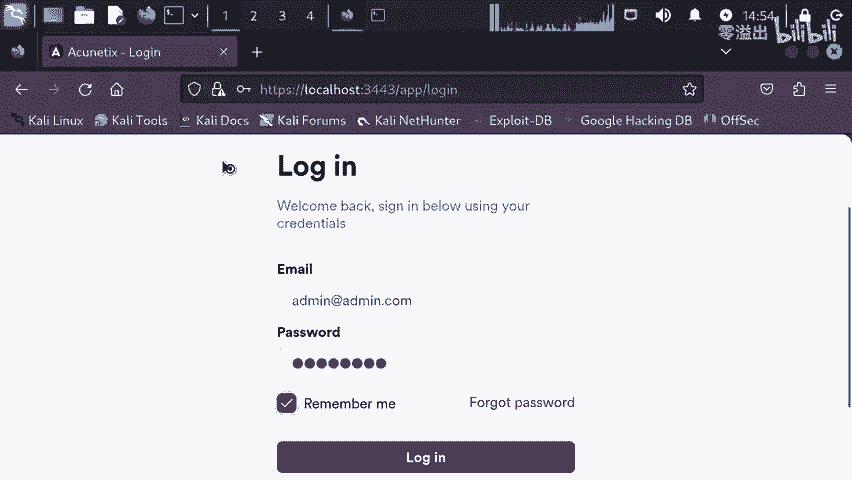

---

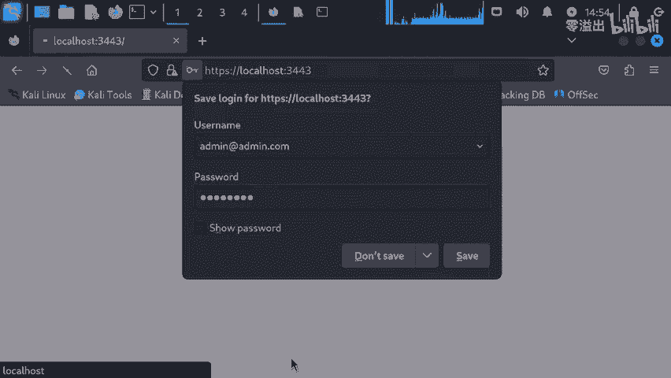

## 总结 📝

本节课中我们一起学习了AWVS在Windows和Linux两大平台上的安装与激活方法。
*   在**Windows**上，核心步骤包括修改Hosts文件、安装程序、替换激活文件及汉化。
*   在**Linux**上，我们利用Docker简化了部署流程，通过运行一个预置镜像即可快速获得已激活的AWVS环境。

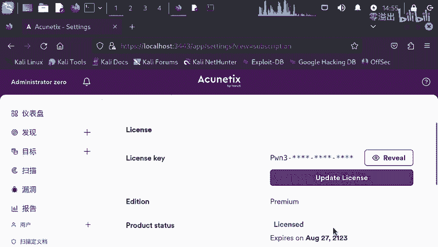

请牢记，本工具仅用于授权的安全测试与学习，务必遵守法律法规。