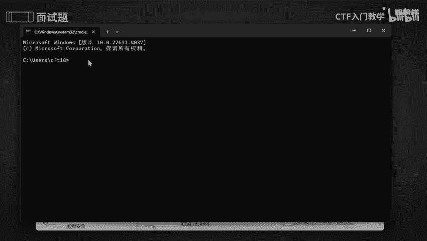
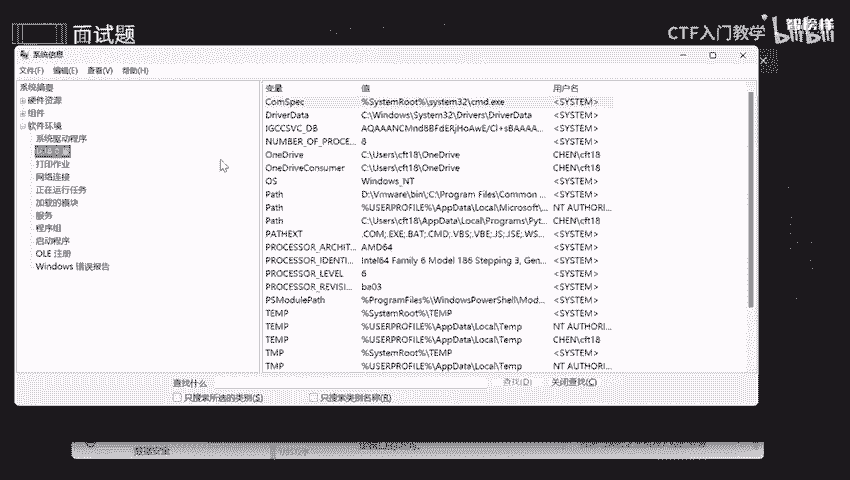
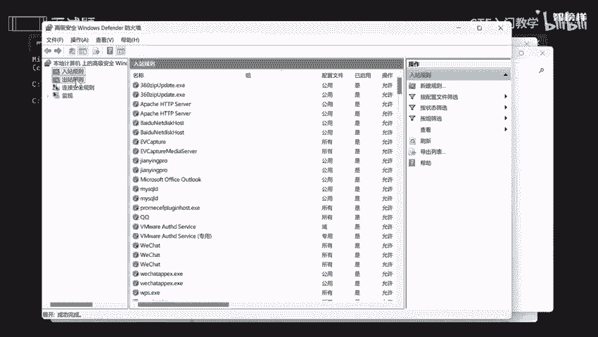

# 网络安全面试突击：P10：应急与响应之Windows加固方法 🔒

在本节课中，我们将学习Windows系统加固的核心方法。系统加固是降低安全风险、提高安全保障的关键步骤。我们将逐一探讨从密码管理到服务配置、漏洞排查及防火墙设置等多个方面的具体操作。

## 概述
本节课程将围绕Windows系统加固的六个核心方法展开，旨在帮助初学者理解并掌握如何通过一系列配置来增强系统的安全性。

---

### 1. 修改弱密码
上一节我们介绍了系统加固的重要性，本节中我们来看看如何从最基础的密码管理开始。弱口令是指强度较低、容易被猜测或破解的密码。

**核心概念**：强密码应包含大写字母、小写字母、数字及特殊字符（如 `@`、`#`、`$`、`%`），长度至少为8位。

以下是修改弱密码的具体步骤：
*   **设置强密码策略**：要求所有账户使用符合上述标准的强密码。
*   **定期更改密码**：强制用户定期更新密码，以提升安全性。
*   **禁止使用历史密码**：防止用户重新使用过去用过的、可能已泄露的密码。
*   **操作路径**：按下 `Win + I` 打开设置，依次点击 **账户** -> **登录选项**，即可修改密码或PIN码。

### 2. 排查服务账户密码
在完成用户密码加固后，我们需要将同样的安全标准应用于系统后台运行的服务账户。

以下是服务账户密码的排查要点：
*   **检查密码强度**：确保所有服务账户的密码均为强密码，避免使用纯数字或简单字母组合。
*   **避免密码共享**：确保不同的服务不共享同一个账户密码，以限制凭证泄露的影响范围。

### 3. 更改服务配置文件
不必要的服务和功能会扩大系统的攻击面。因此，禁用非必需的服务是加固的重要一环。

以下是更改服务配置的核心操作：
*   **禁用非必要服务**：在“服务”管理器中，停止并禁用所有非关键的业务服务。
*   **配置PHP安全**（如适用）：对于Web服务器，应禁用PHP中的危险函数（如 `system`， `exec`， `shell_exec`）。
    *   **操作示例**：编辑 `php.ini` 文件，找到 `disable_functions` 指令，添加需要禁用的函数名。
*   **实施访问控制**：通过文件系统权限或应用程序配置，使用白名单和黑名单策略，限制对特定文件或目录的访问。

### 4. 排查服务版本
老旧的服务版本往往包含已知的安全漏洞。及时更新是防范此类风险的有效手段。

以下是服务版本排查的方法：
*   **更新至最新版本**：为所有系统软件和服务安装最新的安全补丁。
*   **检查已知漏洞**：利用工具排查当前版本是否存在已公开的CVE（公共漏洞披露）漏洞。零日漏洞（0-day）由于尚未公开，需依赖其他防护手段。
*   **操作示例**：在命令行中运行 `systeminfo` 命令，可以查看详细的系统及组件版本信息。

### 5. 使用防火墙设置访问规则
防火墙是控制网络流量的关键。通过配置规则，可以限制对特定端口的访问。

**核心概念**：Windows防火墙或`iptables`（Linux）可用于管理入站和出站流量规则。

以下是配置防火墙的步骤：
*   **打开高级安全防火墙**：通过控制面板，进入 **系统和安全** -> **Windows Defender 防火墙** -> **高级设置**。
*   **创建规则**：在“入站规则”和“出站规则”中，可以根据需求“新建规则”，以允许或阻止特定端口或程序的网络连接。

### 6. 安装并更新杀毒软件
最后一道防线是可靠的安全软件。它能实时监控和拦截恶意活动。

以下是杀毒软件的使用建议：
*   **安装可靠软件**：选择并安装一款信誉良好的杀毒软件。
*   **保持更新**：确保病毒库为最新版本。
*   **定期扫描**：建议每两到三周进行一次全盘扫描，时间紧张时可使用快速扫描功能。

---

## 总结
本节课我们一起学习了Windows系统加固的六个核心方法：**强化密码策略**、**排查服务账户**、**精简服务配置**、**更新软件版本**、**配置防火墙规则**以及**部署杀毒软件**。通过系统性地实施这些措施，可以显著提升Windows系统的安全性，降低被攻击的风险。