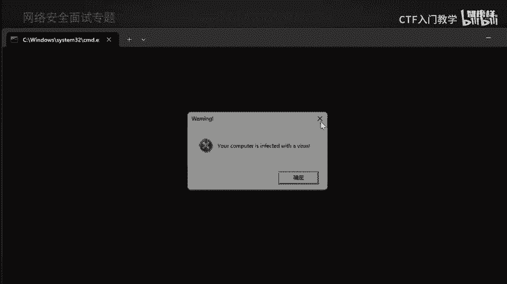
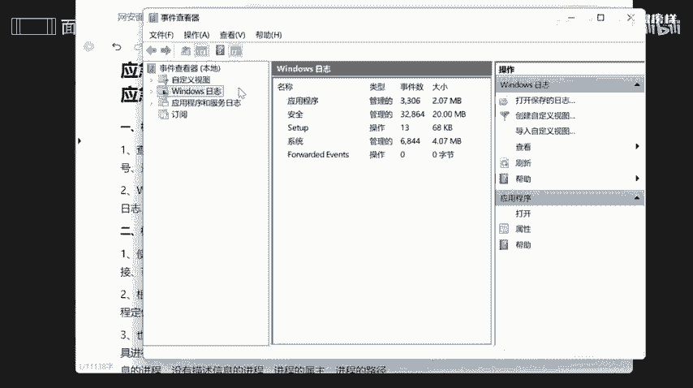
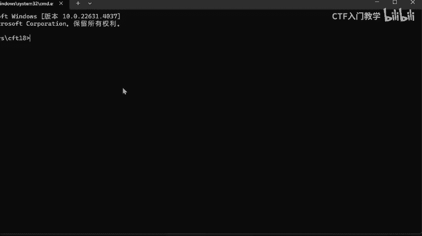
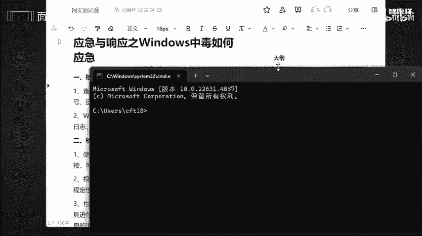
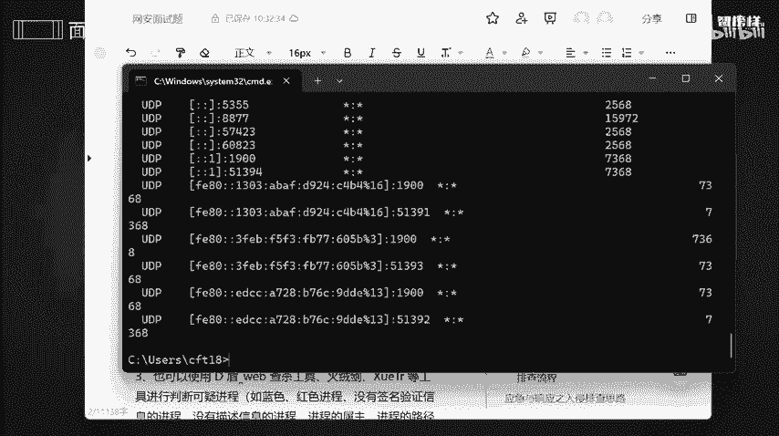
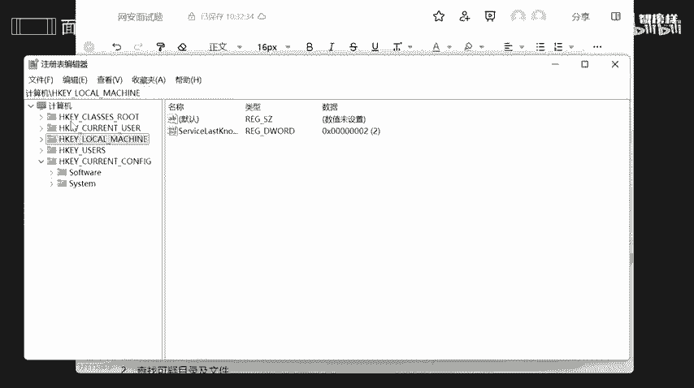

# 网络安全面试突击：P11：应急与响应之Windows中毒如何应急 🛡️

在本节课中，我们将学习当Windows系统疑似中毒时，应如何进行应急响应。我们将从系统账号安全检查开始，逐步深入到端口、进程、启动项、系统信息等多个层面，并介绍自动化查杀与日志分析的方法，帮助你系统性地应对安全事件。

## 检查系统账号安全 🔐

上一节我们介绍了课程概述，本节中我们来看看第一步：检查系统账号的安全性。目的是查看是否存在弱口令、可疑账号、隐藏账号，以及远程服务端口是否异常开放。

具体操作步骤如下：

1.  按下 `Win + R` 键，输入 `eventvwr.msc` 并运行，打开“事件查看器”。
2.  在事件查看器中，重点关注“Windows日志”下的“安全”、“应用程序”和“系统”日志。
3.  检查“管理事件”中的关键、错误或警告事件，分析是否存在异常登录记录或账号创建行为。

## 检查异常端口与进程 📡

检查完账号安全后，接下来我们需要检查系统中是否存在异常的端口连接或可疑进程。

我们可以通过命令行工具来查看网络连接和进程状态。按下 `Win + R`，输入 `cmd` 打开命令提示符。

以下是用于检查网络连接状态的命令及其说明：

*   **命令**：`netstat -ano`
    *   **作用**：显示所有活动的网络连接、监听端口以及对应的进程ID（PID）。
    *   **关键字段**：
        *   `PID`：进程标识符。
        *   `状态`：连接状态，如 `LISTENING`（监听）、`ESTABLISHED`（已建立连接）、`CLOSE_WAIT`（等待关闭）等。
    *   **分析重点**：查看是否存在可疑的远程地址连接或异常端口监听。

为了进一步定位可疑进程，我们可以使用 `tasklist` 命令。

*   **命令**：`tasklist | findstr [PID]`
    *   **作用**：根据 `netstat` 查到的可疑PID，定位具体的进程名称和详细信息。

此外，也可以借助第三方安全工具（如火绒、Windows Defender）的进程管理功能辅助判断。

## 检查启动项、计划任务及服务 ⚙️

在排查了实时运行的进程后，我们需要检查那些随系统启动或定时运行的项目，因为恶意软件常驻于此。

首先检查系统启动配置。按下 `Win + R`，输入 `msconfig` 并运行。

在“系统配置”窗口中：
*   **“常规”选项卡**：可选择“正常启动”、“诊断启动”或“有选择的启动”。
*   **“服务”选项卡**：可查看所有服务，并隐藏Microsoft服务以聚焦第三方服务。对于不必要的服务，可考虑设置为“手动”或“禁用”。
*   **“启动”选项卡**：可打开“任务管理器”以管理启动项，禁用可疑的启动程序。

其次，检查计划任务。恶意软件可能通过计划任务实现持久化。

*   **操作**：在“开始”菜单搜索“任务计划程序”并打开。
*   **分析**：逐一检查任务列表，查看其属性、触发器和操作，重点关注指向可疑文件路径的任务。

## 检查系统相关信息 🗂️

系统本身的漏洞和可疑文件也是排查的重点。我们需要检查系统版本、补丁情况以及文件系统。

检查步骤如下：

1.  **检查系统版本与补丁**：
    *   运行 `winver` 命令查看Windows版本。
    *   在“设置”->“更新和安全”->“Windows更新”中查看已安装的更新，确保系统已及时修补漏洞。
2.  **检查可疑目录与文件**：
    *   查看 `C:\Users\` 目录，检查是否有新建的、可疑的用户文件夹。
    *   在文件资源管理器中，对关键目录（如系统盘根目录、临时目录 `%temp%`）按修改时间排序，排查近期创建或修改的可疑文件。
    *   分析最近打开的文件记录（如运行 `recent` 命令打开的目录）。

## 自动化查杀与日志分析 🔍

完成手动排查后，应使用专业工具进行深度扫描和证据分析。

1.  **自动化查杀**：
    *   使用杀毒软件（如360安全卫士、火绒、Windows Defender）进行全盘扫描。
    *   使用专杀工具（如针对特定木马、后门的工具）进行针对性查杀。
2.  **日志分析**：
    *   回到“事件查看器”（`eventvwr.msc`），对安全日志进行深入分析，筛选事件ID（如4624登录成功、4625登录失败、4720创建用户等），寻找攻击痕迹。
    *   可以使用更强大的日志分析工具（如SIEM平台）或脚本，对大量日志进行聚合与关联分析。

## 总结 📝

本节课中我们一起学习了Windows系统中毒后的应急响应流程。我们首先检查**系统账号安全**，然后排查**异常端口与进程**，接着审查**启动项、计划任务及服务**，之后检查**系统版本、补丁及可疑文件**，最后利用工具进行**自动化查杀**与**日志分析**。遵循这套系统性的方法，可以有效应对多数Windows安全事件，定位并清除威胁。