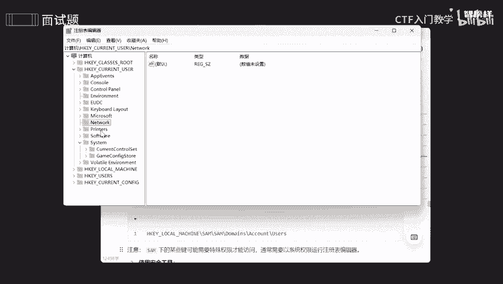
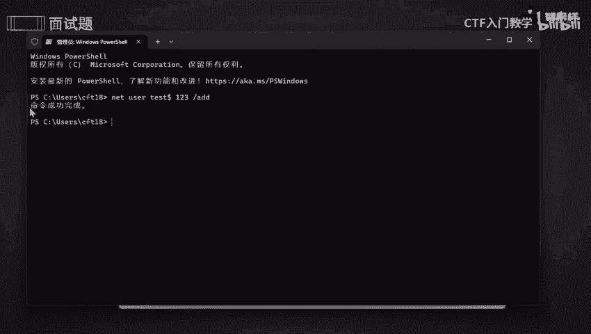
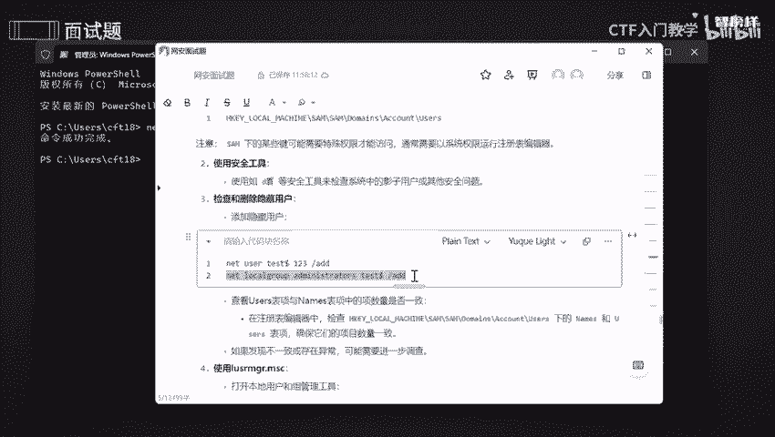
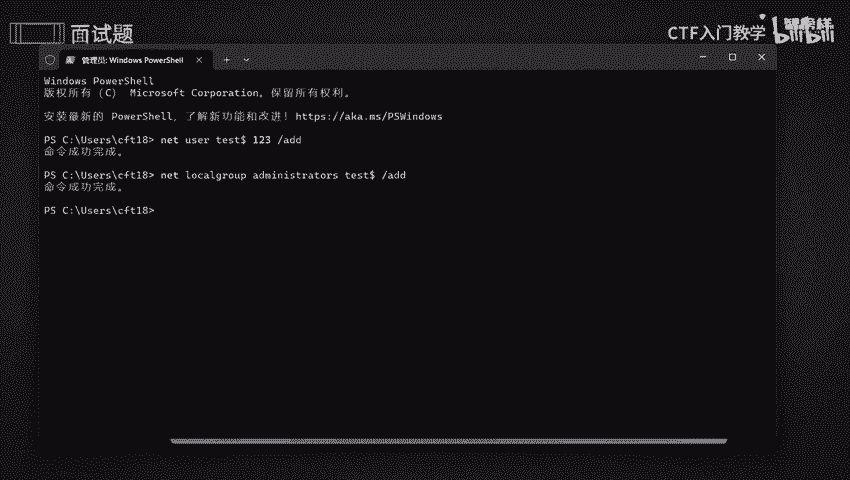
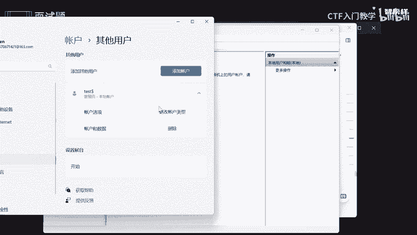
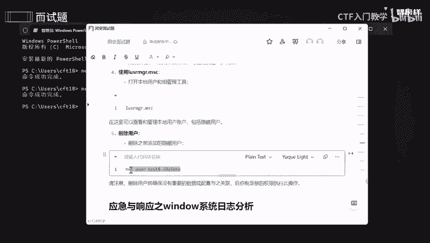
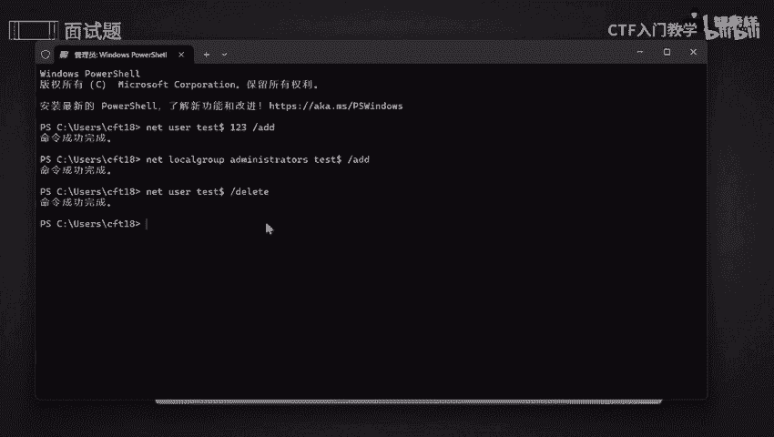
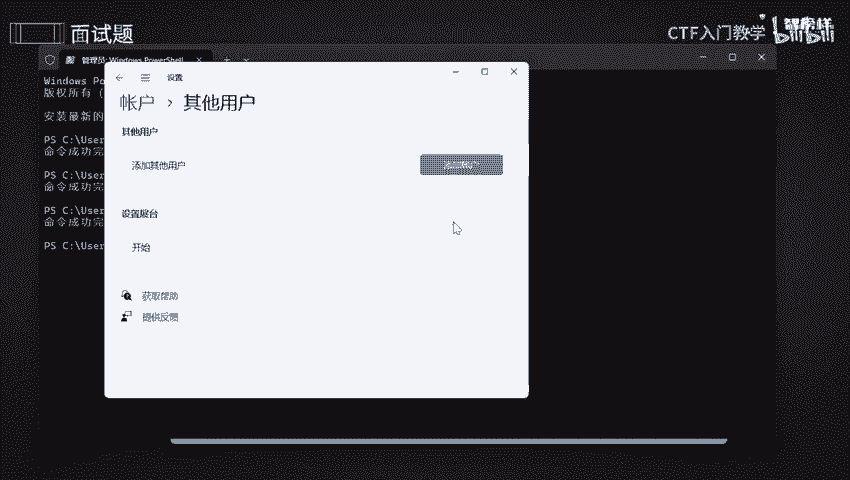

# 网络安全面试突击：P13：应急与响应之主机被入侵的应急 🚨

在本节课中，我们将学习当主机（包括Linux和Windows系统）被入侵后，如何进行应急响应。我们将分步骤讲解如何提取关键数据、检查系统状态、分析日志以及清除威胁，确保您能掌握基础的应急处理流程。

---

## Linux主机应急响应步骤

上一节我们介绍了课程概述，本节中我们来看看针对Linux系统被入侵的具体应急操作。处理Linux主机入侵时，应遵循一个有序的流程。

以下是Linux主机应急响应的五个核心步骤：

1.  **优先提取易失性数据**
    首先应收集系统运行时容易丢失的信息，例如内存内容、进程列表和网络路由。这有助于发现活跃的恶意活动。
    *   检查内存使用状况：使用 `free -h` 或 `top` 命令。
    *   查看系统进程：使用 `ps aux` 命令。
    *   检查路由信息：使用 `netstat -rn` 或 `ip route` 命令。

2.  **检查网卡流量**
    分析网络接口的数据包收发情况，以发现异常网络连接或数据外泄。
    *   使用命令 `ip -s link show [网卡名称]` 或 `ifconfig [网卡名称]`。

3.  **实时监控带宽占用**
    监控各进程或应用程序的实时网络带宽使用情况，定位高带宽消耗的异常进程。
    *   可以使用 `nethogs` 工具。安装后，运行 `sudo nethogs [网卡名称]`。

4.  **检查系统日志**
    系统日志记录了重要的活动信息，是溯源分析的关键。
    *   主要查看 `/var/log/` 目录下的日志文件，如 `auth.log`、`syslog` 等。
    *   使用 `cat`、`tail -f` 或 `less` 命令查看日志内容。

5.  **使用杀毒软件扫描**
    使用专业的杀毒工具进行全盘或指定目录扫描，清除恶意软件。
    *   安装并更新杀毒软件（如 ClamAV）病毒库：`sudo apt-get install clamav && sudo freshclam`。
    *   执行扫描：`sudo clamscan -r /home` （示例为扫描 `/home` 目录）。

**操作注意事项**：
*   在提取数据时，尽量使用只读方式，避免对系统造成二次修改。
*   确保执行命令时拥有足够的权限（如使用 `sudo`）。
*   详细记录所有操作步骤和发现，包括关键的日志条目。

---

## Windows主机应急响应步骤

了解了Linux系统的应急响应后，我们转向Windows系统。Windows的应急重点在于账户安全检查和系统工具的使用。

以下是Windows主机应急响应的四个核心步骤：

1.  **查看用户数据**
    检查系统注册表，获取用户账户信息。
    *   按 `Win + R`，输入 `regedit` 打开注册表编辑器。
    *   导航至路径：`HKEY_LOCAL_MACHINE\SAM\SAM\Domains\Account\Users`。

2.  **使用安全工具检测**
    利用安全工具检查是否存在隐藏账户（如影子用户）等安全问题。

3.  **检查并删除隐藏用户**
    如果发现异常或隐藏用户账户，需要将其删除。
    *   **添加测试用户（用于演示）**：在命令提示符（管理员）中运行 `net user test$ 123 /add`。此命令会创建一个名为 `test$` 的隐藏用户。
    *   **检查用户**：运行 `net user` 查看所有用户，并与注册表或本地用户管理工具中的列表对比。
    *   **删除用户**：确认后，运行 `net user test$ /delete` 将其删除。

4.  **使用本地用户和组管理工具**
    通过系统图形化工具直观地管理用户账户。
    *   按 `Win + R`，输入 `lusrmgr.msc` 打开“本地用户和组”管理工具。在此可以查看和删除所有本地账户。

---

本节课中我们一起学习了主机被入侵后的应急响应流程。对于**Linux系统**，我们掌握了从提取易失数据、检查网络、分析日志到病毒扫描的完整步骤。对于**Windows系统**，我们重点学习了如何通过注册表、命令行和系统工具来检查和清理异常用户账户。牢记操作时的注意事项，并完整记录响应过程，是成功应急的关键。