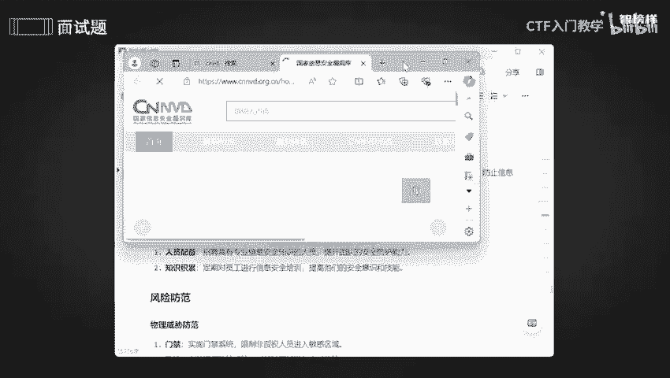
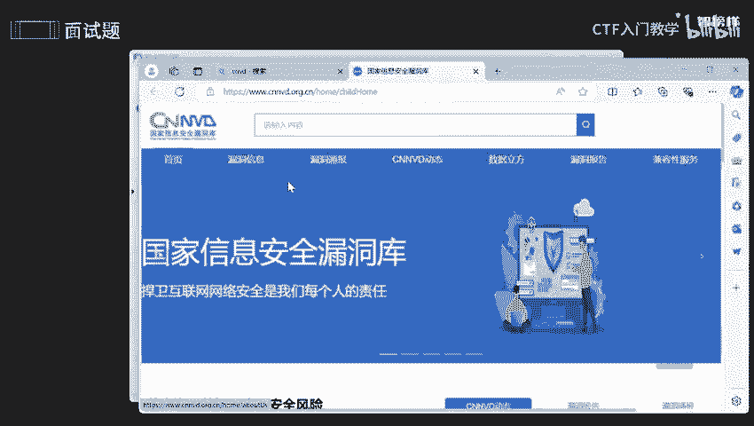
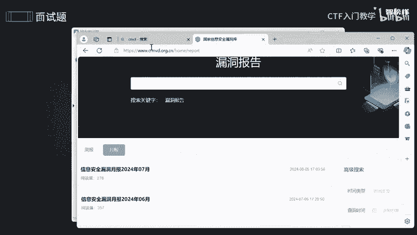
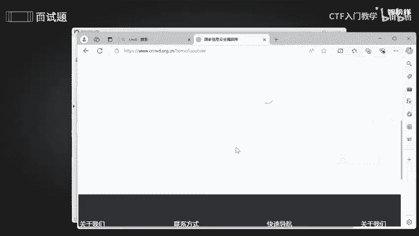
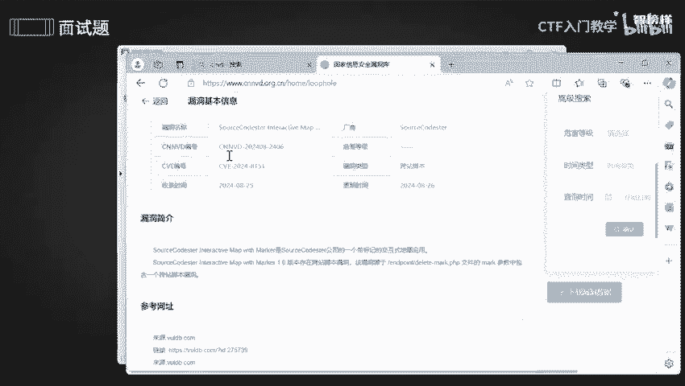
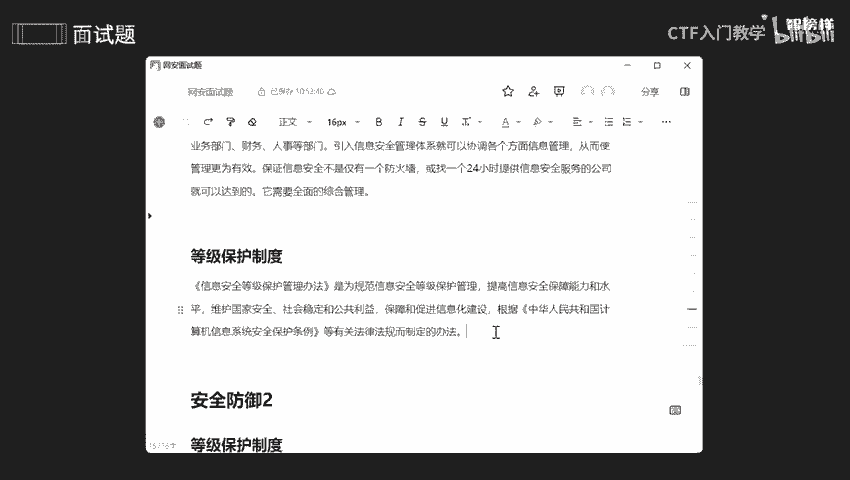

# 网络安全面试突击：P14：安全防御1 - 企业内网安全入门 🛡️

在本节课中，我们将学习企业内网安全防御的核心概念。课程将围绕如何建立和维护企业内部的安全体系展开，涵盖制度流程、人员配备、风险防范等多个方面，旨在帮助你理解企业安全的基本框架和关键措施。

---

## 制度与流程

上一节我们介绍了课程概述，本节中我们来看看企业安全的基础——制度与流程。建立明确的制度和流程是为了防止内部威胁，确保企业信息安全。

以下是制度与流程的具体措施：

1.  **员工入职与离职流程**：员工入职前需接受信息安全培训，以确保数据安全。员工离职时，公司会收回其所有访问权限和公司设备（如电脑主机、服务器访问权），目的是防止公司内部信息泄露。
2.  **权限管理**：建立权限审批流程，确保员工遵循“最小权限原则”获取必要的工作权限。这意味着员工的权限应与其职责严格匹配，既不影响正常工作，也防止权限滥用。

---

## 人员配备与知识积累

了解了基础的制度流程后，我们来看看执行这些制度需要什么样的人员，以及如何保持团队的专业性。

以下是人员与知识管理的关键点：

1.  **专业人员配备**：企业需招聘具备专业信息安全知识的人员，例如能够进行漏洞挖掘、参与CTF比赛或网络安全演练的工程师。
2.  **持续知识积累**：网络安全技术日新月异，安全人员需持续学习最新漏洞和威胁情报。主要的学习平台之一是**国家信息安全漏洞共享平台（CNVD）**。
    *   **平台网址**：`https://www.cnvd.org.cn/`
    *   **平台内容**：该平台提供周期性的漏洞报告（周报、月报）和详细的漏洞信息，是跟踪国内安全动态的重要资源。

---

## 风险防范措施

有了制度和人员，接下来需要具体的措施来防范风险。风险防范主要分为物理防范和网络防范两个方面。

### 物理安全防范

物理防范旨在保护企业的硬件和办公环境安全。

以下是物理安全防范的主要手段：

*   **门禁与监控**：设置门禁系统和视频监控。
*   **禁用外部存储设备**：严禁随意插入USB设备（如U盘、移动硬盘），防止数据被非法拷贝或引入病毒。
*   **固定办公设备**：公司的电脑等设备不能随意搬动或带离公司，如需变动需经过申请和审批。
*   **定期巡查**：对办公区域进行定期安全巡逻。

### 网络安全防范

网络防范则针对数字层面的威胁，保护企业网络和数据流的安全。

以下是网络安全防范的核心策略：

1.  **部署安全设备**：使用防火墙、入侵检测系统（IDS）等设备监控网络行为。
2.  **设计可靠网络架构**：采用安全、可靠的网络拓扑结构。
3.  **绑定IP与MAC地址**：将IP地址与设备的物理地址（MAC地址）绑定，增强访问控制。
    *   **公式/概念**：`IP地址 + MAC地址 绑定`
4.  **网络隔离（分组）**：对网络进行分段隔离，限制不同区域间的访问。
5.  **限制软件与协议**：禁用不必要的软件（如某些即时通讯工具）和通信协议，减少攻击面。
6.  **定期审计日志**：定期审查系统日志，分析是否存在异常行为或攻击痕迹。

---

## 信息安全管理体系（ISMS）

在实施了具体防范措施后，企业需要一个顶层的框架来系统化管理安全，这就是信息安全管理体系。

**信息安全管理体系（ISMS）** 是一套系统性的管理方法，尤其以 **ISO/IEC 27001** 标准为代表。它适用于整个企业，旨在通过综合管理保障信息安全。

实施ISMS的前提是：
*   熟悉公司的组织架构和业务流程。
*   了解相关的数据保护法律及合规要求。

ISMS的核心任务包括：
*   **资源评估**：评估现有的技术、人员和管理资源。
*   **风险评估**：识别和评估企业面临的信息安全风险。

---

## 等级保护制度

最后，我们来了解在中国网络安全领域一项重要的合规性要求——等级保护制度。

**等级保护制度** 是国家为了规范信息安全等级管理而制定的法规体系。其核心目的是通过分级保护，确保不同级别的信息系统得到相应强度的安全防护，防止因权限过大或管理不善导致的数据泄露、系统破坏等“删库跑路”风险。

---

本节课中我们一起学习了企业内网安全防御的多个层面。我们从基础的**制度与流程**入手，探讨了**人员配备与知识积累**的重要性，并详细分析了**物理与网络两方面的风险防范**措施。接着，我们了解了顶层设计的**信息安全管理体系（ISMS）** 和合规要求的**等级保护制度**。掌握这些内容，能够帮助你构建起企业安全防御的基本知识框架。