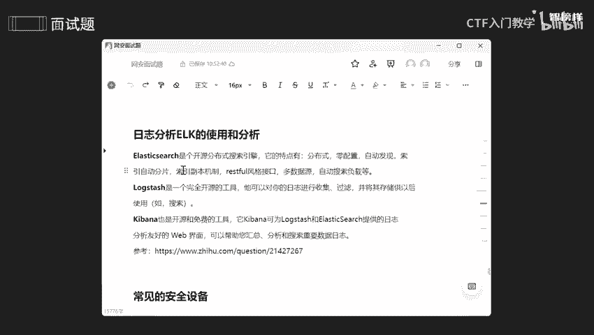
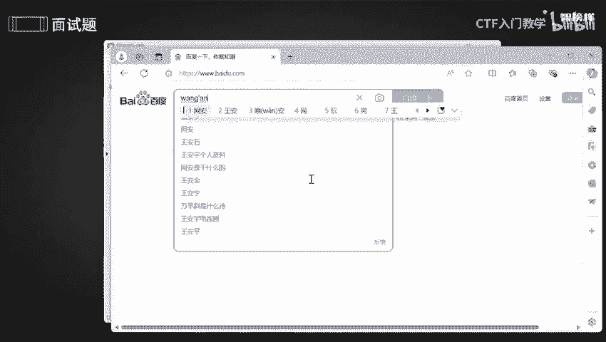
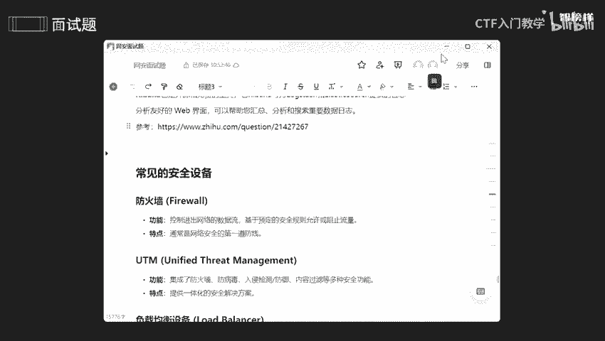

网络安全面试突击：P15：安全防御2

在本节课中，我们将继续学习安全防御的核心知识。本节内容聚焦于三个关键领域：等级保护制度、日志分析工具ELK的使用，以及常见安全设备的功能。这些是企业在安全建设和面试中非常关注的重点。

上一节我们介绍了安全防御的基础概念，本节中我们来看看更具体的技术和制度。

### 🛡️ 等保制度的重要性

等级保护制度是保障数据安全性的核心法规框架。它旨在通过分级保护的要求，全面提升组织的信息安全保障能力。理解等保是从事安全工作的基础。

### 📊 日志分析与ELK栈

日志分析是安全运营中发现问题、追溯根源的关键手段。以下是用于高效日志管理的ELK技术栈介绍。

ELK是三个开源工具的缩写组合：
*   **E**lasticsearch：一个开源的分布式搜索引擎。
*   **L**ogstash：一个服务器端的数据处理管道，用于从多种来源采集、转换数据，并将其发送到指定存储。
*   **K**ibana：一个为Elasticsearch设计的开源分析和可视化平台。

它们协同工作，共同构建强大的日志管理与分析系统。其工作流程可以概括为：**Logstash采集和过滤日志 -> 发送至Elasticsearch进行索引和搜索 -> 通过Kibana进行可视化展示**。

为了更直观地理解搜索引擎的作用，可以类比百度搜索。当用户输入关键词时，搜索引擎不仅能返回精确匹配的结果，还能进行模糊查询和关联词联想，从而帮助用户更快速、更全面地找到所需信息。Elasticsearch在日志分析中就扮演着这样的角色，它能对海量日志进行全文检索和复杂分析。

Logstash作为数据收集端，可以自动化地从各种来源（如日志文件、数据库、消息队列）收集数据，并进行格式化、匿名化等处理，极大简化了数据预处理的工作。

最终，通过Kibana的可视化Web界面，分析人员可以直观地创建仪表盘、图表，从而更容易地洞察数据趋势和异常。

### 🔧 常见安全设备概述

了解各类安全设备的功能是构建纵深防御体系的前提。以下是常见安全设备的简要说明。

*   **防火墙**：网络安全的第一道防线，通过预设规则控制网络流量，允许或阻止特定数据包通过。
*   **UTM（统一威胁管理）**：一种一体化的安全解决方案，集成了防火墙、防病毒、入侵检测、内容过滤等多种安全功能。
*   **负载均衡器**：将网络流量分发到多个服务器，以防止单台服务器过载，确保应用的高可用性和可靠性。
*   **IPS（入侵防御系统）** 与 **IDS（入侵检测系统）**：IPS能主动实时阻断恶意流量；IDS则侧重于监控和报警，发现潜在的恶意活动。
*   **堡垒机**：提供对内部网络设备的统一访问控制和操作审计，常用于远程运维管理。
*   **蜜罐**：一种安全陷阱系统，通过模拟有漏洞的服务或应用，诱使攻击者对其进行攻击，从而收集攻击者信息、手法和意图。
*   **网闸**：通过物理隔离技术，确保两个或多个网络之间没有直接的物理连接，用于保护高安全等级的网络。
*   **WAF（Web应用防火墙）**：专门用于保护Web应用程序的安全设备，能防御SQL注入、跨站脚本（XSS）等常见的Web攻击。
*   **漏洞扫描器**：用于自动检测网络、系统或应用程序中存在的安全漏洞和弱点，例如Nessus, Nmap等工具。
*   **SOC（安全运营中心）**：一个集中化的团队和平台，负责持续监控、分析安全事件，并提供威胁检测、分析和响应服务。

本节课中我们一起学习了等级保护制度的意义、ELK栈在日志分析中的协同工作原理，以及防火墙、WAF、蜜罐等常见安全设备的核心功能。掌握这些知识，有助于你构建系统性的安全防御视角，应对相关的技术面试。