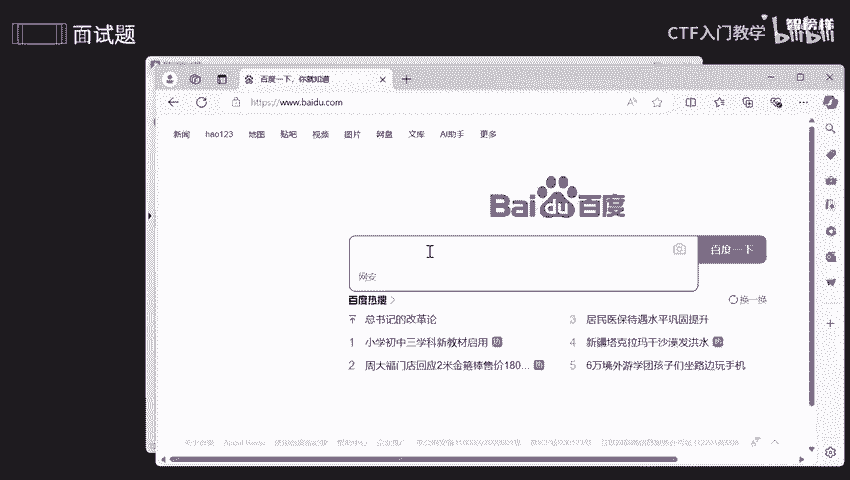
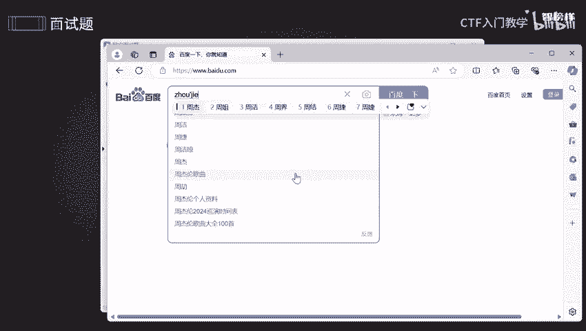

# 网络安全面试突击：P16：面试题-框架与中间件之IIS篇 🔐

在本节课中，我们将要学习IIS（Internet Information Services）的基本概念、其常见的版本漏洞以及如何实施有效的安全防护措施。通过理解这些核心内容，你将能够更好地应对面试中关于IIS安全的相关问题。

## IIS是什么？🚦

上一节我们介绍了本节课的学习目标，本节中我们来看看IIS究竟是什么。

IIS是微软提供的一项用于Windows系统的基本服务。它主要用于网络浏览、文件传输、新闻服务和邮件发送等方面，功能强大且好用。

IIS是网络信息交流中的一个交通枢纽。它负责接收、处理以及发送各种各样的信息。例如，当你访问一个网址（如 `www.baidu.com`）并输入关键词（如“周杰伦”）进行搜索时，这个搜索过程就是一个请求。IIS会接收这个请求，将其转发到相应的服务器。服务器从数据库中查找信息后，再将结果通过IIS返回并显示给你。

不仅如此，在这个过程中，IIS还能提供一个安全的环境，帮助用户更高效、快速、安全地找到相应信息。

## IIS常见漏洞 🕳️

既然IIS如此强大，那么它是否存在漏洞呢？答案是肯定的。任何系统、服务器或中间件都可能存在漏洞，无论怎么升级，风险依然存在。因此，了解这些漏洞至关重要。以下是IIS各版本的一些常见漏洞：

*   **IIS 6.0 版本**：
    *   **文件解析漏洞**：可能会错误地解析文件扩展名，导致攻击者可以执行任意代码。
    *   **WebDAV漏洞**：能够允许攻击者远程执行任意命令。

*   **IIS 7.0/7.5 版本**：
    *   虽然修复了旧漏洞，但仍可能出现新的问题，例如利用空字符（`%00`）截断来绕过某些安全限制的漏洞。
    *   还存在**模块解析**方面的漏洞。

*   **IIS 8.0/10.0 版本**：
    *   漏洞不仅可能存在于IIS本身，还可能存在于其依赖的框架或组件中。攻击者可能会通过影响这些第三方提供商来间接影响IIS服务的正常运行。

## IIS安全防护措施 🛡️

既然无法百分百控制漏洞的出现，那么我们应该如何行动来缩小危害范围、提高安全性呢？以下是一些关键的保护措施：

以下是实施安全防护的具体步骤列表：

1.  **保持系统更新**：定期更新Windows操作系统和IIS到最新版本，以修复已知的安全漏洞。
2.  **使用防范工具**：利用安全工具（如防火墙、入侵检测系统）来优化和加固IIS环境。
3.  **移除不必要的组件**：
    *   删除不需要的Web站点。
    *   如果不需要文件传输协议（FTP）或邮件发送协议（SMTP），则将其卸载。
4.  **定期审查与审计**：
    *   有规则地检查管理员组和服务，确保没有未知或未授权的账户。
    *   审计Web服务器日志，排查异常行为。
5.  **严格权限控制**：
    *   严格控制服务器的写访问权限。
    *   管理目录安全，确保敏感文件（如配置文件、数据文件）只有授权人员才能访问。
    *   对用户账户实施最小权限原则。
6.  **强化认证安全**：
    *   设置复杂的强密码，避免使用弱口令，防止被社会工程学攻击或暴力破解。
7.  **管理网络共享与端口**：
    *   排查并关闭不必要的网络共享。
    *   禁用TCP/IP协议中的NetBIOS over TCP/IP（如果不需要文件共享和网络设备发现功能）。
    *   使用防火墙配置规则，阻塞不必要的TCP/UDP端口。
8.  **检查可执行文件**：
    *   仔细检查`.bat`批处理文件和`.exe`可执行文件。恶意软件常伪装成这些文件进行植入。
9.  **利用文件系统安全特性**：
    *   使用NTFS文件系统的权限来控制对文件和目录的访问。
    *   NTFS还能在意外断电等情况下，帮助保护数据完整性和恢复数据。
10. **启用并配置日志**：确保IIS日志功能开启，并定期分析，以便及时发现安全事件。

## 总结 📚

本节课中我们一起学习了IIS的基础角色、其在各历史版本中出现过的典型安全漏洞，以及一系列实用的安全加固措施。核心在于理解没有绝对安全的系统，但通过**持续更新、最小权限、深度防御和定期审计**这些安全基本原则，可以极大提升IIS服务的安全性，有效应对潜在威胁。

---
*（注：课程中提到的详细操作步骤和排查方法已整理至语雀文档。）*