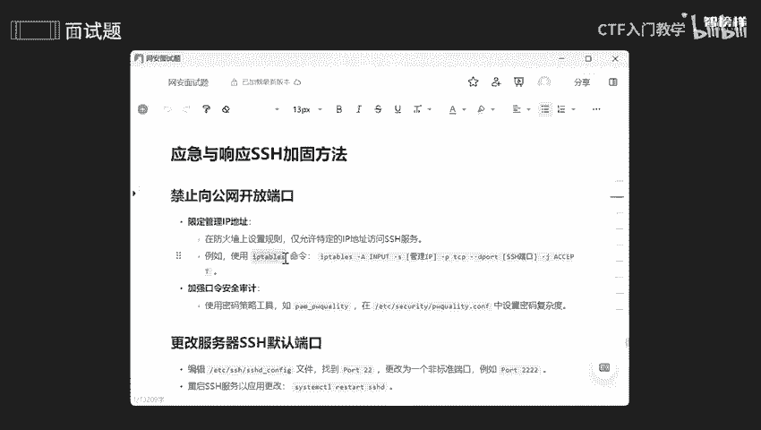
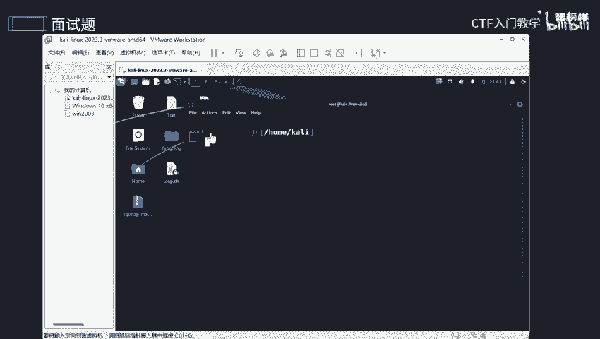
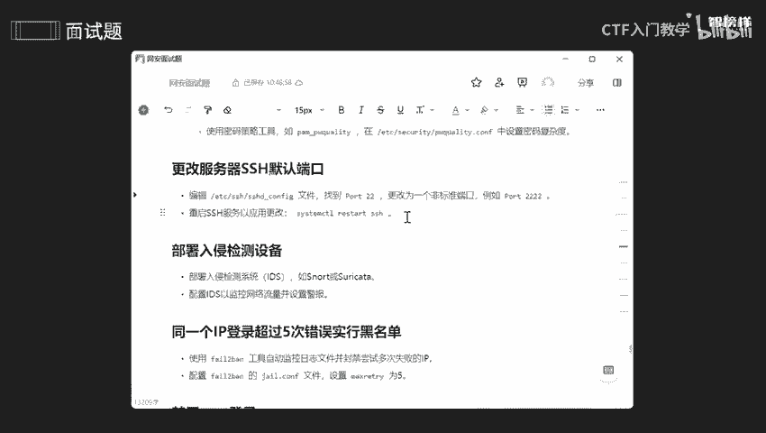

# 网络安全面试突击：P19：应急与响应SSH加固方法 🔐

在本节课中，我们将学习如何对SSH服务进行安全加固。SSH是远程管理服务器的重要工具，如果配置不当，可能成为攻击者入侵的入口。我们将介绍一系列实用的加固方法，以提升服务器的安全性。

## 概述：为什么要加固SSH？

上一节我们讨论了SSH被爆破后的应急处理，本节中我们来看看如何主动加固SSH，防患于未然。加固的核心在于缩小攻击面、增强认证强度和加强监控。

## 方法一：限制访问范围



首先，应禁止SSH服务直接对公网开放。公网指全球互联网，任何人都可访问，风险极高。内网则范围较小，仅限于局域网内访问。将SSH访问限制在内网或特定IP，能有效减少暴露风险。



以下是具体操作步骤：

1.  **限定管理IP地址**：通过防火墙规则，仅允许特定的、受信任的IP地址访问SSH服务。
2.  **查看与设置防火墙规则**：在Linux系统中，常用`iptables`或`firewalld`工具管理防火墙。

例如，使用`iptables`查看当前规则：
```bash
iptables -L -n
```
添加一条规则，仅允许IP `192.168.1.100`访问本机的22端口（SSH默认端口）：
```bash
iptables -A INPUT -p tcp -s 192.168.1.100 --dport 22 -j ACCEPT
iptables -A INPUT -p tcp --dport 22 -j DROP
```

## 方法二：加强口令复杂度

弱密码是SSH最常见的攻击突破口。我们需要制定并强制执行强密码策略。

以下是密码策略的核心要求：

*   **长度不低于12位**。
*   **必须包含以下三类字符**：
    *   大写字母 (A-Z)
    *   小写字母 (a-z)
    *   数字 (0-9)
    *   特殊字符 (如 !, @, #, $, %, &, *)

可以使用`cracklib`等工具在系统层面强制密码复杂度。

## 方法三：更改默认服务端口

SSH默认使用22端口，攻击者会首先扫描此端口。更改为一个不常用的高位端口，能避开大部分自动化扫描。

操作步骤如下：

1.  编辑SSH配置文件 `/etc/ssh/sshd_config`。
2.  找到 `#Port 22` 这一行，去掉注释`#`，并将22修改为其他端口，例如 `Port 2222`。
3.  保存文件并重启SSH服务使配置生效。
```bash
systemctl restart sshd
```
4.  **重要**：务必在防火墙中放行新设置的端口。

## 方法四：部署监控与主动防御

仅靠预防不够，还需要能及时发现攻击行为。

以下是关键的监控与防御措施：

*   **部署入侵检测系统(IDS)**：如Snort、Suricata，用于监控网络流量中的攻击行为，并设置警报。
*   **自动封禁恶意IP**：使用`fail2ban`等工具自动分析系统日志（如`/var/log/secure`），监控SSH登录失败记录。当同一IP在短时间内失败次数超过阈值（例如5次），则自动将其加入防火墙黑名单。
*   **配置`fail2ban`**：在其 jail 配置文件中设置 `maxretry = 5` 和 `bantime = 3600`（封禁1小时）。

## 方法五：调整SSH配置增强安全

SSH服务本身的配置选项提供了多重安全加固手段。

我们需要修改 `/etc/ssh/sshd_config` 文件中的以下关键参数：

1.  **禁止Root用户直接登录**：
    ```
    PermitRootLogin no
    ```
    *   **原因**：遵循最小权限原则。即使攻击者获得凭证，也无法直接获得最高权限。管理员应先以普通用户登录，再通过`sudo`提权，此过程会被系统日志记录，便于审计。

2.  **禁用空密码登录**：
    ```
    PermitEmptyPasswords no
    ```
    *   **原因**：防止因账户密码为空而导致未授权访问。

3.  **改用密钥认证登录**（替代密码登录）：
    *   在客户端生成密钥对：`ssh-keygen -t rsa -b 4096`
    *   将公钥(`id_rsa.pub`)内容上传至服务器的 `~/.ssh/authorized_keys` 文件中。
    *   在SSH配置文件中禁用密码登录，强制使用密钥：
        ```
        PasswordAuthentication no
        PubkeyAuthentication yes
        ```
    *   **原因**：密钥认证比密码更安全，且能避免暴力破解。

4.  **基于信任主机的无密码登录**（可选，用于特定管理场景）：
    在服务器的 `/etc/ssh/sshd_config` 或用户 `~/.ssh/authorized_keys` 文件中，通过 `from=` 选项限制源IP，可以实现从特定受信任主机无需密码（或使用密钥）直接登录。

**注意**：每次修改SSH配置文件后，都需要执行 `systemctl restart sshd` 重启服务以使更改生效。

## 总结



本节课中我们一起学习了SSH服务的安全加固方法。我们从**限制访问**（IP、端口）、**增强认证**（强密码、密钥登录、禁用Root）、到**加强监控**（IDS、fail2ban）等多个层面，系统性地提升了SSH服务的安全性。在实际应用中，无需实施所有项目，可根据服务器的重要性和所处环境，挑选最关键的数项进行配置。记住，安全是一个持续的过程，合理的配置和持续的监控同样重要。