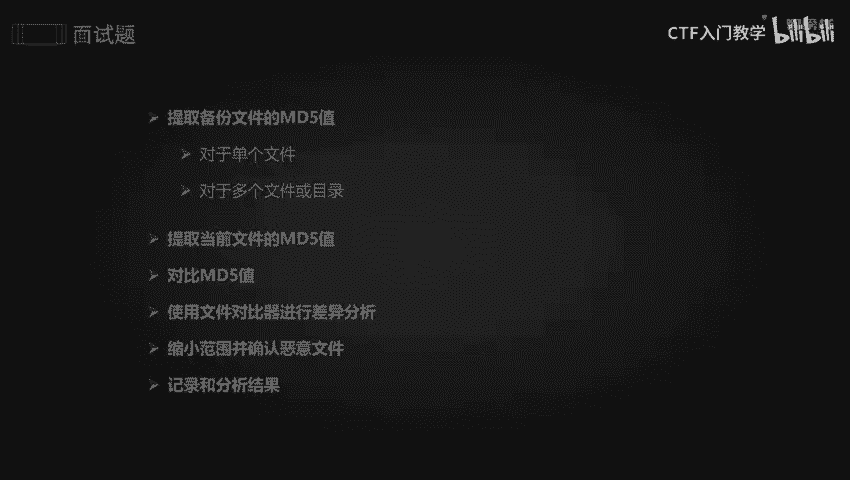
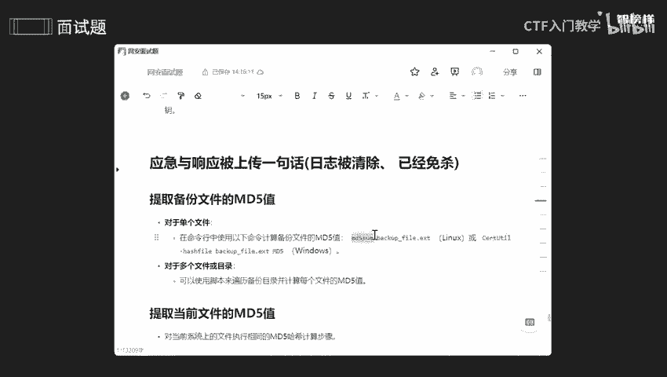
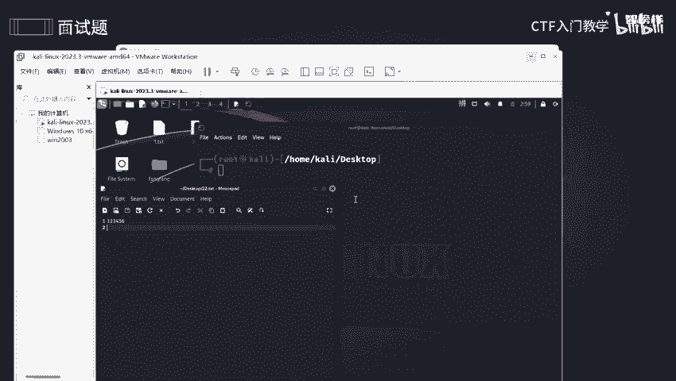
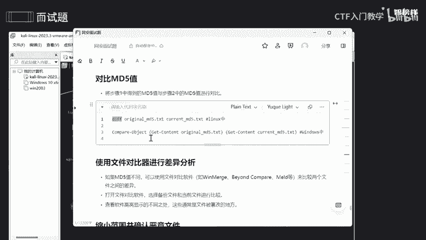
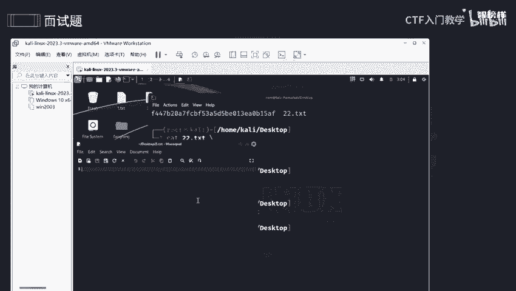
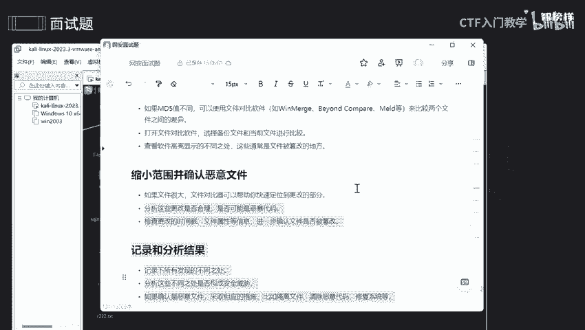

网络安全面试突击：P20：应急响应与文件完整性验证

在本节课中，我们将学习当系统遭受攻击，例如被上传一句话木马，且攻击者清除了日志并进行了免杀处理时，应如何进行应急响应。核心思路是通过对比文件变化来定位恶意文件。我们将重点学习如何使用MD5值来验证文件完整性。

---



### **第一步：理解并提取备份文件的MD5值**

上一节我们介绍了应急响应的背景，本节中我们来看看如何开始调查。首先需要提取备份文件的MD5值。

**MD5值**是一种广泛使用的密码散列函数，可以为任何数据生成一个唯一的“指纹”。在安全领域，它主要用于：
*   **验证文件完整性**：通过对比文件修改前后的MD5值，可以判断文件是否被篡改。
*   **追踪恶意软件**：如果某个文件的MD5值与已知的恶意软件库匹配，可以快速识别威胁。

MD5算法会将输入（如字符串、文件）转换为一串固定长度（128位，通常表示为32位十六进制数）的哈希值。例如，字符串 `123456789` 的MD5值是 `25f9e794323b453885f5181f1b624d0b`。

在数据库中，用户密码也常以MD5哈希值的形式存储，而非明文，以增加安全性。开发者还可以通过“加盐”进一步提升安全性。

以下是提取文件MD5值的命令：

**Linux/macOS系统：**
```bash
md5sum [文件名]
```

**Windows系统：**
```powershell
certutil -hashfile [文件名] MD5
```



若要将MD5值保存到文件，可以使用输出重定向：
```bash
md5sum [原文件名] > [保存MD5值的文件名]
```



由于攻击者可能清除了系统日志，我们无法从日志中直接获取入侵记录。因此，提取定期备份文件的MD5值，作为“干净”状态的基准，是调查的第一步。

---

### **第二步：提取当前文件的MD5值**

提取了备份文件的基准后，接下来需要提取系统当前状态下的文件MD5值，以便进行对比。

操作方法与第一步完全相同，只是目标文件是当前系统中疑似被篡改的文件。将当前文件的MD5值与备份文件的MD5值进行对比，是发现异常的关键。

---

### **第三步：对比MD5值并分析差异**



我们已经提取了备份文件和当前文件的MD5值，现在需要对它们进行对比分析。



**使用命令行对比：**
在Linux中，可以使用 `diff` 命令或直接比较两个保存了MD5值的文件：
```bash
diff [备份MD5文件] [当前MD5文件]
```
如果两个文件内容一致，`diff` 命令将不会有任何输出，表示文件未被篡改。如果输出差异内容，则表明文件可能发生了变化。

**使用文件对比工具：**
对于复杂的目录结构或非文本文件（如图片、音频），使用图形化的文件对比工具（如Beyond Compare, WinMerge, Meld）会更高效。
以下是使用对比工具的通用步骤：
1.  打开文件对比软件。
2.  分别选择备份文件和当前文件（或文件夹）。
3.  软件会高亮显示所有差异之处，这些通常是文件被篡改的位置。

**分析对比结果的目的：**
*   **缩小调查范围**：快速定位发生变化的文件。
*   **判断更改合理性**：确认文件修改是正常的系统更新、管理员操作，还是可疑的恶意篡改。
*   **验证文件完整性**：如果当前文件的MD5值与备份值不匹配，则该文件很可能已被篡改或损坏。
*   **记录取证**：详细记录所有发现的差异，作为事件响应的证据。

---

### **第四步：处置与修复**

通过对比分析，如果确认某个文件是恶意文件（例如，其MD5值与威胁情报库匹配，或文件内容被植入恶意代码），则需要立即采取行动。

以下是标准的处置流程：
1.  **隔离**：将受感染的主机从网络中断开，防止威胁扩散。
2.  **清除**：删除已确认的恶意文件。
3.  **修复**：从干净的备份中恢复被篡改的文件。
4.  **加固**：修复导致此次入侵的安全漏洞（例如，修复应用漏洞、加强访问控制）。

---

### **总结**



本节课中我们一起学习了在日志被清除情况下的应急响应流程。核心方法是利用 **MD5值** 进行文件完整性验证。我们通过四个步骤展开：首先**提取备份文件的MD5值**作为基准；然后**提取当前文件的MD5值**；接着**对比两者差异**，使用命令行或专业工具进行分析，以定位被篡改的文件；最后，对确认的恶意文件进行**隔离、清除与修复**。掌握这一流程，能够帮助你在面对文件篡改类安全事件时，进行有效的溯源和处置。