# 网络安全面试突击：P21：应急与响应之Windows系统日志分析 🔍

在本节课中，我们将学习网络安全面试中关于应急响应的重要环节——Windows系统日志分析。我们将了解日志的存储位置、分析步骤以及排查方法，帮助你掌握快速定位和分析安全事件的能力。

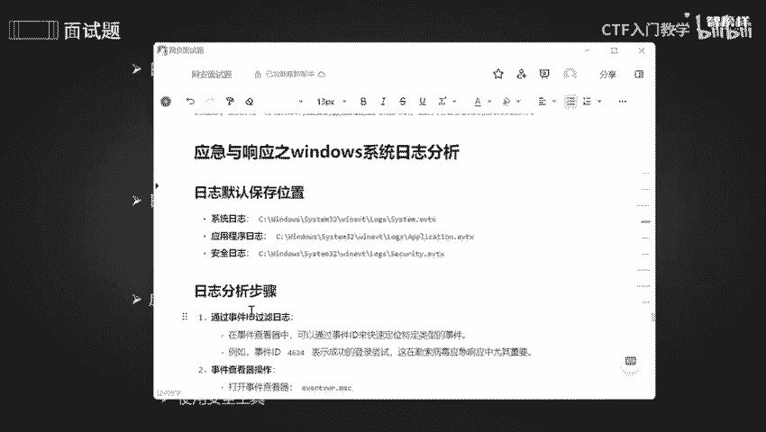

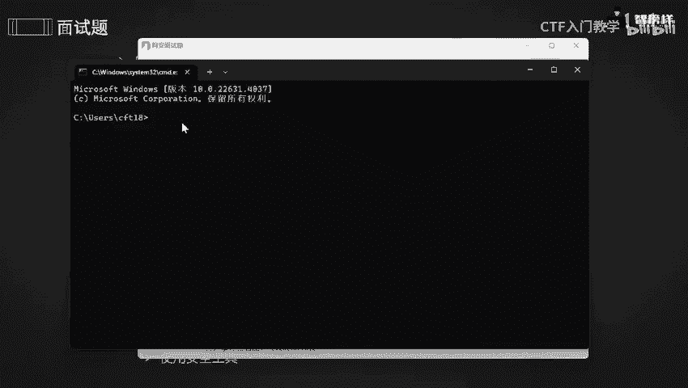

## 日志存储位置 📁

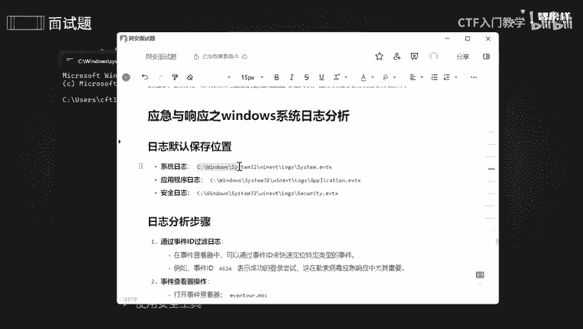

上一节我们介绍了日志分析的重要性，本节中我们来看看日志具体存放在哪里。如果不知道日志的存储位置，就无法进行有效分析。

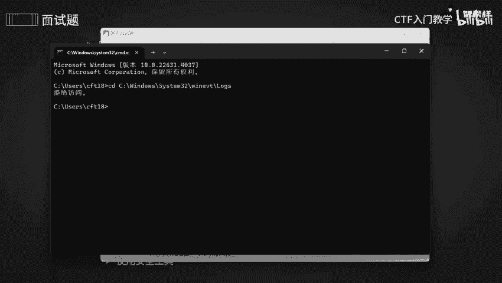

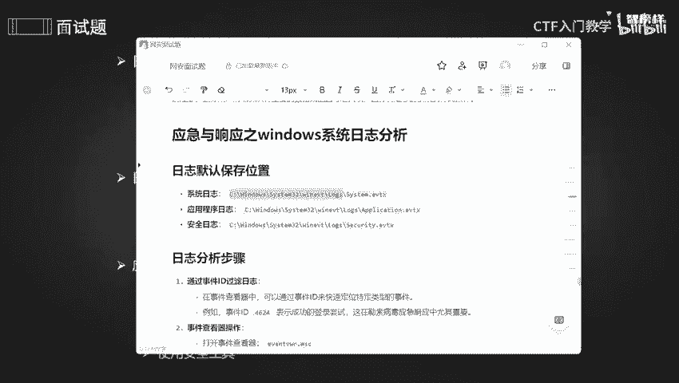

Windows系统日志默认存储在以下路径：
```
C:\Windows\System32\winevt\Logs\
```

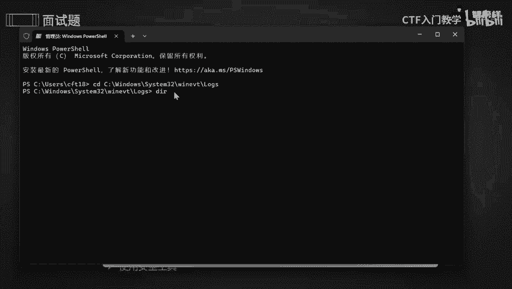

以下是查看日志位置的步骤：
1.  按下 `Win + R` 键，打开“运行”对话框。
2.  输入 `cmd` 并点击“确定”，打开命令提示符。
3.  在命令提示符中，使用 `cd` 命令切换到日志目录。

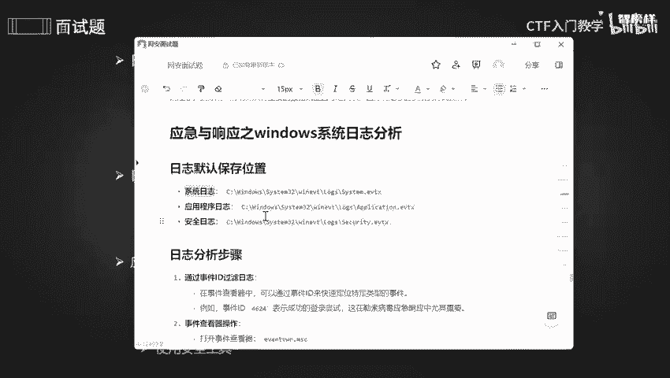

**注意**：访问此目录可能需要管理员权限。如果遇到“拒绝访问”的提示，需要以管理员身份运行命令提示符。可以通过在开始菜单中右键点击“终端”或“命令提示符”，选择“以管理员身份运行”来获取权限。

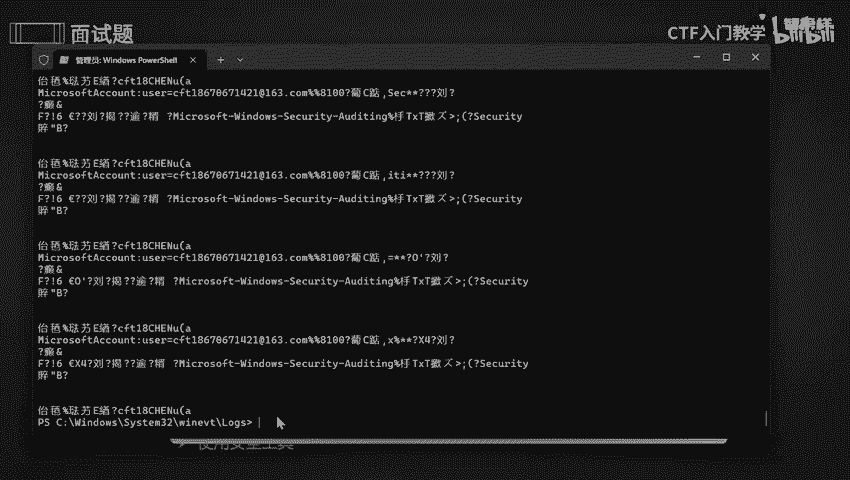

进入目录后，可以使用 `dir` 命令列出所有日志文件。关键的系统日志文件通常包括：
*   **Application.evtx**：应用程序日志
*   **System.evtx**：系统日志
*   **Security.evtx**：安全日志（分析重点）

可以使用 `type` 命令查看日志内容，但请注意，由于编码问题，内容可能显示为乱码。在实际分析中，我们更常使用图形化工具。

## 日志分析步骤 🔎

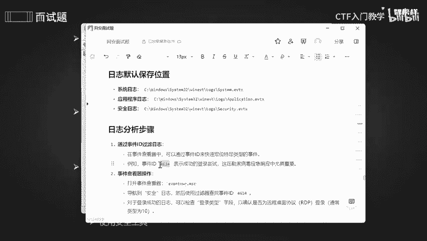

了解了日志的存储位置后，我们开始学习具体的分析步骤。高效的分析依赖于快速定位关键事件。

以下是日志分析的核心步骤：
1.  **通过事件ID筛选日志**：利用特定的事件ID快速定位到相关安全事件。
2.  **进行系统排查**：结合日志信息，检查系统服务、开放端口和运行进程。

### 步骤一：使用事件ID过滤日志

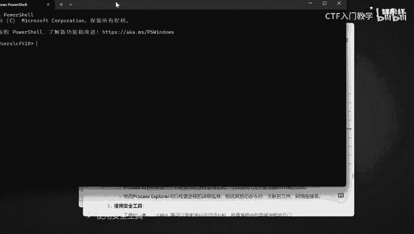

在Windows中，每个系统事件都有一个唯一的ID。通过ID可以快速过滤出特定类型的事件，这是应急响应中的关键技巧。

例如，事件ID **4624** 代表“账户登录成功”。在分析勒索病毒攻击或异常登录时，这个ID至关重要。

我们可以使用“事件查看器”来查看和筛选日志：
1.  按下 `Win + R`，输入 `eventvwr.msc`，打开事件查看器。
2.  在左侧导航栏中，展开“Windows 日志”。
3.  点击“安全”日志，这里记录了所有与安全审核相关的事件。
4.  在右侧“操作”面板中，点击“筛选当前日志...”。
5.  在“筛选器”选项卡的“包括/排除事件ID”框中，输入 `4624`。
6.  点击“确定”，所有成功的登录事件就会被筛选出来。

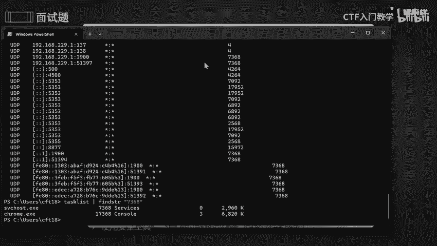

在筛选结果中，可以查看每个事件的详细信息，包括登录账户、登录类型、登录时间等，这对于追踪攻击者行为非常有帮助。

### 步骤二：在Windows中进行排查

当通过日志发现可疑事件后，下一步就是对系统进行深入排查，确认是否存在异常。

以下是排查系统状态的几种方法：
*   **查看开放端口与对应服务**：使用 `netstat` 命令可以查看当前系统的网络连接和监听端口。
    *   以管理员身份打开命令提示符或PowerShell。
    *   输入命令：`netstat -ano`
    *   这个命令会列出所有活动的网络连接（协议、本地地址、外部地址、状态）以及对应的**进程ID（PID）**。
*   **根据PID查找进程**：如果发现可疑的端口或连接，可以通过其PID找到对应的进程。
    *   在命令提示符中，使用 `tasklist | findstr [PID]` 命令。例如：`tasklist | findstr 7368`
    *   该命令会显示占用该PID的进程名称。
*   **使用专业工具分析进程**：对于更详细的分析，推荐使用 **Process Explorer** 工具。它是微软官方发布的强大进程管理器，比系统自带的任务管理器功能更全面。
    *   它可以图形化地展示所有进程的树状结构（父进程和子进程）。
    *   可以查看进程的详细信息，如启动项、加载的DLL文件、句柄、网络连接以及CPU和内存使用情况。
    *   可以从微软官网（`docs.microsoft.com/sysinternals/downloads/process-explorer`）安全下载。
*   **使用安全软件辅助**：此外，也可以利用如**火绒**、**360**等安全工具进行启动项分析和全盘扫描，检查系统中是否存在异常进程或后门程序。

本节课中涉及的工具和完整操作流程，我已整理成详细的文档。有需要的同学可以通过评论区或私信获取。

## 总结 📝


本节课我们一起学习了Windows系统日志分析的完整流程。
1.  我们首先明确了系统日志的默认存储位置：`C:\Windows\System32\winevt\Logs\`。
2.  接着，我们学习了分析的核心步骤：**通过事件ID（如4624）快速筛选安全日志**，定位关键事件。
3.  最后，我们掌握了排查方法：使用 `netstat` 命令检查网络连接，通过PID定位进程，并利用 **Process Explorer** 等工具进行深度分析。

掌握这些技能，能够帮助你在安全事件发生时，快速响应，追溯源头，有效控制影响。