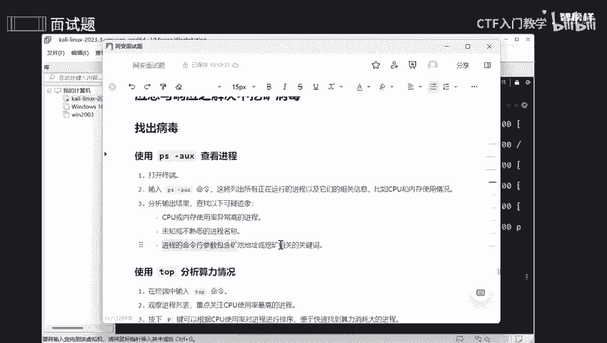
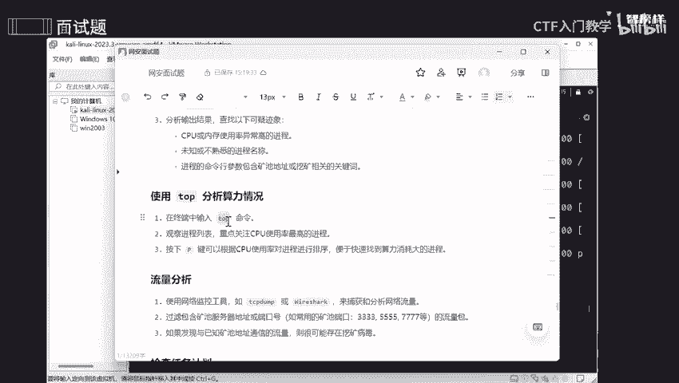

# 网络安全面试突击：P22：应急与响应之解决挖矿病毒 🛡️

在本节课中，我们将学习如何识别和解决计算机系统中的挖矿病毒。挖矿病毒会未经授权地占用你的计算资源（如CPU和电力）为攻击者“挖掘”加密货币，导致设备性能下降和能耗增加。我们将通过一系列步骤来定位并彻底清除这类病毒。

## 什么是挖矿病毒？🖨️

挖矿病毒可以类比为一台被偷偷搬到你家里的神奇打印机。这台打印机可以自动打印钞票，但它在工作时会消耗大量的纸张和墨水（相当于计算机的电力与计算能力）。攻击者在你不知情的情况下让它工作，打印出的钞票（挖矿收益）归他所有，而你却需要承担所有消耗（电费、性能损耗）的成本。

因此，我们的核心目标就是找到并移除这台“打印机”，即挖矿病毒。

## 如何发现挖矿病毒？🔍

上一节我们介绍了挖矿病毒的本质，本节中我们来看看如何发现它。挖矿病毒会大量消耗系统资源，因此我们可以通过监控系统状态来寻找异常。



以下是发现挖矿病毒的四个主要步骤：



**1. 使用 `ps` 命令查看当前进程**
打开终端，输入命令 `ps aux`。这个命令会列出所有正在运行的进程及其详细信息，包括进程ID（PID）、CPU占用率和内存占用率。
```bash
ps aux
```
我们需要重点关注CPU和内存使用率异常高的进程，以及那些名称陌生或可疑的进程。挖矿进程的命令行中有时会包含矿池地址或相关关键词。

**2. 使用 `top` 命令分析实时资源占用**
在终端输入 `top` 命令。这是一个动态视图，会实时显示并按资源使用率（默认是CPU）对进程进行排序。
```bash
top
```
这类似于Windows的任务管理器。通过观察，可以快速定位到持续占用大量CPU资源的进程，这很可能是挖矿病毒在活动。你可以按 `P` 键让列表按CPU使用率排序。

**3. 进行网络流量分析**
挖矿病毒需要与远程矿池服务器通信。我们可以使用网络监控工具（如 `tcpdump`）来捕获和分析网络流量。
```bash
sudo tcpdump -i any -w traffic.pcap
```
然后，可以过滤流量，检查是否有与已知矿池服务器（如鱼池、蚂蚁矿池等）的通信。常见的矿池端口包括3333、4444、5555、7777、8333等。发现此类通信是存在挖矿病毒的有力证据。

**4. 检查系统任务计划**
攻击者常常会设置周期性或一次性的计划任务，以确保挖矿病毒在系统重启后能再次运行。
- 检查周期性任务（Cron Jobs）：
```bash
crontab -l
```
- 检查一次性任务（AT Jobs）：
```bash
atq
```
仔细检查这些任务列表，移除任何不是你本人创建的、来源可疑的任务。

## 如何移除挖矿病毒？🗑️

在发现了可疑的挖矿进程后，我们需要彻底将其从系统中清除。

**1. 终止恶意进程**
使用 `kill` 命令强制停止该进程。`-9` 参数表示强制终止。
```bash
kill -9 <进程PID>
```
将 `<进程PID>` 替换为你从 `ps` 或 `top` 命令中找到的恶意进程ID。

**2. 删除病毒文件**
找到病毒程序文件所在的路径，并使用 `rm` 命令将其删除。
```bash
rm -f /path/to/malware/file
```

**3. 清理相关痕迹**
病毒可能会在系统中留下启动脚本或配置文件。检查常见的启动目录（如 `/etc/init.d/`, `~/.config/autostart/` 等）和配置文件，删除所有与病毒相关的条目。

**4. 处理无法删除的文件**
如果删除文件时遇到“权限不足”或“文件正在使用”的错误，可以尝试以下方法：
- **文件正在使用**：先用 `kill` 命令结束相关进程，再尝试删除。
- **权限不足**：使用 `sudo` 命令以管理员权限执行删除。
```bash
sudo rm -f /path/to/file
```
- **仍无法解决**：可以尝试使用 `chmod` 命令移除文件的读写权限，再行删除。
```bash
sudo chmod a-wx /path/to/file
sudo rm -f /path/to/file
```

## 总结 📝

本节课中我们一起学习了挖矿病毒的危害、发现方法和清除步骤。首先，我们了解了挖矿病毒会窃取你的计算资源。接着，我们学习了通过 `ps`、`top` 命令分析进程，通过网络流量分析发现异常通信，以及检查计划任务来定位病毒。最后，我们掌握了终止进程、删除文件、清理痕迹这一套完整的病毒清除流程。按照这些步骤操作，你就能有效地应对系统中的挖矿病毒威胁。