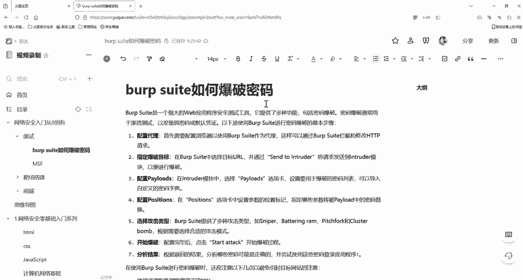

# Burp Suite入门：P24：Burp Suite如何爆破密码

在本节课中，我们将学习Burp Suite工具进行密码爆破的核心原理，并了解如何绕过常见的验证机制，如前端验证码、后端验证码和Token验证。

## 🧠 工作原理概述

上一节我们介绍了Burp Suite的基本概念，本节中我们来看看它的密码爆破功能是如何工作的。

Burp Suite是一款功能强大的渗透测试工具，它提供了多种功能来帮助安全研究人员和测试人员评估Web应用程序的安全性。其密码爆破的工作原理，是在原始网络数据包中，利用不同的变量值对请求参数进行替换。

这个“不同的变量值”通常来自我们准备的爆破字典。工具通过字典中的值逐一替换请求参数，模拟发送大量请求，并根据服务器的响应结果来判断尝试是否成功，从而达到爆破的目的。

## 🔍 绕过前端验证码

前端验证是一种常见的防护手段，但其原理决定了它相对容易被绕过。

前端验证码将验证逻辑放在JavaScript代码中，只在浏览器端进行校验，不会提交到服务器端进行验证。因此，我们可以通过查看网页源代码直接找到验证码或相关逻辑。

Burp Suite作为运行在浏览器和目标服务器之间的代理，一旦抓取到包含账号密码的请求包，就可以绕过浏览器直接向服务器发送请求。由于验证码校验仅在前端，服务器端不会再次校验，因此可以实现绕过。

## ⚙️ 绕过后端验证码

后端验证码的机制与前端相反，安全性更高。

后端验证码会将用户输入的验证码提交到服务器端进行校验。验证码通常由后端代码生成，并可能存储在会话（Session）或文件中。其刷新往往需要触发特定条件，例如点击登录按钮或专门的“刷新验证码”链接。

使用Burp Suite抓包进行爆破时，关键在于**不触发验证码刷新**。我们需要在抓取登录请求数据包后，保持拦截开关开启，不释放数据包。这样，页面的验证码就不会刷新，爆破过程可以一直使用同一个正确的验证码进行尝试。如果关闭拦截开关放行数据包，则会触发页面刷新，导致验证码失效。

## 🎫 处理Token验证

Token（令牌）是一种常见的身份验证机制，每次请求都需要携带有效的Token。

Token的工作流程如下：用户使用用户名密码请求验证，服务器验证成功后，返回一个签名的Token给客户端（浏览器）。客户端保存此Token，并在后续每次请求时携带它。服务器会验证Token的有效性，以此决定是否处理请求。

在爆破过程中，Token每次都会变化，手动处理是不现实的。Burp Suite可以通过以下方式自动化处理Token验证：
1.  使用 **“Pitchfork”** 或 **“Cluster bomb”** 攻击模式。
2.  在攻击设置中，将Token参数设置为 **“Extract from response”** 类型，并使用正则表达式从服务器响应中抓取新的Token值。
3.  **将爆破线程（Number of threads）设置为1**，以确保请求按顺序发送，后一个请求能使用前一个响应中提取到的最新Token。

以下是配置关键点的示意：
*   **攻击模式**：`Pitchfork` 或 `Cluster bomb`
*   **Token处理**：`Payload type: Recursive grep`
*   **线程设置**：`Number of threads: 1`

## 📝 总结

本节课我们一起学习了Burp Suite进行密码爆破的核心原理。我们了解到，爆破的本质是使用字典替换参数并重放请求。同时，我们探讨了如何绕过三种常见的防护机制：通过代理直接发包绕过**前端验证码**；通过保持拦截状态、避免触发刷新来绕过**后端验证码**；以及通过配置攻击模式、提取响应Token并设置单线程来自动化处理**Token验证**。掌握这些原理，是进行有效安全测试的基础。

---
（教程中提及的插件与资料请通过正规渠道获取，并仅用于合法授权的安全测试。）