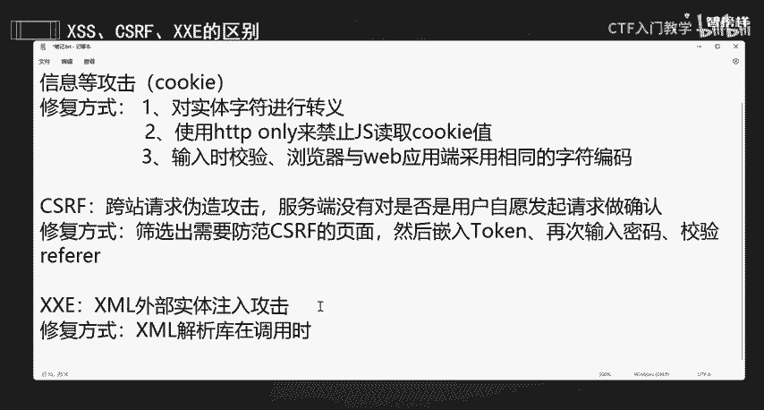
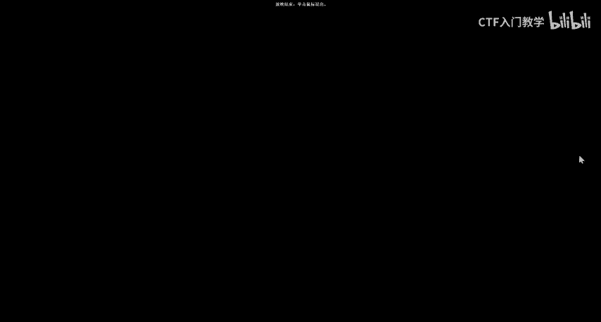

# 网络安全面试突击：P25：CSRF、XXE和XSS的区别

在本节课中，我们将学习网络安全中三个常见的Web漏洞：XSS、CSRF和XXE。我们将分别介绍它们的基本概念、攻击原理以及修复方式，并重点分析它们之间的区别。

## XSS：跨站脚本攻击

上一节我们概述了本课内容，本节中我们来看看第一个漏洞：XSS。

XSS的全称是跨站脚本攻击。这种攻击的本质是，攻击者能够在用户提交的数据中构造恶意代码，并且这些代码能够在其他用户的浏览器中被执行。其目的是窃取用户信息，例如用户的Cookie。

以下是XSS攻击的核心原理描述：
**攻击者提交的数据 = 正常数据 + 恶意脚本代码**

XSS的修复方式主要有以下几种：
*   **对实体字符进行转义**：对用户输入的特殊字符（如 `<`, `>`, `&` 等）进行HTML实体转义，防止其被解析为代码。
*   **使用HttpOnly Cookie**：在设置Cookie时添加`HttpOnly`属性，可以禁止JavaScript读取该Cookie值，从而降低敏感信息被窃取的风险。
*   **输入校验与过滤**：对用户输入进行严格的校验和过滤，移除或禁用潜在的恶意脚本。
*   **实施内容安全策略**：浏览器与Web服务器端采用相同的字符编码规则，并配置CSP（内容安全策略）来限制可执行的脚本来源。

简单来说，XSS就是攻击者将恶意代码“注入”到网页中，当其他用户浏览该页面时，代码就会执行。

## CSRF：跨站请求伪造

了解了XSS之后，我们来看看另一个容易混淆的漏洞：CSRF。

CSRF的全称是跨站请求伪造。XSS是实现CSRF攻击的诸多手段之一。CSRF攻击能够成功，是因为服务器在执行关键操作（如转账、改密）时，没有验证该请求是否确实是用户自愿、知情并主动发起的。攻击者可以诱骗已登录的用户去访问一个恶意页面，从而以该用户的身份向服务器发送伪造的请求。

以下是CSRF攻击的一个简单逻辑描述：
**服务器收到请求 → 检查用户登录状态（通过Cookie）→ 状态有效则执行操作（未检查请求来源是否合法）**

CSRF的修复方式主要包括：
*   **筛选需要防护的页面**：识别出所有执行敏感操作的页面或接口。
*   **嵌入Token进行校验**：在表单或请求中嵌入一个随机的、不可预测的Token（令牌），服务器在处理请求前校验此Token的有效性。
*   **校验HTTP Referer字段**：检查请求头中的Referer字段，确认请求是否来源于可信的域名。但此方法可能因浏览器隐私设置或Referer被篡改而不可靠。

简而言之，CSRF是攻击者“借用”了用户的身份和权限，在用户不知情的情况下代替用户向服务器发送恶意请求。

## XXE：XML外部实体注入

最后，我们来探讨一个与数据格式相关的漏洞：XXE。

XXE的全称是XML外部实体注入攻击。这种攻击发生在应用程序解析XML输入时。攻击者可以利用XML规范中的“外部实体”功能，在XML文件中构造恶意实体，从而请求并读取服务器本地的敏感文件（如`/etc/passwd`），甚至可能造成内网探测、拒绝服务攻击等安全问题。

以下是XXE攻击中可能出现的恶意XML代码示例：
```xml
<?xml version="1.0"?>
<!DOCTYPE foo [
<!ENTITY xxe SYSTEM "file:///etc/passwd">
]>
<foo>&xxe;</foo>
```



XXE的修复方式相对直接：
*   **禁用外部实体解析**：在XML解析器调用时，严格配置并禁用对外部实体的解析功能。这是最根本、最有效的修复方法。
*   **使用安全的解析器**：使用默认配置下更安全的XML解析库。
*   **输入过滤**：对用户提交的XML数据进行严格的模式验证，过滤不必要的DOCTYPE声明。

简单理解，XXE就是攻击者通过提交恶意的XML数据，让服务器“主动”去读取本不该被访问的系统文件。

## 总结与对比

本节课中，我们一起学习了XSS、CSRF和XXE这三个Web安全核心漏洞。



现在，让我们用一个简单的比喻来总结它们的区别：
*   **XSS** 像是有人在你管理的公告板（网页）上贴了一张带病毒的纸条（恶意脚本），其他来看纸条的人（用户）就会中毒。
*   **CSRF** 像是有人偷偷拿到了你的印章（登录状态），然后伪造你的命令（请求）去办事。
*   **XXE** 像是有人递给你一份格式特殊的申请书（XML），你按照流程处理时，这份申请书会要求你去打开保险柜（文件系统）并取出机密文件。

理解这三者的根本区别，对于回答相关面试题和进行实际的安全防护都至关重要。记住它们各自的全称、攻击原理和修复思路，你就能清晰地应对这方面的考察。