# 网络安全面试突击：P26：GET与POST请求的区别 🔍

在本节课中，我们将学习HTTP协议中两种最常用的请求方法：GET和POST。理解它们的核心区别是网络安全、Web开发和渗透测试领域的基础知识。我们将通过对比分析，帮助你清晰掌握两者的不同之处。

## 概述

GET和POST是HTTP协议中用于向服务器提交或请求数据的两种主要方法。它们在数据传输方式、安全性、用途以及底层处理机制上存在显著差异。掌握这些区别对于回答技术面试题和进行安全测试至关重要。

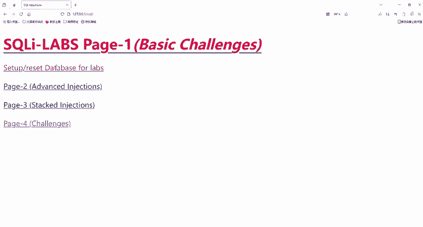

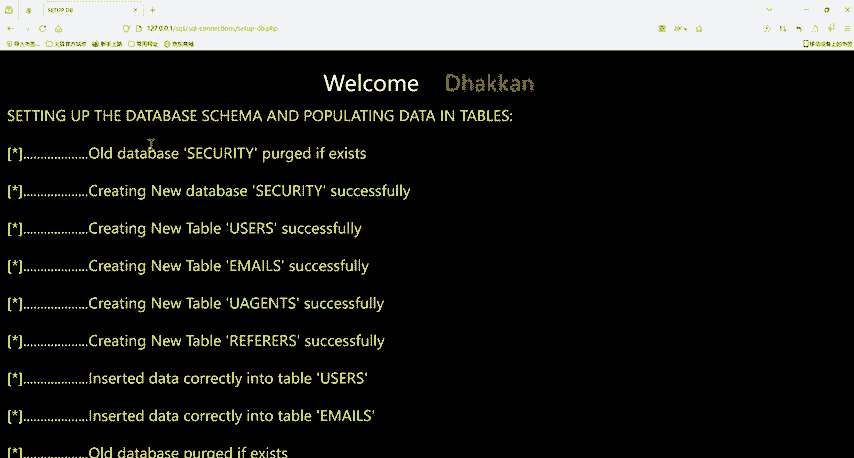

## 核心区别详解

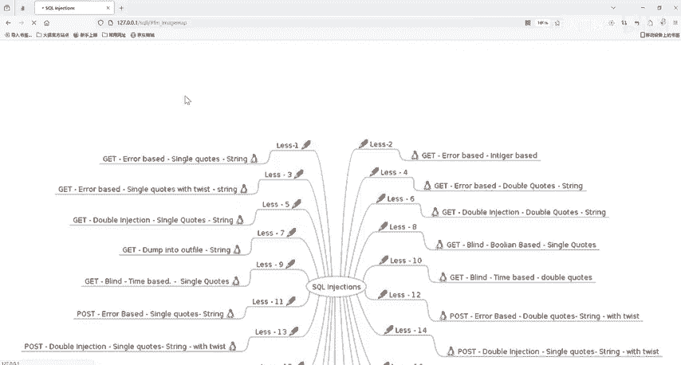

上一节我们概述了GET和POST的基本概念，本节中我们来看看它们具体的五点核心区别。

### 1. 数据传输位置与安全性


最基础的区别在于数据传输的位置，这直接影响了其安全性。

*   **GET请求**：将请求参数附加在URL之后。
    *   **格式**：`URL?参数1=值1&参数2=值2`
    *   参数以问号`?`开始，多个参数用`&`符号连接。
    *   由于参数明文显示在地址栏和浏览器历史中，**安全性较低**。

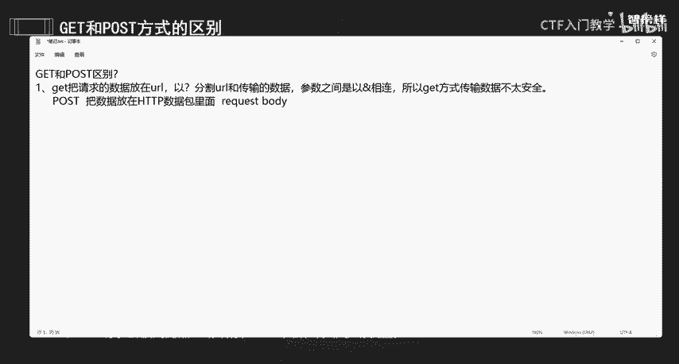

*   **POST请求**：将请求参数放在HTTP请求的正文（Body）中。
    *   数据不会显示在URL上。
    *   相对于GET，**安全性较高**。

以下是两种方式的直观对比：
```http
# GET请求示例（参数在URL中）
GET /login.php?username=gaga&password=123456 HTTP/1.1
Host: example.com

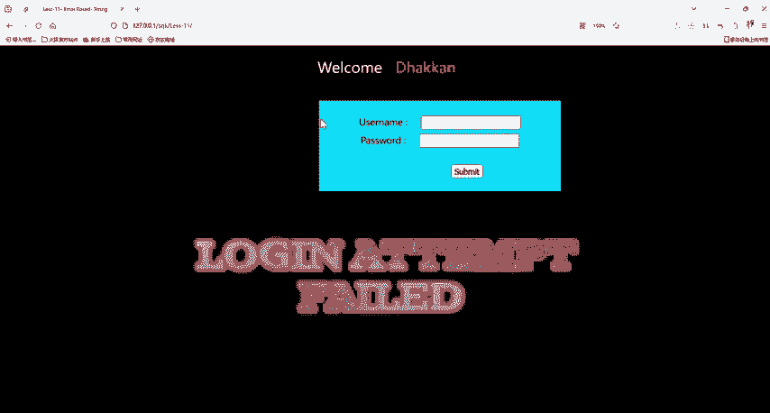

# POST请求示例（参数在请求体中）
POST /login.php HTTP/1.1
Host: example.com
Content-Type: application/x-www-form-urlencoded

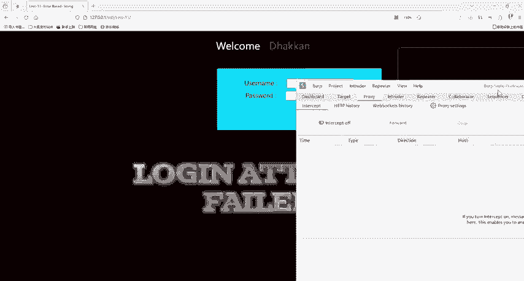

username=gaga&password=123456
```

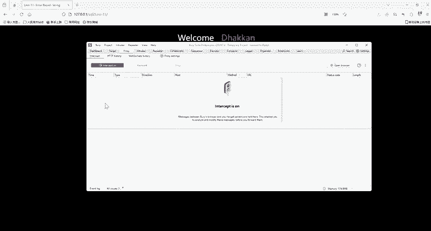


### 2. 设计目的与用途

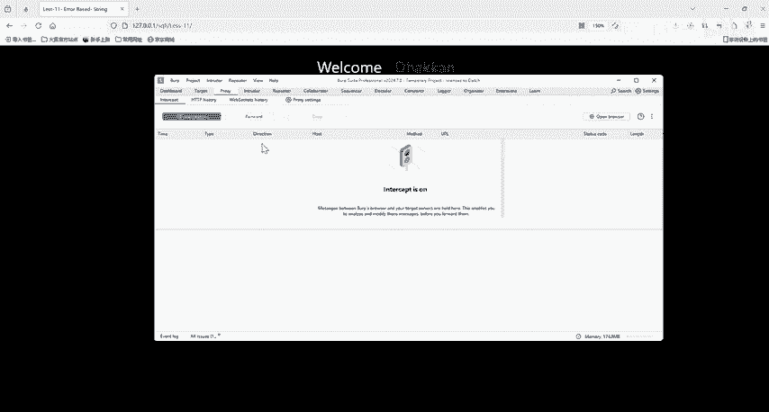

GET和POST在HTTP协议中被设计用于不同的目的。

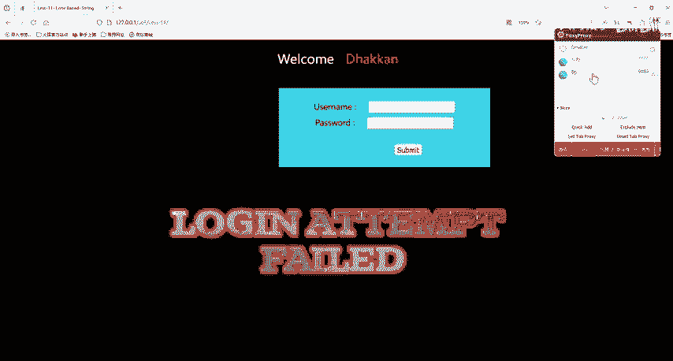

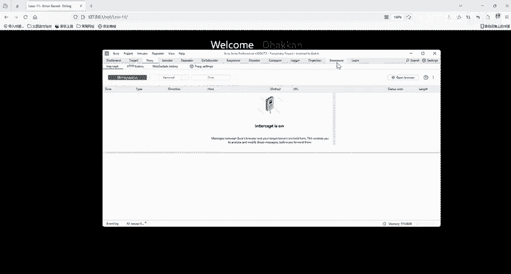

*   **GET**：主要用于**获取数据**。它应该是幂等的，即多次执行相同的GET请求，结果应该一致，且不应改变服务器状态。
*   **POST**：主要用于**提交数据**，常会改变服务器状态，例如创建、更新或删除资源。

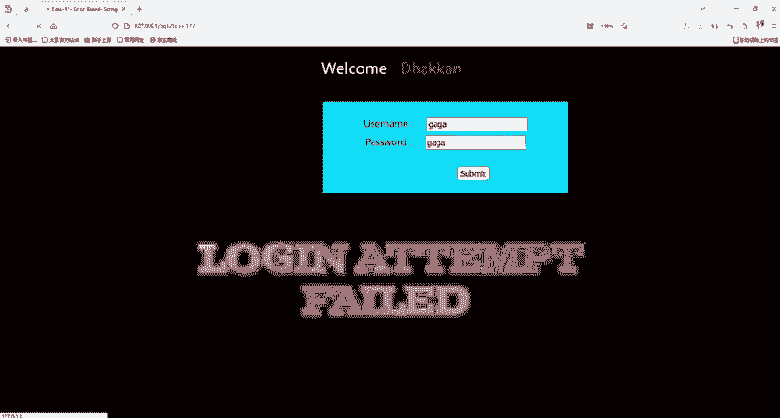

### 3. 数据大小限制

两者在可提交的数据量上存在限制差异。

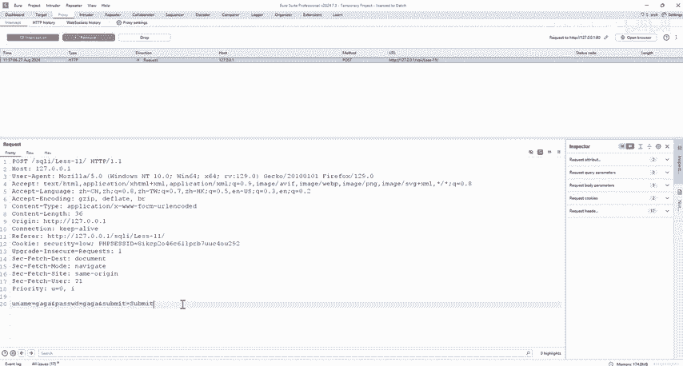

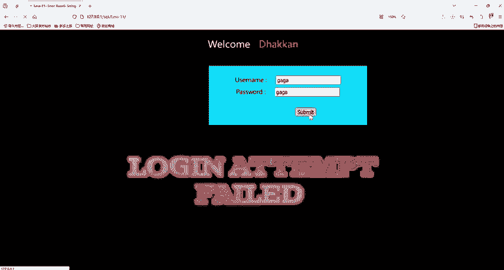

*   **GET请求**：对URL长度有限制，因此可传输的数据量较小。虽然HTTP协议本身未规定上限，但浏览器和服务器通常有约束（例如，**约2KB**）。
*   **POST请求**：理论上**没有数据大小限制**，数据通过请求体传输。实际限制通常由服务器配置决定。

### 4. 底层TCP数据包生成

这是一个更底层的技术区别，涉及网络传输过程。

*   **GET请求**：产生**一个TCP数据包**。浏览器将HTTP请求头（Header）和数据（Data）一并发出，服务器响应200（OK）并返回数据。
*   **POST请求**：产生**两个TCP数据包**。浏览器先发送请求头，服务器响应100（Continue），然后浏览器再发送请求体中的数据，最后服务器响应200（OK）并返回数据。

### 5. 浏览器缓存行为

浏览器对两种请求的缓存处理方式不同。

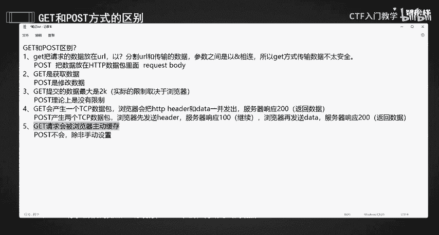

*   **GET请求**：**会被浏览器主动缓存**。例如，访问过的带参数的URL可能会被保存在历史记录中。
*   **POST请求**：**默认不会被浏览器缓存**。除非在代码中手动设置特定的缓存控制头。

## 总结

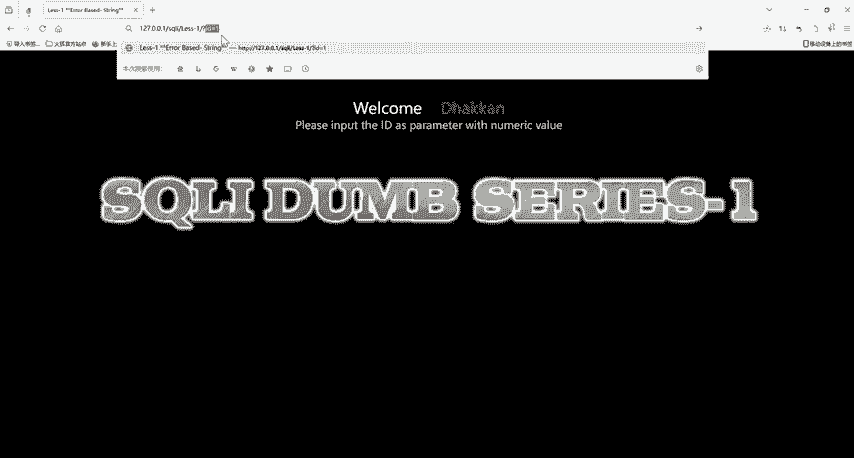

本节课中我们一起学习了GET与POST请求的五点核心区别：
1.  **数据传输位置**：GET在URL中，POST在请求体中。
2.  **设计用途**：GET用于获取数据，POST用于修改数据。
3.  **数据大小**：GET有长度限制，POST理论上无限制。
4.  **TCP包数量**：GET产生一个包，POST产生两个包。
5.  **浏览器缓存**：GET会被主动缓存，POST默认不会。

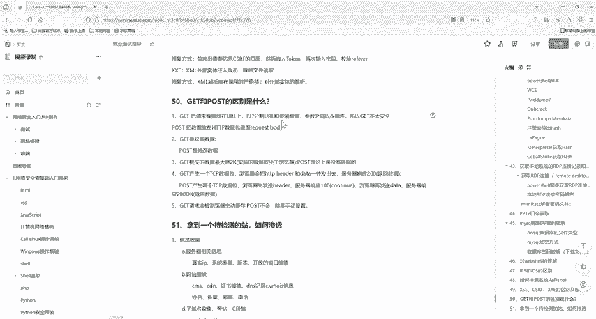

理解这些区别有助于在开发中正确选择请求方法，并在安全测试中识别潜在的风险点（例如，敏感信息通过GET请求传输）。