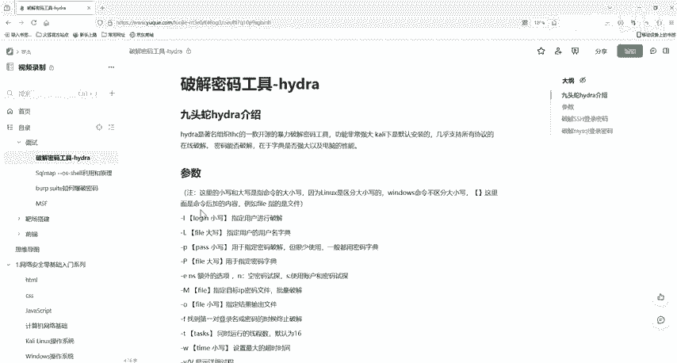
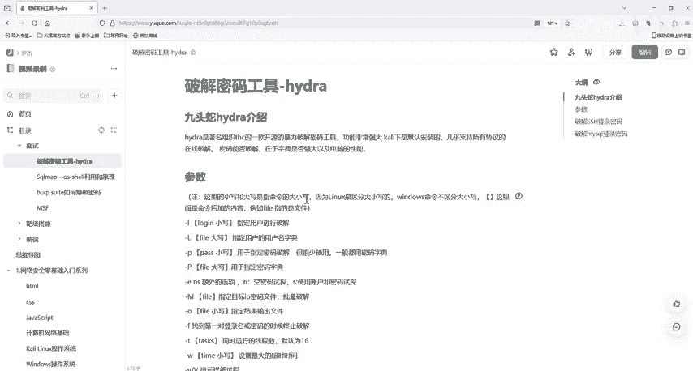
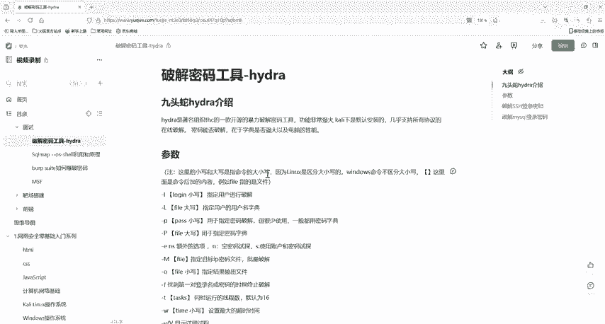

# 网络安全入门：P27：1 密码爆破工具 Hydra 介绍 🔑

在本节课中，我们将要学习一款强大的密码破解工具——Hydra。Hydra 被誉为密码爆破领域的“瑞士军刀”，它支持多种网络协议，能够帮助我们进行在线密码猜测和破解。无论你是网络安全的新手，还是希望提升技能的资深人士，本节课都将为你提供宝贵的知识和启发。

## 工具简介

Hydra，中文常被称为“九头蛇”，是一款由著名黑客组织 THC 开发的开源密码破解工具。它的功能非常强大，支持包括 SSH、FTP、HTTP 在内的多种协议的在线破解。该工具特别适合在渗透测试中，对网络服务进行密码猜测，因为它支持多种认证方式，并能并行处理多个登录尝试，从而显著加快破解速度。

## 环境准备

要使用 Hydra，我们需要一个合适的运行环境。Kali Linux 系统已经内置了此工具，因此最便捷的方式是准备一个虚拟机并安装 Kali Linux 系统，然后即可开箱使用。相关的软件资源已提供在评论区，有需要的小伙伴可以自行获取。

上一节我们介绍了 Hydra 的基本概念和运行环境，本节中我们来看看它的具体使用方法，特别是核心参数的含义。

## 基本参数详解

以下是 Hydra 工具的一些核心命令行参数。请注意，Linux 系统区分命令的大小写。

*   **`-l`**：指定单个用户名进行破解。例如：`-l admin`
*   **`-L`**：指定一个用户名字典文件进行破解。字典文件是一个文本文件，其中每一行都是一个可能的用户名。
*   **`-p`**：指定单个密码进行尝试。例如：`-p 123456`
*   **`-P`**：指定一个密码字典文件进行尝试。密码字典文件同样是一个文本文件，包含大量可能的密码组合。
*   **`-M`**：指定一个包含多个目标 IP 地址的文件，用于批量破解。
*   **`-o`**：将破解结果输出到指定的文件中。例如：`-o result.txt`
*   **`-f`**：找到第一对正确的用户名和密码后，立即停止破解。
*   **`-t`**：设置任务线程数。如果不设置，默认使用 16 个线程。例如：`-t 32`
*   **`-w`**：设置每次尝试的最大超时时间（单位：秒）。
*   **`-v` / `-V`**：显示详细的破解过程。
*   **`-R`**：恢复之前中断的破解任务。通常需要配合 Hydra 的恢复文件使用。
*   **`-x`**：启用自定义密码生成模式。

除了上述参数，Hydra 还支持更多高级选项。大家可以在 Kali Linux 系统中通过 `man hydra` 命令查看完整手册，或在 Windows 版本中探索。更详细的参数列表也已提供在评论区。

了解了基本参数后，我们将在下一节课进行实际操作，演示如何使用 Hydra 对 SSH 服务进行密码破解。

## 总结

本节课中我们一起学习了密码破解工具 Hydra 的起源、功能、所需环境及其核心命令行参数。Hydra 作为一款支持多协议、高效率的在线密码破解工具，是网络安全学习和渗透测试中的重要利器。请务必牢记，所有技术都应在合法授权的范围内使用，未经许可尝试破解他人密码是违法且不道德的行为。

好的，那么我们下一节课再见。