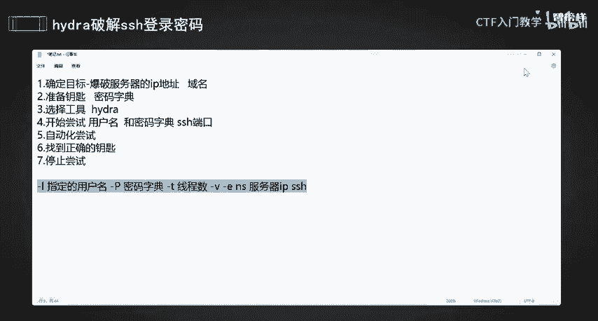
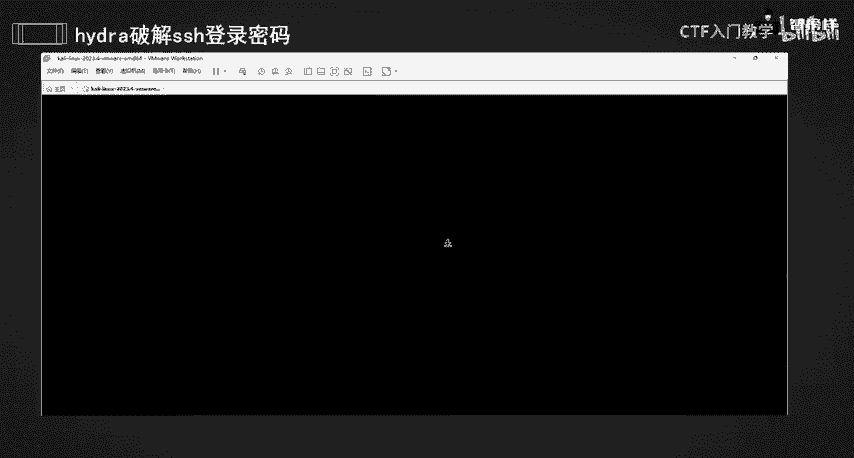
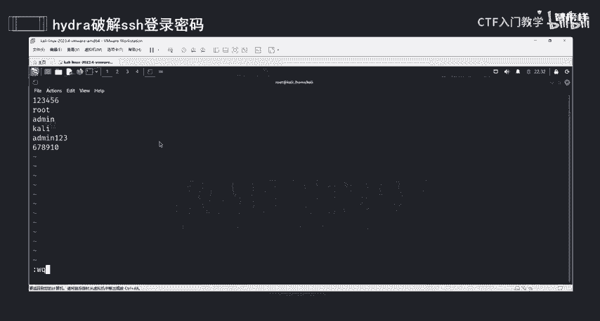
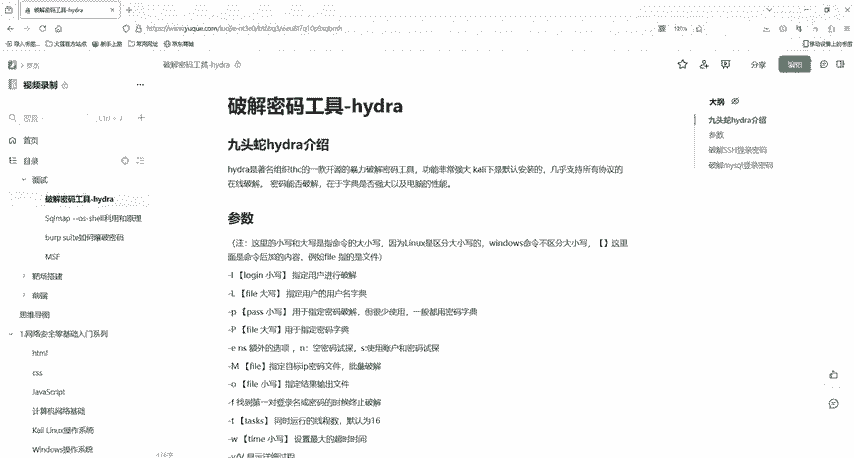

# 网络安全入门：P28：使用Hydra爆破SSH用户名密码

## 概述
在本节课中，我们将学习如何使用Hydra工具自动化地尝试破解SSH服务的登录凭证。这个过程类似于用一串钥匙去尝试打开一把锁，直到找到正确的那一把。我们将从原理讲解到实际操作，确保初学者能够理解并掌握基本步骤。

---

## 原理与步骤

上一节我们介绍了网络安全的基本概念，本节中我们来看看如何使用工具进行密码爆破。整个爆破过程可以分解为几个清晰的步骤。

### 第一步：确定目标
首先需要明确攻击目标，即SSH服务所在的位置。这通常是目标服务器的IP地址或域名。

### 第二步：准备钥匙（密码字典）
我们需要准备一个或多个可能的密码列表，即密码字典。这个列表可以包含常见密码，也可以是根据目标用户习惯生成的密码。

### 第三步：选择工具
我们将使用功能强大的Hydra工具。它就像我们的手，会自动尝试字典中的每一个密码。

### 第四步：开始尝试
告诉Hydra使用哪个用户名和密码字典，去尝试连接哪个SSH服务的端口。这个过程是自动化的，工具会依次尝试每一个组合。

### 第五步：获取结果并停止
当Hydra尝试到正确的密码时，它会自动停止并告知结果。找到正确凭证后即可停止尝试，以节省时间和资源。

---





## 实战操作

理解了基本步骤后，我们现在进入实战环节。本次操作需要在安装Kali Linux的虚拟机环境中进行。

### 环境准备
你需要准备以下环境：
*   一台安装Kali Linux的虚拟机。
*   确保你拥有对目标进行测试的合法授权。

### Hydra命令参数简介
在使用Hydra前，我们先了解几个关键参数。以下是核心参数及其作用：

*   `-l <用户名>`: 指定单个用户名进行爆破。
*   `-L <用户名字典文件>`: 使用用户名字典文件进行爆破。
*   `-p <密码>`: 指定单个密码进行尝试。
*   `-P <密码字典文件>`: 使用密码字典文件进行爆破。
*   `-t <线程数>`: 设置同时尝试的线程数，可以提高效率，但不宜过高。
*   `-v` / `-V`: 显示详细的尝试过程。
*   `<目标IP> <服务类型>`: 指定目标地址和服务（如`ssh`）。

**重要提醒**：必须在获得明确授权的前提下进行此类操作，确保行为合法合规。

### 操作演示
接下来，我们以爆破本地Kali机器的SSH服务为例进行演示。

1.  **打开终端并获取目标IP**：
    使用 `ifconfig` 命令查看本机IP地址。假设查到的IP是 `192.168.110.12`。



2.  **创建密码字典**：
    我们可以手动创建一个简单的密码字典文件。
    ```bash
    touch password.txt
    vi password.txt
    ```
    在文件中输入几行可能的密码，例如：
    ```
    123456
    root
    kali
    admin
    1234567890
    ```
    保存并退出编辑器。

3.  **启动目标SSH服务**：
    在尝试爆破前，需确保目标SSH服务正在运行。
    ```bash
    service ssh start
    service ssh status # 确认服务状态为“running”
    ```

4.  **执行Hydra爆破命令**：
    已知SSH用户名为 `kali`，使用刚创建的字典进行爆破。
    ```bash
    hydra -l kali -P password.txt 192.168.110.12 ssh -v
    ```
    *   `-l kali`: 指定用户名为 `kali`。
    *   `-P password.txt`: 指定密码字典文件。
    *   `192.168.110.12 ssh`: 目标IP和服务类型。
    *   `-v`: 显示详细过程。

5.  **查看结果**：
    命令执行后，Hydra会开始尝试。当尝试成功时，会以绿色文字输出类似以下结果：
    ```
    [22][ssh] host: 192.168.110.12   login: kali   password: kali
    ```
    这表示成功爆破了SSH凭证，用户名为 `kali`，密码也是 `kali`。

---

## 总结
本节课中我们一起学习了使用Hydra工具爆破SSH用户名和密码的全过程。我们首先将爆破比喻为“试钥匙”来理解其原理，然后分解为确定目标、准备字典、选择工具、执行尝试和获取结果五个步骤。最后，我们通过实战演示，在Kali Linux上使用具体命令完成了对本地SSH服务的密码爆破。请务必记住，所有安全测试都应在合法授权的范围内进行。



在下一节课中，我们将学习如何使用Hydra对MySQL数据库的登录密码进行爆破。