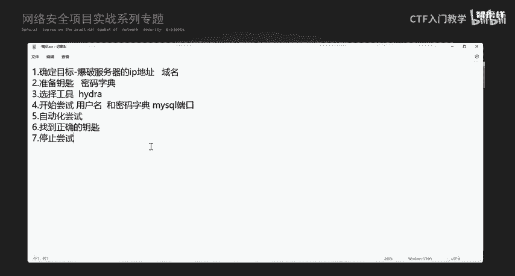
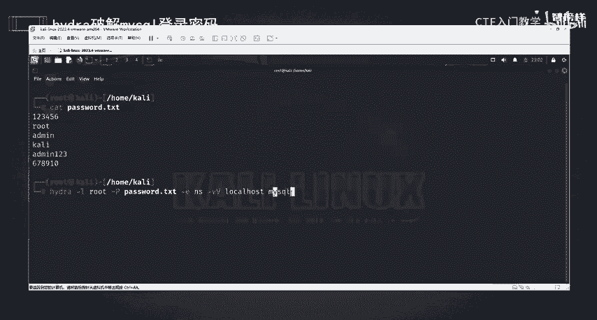
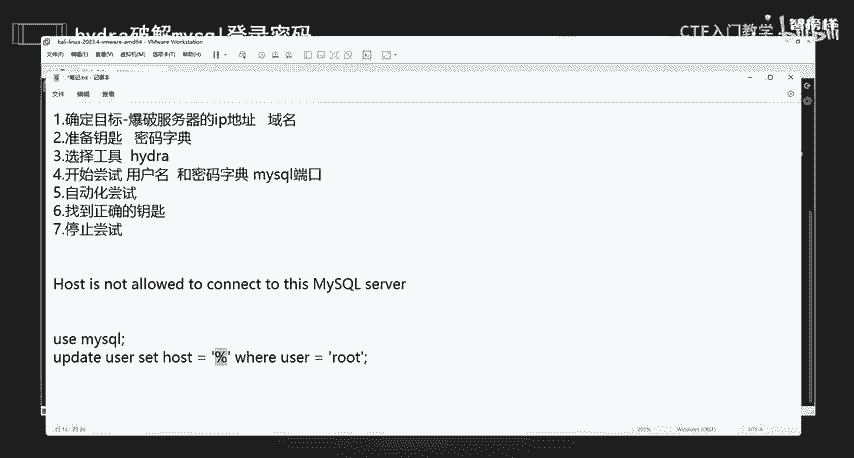
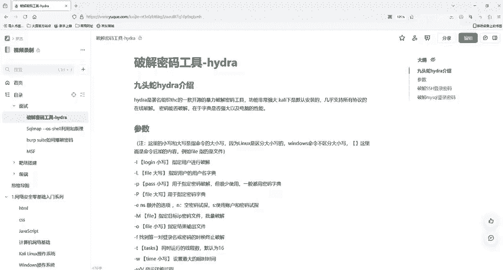

# 网络安全入门：P29：使用Hydra爆破MySQL用户名密码 💻

在本节课中，我们将学习如何使用Hydra工具对MySQL数据库进行用户名和密码的爆破。我们将从准备工作开始，逐步讲解整个操作流程，确保初学者能够理解并掌握。

## 概述

上一节我们介绍了如何使用Hydra爆破SSH服务。本节中，我们来看看如何将同样的逻辑应用于MySQL数据库的爆破。核心流程包括：确定目标、准备字典、选择工具、配置参数并执行自动化尝试。

## 准备工作



开始之前，需要确保拥有操作权限，并且目标MySQL服务正在运行。本教程使用Kali Linux虚拟机进行演示。

以下是操作前的必要检查步骤：

*   **检查服务状态**：使用命令 `systemctl status mysql` 确认MySQL服务是否处于运行（`running`）状态。
*   **获取目标地址**：爆破本地数据库可使用 `127.0.0.1`、`localhost` 或本机局域网IP。
*   **准备密码字典**：创建一个包含可能密码的文本文件，例如 `password.txt`。

## Hydra关键参数回顾

在开始操作前，我们先回顾一下Hydra工具中与本次任务相关的几个核心参数。

*   **-l**：指定单个用户名进行尝试。
*   **-L**：指定一个包含用户名的字典文件。
*   **-p**：指定单个密码进行尝试。
*   **-P**：指定一个包含密码的字典文件。
*   **-e nsr**：尝试空密码（`n`）、用户名作为密码（`s`）和反向用户名作为密码（`r`）。
*   **-v / -V**：设置详细输出模式，便于观察过程。
*   **`hydra -h`**：查看完整的参数说明。

## 爆破操作步骤

现在，我们进入实际操作环节。假设我们要爆破本地MySQL数据库，已知用户名为 `root`，并已准备好密码字典 `password.txt`。

1.  **打开终端并获取权限**：在Kali Linux中打开终端，使用 `sudo su` 命令切换到管理员权限。
2.  **执行爆破命令**：使用以下格式的命令发起爆破攻击。

```bash
hydra -l root -P /path/to/password.txt -e nsr -vV localhost mysql
```

**命令解析**：
*   `-l root`：指定目标用户名为 `root`。
*   `-P password.txt`：指定使用的密码字典文件。
*   `-e nsr`：额外尝试空密码及与用户名相关的密码。
*   `-vV`：启用详细输出，显示尝试过程。
*   `localhost mysql`：指定目标主机为本地，服务类型为 `mysql`。

3.  **观察结果**：命令执行后，Hydra会遍历字典中的密码进行尝试。如果成功，终端会高亮显示匹配成功的用户名、密码及主机信息。



## 常见问题与注意事项

在尝试爆破远程MySQL服务时，可能会遇到“Host is not allowed to connect”的错误。

*   **原因**：这通常是因为目标MySQL数据库的 `user` 表中，对应用户（如 `root`）的 `host` 字段未设置为 `%`（允许任何主机连接），而仅允许本地连接（如 `localhost`）。
*   **重要提醒**：爆破操作必须在获得明确授权的环境下进行，严禁用于非法入侵。作为管理员，应为数据库设置强密码以防范此类攻击。



## 总结



本节课我们一起学习了使用Hydra工具爆破MySQL数据库密码的完整流程。我们回顾了关键参数，演示了具体的操作命令，并分析了可能遇到的问题。记住，工具的使用必须合乎法律与道德规范。下一节课，我们将探讨其他服务协议的爆破方法。