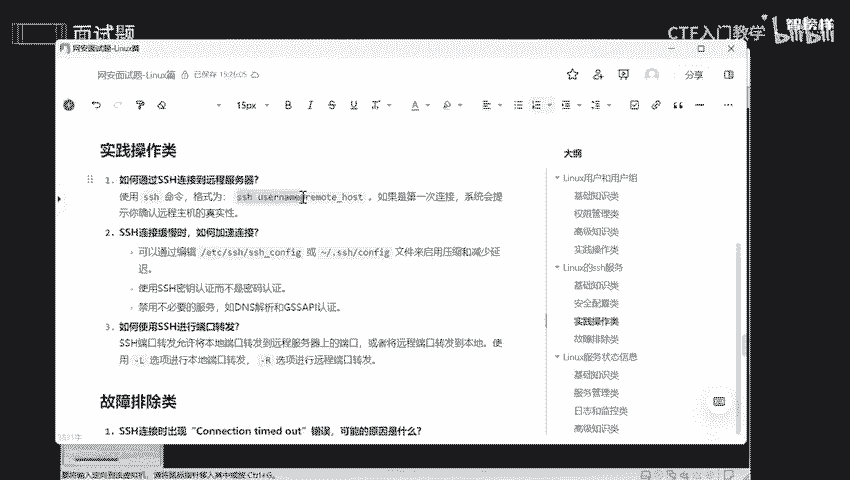
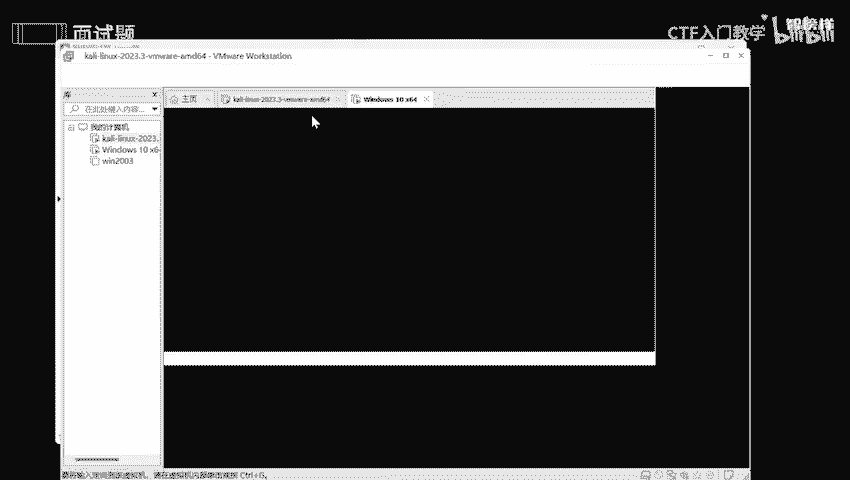
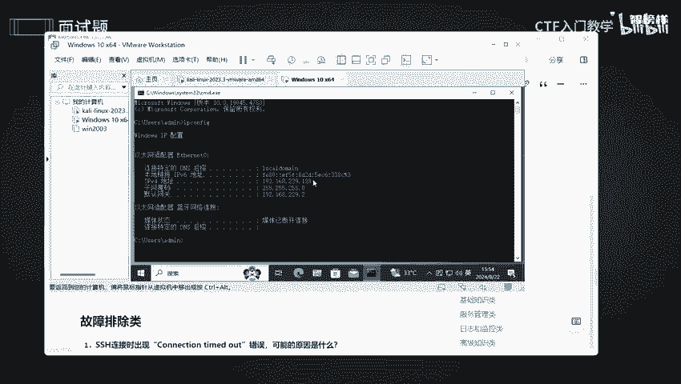
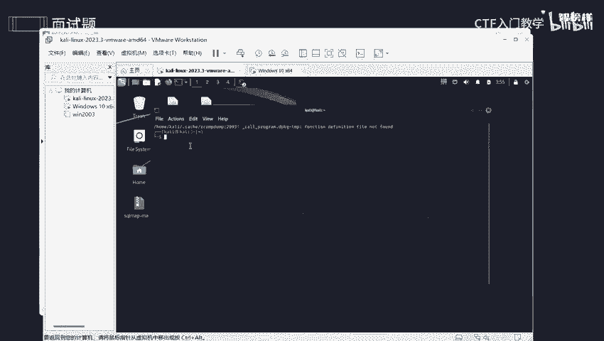
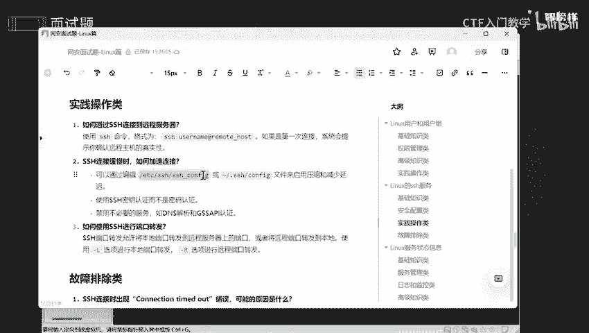
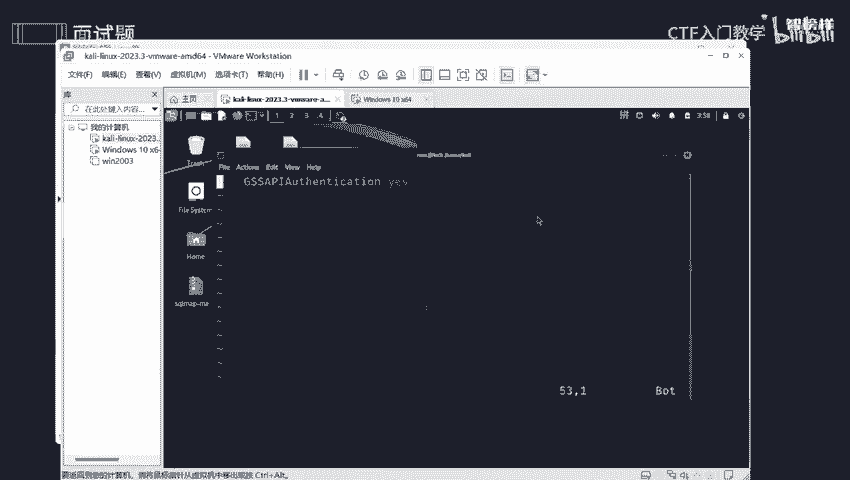
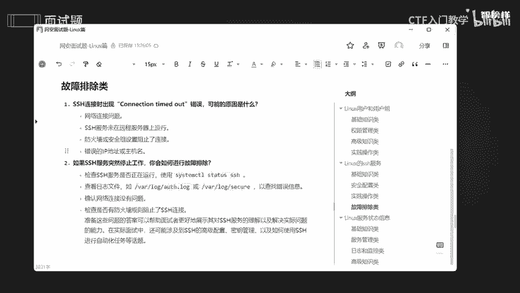

# 网络安全面试突击：P2：Linux的SSH服务 🔐

在本节课中，我们将学习Linux SSH服务相关的核心知识。SSH是网络安全和系统管理中至关重要的工具，理解其原理、配置和排错是面试和实际工作的必备技能。我们将从基础知识开始，逐步深入到安全配置、实战操作和故障排除。

---

## 基础知识类

上一节我们概述了课程内容，本节中我们来看看SSH的基础知识。这部分内容将帮助你理解SSH是什么、它如何工作以及其基本构成。

**SSH是什么？**
SSH（Secure Shell）是一个网络协议，用于在不安全的网络（如互联网）中为网络服务提供安全的传输过程。它通过加密技术来保证数据传输的安全性。

**SSH的默认监听端口是什么？**
SSH服务的默认监听端口是 **22**。这个端口号是SSH服务的标准标识。

**SSH有哪些版本？**
SSH主要有两个版本：**SSH-1** 和 **SSH-2**。目前广泛使用的是更安全的 **SSH-2** 版本。

---

## 安全配置类

了解了SSH的基础后，本节我们将探讨如何安全地配置SSH服务。正确的配置是防止未授权访问的关键。

以下是安全配置SSH服务的关键步骤：

1.  **限制登录IP地址**：在配置文件中，只允许特定的IP地址进行SSH登录，以减少攻击面。
2.  **修改默认端口**：将默认的22端口修改为一个不常用的端口，可以减少自动化扫描和攻击尝试。
3.  **使用强密码策略**：要求用户设置由数字、字母和特殊字符组成的12位以上复杂密码。
4.  **禁止root用户直接登录**：防止攻击者直接针对最高权限账户进行爆破。应创建普通用户，并通过 `sudo` 命令来执行需要特权的操作。
5.  **启用基于密钥的身份认证**：这比密码认证更安全。具体方法我们稍后介绍。
6.  **定期更新系统和SSH服务**：及时安装安全补丁，修复已知漏洞。

**如何生成SSH密钥对？**
使用 `ssh-keygen` 命令可以生成密钥对。密钥对包括一个**私钥**（必须严格保密）和一个**公钥**（可以公开分发）。
```bash
ssh-keygen -t rsa -b 4096
```

**如何将公钥上传到远程服务器？**
使用 `ssh-copy-id` 命令可以将本地公钥上传到远程服务器的授权文件中，从而实现免密码登录。
```bash
ssh-copy-id username@remote_server_ip
```




---




## 实战操作类




配置好SSH服务后，本节我们来学习如何进行实际的连接和高级操作。

**如何通过SSH连接到远程服务器？**
使用以下命令格式进行连接。如果是首次连接，系统会提示你确认远程主机的真实性。
```bash
ssh username@hostname_or_ip
```


**如果SSH连接缓慢，如何加速？**
可以编辑SSH客户端的配置文件（`~/.ssh/config` 或 `/etc/ssh/ssh_config`），禁用DNS反向解析等选项来加速连接。
```bash
Host *
    GSSAPIAuthentication no
```




**如何使用SSH进行端口转发？**
SSH端口转发功能强大，常用于穿透防火墙或访问内网服务。
*   **本地端口转发** (`-L`)：将本地端口流量转发到远程服务器。
    ```bash
    ssh -L local_port:remote_host:remote_port username@ssh_server
    ```
*   **远程端口转发** (`-R`)：将远程服务器端口流量转发到本地。
    ```bash
    ssh -R remote_port:local_host:local_port username@ssh_server
    ```

---

## 故障排除类

最后，我们来学习当SSH出现问题时，如何进行排查和修复。





**连接时出现“Connection timed out”错误怎么办？**
这个错误表示连接超时。可能的原因和排查步骤如下：

1.  **检查网络连通性**：确认客户端与服务器之间的网络是通的，可以使用 `ping` 命令测试。
2.  **确认SSH服务状态**：在服务器上检查SSH服务是否正在运行。
    ```bash
    systemctl status sshd
    ```
3.  **检查防火墙规则**：确保服务器防火墙（如`iptables`或`firewalld`）没有阻止SSH端口（默认22或你修改后的端口）。
4.  **核对IP地址和端口**：确认连接的IP地址和端口号是否正确。

**SSH服务突然停止工作，如何排查？**
以下是系统性的排查步骤：

1.  **检查服务状态**：首先使用 `systemctl status sshd` 查看服务是否处于 `running` 状态。
2.  **查看系统日志**：通过日志文件（如 `/var/log/auth.log` 或 `/var/log/secure`）查找相关错误信息。
    ```bash
    sudo tail -f /var/log/auth.log
    ```
3.  **检查网络和防火墙**：同上，确认网络无故障且防火墙规则正确。
4.  **检查配置文件语法**：错误的配置文件会导致服务启动失败。可以使用 `sshd -t` 命令测试配置文件语法。
    ```bash
    sudo sshd -t
    ```

---



本节课中我们一起学习了Linux SSH服务的核心知识。我们从**SSH的基础概念**（协议、端口、版本）出发，深入探讨了**安全配置的最佳实践**，包括密钥认证和权限管理。接着，我们进行了**实战操作演示**，涵盖了连接、加速和端口转发。最后，我们掌握了**故障排除的方法**，以应对连接超时和服务异常等问题。理解并掌握这些内容，将为你应对网络安全面试和日常运维工作打下坚实的基础。