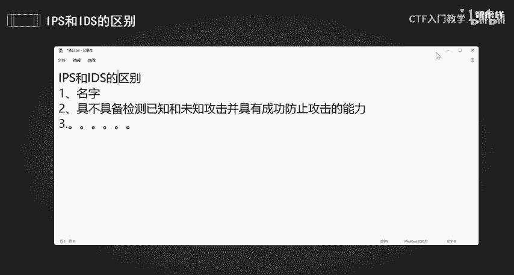
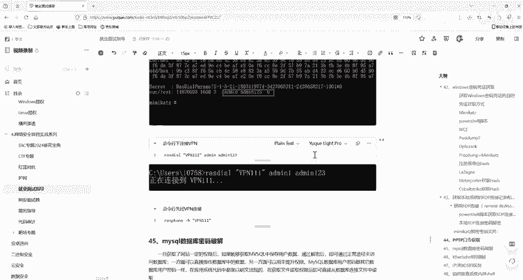

# 网络安全面试突击：P30：IPS与IDS的区别 🔍

在本节课中，我们将学习网络安全领域中两个核心概念——入侵防御系统（IPS）与入侵检测系统（IDS）的区别。理解这两者的不同是面试中的常见考点，也是构建有效网络安全防御体系的基础。

## 概述 📖

IPS和IDS都是用于保护网络免受攻击的安全设备，但它们在网络中的角色、部署位置和功能上存在关键差异。简单来说，一个侧重于主动“防御”，另一个侧重于被动“检测”与“报警”。

## IPS：入侵防御系统 🛡️

上一节我们概述了课程目标，本节中我们来看看什么是入侵防御系统（IPS）。

IPS是电脑网络安全设备，它对防病毒软件和防火墙的功能进行补充。该系统能够监视网络或网络设备的资料传输行为，并及时中断、调整或隔离不正常的或具有伤害性的网络资料传输。

对于初学者，可以将其理解为网络世界里的“主动保安”。它不仅监控网络流量，检查可疑行为或恶意软件，一旦发现威胁，会立即采取行动阻止攻击。例如，封锁攻击者的IP地址或直接切断可疑连接。

**核心能力公式**：
`IPS能力 = 检测攻击（已知 + 未知） + 成功阻止攻击`

IPS通常部署在防火墙和内部网络设备之间，属于一种硬件或软件设备。如果检测到攻击，IPS会在攻击扩散到网络其他部分之前，阻止恶意通讯。

## IDS：入侵检测系统 👁️

了解了主动防御的IPS后，我们再来看看侧重于监控的入侵检测系统（IDS）。

IDS的核心价值在于通过分析全网信息，了解信息系统的安全状况，进而指导安全建设目标和安全策略的建立与调整。而IPS的核心价值在于安全策略的实施和对黑客行为的直接阻止。

以下是IDS的一个关键特点：
*   IDS需要部署在网络内部，其监控范围可以覆盖整个子网，包括来自外部的数据以及内部终端之间传输的数据。
*   IDS的局限性在于不能主动反击网络攻击。因为IDS传感器基于数据包嗅探技术，只能“观察”网络信息流过。
*   IDS只是存在于你的网络之中起到报警的作用，而不是在网络边界前起到防御的作用。
*   **IDS不具备检测已知和未知攻击并成功防止攻击的能力**，这个能力是IPS所独有的。

## IPS与IDS的核心区别 ⚖️

前面我们分别介绍了IPS和IDS，现在我们来系统性地总结它们之间的核心区别。

两者最根本的区别在于名字和核心功能：一个是“防御”系统，一个是“检测”系统。

最重要的区别在于是否具备**检测已知和未知攻击并成功防止攻击的能力**。IPS具备此能力，而IDS不具备。

此外，它们在部署位置上也有显著不同：
*   **IDS**：部署在网络内部，用于监控整个子网（包括内外部流量）。
*   **IPS**：必须部署在网络边界，用于抵御外部入侵，但对内部攻击行为无能为力。

## 总结 🎯

本节课我们一起学习了IPS（入侵防御系统）与IDS（入侵检测系统）的区别。

我们可以用一个简单的比喻来理解：IPS就像一个积极的保镖，不仅会监控，发现可疑人物时还会立刻采取行动将其赶走或报警。而IDS更像一个监控室的保安，他通过摄像头发现可疑情况后会记录下来并发出警告，但他自己不会离开监控室去直接阻止入侵者。

记住这个核心区别：**IPS能检测并阻止攻击，而IDS只能检测并报警**，这将帮助你在面试和实际工作中更好地理解和运用这两类安全设备。