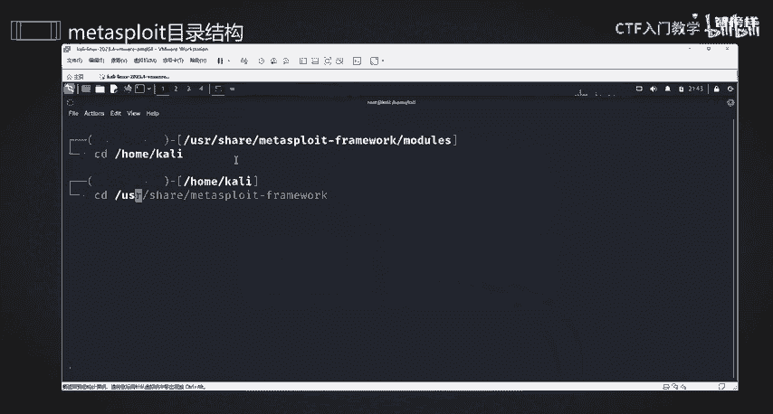
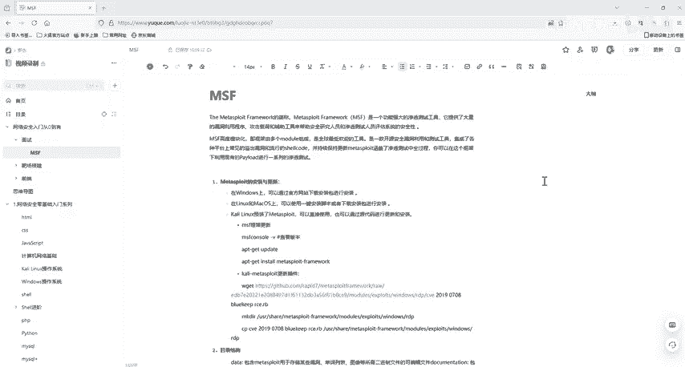

# 网络安全入门：P31：Metasploit框架介绍 🛠️

在本节课中，我们将要学习渗透测试中最著名的工具之一——Metasploit框架。我们将了解它是什么、能做什么、以及它的基本结构和核心概念，为后续的实际操作打下基础。

## 框架概述

Metasploit（简称MSF）是一个排名第二的流行安全工具。它是一个渗透测试框架，能在渗透测试过程中，帮助我们自动化地进行攻击服务端口、生成木马程序、植入后门、提升权限以及维持权限等复杂操作。

使用MSF框架，我们在攻击系统服务脚本时，不需要对漏洞本身有过深的研究，也不需要自己编写POC（概念验证）脚本。我们可以直接使用框架内集成的模块进行自动化攻击，这极大方便了渗透测试的入门。

## 核心特点与架构

简单来说，Metasploit的基本使用流程非常直观，但其内部结构极其复杂和庞大。即使是该框架的核心贡献者也曾表示无法完全掌握其所有内容。

MSF是一款高度模块化的开源安全漏洞利用、测试和开发工具。它集成了常见的系统服务漏洞和流行的攻击代码（Exploit），并能持续保持更新。目前，MSF已经更新到了6.x版本。

该框架覆盖了渗透测试的全过程。使用者可以在其框架下，利用现有的攻击载荷（Payload）或攻击代码进行一系列测试，而无需过度关注漏洞本身的底层细节。当然，如果希望深入理解，自行调试MSF的模块（例如永恒之蓝漏洞利用模块）是学习漏洞原理的好方法，但作为入门，我们可以先专注于掌握工具的使用。

## 环境准备

要使用Metasploit，我们需要准备以下环境：
*   **虚拟机软件**：用于安装操作系统。
*   **Kali Linux系统**：Kali是专为渗透测试和安全审计设计的Linux发行版，**默认自带了Metasploit框架**。



所有相关的软件和资料链接已提供在课程评论区，有需要的同学可以自行获取。

## 目录结构解析

在Kali Linux中，Metasploit通常安装在 `/usr/share/metasploit-framework/` 路径下。了解其目录结构有助于我们理解框架的组成。

以下是该目录下的核心文件夹及其作用：

*   **data**：用于存储某些漏洞所需的二进制文件、可编译文件以及其他数据文件。
*   **documentation**：包含框架的可用文档。
*   **lib**：存放Metasploit的核心库文件。
*   **plugins**：存放扩展框架功能的插件。
*   **scripts**：存放Metasploit相关的脚本文件。
*   **tools**：存放一些命令行使用的实用程序。
*   **modules**：**这是最重要的目录**，存放了MSF的所有模块文件。我们对渗透测试的自动化利用，通常就是调用此目录下的模块。

## 核心模块详解

上一节我们介绍了MSF的整体目录，本节中我们重点来看看最核心的 `modules` 目录。它包含了执行不同任务的子模块。

以下是 `modules` 目录下的主要子目录及其功能：

*   **auxiliary**：辅助模块。用于渗透测试前期的信息收集、漏洞扫描探测、服务枚举、密码爆破等。
*   **exploits**：漏洞利用模块。包含了针对各种主流软件和系统漏洞的利用脚本。
*   **payloads**：攻击载荷模块。指攻击成功后，在目标系统上执行的可操作代码，例如反弹Shell的代码。
*   **post**：后渗透模块。在漏洞利用成功并获取了目标系统访问权限（Meterpreter会话）后，用于执行后续操作的模块，例如提权、信息搜集、横向移动等。
*   **encoders**：编码器模块。包含各种编码工具，用于对攻击载荷进行编码和加密，以绕过杀毒软件和入侵检测系统的查杀。
*   **evasion**：规避模块。用于生成免杀（Antivirus Evasion）的攻击载荷。
*   **nops**：空指令模块。用于生成“空操作”指令串，在某些漏洞利用场景（如缓冲区溢出）中，用于保持攻击代码结构的稳定性。

## 体系结构与使用

Metasploit的核心是一个名为 `msfcore` 的库。用户通过接口（例如最常用的 `msfconsole` 命令行接口）与框架交互。接口会调用核心库，而核心库则基于我们刚才介绍的 `modules` 目录中的模块来执行具体任务。

其基本调用关系可以简化为：
**用户 -> msfconsole (接口) -> msfcore (核心) -> modules (模块)**

## 框架更新

为了获取最新的漏洞利用模块和功能，我们需要定期更新Metasploit。在Kali中，可以使用以下命令：
```bash
# 查看当前版本
msfconsole -v
# 更新Metasploit框架
sudo apt update && sudo apt install metasploit-framework
```
在更新前，建议将Kali的软件源（APT源）更换为国内镜像（如清华、阿里云镜像），以提升下载速度。如果不想更新整个框架，也可以选择只更新特定的插件。

## 总结

本节课中，我们一起学习了渗透测试的利器——Metasploit框架。我们了解了它的定义、核心特点以及它在安全测试中的重要作用。我们详细解析了其在Kali Linux中的目录结构，特别是核心的 `modules` 目录下的各类模块（辅助、利用、载荷、后渗透等）及其功能。最后，我们介绍了框架的基本体系结构和更新方法。



下一节课，我们将正式进入 `msfconsole`，带领大家进行实际的命令操作，开启我们的自动化渗透测试之旅。