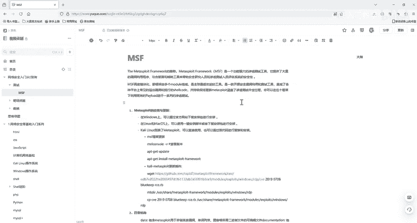
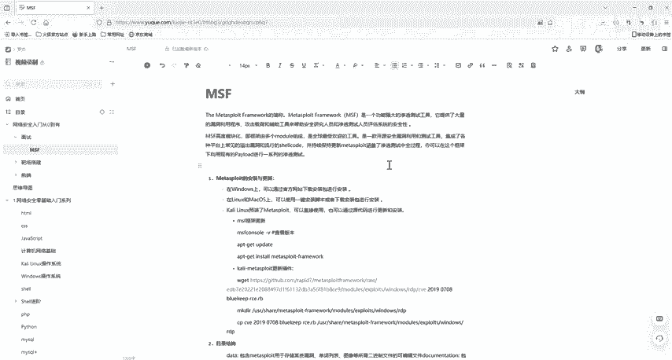

# 网络安全入门：P32：2：进入MSF与信息收集模块使用 🛠️

在本节课中，我们将学习如何进入Metasploit Framework（MSF）的控制台，并利用其内置模块进行基础的信息收集操作，这是渗透测试流程中的关键第一步。

## 概述

Metasploit Framework（MSF）是一个功能强大的渗透测试框架，它集成了信息收集、漏洞利用、后渗透等全流程工具。本节课将重点介绍如何启动MSF控制台，以及如何使用其辅助模块进行网络主机发现和端口扫描。

---

## 启动与初始化MSF

上一节我们介绍了MSF的基本概念，本节中我们来看看如何启动它并进行基础配置。

MSF在Kali Linux系统中是预装的。启动前，建议先初始化其内置数据库，以便保存扫描结果。当然，不初始化数据库也可以运行，只是无法保存数据。

初始化数据库的命令如下：
```bash
msfdb init
```

启动MSF控制台：
```bash
msfconsole
```

启动后，可以检查数据库连接状态：
```bash
db_status
```

查看当前工作区：
```bash
workspace
```

以下是关于工作区管理的几个常用命令：
*   `workspace -h`：查看帮助信息。
*   `workspace -a [名称]`：创建并切换到一个新的工作区。
*   `workspace [名称]`：切换到指定工作区。

工作区管理在初期可以不做，对后续渗透测试操作没有影响。

---

## 使用MSF进行信息收集

信息收集是渗透测试的首要环节。MSF作为一个全能框架，自然也提供了强大的信息收集能力。

### 1. 使用db_nmap进行扫描

一个经典的信息收集工具是Nmap。MSF内置了`db_nmap`命令，其使用方法与标准Nmap完全一致，区别在于扫描结果会自动保存到MSF的数据库中。

执行`db_nmap`并查看帮助：
```bash
db_nmap -h
```

其参数与Nmap相同，支持SYN半开扫描（-sS）、TCP全连接扫描（-sT）、服务版本探测（-sV）等所有功能。例如，进行SYN扫描：
```bash
db_nmap -sS [目标IP]
```

还可以结合Nmap脚本引擎（NSE）检查常见服务漏洞：
```bash
db_nmap --script vuln [目标IP]
```

### 2. 使用辅助（Auxiliary）模块进行扫描

除了调用外部工具，MSF的核心操作依赖于其模块（Modules）。我们可以直接使用其辅助模块进行更集成的扫描。

以下是查找并利用端口扫描模块的流程：

首先，搜索与端口扫描相关的模块：
```bash
search portscan
```

在搜索结果中，选择一个模块使用，例如TCP SYN半开扫描模块：
```bash
use auxiliary/scanner/portscan/syn
```

使用`show options`命令查看该模块需要配置的参数：
```bash
show options
```

关键的参数通常包括：
*   **RHOSTS**：目标主机或网段（例如 `192.168.1.1` 或 `192.168.1.0/24`）。
*   **PORTS**：要扫描的端口范围（默认常为1-10000）。
*   **THREADS**：扫描线程数，提高扫描速度。

设置目标地址和线程数：
```bash
set RHOSTS 192.168.1.100
set THREADS 20
```

最后，执行扫描：
```bash
run
```

这样，MSF就会使用指定的模块对目标进行扫描。这种扫描方式更为隐蔽（如SYN扫描不完成TCP三次握手），且完全在MSF框架内完成，便于后续利用。

---

## 总结



本节课中我们一起学习了进入Metasploit Framework控制台的基本步骤，并实践了两种在MSF中进行信息收集的方法：
1.  使用 **`db_nmap`** 命令，它继承了Nmap的所有功能并将结果存入数据库。
2.  使用MSF内置的 **辅助扫描模块**，通过 `search`、`use`、`set`、`run` 的标准流程，完成对目标主机或网段的端口扫描。



掌握这些基础操作是理解渗透测试流程和后续学习漏洞利用的关键。建议大家在实验环境中手动操作一遍整个流程以加深理解。